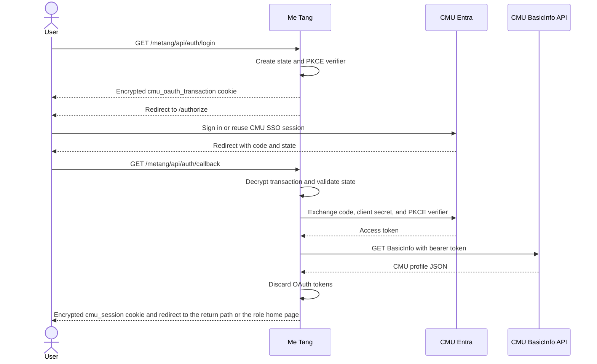

# CMU Entra SSO

This document describes the CMU Entra sign-in implementation in Me Tang. It covers the
application registration, environment variables, request flow, session design, deployment,
and troubleshooting.

## What the implementation provides

The application uses the OAuth 2.0 authorization-code flow with a confidential client:

- CMU Entra signs the user in and asks for delegated CMU API consent.
- The Next.js server exchanges the authorization code using the application client secret.
- The server calls the CMU BasicInfo API with the access token.
- The application creates its own encrypted, eight-hour session containing the BasicInfo
  profile.
- Access and refresh tokens are discarded after BasicInfo is fetched.

Users receive an SSO experience when they already have an active CMU Entra browser session.
However, the current implementation does not request the `openid` scope or validate an ID
token. It uses the successful delegated BasicInfo request to establish the local application
session. If standards-based authentication claims are required later, extend the flow to
OpenID Connect with ID-token signature, issuer, audience, nonce, and expiry validation.

## Implementation map

| Area | File or route | Responsibility |
| --- | --- | --- |
| Shared authentication library | `lib/cmu-auth.ts` | Configuration, PKCE, state, encryption, profile sanitization, and session reads (with the nursing check in a production build) |
| Login (the sign-in button) | `GET /metang/api/auth/login` | Creates a nursing-policy OAuth transaction in a production build (`NODE_ENV=production`) unless `DEBUG_MODE=true`, and a general one otherwise (`next dev`, or a production build with `DEBUG_MODE=true`). Redirects to CMU Entra |
| Nursing SSO login | `GET /metang/api/auth/nurse/login` | Always creates a nursing-policy OAuth transaction and redirects to CMU Entra |
| Complete login | `GET /metang/api/auth/callback` | Validates the callback, exchanges the code, fetches BasicInfo, and applies nursing policy when requested, and in a production build unless `DEBUG_MODE=true` |
| Nursing access policy | `lib/nurse-auth.ts` | Allows only eligible nursing students and nursing-faculty employees |
| Logout | `POST /metang/api/auth/logout` (`GET` also works) | Deletes the local session and the OAuth cookie, then sends a `303` to the login page under the base path. With `?federated=true` the `303` goes to `LOGOUT_URL` (Entra) instead |
| Sign-in page | `app/login/page.tsx` | Shows the sign-in button and the error messages. `app/page.tsx` only redirects, to this page or to the home page of the signed-in account |
| Debug profile view | `app/demo/cmu-sso/page.tsx` | Shows the complete BasicInfo JSON response. Returns 404 unless `NODE_ENV=development` or `DEBUG_MODE=true` |

The application does not store the CMU BasicInfo profile in Postgres. At sign-in the callback calls
`syncUserFromCmuProfile` (`db/queries/users.ts`). When an `app_user` row already matches the CMU
account or email, it updates the Thai and English names on that row and fills `cmuAccount` and `email`
when they are empty. It never creates a user.

## Request sequence



### 1. Login request

`GET /metang/api/auth/login` reads the server-side configuration and creates:

- A cryptographically random OAuth `state` value.
- A PKCE verifier and SHA-256 challenge.
- An encrypted `cmu_oauth_transaction` cookie that expires after ten minutes.

The browser is redirected to the configured `AUTH_URL` with `response_type=code`,
`response_mode=query`, the callback URI, scope, state, and PKCE challenge.

### 2. Callback and token exchange

CMU Entra redirects to `GET /metang/api/auth/callback`. The callback requires all three values:

- Authorization `code` from Entra.
- Returned `state` from Entra.
- Encrypted `cmu_oauth_transaction` cookie from the login request.

The server decrypts the cookie, checks its expiry, and compares the two state values using a
timing-safe comparison. It then posts the code, client ID, client secret, callback URI, scope,
and PKCE verifier to `TOKEN_URL`.

### 3. BasicInfo and application session

After receiving an access token, the callback sends:

```http
GET https://api.cmu.ac.th/mis/cmuaccount/prod/v3/me/basicinfo
Authorization: Bearer <access-token>
```

The complete JSON-compatible BasicInfo response is sanitized and encrypted into the local
`cmu_session` cookie. The raw BasicInfo response is shown only on `/metang/demo/cmu-sso`, which
returns 404 unless `NODE_ENV=development` or `DEBUG_MODE=true`. Because BasicInfo can contain
personal data, do not set `DEBUG_MODE` on a site with real data.

The OAuth access token and any returned refresh token are not stored in the browser, database,
or local session.

### Nursing faculty access policy

The nursing callback applies the nursing authorization policy after BasicInfo is fetched and
before the local session cookie is created. In a production build (`NODE_ENV=production`),
the sign-in button (`/api/auth/login`) starts this restricted mode. A rejected account receives `not_eligible` and
cannot use the nursing SSO session, even if CMU Entra authentication itself succeeded. Under
`next dev` the button starts the general mode, which keeps the unrestricted CMU profile behavior.
`DEBUG_MODE=true` gives a production build the general mode too, for a debug deployment on fake data.
`INFISICAL_ENV` does not change the mode.

A production build also checks the policy on every read of the session (`getCmuSession` in
`lib/cmu-auth.ts`), and the callback applies it whatever mode started the login. So only nursing
students and nursing staff can use the application in production, and a session of any other
account (for example one issued before this rule) is treated as signed out. `DEBUG_MODE=true`
turns this rule off.

Student IDs are interpreted using the format shown by the CMU student examples. Only the faculty
code is checked; the plan and level digits are not:

```text
YY 12 1 0 XXX
│  │  │ │ └── student sequence (not checked)
│  │  │ └──── plan (not checked)
│  │  └────── level (not checked)
│  └───────── nursing faculty (12)
└──────────── enrollment year, Buddhist Era short year (any two digits)
```

The allowed student pattern (`NURSING_STUDENT_ID_PATTERN` in `lib/nurse-auth.ts`) is:

```text
^\d{2}12\d{5}$
```

Examples:

- `661210XXX`: allowed nursing undergraduate, normal-plan student.
- `661215XXX`: allowed. The plan digit is not checked, so an international-plan ID passes.
- IDs with a faculty code other than `12`: rejected.

Employees do not use the student-ID rule. An employee is allowed only when the CMU BasicInfo
field `organization_code` is exactly `12`. All other employee organization codes, and profiles
without an eligible student ID or nursing organization code, are rejected.

The policy is implemented by `getNurseAccessDecision` in `lib/nurse-auth.ts`, so the rule can be
reused by protected pages and API routes as the application grows. Keep this policy server-side;
it must not be implemented only as a UI visibility check.

### 4. Logout

The page submits `POST /metang/api/auth/logout`. The route expires `cmu_session` and the OAuth
cookie, and sends a `303` redirect to the login page under the base path. This ends the
application session only. The user's Microsoft session stays, and Entra is not contacted.

With `?federated=true` (for example `GET /metang/api/auth/logout?federated=true`) the route sends
the `303` to `LOGOUT_URL` instead. It sets `post_logout_redirect_uri` on that URL to the public
origin plus the base path plus `/login`, for example `https://metang.example/metang/login`, and
replaces any value already in `LOGOUT_URL`. The Entra endpoint then returns the browser to that
address. It does so only when the address is registered as a redirect URI on the Entra
application. No page of the application uses `federated=true` yet.

## Entra application registration

The CMU reference setup uses a Web platform registration with an authorization-code client
secret.

1. Open the Entra application and select **Authentication**.
2. Add the **Web** platform.
3. Register the exact callback URI used by the application:

   ```text
   http://localhost:8080/metang/api/auth/callback
   ```

4. Register the sign-out return address in the same Web platform, next to the callback. It is the
   login page under the base path:

   ```text
   http://localhost:8080/metang/login
   ```

   This address is used only by federated sign-out (Section 4). Without it, federated sign-out
   ends on the Microsoft sign-out page and does not return to the application. Sign-in and the
   normal sign-out button do not need it.
5. Under **Certificates & secrets**, create a client secret and store its value securely.
   Track its expiry and rotate it before it expires.
6. Under **API permissions**, select **APIs my organization uses**, then **CMU API**.
7. Add the delegated permission:

   ```text
   Mis.Account.Read.Me.Basicinfo
   ```

The callback URI must match `CALLBACK_URL` exactly, including scheme, host, port, and path.
Register the HTTPS production callback separately when deploying.

Register both addresses with the base path: `<origin>/<sub path>/api/auth/callback` and
`<origin>/<sub path>/login`, where `<sub path>` is the value of `PUBLIC_SUBPATH` (Section 2.1 of the
maintenance guide).

The path registered before the base path was added, `/api/auth/callback`, still reaches the
callback while it stays registered. The `/api/:path*` redirect in `next.config.ts` sends the browser
on to `/metang/api/auth/callback` with the `code` and `state` query unchanged. Do not rely on it: it
costs one extra redirect, and it stops working if that redirect is removed. It also works only if
the reverse proxy forwards root paths to the application. The sample `deploy/nginx.conf.example`
forwards only `/metang/`, so behind it the old path does not reach the application.

To move an environment from the old addresses to the new ones:

1. In Entra, add `<origin>/<sub path>/api/auth/callback` and `<origin>/<sub path>/login`. Keep the
   old `/api/auth/callback` and `/login` registered.
2. Set `CALLBACK_URL` to the new callback address in the secret store, and deploy this release.
   `CALLBACK_URL` and the Entra registration must match; if they do not, sign-in stops on a
   Microsoft redirect-URI error page.
3. Sign in, then sign out with the federated logout, and confirm both return to the application.
4. Remove the old `/api/auth/callback` and `/login` registrations from Entra.

## Environment variables

All authentication variables are server-side. None of them needs the `NEXT_PUBLIC_` prefix.

| Variable | Secret | Purpose |
| --- | --- | --- |
| `AUTH_URL` | No | CMU tenant OAuth authorization endpoint |
| `TOKEN_URL` | No | CMU tenant OAuth token endpoint |
| `CALLBACK_URL` | No | Exact registered application callback URI |
| `CLIENT_ID` | No | Entra application/client ID |
| `CLIENT_SECRET` | Yes | Entra confidential-client credential |
| `SESSION_SECRET` | Yes | Encrypts and authenticates local cookies |
| `SCOPE` | No | Delegated CMU API scopes requested during login |
| `BASICINFO_URL` | No | CMU BasicInfo resource endpoint |
| `LOGOUT_URL` | No | Entra logout endpoint. The application replaces its `post_logout_redirect_uri` with `<origin>/<sub path>/login` |

Example development configuration:

```dotenv
AUTH_URL=https://login.microsoftonline.com/cf81f1df-de59-4c29-91da-a2dfd04aa751/oauth2/v2.0/authorize
TOKEN_URL=https://login.microsoftonline.com/cf81f1df-de59-4c29-91da-a2dfd04aa751/oauth2/v2.0/token
CALLBACK_URL=http://localhost:8080/metang/api/auth/callback
CLIENT_ID=replace-with-application-id
CLIENT_SECRET=replace-with-client-secret
SESSION_SECRET=replace-with-a-random-value-of-at-least-32-characters
SCOPE=api://cmu/Mis.Account.Read.Me.Basicinfo offline_access
BASICINFO_URL=https://api.cmu.ac.th/mis/cmuaccount/prod/v3/me/basicinfo
LOGOUT_URL=https://login.microsoftonline.com/cf81f1df-de59-4c29-91da-a2dfd04aa751/oauth2/v2.0/logout?post_logout_redirect_uri=http://localhost:8080
```

Use only one definition for each variable. When a dotenv file contains duplicate keys, the
effective value may depend on the loader and can be difficult to diagnose.

### `SESSION_SECRET`

`SESSION_SECRET` is not provided by CMU. It belongs to this application and derives the
AES-256-GCM key used for both authentication cookies. Generate it once per environment:

```bash
openssl rand -base64 32
```

It must contain at least 32 characters. Use the same value on every application instance.
Rotating the value invalidates all active login transactions and user sessions.

### `NEXT_PUBLIC_CLIENT_ID`

`NEXT_PUBLIC_CLIENT_ID` is not read by this implementation. The authorization URL is assembled
on the server using `CLIENT_ID`. Never create `NEXT_PUBLIC_CLIENT_SECRET` or
`NEXT_PUBLIC_SESSION_SECRET`; Next.js exposes `NEXT_PUBLIC_*` values to browser code.

### Scope behavior

The CMU reference scope includes `offline_access`, so Entra may return a refresh token. This
implementation intentionally discards refresh tokens and does not refresh CMU API access. If
offline access is not required by future functionality, consider removing `offline_access`
after confirming the desired behavior with the CMU application owner.

## Cookie and session behavior

| Cookie | Lifetime | Contents | Attributes |
| --- | --- | --- | --- |
| `cmu_oauth_transaction` | 10 minutes | OAuth state, PKCE verifier, expiry, login mode, and the optional return path | `HttpOnly`, `SameSite=Lax`, `Path=/metang`, `Secure` in production |
| `cmu_session` | 8 hours | Sanitized BasicInfo profile, login time, and expiry | `HttpOnly`, `SameSite=Lax`, `Path=/metang`, `Secure` in production |

`Path` is the base path (`PUBLIC_SUBPATH`, `/metang` by default, `/` when the application is
served from the root), so other applications on the same domain do not receive the cookies. The
callback and logout also expire cookies of the same names at `Path=/`, which earlier builds set.

Both cookies are encrypted and authenticated with AES-256-GCM. The encryption key is a SHA-256
digest derived from `SESSION_SECRET`. Cookie decryption or authentication failure results in no
valid session.

The complete profile is stored in a browser cookie. Browser cookie limits are commonly around
4 KB per cookie. If CMU expands the BasicInfo payload beyond that size, move application
sessions to a server-side store and keep only an opaque session identifier in the cookie.

## Local development

1. Copy the environment template:

   ```bash
   cp .env.example .env
   ```

2. Replace all placeholders and ensure each variable appears only once.
3. Start Next.js on the callback port. `npm run dev` already passes `-p 8080`. It stops unless
   `.env` sets `INFISICAL_ENV`; `npm run dev-normal` skips that check:

   ```bash
   npm run dev
   ```

4. Open <http://localhost:8080/metang>.
5. Select **เข้าสู่ระบบด้วย CMU Account**.
6. Complete CMU sign-in and consent.
7. Confirm you land on the home page of your role. To see the BasicInfo profile, open
   `/metang/demo/cmu-sso` (works only under `next dev` or with `DEBUG_MODE=true`).
8. Test **ออกจากระบบ** and confirm the local session is cleared and the login page opens. To test
   the Entra sign-out too, open `/metang/api/auth/logout?federated=true` and confirm that the
   browser returns to `/metang/login`.

## Production checklist

- Register the exact HTTPS production callback in Entra.
- Set `CALLBACK_URL` to that registered HTTPS URI.
- To use federated sign-out, register `https://<host>/<sub path>/login` in Entra as the
  sign-out return address. The application sets `post_logout_redirect_uri` to it, whatever
  `LOGOUT_URL` contains.
- Store `CLIENT_SECRET` and `SESSION_SECRET` in the deployment secret manager.
- Use one stable `SESSION_SECRET` across all instances.
- Do not log authorization codes, access tokens, refresh tokens, or cookie values.
- Do not set `DEBUG_MODE` on a site with real data. It shows the raw BasicInfo profile at
  `/metang/demo/cmu-sso`.
- Track the Entra client-secret expiry and rotate it before expiration.
- Request only the delegated permissions required by the application.
- Confirm production responses set both authentication cookies with `Secure`.
- Confirm every staff account (admin, advisor, executive, SuperAdmin) has `organization_code` `12` in
  its CMU profile. A production build refuses any other account at sign-in, even with a role.
- Do not set `NODE_ENV` by hand on the host or in any secret store. The nursing rule trusts it, and
  `NODE_ENV=development` would turn the rule off.
- Do not set `DEBUG_MODE` on a production site. It also turns the rule off, and it turns on the
  `DEV_*` shortcuts. The server logs a warning at start when a production build has it on.

## Errors and troubleshooting

| Application error | Meaning | Checks |
| --- | --- | --- |
| `configuration` | A required variable is missing, is still a placeholder, or is invalid | Check all variables and ensure `SESSION_SECRET` is at least 32 characters |
| `access_denied` | Entra returned an OAuth error | Check whether the user cancelled or lacks access/consent |
| `invalid_callback` | Code, state, or transaction cookie is missing | Restart login; check browser cookie policy and callback host |
| `invalid_state` | Transaction expired, could not decrypt, or state did not match | Restart within ten minutes; check that all instances share `SESSION_SECRET` |
| `token_exchange_failed` | Entra rejected the code exchange | Check client ID, client secret, callback URI, scope, and secret expiry |
| `profile_failed` | BasicInfo returned an error or unusable JSON | Check delegated permission, scope, token audience, and CMU API availability |
| `not_eligible` | CMU authentication succeeded but the nursing access policy rejected the profile | Check the student-ID segment or employee `organization_code` |
| `login_failed` | An unexpected callback error occurred | Review server logs without printing tokens or secrets |

### Common redirect mismatch

These values must be identical:

- Redirect URI registered under the Entra Web platform.
- `CALLBACK_URL` in the running application.
- `redirect_uri` sent to both the authorization and token endpoints.

For example, `localhost:3000`, `localhost:8080`, and `127.0.0.1:8080` are different redirect
URIs.

### Login works once but fails on another instance

All deployed instances must use the same `SESSION_SECRET`. Otherwise one instance cannot
decrypt a transaction or session cookie created by another instance.

## Security boundaries and limitations

- `CLIENT_SECRET`, `SESSION_SECRET`, OAuth codes, and OAuth tokens are server-only.
- OAuth state mitigates login CSRF and callback substitution.
- PKCE binds the authorization code to the browser-initiated transaction.
- Tokens are used only long enough to retrieve BasicInfo and are then discarded.
- The local session is encrypted, authenticated, HTTP-only, and time-limited.
- The sign-out button submits a POST form. The logout route also accepts GET (federated sign-out
  is a GET), so a link on another site can sign a user out of the application.
- This is not currently a full OpenID Connect relying-party implementation because it does not
  validate an ID token.
- Revoking CMU access does not immediately revoke an already-issued eight-hour local cookie.
- There is no server-side session revocation list; rotating `SESSION_SECRET` invalidates every
  session at once.

## References

- [CMU authorization-code client-secret setup](https://gitlab.mis.cmu.ac.th/supawit.w/cmu-authorization-consumer/-/tree/main/auth-code-client-secret)
- [CMU PHP authorization-code example](https://gitlab.mis.cmu.ac.th/supawit.w/cmu-authorization-consumer/-/tree/main/example/oauth-php-auth-code-client-secret)
- [Microsoft identity platform authorization-code flow](https://learn.microsoft.com/en-us/entra/identity-platform/v2-oauth2-auth-code-flow)
- [Microsoft identity platform OpenID Connect and sign-out](https://learn.microsoft.com/en-us/entra/identity-platform/v2-protocols-oidc#send-a-sign-out-request)
