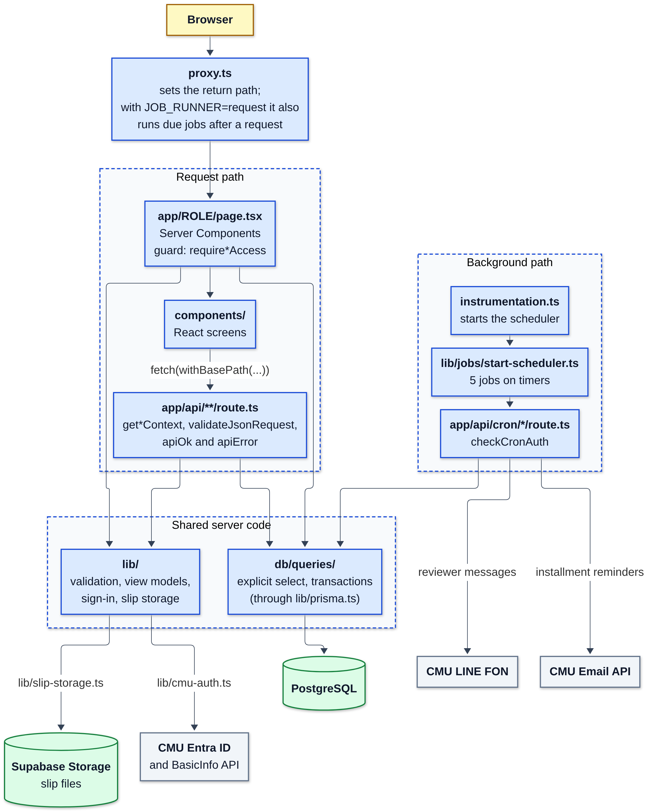
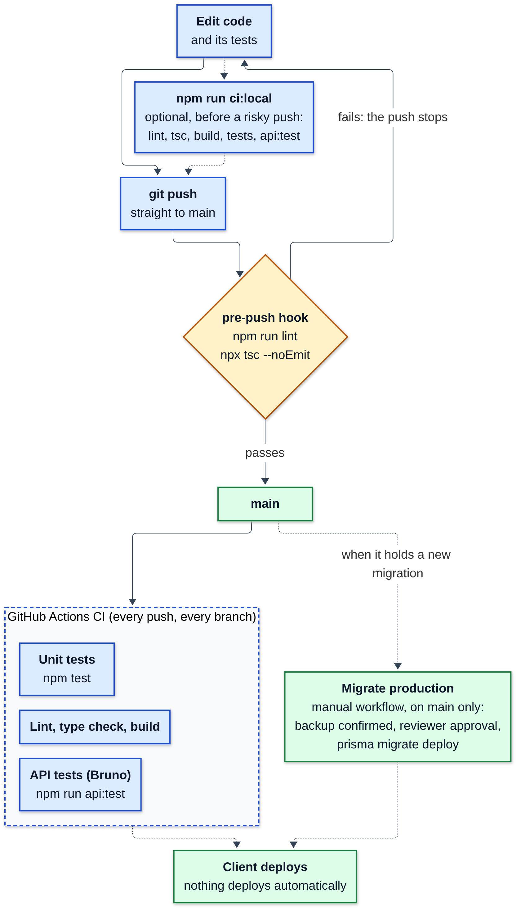
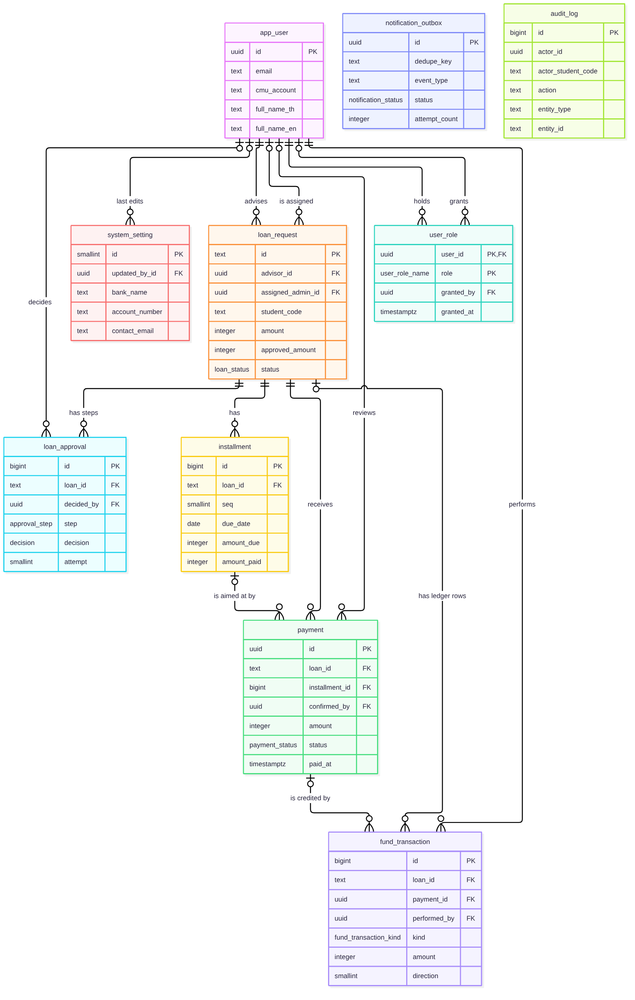

# metang Developer Guide

Version covered: metang 0.1.0
Document version: 1.0 draft
Date: 2026-10-02
Checked against: the code of 2026-10-02 (the outbox change of Section 8.2)

This guide is for the metang development team. It explains how to set up, change, test, and
document the code. It does not replace the other documents:

| Document | Reader | Use it for |
|---|---|---|
| This guide | Development team | Working on the code |
| `AGENTS.md` | Development team and coding agents | Short rules: style, commands, commit messages |
| `docs/documentation/maintenance-guide.en.md` | Client IT staff | Running the system after delivery (backup, update, monitoring). Its Section 7 lists every environment variable and every fixed value (limits, intervals, formats), and Section 10 lists every error message |
| `docs/documentation/user-manual-staff.md`, `user-manual-student.md` | End users | Using the screens |
| `db/README.md`, `bruno/README.md` | Development team | Database commands and the API test collection |
| `docs/CMU-ENTRA-SSO.md`, `docs/Email_API_Manual.md` | Development team | The CMU sign-in flow and the CMU Email API |

---

## Contents

- [1. Set up your computer](#1-set-up-your-computer)
- [2. Repository map](#2-repository-map)
- [3. Commands](#3-commands)
- [4. Daily workflow, hooks, and CI](#4-daily-workflow-hooks-and-ci)
- [5. Tests](#5-tests)
- [6. Database](#6-database)
- [7. Code conventions](#7-code-conventions)
- [8. Notifications and background jobs](#8-notifications-and-background-jobs)
- [9. Known traps](#9-known-traps)
- [10. Keep the documents current](#10-keep-the-documents-current)

---

## 1. Set up your computer

You need:

- Node.js 24 (the version in `.nvmrc`).
- Docker, for `npm run api:test` and `npm run ci:local`.
- The Infisical CLI (optional). Without it, the scripts use the values in your local `.env`.
- Access to the Infisical `dev` environment, or your own PostgreSQL database.

Steps:

1. Install the dependencies:

   ```bash
   npm ci
   ```

   This also generates Prisma Client (`postinstall`, into `lib/generated/prisma`, which Git
   ignores) and turns on the Git hooks in `.githooks/` (`prepare` sets `core.hooksPath`).
2. Copy `.env.example` to `.env`. Set `INFISICAL_ENV=dev`. Put the CMU application ID, the client
   secret, and a `SESSION_SECRET` of at least 32 characters in the file, or let Infisical load them.
   Section 7.1 of the maintenance guide lists every variable.
3. Confirm that `DATABASE_URL` and `DIRECT_URL` point to a database that you own. Never point them
   to the real production database.
4. Start the server:

   ```bash
   npm run dev
   ```

   It listens on port 8080. Open <http://localhost:8080>. The app runs under the base path
   `/metang` (`PUBLIC_SUBPATH`), and the root paths redirect to it.
5. Sign in. Either register the callback URL in CMU Entra (`README.md`), or use the development
   shortcuts: `DEV_API_BYPASS=true` plus `DEV_AS_ADVISOR`, `DEV_AS_ADMIN`, `DEV_AS_SUPERADMIN`, or
   `DEV_AS_EXECUTIVE` set to `true` (`lib/development-access.ts`). The shortcuts work only under
   `next dev`, or on a build with `DEBUG_MODE=true`. `DEBUG_MODE=true` on a build that holds real
   data lets any CMU account sign in, so use it only on a demo with fake data. A `.env` for the
   admin shortcut looks like this:

   ```dotenv
   INFISICAL_ENV=dev
   DEV_API_BYPASS=true
   DEV_AS_ADMIN=true
   ```
6. Load test data if you need it: `npm run db:seed`. `npm run db:reset` deletes the application
   data first. Neither command checks which database it uses, so check `DATABASE_URL` first.

---

## 2. Repository map



*Diagram 1. The request path and the background path. Source: `images/developer-guide/code-map.mmd`.*

| Path | Content |
|---|---|
| `app/` | Next.js App Router: pages per role (`student`, `advisor`, `admin`, `executive`, `superadmin`), `api/` route handlers, `login`, `demo/` developer test pages, `api-docs` (Swagger UI) |
| `app/api/cron/` | Workers of the scheduled jobs (Section 8) |
| `components/` | React components per role, and `shared/` for the parts that roles share (`RoleShell`, `TopNav`, `SidebarNav`) |
| `hooks/` | Shared React hooks |
| `lib/` | Server and shared logic: sign-in (`cmu-auth.ts`, `loan-auth.ts`), validation, notifications, jobs, slip storage, view models |
| `lib/generated/prisma/` | Prisma Client (generated, not in Git) |
| `db/schema.prisma` | Source of truth for tables and relations |
| `db/migrations/` | SQL migrations (26 on 2026-10-02) |
| `db/queries/` | Reusable database reads and writes. Put a query here, not in a route |
| `db/seed.ts`, `db/clear.ts`, `db/simple-workflow.ts` | Test data and clean-up scripts |
| `db/schema.dbml`, `db/design/database_schema.pdf` | Diagrams of the schema (Section 10) |
| `tests/` | Unit tests; `tests/db/` holds the tests that need a real database |
| `bruno/` | Bruno API collection (run by `npm run api:test`) |
| `scripts/` | `with-infisical.mjs`, `api-test-isolated.mjs`, `ci-local.mjs`, `normalize-openapi.mjs`, `create-test-case-workbook.py` |
| `.githooks/`, `.github/workflows/` | The pre-push hook, the CI workflow, the production migration workflow |
| `instrumentation.ts`, `proxy.ts` | Start of the job scheduler; page-request hook (return path, jobs after requests) |
| `Dockerfile`, `deploy/` | Container image and an example nginx configuration (maintenance guide, Section 6.4) |
| `public/openapi.json` | Generated API description (Section 7.3) |
| `docs/` | All documents. The diagrams are in `docs/documentation/images/` (`.mmd` Mermaid source and `.png`). `docs/docs-pdf/` makes the PDF files of the guides (Section 10) |
| `supabase/config.toml` | Supabase CLI settings with migrations and seeds switched off; Prisma owns both |
| `test-cases/` | Business-logic test case workbook |

---

## 3. Commands

| Command | What it does |
|---|---|
| `npm run dev` | Dev server on 8080 through `scripts/with-infisical.mjs`. It stops if `.env` or `INFISICAL_ENV` is missing |
| `npm run dev-normal` | Dev server on 8080 without the Infisical wrapper |
| `npm run build` | `prisma generate`, then `next build` |
| `npm run build:infisical`, `start:infisical` | Build and start with Infisical values (`start:infisical` uses port 8080) |
| `npm run start` | `next start` on `$PORT`, or 3000 |
| `npm run lint` | ESLint (Next.js core web vitals and TypeScript rules) |
| `npx tsc --noEmit` | Type check |
| `npm test` | All unit tests (Section 5) |
| `npm run api:test` | Database tests and the Bruno collection against a throwaway PostgreSQL 17 container |
| `npm run ci:local` | The CI checks in CI order, then clean-up (Section 4.3) |
| `npm run openapi:generate` | Rebuilds `public/openapi.json` (Section 7.3) |
| `npm run db:generate` | Regenerates Prisma Client |
| `npm run db:migrate` | Creates and applies a development migration (`prisma migrate dev`) |
| `npm run db:deploy`, `db:deploy:env` | Apply the migrations that are pending. `db:deploy:env` skips Infisical |
| `npm run db:status` | Shows the migration status |
| `npm run db:push`, `db:pull` | Push the schema without a migration; read the schema from the database |
| `npm run db:seed`, `db:reset` | Load test data; delete the application data and load it again |
| `npm run db:studio` | Prisma Studio |

All `db:*` commands except `db:generate` and `db:deploy:env` run through `scripts/with-infisical.mjs`.
It loads the variables of the Infisical environment in `INFISICAL_ENV`, or uses `.env` when the CLI
is not installed. There is no default environment.

---

## 4. Daily workflow, hooks, and CI



*Diagram 2. What checks a change. Nothing deploys automatically. Source: `images/developer-guide/change-and-check.mmd`.*

### 4.1 Rules

- The team pushes straight to `main`. There are no pull requests, so the hook and CI are the only
  checks.
- Write commits as `type(scope): summary` with a body and a footer. `AGENTS.md` has the full format.
- A change that touches the schema needs a migration and a note in the commit message.
- Never run `git push --no-verify` on `main`.

A commit message looks like this. An AI-assisted commit also ends with its `Co-Authored-By:` line.

```text
fix(db): enforce advisor assignment

Say what changed and why. Wrap the lines at about 76 characters.

No schema change and no migration.

Validation: npm run lint, npx tsc --noEmit, npm run build, npm test.
Not run: npm run api:test.
```

### 4.2 The pre-push hook

`.githooks/pre-push` runs `npm run lint` and `npx tsc --noEmit` before every push. It is fast on
purpose. It does not build or run tests.

### 4.3 CI and `npm run ci:local`

`.github/workflows/ci.yml` runs on every push to every branch, and by hand. It has three jobs:

| Job | Steps |
|---|---|
| Lint, type check, and build | `npm ci`, `npm run lint`, `npx tsc --noEmit`, `npm run build` with placeholder `DATABASE_URL` and `DIRECT_URL` |
| Unit tests | `npm ci`, `npm test` |
| API tests (Bruno) | `npm ci`, `npm run api:test` |

Run the same checks on your computer before you push a risky change:

```bash
npm run ci:local
```

It stops at the first failed check. The last line is `✓ all CI checks passed` when everything
passes. When it ends, pass or fail, it deletes the build output in `.next` (not `.next/dev`) and the
`metang-test` container. Add `-- --install` to run `npm ci` first; that deletes `node_modules`.

The build and the clean-up change `.next`, so stop every `next dev` and `next start` server of this
folder first. The command refuses to start while something listens on port 8080, 3000, or `$PORT`,
or while `.next/dev/lock` names a live dev server. It cannot see a server that you started by hand
on another port.

### 4.4 Production migration workflow

`.github/workflows/migrate-production.yml` runs `prisma migrate deploy` against production. Start
it by hand, on `main` only. It needs the `production` environment with required reviewers and a
`DIRECT_URL` secret in that environment (never a repository secret). It asks you to confirm that
you took a backup and to type `migrate production`. Migrations have no down scripts, so the backup
is the only way back. The maintenance guide, Section 5.2, describes the backup.

---

## 5. Tests

`npm test` runs `tests/*.test.ts` and `tests/*.test.mjs` with `node:test` through `tsx`, using
`--conditions=react-server` so that files that import `server-only` load. On 2026-10-02 it ran 584
tests in 104 files. Run one file like this:

```bash
npx tsx --conditions=react-server --test tests/fund-budget.test.ts
```

There are four kinds of test. Know which kind you are reading:

| Kind | Example | What it proves |
|---|---|---|
| Behaviour | `fund-budget.test.ts`, `installment-schedule.test.ts` | Calls the real function with inputs and checks the output |
| Source text | `payment-outcome-wiring.test.mjs`, `workflow.test.mjs` | Reads a source file with `readFileSync` and checks it with `assert.match`. It proves that code is present, not that it works. A rename or a reformat can break it |
| Migration | `*.migration.test.mjs` (11 files) | Reads the migration SQL and checks the constraint or the trigger text |
| Database | `tests/db/*.test.ts` | Runs against a real PostgreSQL database. Only `npm run api:test` runs them |

`npm run api:test` (`scripts/api-test-isolated.mjs`) starts a `postgres:17` container named
`metang-test` on port 5433, applies all migrations, seeds it, runs the three database test files
(47 tests), starts the app on port 8081, and runs the Bruno collection twice: the endpoints (41
requests, 148 assertions) and the ordered `Workflow/` walk (28 requests, 62 assertions). If a test fails, the container stays up.
Remove it with `docker rm -f metang-test`. It needs no `.env` and never touches a real database. It
cannot test slip upload or download or the notification routes, because the container has no
Supabase credentials and no LINE or email service. `bruno/README.md` lists what runs and what does
not.

A source-text test reads a file and matches its text (excerpt of
`tests/payment-outcome-wiring.test.mjs`):

```js
const read = (file) => readFileSync(resolve(root, file), "utf8");
const worker = read("app/api/cron/deliver-payment-outcomes/route.ts");

test("the payment-outcome worker claims only its own event and sends by email, never FON", () => {
  assert.match(worker, /claimDueNotifications\(20, PAYMENT_OUTCOME_EVENT\)/);
  assert.match(worker, /checkCronAuth\(request\)/);
  assert.doesNotMatch(worker, /sendLineNotification|line-notification/);
});
```

When you change behaviour, change its tests in the same commit. When you add a route, check its
wiring test (a source-text test) and the Bruno collection.

---

## 6. Database



*Diagram 3. The tables and their foreign keys, key columns only. `db/schema.prisma` lists every
column, and `db/schema.dbml` adds notes on the rules. Source: `images/developer-guide/er-diagram.mmd`.*

### 6.1 Change the schema

1. Edit `db/schema.prisma`.
2. Run `npm run db:migrate`. Check first that `DATABASE_URL` and `DIRECT_URL` point to your own
   database, because `prisma migrate dev` can ask to reset the database when it finds a difference.
3. Read the generated SQL in `db/migrations/<timestamp>_<name>/migration.sql`. Wrap hand-written
   SQL in `BEGIN;` and `COMMIT;`.
4. Add what Prisma cannot describe by hand in the same migration: CHECK constraints, triggers,
   functions, and views. Partial unique indexes can stay in the schema (`partialIndexes`).
5. Add a `tests/<name>.migration.test.mjs` file for each rule that the database enforces.
6. Run `npm run api:test`. It applies every migration to an empty PostgreSQL 17 database.
7. Check that the schema and the migrations agree. Run this against your development database
   after the migration:

   ```bash
   npx prisma migrate diff --from-config-datasource --to-schema db/schema.prisma --exit-code
   ```

   Expected result: `No difference detected.`
8. Update the documents (Section 10).

A hand-written migration is one transaction. This is an excerpt of
`db/migrations/20261001160000_immutable_audit_log/migration.sql`:

```sql
-- Say why the migration exists. Put the reasoning in comments.
BEGIN;

CREATE FUNCTION "public"."audit_log_block_mutation"() RETURNS trigger AS $$
BEGIN
  IF current_setting('methang.allow_audit_mutation', true) = 'on' THEN
    RETURN COALESCE(NEW, OLD);
  END IF;

  RAISE EXCEPTION 'audit_log is append-only; % is not allowed', TG_OP
    USING ERRCODE = 'check_violation';
END;
$$ LANGUAGE plpgsql;

CREATE TRIGGER "audit_log_append_only"
  BEFORE UPDATE OR DELETE ON "public"."audit_log"
  FOR EACH ROW EXECUTE FUNCTION "public"."audit_log_block_mutation"();

COMMIT;
```

Its `*.migration.test.mjs` test reads the SQL text (shortened excerpt of
`tests/admin-executive-loop.migration.test.mjs`):

```js
test("review-loop migration preflights legacy attempts before additive DDL", () => {
  const migration = read("db/migrations/20260904120000_admin_executive_review_loop/migration.sql");
  assert.match(migration, /^BEGIN;/);
  assert.match(migration, /ADD COLUMN "assigned_admin_id" UUID/);
  assert.match(migration, /COMMIT;\s*$/);
});
```

### 6.2 Rules the database enforces

- `fund_transaction` and `audit_log` are append-only. Triggers block `UPDATE` and `DELETE` (and
  `TRUNCATE` on `audit_log`). Only `db/seed.ts` and `db/clear.ts` switch them off, with
  `SET LOCAL methang.allow_fund_mutation = 'on'` and `SET LOCAL methang.allow_audit_mutation = 'on'`
  inside a transaction. Never do this in application code.

  The switch-off lasts for one transaction (excerpt of `db/seed.ts`):

  ```ts
  async function wipeMockData(tx: Prisma.TransactionClient) {
    await tx.$executeRaw`SET LOCAL methang.allow_fund_mutation = 'on'`;
    // ... delete the mock rows
  }
  ```

- `fund_transaction_check_balance` rejects an insert that makes the fund balance negative.
- `audit_log_snapshot_actor` fills `audit_log.actor_name` and `actor_role` before each insert. The
  application does not pass them.
- `loan_request` allows one open request per student (`one_open_loan_per_student`) and one executive
  in `user_role` (`one_executive_only`). `fund_transaction` allows one disbursement per loan
  (`fund_transaction_one_disbursement_per_loan`) and one repayment per payment
  (`fund_transaction_one_repayment_per_payment`).
- CHECK constraints: `audit_log_one_actor` (exactly one of `actor_id` and `actor_student_code`),
  `fund_transaction_amount_positive`, `fund_transaction_direction_valid`,
  `fund_transaction_kind_direction_pairing`, `payment_amount_positive`, and
  `system_setting_singleton` (one row, `id = 1`). The loan ID format, the installment count (1 to
  3), and `transfer_confirmed_at` (not before `disbursed_at`) have CHECK constraints too.
- `next_loan_request_id()` makes the loan ID (`REQYYYYMMDDNNNN`, Bangkok date). Prisma cannot
  describe it, so it is only in the migration SQL.
- To see every rule of a table, run `\d <table>` in `psql`, or read the notes in
  `db/schema.dbml` and the SQL in `db/migrations/`. `db/schema.prisma` does not hold the CHECK
  constraints, the triggers, or the functions.

### 6.3 Queries

Put reads and writes in `db/queries/`. Use an explicit `select`. The bank account fields of a loan
(`bankAccountNo`, `bankName`, `bankAccountName`) must reach only the admin, who disburses the loan,
and a Bruno assertion checks this. Decisions use a transaction at `Serializable` isolation and an
`updateMany` guard on the current status (`decideAdminLoanRequest`), so that two simultaneous
decisions give one success and one `409`. Copy this pattern for a new decision. This is an excerpt
of `decideAdminLoanRequest` in `db/queries/loan-requests.ts` (`// ...` marks lines that are left
out):

```ts
return prisma.$transaction(async (tx) => {
  const current = await tx.loanRequest.findFirst({
    where: { id, status: "pending_admin", OR: [{ assignedAdminId: null }, { assignedAdminId: adminId }] },
    select: adminLoanDetailSelect,
  });
  if (!current) throw new AdminDecisionError("NOT_FOUND");
  // ... check the decision rules

  const changed = await tx.loanRequest.updateMany({
    where: { id, status: "pending_admin", OR: [{ assignedAdminId: null }, { assignedAdminId: adminId }] },
    data: {
      status: nextStatus,
      approvedAmount: decision === "approved" ? approvedAmount : null,
      assignedAdminId: decision === "approved" ? adminId : null,
    },
  });
  if (changed.count !== 1) throw new AdminDecisionError("STALE_DECISION");

  // ... write the approval row and the audit row
  await enqueueReviewerNotifications(tx, { loanId: id, auditLogId: audit.id });
  // ...
}, { isolationLevel: Prisma.TransactionIsolationLevel.Serializable, timeout: 15000 });
```

Staff pages are Server Components, so everything their query returns goes into the page HTML,
where anyone signed in to that role can read it. Each page calls its own query in
`db/queries/loan-requests.ts` (for example `getVerifySlipRequests`), and the query decides which
loans and fields the page gets. When you add a field to a staff screen, add it to that page's
query. Do not widen a query to "everything" to make a field appear.

Never import `lib/prisma.ts` into a Client Component.

---

## 7. Code conventions

### 7.1 Style

Two spaces, double quotes, semicolons, trailing commas, 100 characters per line (`.prettierrc`).
Components use PascalCase and variables use camelCase. Server Components are the default. Add
`"use client"` only when a component needs the browser. Use the `@/` alias for imports from the
repository root.

This project uses Next.js 16, which has breaking changes against older versions. Before you write
Next.js code, read the matching guide in `node_modules/next/dist/docs/` (`AGENTS.md` says the same).

### 7.2 Sign-in, roles, and the base path

- The sign-in flow is in `docs/CMU-ENTRA-SSO.md` (`lib/cmu-auth.ts`). The session cookie is
  `cmu_session` and lasts 8 hours.
- Students have no `app_user` row. Each `loan_request` holds the borrower (`student_code` and the
  copied name and email). Staff have an `app_user` row and rows in `user_role`.
- A page guards itself with `require*Access` from `lib/loan-auth.ts`. An API route calls a
  `get*Context()` function from the same file and returns `401` or `403` itself when it gets `null`.
- Role rules (the maintenance guide, Section 3.2): an advisor never also holds `admin` or
  `super_admin`; there is exactly one executive, who also holds `advisor` and is edited in place.
  The application enforces the first rule and the database enforces only "one executive".
- A signed-out user who opens a protected page goes to `/login?next=<page>` and returns to that
  page after sign-in. `proxy.ts` passes the page to the guard in a header, and
  `lib/return-path.ts` rejects a value that is not a page of this site.
- Every client-side `fetch` and every link that you write by hand must go through `withBasePath()`
  from `lib/base-path.ts`. Without it the call breaks when `PUBLIC_SUBPATH` is not empty.

A page guards itself (excerpt of `app/admin/disburse-debt/page.tsx`). The guard redirects to
`/login`, or to `/error?type=forbidden`:

```tsx
import { requireAdminAccess } from "@/lib/loan-auth";

export default async function DisburseDebt() {
  await requireAdminAccess();
  // ... read with a function of db/queries, then render
}
```

An API route answers `401` itself:

```ts
const context = await getStudentContext();
if (!context) return apiError("UNAUTHORIZED", "Authentication required", 401);
```

A client-side call (excerpt of `components/shared/disburse-debt/DisburseDebtCard.tsx`):

```tsx
import { withBasePath } from "@/lib/base-path";

const res = await fetch(withBasePath(`/api/admin/loan-requests/${selectedRequest.id}/disburse`), {
  method: "POST",
  body: formData,
});
```

### 7.3 API routes

- Answer with `apiOk(data)` or `apiError(code, message, status)` (`lib/api-response.ts`). The body
  is `{ data }` or `{ error: { code, message } }`, with `Cache-Control: no-store`.
- A route that changes data calls `validateJsonRequest(request)` (same origin and JSON), or
  `isSameOrigin(request)` when it has no body (`lib/request-security.ts`).
- Check an ID with `isLoanId`, and send results through `serializeJson` (it converts `Date` and
  `bigint`).
- Describe the route with JSDoc tags above the handler (`@tag`, `@body`, `@pathParams`, `@auth`,
  `@response`, `@add`). Then run `npm run openapi:generate`. It runs `next-openapi-gen` and
  `scripts/normalize-openapi.mjs` and writes `public/openapi.json`. Commit the result. `/api-docs`
  shows it, and `/api/openapi` redirects to it.
- The Bruno collection came from that file. Do not import it again over the collection, because
  that overwrites every assertion. Add the request files by hand (`bruno/README.md`).

A route without a body (excerpt of `app/api/student/loan-requests/[id]/cancel/route.ts`):

```ts
/**
 * Cancel the current student's active loan request.
 * @tag Student loans
 * @pathParams LoanRequestIdParams
 * @auth cookieAuth
 * @response 200:LoanRequestDetailResponse
 * @add 401:ApiErrorResponse
 * @add 409:ApiErrorResponse
 */
export async function POST(request: Request, { params }: Params) {
  if (!isSameOrigin(request)) {
    return apiError("FORBIDDEN", "A same-origin request is required", 403);
  }
  const context = await getStudentContext();
  if (!context) return apiError("UNAUTHORIZED", "Authentication required", 401);

  const { id } = await params;
  if (!isLoanId(id)) return apiError("NOT_FOUND", "Loan request not found", 404);
  // ... a transaction with a guarded updateMany, then:
  return apiOk(serializeJson(loan));
}
```

A route with a JSON body starts with `validateJsonRequest` instead of `isSameOrigin`:

```ts
export async function POST(request: Request) {
  const requestError = validateJsonRequest(request);
  if (requestError) return requestError;
  // ...
}
```

The two answers look like this:

```json
{ "data": { "id": "REQ202610020001", "status": "cancelled" } }
{ "error": { "code": "CONFLICT", "message": "The request can no longer be cancelled" } }
```

### 7.4 Screens

- Student screens have Thai and English text through `app/student/StudentLanguageProvider.tsx`
  (`t(thai, english)` and a map for status labels). Staff screens are Thai only. Example (excerpt of
  `components/student/application/TempLoanApplicationPage.tsx`):

  ```tsx
  const { language, t } = useStudentLanguage();
  // ...
  {t("กลับหน้าหลัก", "Back to home")}
  ```
- Some files with `temp` or `mock` in the name are in use. For example, `Temp*` components under
  `components/student/application/` are the real application form, and `RequestsCard.tsx` takes the
  500,000 baht cap on the approved amount from `app/student/temp/tempMockData.ts`. Search for
  imports before you delete or rename one.
- Slip files go to a private Supabase Storage bucket (`lib/slip-storage.ts`, `SUPABASE_SLIP_BUCKET`).
  The limit is 1 MB (`MAX_SLIP_BYTES`), and `lib/slip-file-type.ts` finds the real image type from
  the first bytes of the file. The routes `/api/payments/:id/slip` and
  `/api/fund-transactions/:id/slip` check access with `lib/slip-access.ts`.

### 7.5 Loan status flow


*Diagram 4. The moves between the 10 values of `loan_status`. Source: `images/developer-guide/loan-status-map.mmd`.*

- The database does not check the order of status changes. Each action reads the current status
  inside a transaction and updates with a guard on that status (`updateMany` with the expected
  status), so two actions at the same time give one success and one `409`.
- The app creates every request in `pending_advisor` (`app/api/student/loan-requests/route.ts`).
  `draft` exists in the enum and in seed data. The reviewer lists exclude it.
- A student can cancel a request in `draft`, `returned`, `pending_advisor`, `pending_admin`, or
  `pending_executive`, but not in `pending_disbursement`
  (`app/api/student/loan-requests/[id]/cancel/route.ts`). An admin or SuperAdmin cancels in
  `pending_admin` or `pending_disbursement` (`cancelAdminLoanRequest`). Removing an advisor cancels
  that advisor's requests in `pending_advisor` only (`db/queries/users.ts`).
- After the transfer, the student confirms receipt. That sets `loan_request.transfer_confirmed_at`.
  The status stays `disbursed` until the last installment is confirmed. The student screen shows the
  label "กำลังชำระ" only in the browser, from `isTransferConfirmed`.
- A student has at most one open request (`one_open_loan_per_student`). Open means any status other
  than `closed`, `rejected`, or `cancelled`.

---

## 8. Notifications and background jobs

The maintenance guide, Sections 2.3 to 2.5, explains this from the operator's side.

### 8.1 How it works

1. A database transaction writes a row to `notification_outbox` with `enqueueNotification(tx, ...)`.
   The `dedupe_key` is unique, so the same event never makes two rows.
2. A worker claims due rows with `claimDueNotifications(limit, eventType)`. It uses
   `FOR UPDATE SKIP LOCKED`, so several server instances can run. A claim is a lease of 15
   minutes. A row gets 5 attempts, with waits of 1, 5, 15, and 60 minutes.
3. The worker sends the message and finishes the row (Section 8.2). A run claims up to 20 rows
   and sends 5 at a time.

A reviewer step writes one row for each recipient, so three admins give three rows. A reminder
that is no longer needed (the installment is paid, or the loan is not disbursed) is marked
`delivered` with an empty `delivered_at` and the reason in `last_error`. A job that does not run
on a day does not create that day's reminders later.

Two routes send at once and do not use the outbox: `POST /api/notifications/fon` (a LINE reminder
to the current reviewer, with a 60-second cool-down in the memory of each instance) and
`POST /api/notifications/outlook` (a due-date email to a student; no screen calls it).

In code, the enqueue runs inside the transaction of the change, and the worker claims with a raw
query (excerpts of `db/queries/loan-requests.ts` and `db/queries/notifications.ts`):

```ts
// inside prisma.$transaction(async (tx) => { ... })
await enqueueReviewerNotifications(tx, { loanId: id, auditLogId: audit.id });

// claimDueNotifications(limit, eventType)
const claimable = await tx.$queryRaw<{ id: string }[]>`
  SELECT id FROM notification_outbox
  WHERE event_type = ${eventType}
    AND status IN ('pending', 'retry', 'processing')
    AND available_at <= now()
  ORDER BY available_at
  LIMIT ${limit}
  FOR UPDATE SKIP LOCKED
`;
```


*Diagram 5. The life of an outbox row. Source: `images/developer-guide/notification-flow.mmd`.*

| Event type | Channel | Written by |
|---|---|---|
| `reviewer_notification` | LINE through the FON API (`lib/line-notification.ts`) | `enqueueReviewerNotifications` (`db/queries/notification-recipients.ts`), inside the transaction of a status change to a reviewer step (`pending_advisor`, `pending_admin`, `pending_executive`) |
| `installment_reminder` | Email through the CMU Email API (`lib/email-api/`) | The daily job `installment-reminders` |
| `loan_outcome`, `payment_outcome` | Email | Nothing since 2026-10-01. The workers only drain old rows |

Students get email only from the two installment reminder kinds. Do not add an email for a status
change without agreeing it with the fund office first.

### 8.2 Finish a row

- A sent or skipped `reviewer_notification`, `loan_outcome`, or `payment_outcome` row is deleted
  with `deleteFinished(id)`. Its key is the audit-log row of one transition, so nothing enqueues it
  again.
- An `installment_reminder` row stays and is marked with `markDelivered(id)` or `markSkipped`. Its
  `dedupe_key` (`installment-reminder:<installmentId>:<dueDate>:<offsetDays>`) is what stops a
  restarted scheduler from emailing the same reminder twice. Never use `deleteFinished` for it.

```ts
// app/api/cron/deliver-fon/route.ts: a sent or skipped reviewer row is deleted
await deleteFinished(row.id);

// app/api/cron/deliver-reminders/route.ts: an installment reminder stays
await markDelivered(row.id);
await markSkipped(row.id, decision.reason);

// on an error: the first call fails the row for good, the second retries it after a wait
await markFailed(row.id, message, { permanent: true });
await markFailed(row.id, message, {});
```

### 8.3 Jobs

`instrumentation.ts` starts `lib/jobs/start-scheduler.ts` when the server starts. Each job calls the
route handler of `app/api/cron/<name>` directly, with the `CRON_SECRET` bearer token that
`checkCronAuth` checks. `JOB_RUNNER` chooses the trigger: `timer` (default), `request` (after page
requests, through `proxy.ts`, for hosts that freeze idle servers), or `off` (an outside scheduler
calls the routes).

| Job | Interval |
|---|---|
| `deliver-fon` | every minute |
| `deliver-reminders`, `deliver-loan-outcomes`, `deliver-payment-outcomes` | every 3 minutes |
| `installment-reminders` | once a day, at the first check after 08:00 Bangkok time. It writes a row for each unpaid installment that is due in 3, 1, or 0 days, or is 1, 3, or 7 days late |

To add a job:

1. Add `app/api/cron/<name>/route.ts`. Call `checkCronAuth(request)` first.
2. Add the job to `JOBS` in `lib/jobs/start-scheduler.ts`.
3. Add a wiring test like `tests/payment-outcome-wiring.test.mjs`.
4. Update the cron example and the job table in the maintenance guide, Section 2.3, and run
   `npm run openapi:generate`.

The route of a job (excerpt of `app/api/cron/deliver-fon/route.ts`):

```ts
import { checkCronAuth } from "@/lib/notifications/cron-auth";

export const maxDuration = 60;

async function handle(request: Request) {
  const authError = checkCronAuth(request);
  if (authError) return authError;
  // ... claim, send, finish the rows
  return apiOk(serializeJson({ processed, delivered, skipped, failed }));
}

export const GET = handle;
export const POST = handle;
```

Its entry in `JOBS` (`lib/jobs/start-scheduler.ts`):

```ts
{
  path: "/api/cron/deliver-fon",
  shouldRun: everyMinutes(1),
  load: () => import("@/app/api/cron/deliver-fon/route"),
},
```

---

## 9. Known traps

- **One `.next` folder.** `npm run dev`, `npm run build`, `npm run start`, `npm run api:test`, and
  `npm run ci:local` share it. A build or a clean-up under a running server breaks that server with
  `Cannot find module .next/server/middleware-manifest.json`. Stop the server first.
- **Ports.** Dev uses 8080. `api:test` uses 8081 for the app and 5433 for PostgreSQL. A dev server
  blocks `api:test` (it reads `.next/dev/lock`).
- **`tsconfig.json` changes by itself.** Next rewrites it during `dev`, `build`, and `api:test`.
  Check it before you commit, and restore it if it changed:

  ```bash
  git diff tsconfig.json
  git show HEAD:tsconfig.json > tsconfig.json
  ```
- **Prisma Client is not in Git.** After you pull a schema change, run `npm run db:generate`.
- **Tests that import `server-only`** need `--conditions=react-server`. Use `npm test`, or the
  command in Section 5.
- **`db:seed` and `db:reset` do not check the environment.** They act on whatever `DATABASE_URL`
  names. `db/clear.ts` refuses to run when `INFISICAL_ENV` is set to anything but `dev`, and `db/simple-workflow.ts` runs only when it is `dev`.
- **Wrong message.** The student error for a bad installment count says "1-4 งวด"
  (`lib/student-error-mapper.ts`), but the server and the database accept 1 to 3.
- **A stray file in Git.** `test-cases/.~lock.loan-business-logic-test-cases.xlsx#` is a
  LibreOffice lock file that was committed by mistake. Commit its deletion, and add `.~lock.*#` to
  `.gitignore`.
- **Settings saved only in the browser.** The SuperAdmin contact screen keeps the opening hours,
  the closed-days note, and the faculty address in `localStorage` (`metang-system-address`), not in
  `system_setting`. Other users do not see them, because the screen never sends them to the server.
- **The user and role screen** (`components/superadmin/setting/UserRolesTab.tsx`).
  It treats any `409` as the "last SuperAdmin" error. On the executive row, and when a SuperAdmin
  changes their own row, it grants the new role first and then fails to remove the old one, so
  the user can end up with both roles. The maintenance guide, Section 3.2, tells the operator how
  to remove the extra role.
- **Known gaps of version 0.1.0.** The maintenance guide, Section 2.5, lists them.

---

## 10. Keep the documents current

The client receives the source code and the database schema, so a document that is wrong is a
defect. Use this table when you change the code.

| You change | Update |
|---|---|
| `db/schema.prisma` or add a migration | `db/schema.dbml` (by hand); the maintenance guide: migration count and latest name (Sections 1.3, 5.4, 6.4), and the list of migrations that cannot be reversed (Section 6.3); `images/developer-guide/er-diagram.mmd` if a table or key changes; Section 6.2 of this guide if a rule changes; `bruno/README.md` and `docs/BRUNO-API-TESTING.md` if they quote the count |
| `db/design/database_schema.pdf` | It is the version 1.0 file of 2026-07-23. Make a new one from `db/schema.dbml` at dbdiagram.io before you give it to anyone |
| An API route | JSDoc tags, then `npm run openapi:generate`; a Bruno request file; the route and handler counts in `bruno/README.md` |
| A test count | The test count in the maintenance guide, Section 6.2 step 3, and `bruno/README.md` |
| An environment variable | `.env.example` and the table in the maintenance guide, Section 7.1 |
| A job or its interval | `lib/jobs/start-scheduler.ts`, the job table and the cron example in the maintenance guide, Section 2.3 |
| Screen text, a button, or a status label | The user manuals (staff and student) and their screenshots |
| A procedure for the operator | The maintenance guide, and its document history table |
| A loan status, or who may cancel | Section 7.5 of this guide and its diagram, and the maintenance guide, Section 3.2 (it shows the same diagram) |
| How the outbox works | Section 8 of this guide and its diagram, and the maintenance guide, Section 2.3 (it shows the same diagram) |
| A diagram | Edit the `.mmd` file, then render it again (see below) and commit both files. The maintenance guide shows `loan-status-map` and `notification-flow` from this folder |
| A command or a developer rule | This guide and `AGENTS.md` |
| Any guide (`*.md` in `docs/documentation/`) | Its other language (the developer guide and the maintenance guide have a Thai copy, `*.th.md`), then make the PDF again (see below) |

Check the counts with these commands:

```bash
ls db/migrations | grep -c .          # one more than the number of migrations (migration_lock.toml)
npm test 2>&1 | grep -E '^ℹ (tests|pass|fail)'
npm run openapi:generate && git diff --stat public/openapi.json   # expect no difference
```

To render a diagram again, run this in `docs/documentation/images/developer-guide/` (it needs
Node.js and a Chromium browser; the first run downloads `@mermaid-js/mermaid-cli`):

```bash
npx -y -p @mermaid-js/mermaid-cli mmdc -i code-map.mmd -o code-map.png -s 2 -b white -C fonts.css
```

`fonts.css` forces the font Liberation Sans. Without it the labels can use another font and the
boxes can clip the text. If `mmdc` cannot find Chromium, pass `-p puppeteer.json`, a file with
`{ "executablePath": "<path to Chromium>", "args": ["--no-sandbox"] }`.

To make the PDF files of the guides (this guide and the maintenance guide in English and in Thai, and the two user manuals):

```bash
cd docs/docs-pdf
npm install        # once
npm run render     # writes docs/documentation/pdf/*.pdf
npm test           # lays out a test document and the four guides, and checks the PDF files
```

The tool needs Chromium (`CHROMIUM_PATH`, default `/usr/bin/chromium`), `pdftotext`, `pdffonts`, and
`pdfimages` from poppler-utils, and the fonts Liberation Sans, Liberation Mono, and Noto Sans Thai.
It is separate from the application: the root `npm ci` does not install it, `npm test` of the
application does not run it, and CI does not use it.

Before it prints a page, the tool measures the layout. `npm run render` stops with exit code 1, and
names the section, when a table column is squeezed, a word is split in the middle, text runs past the
edge of the page or is cut off, or an image does not load. The tests also check the printed PDF: the
text stays inside the margins, no page is empty, no character is lost, only the expected fonts are
used, and every character of the guides has a glyph. If you meet a new kind of text that prints badly,
add it as a section to `docs/docs-pdf/test/fixture.mjs` first, then fix `render.mjs`.
