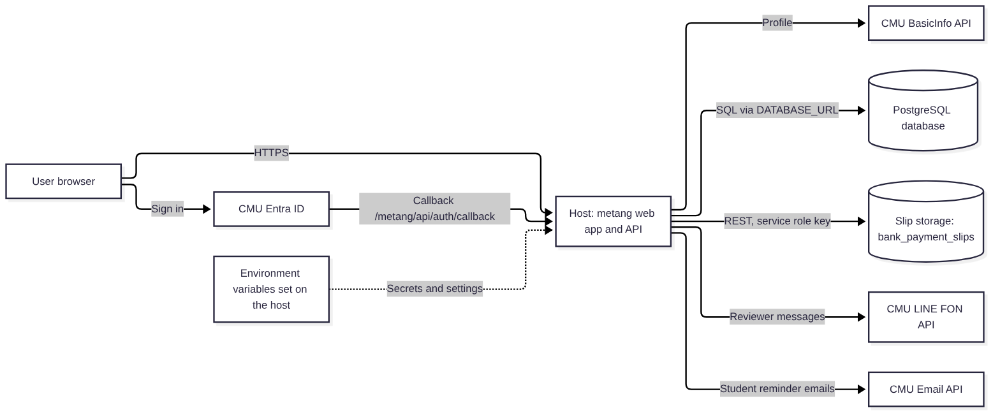
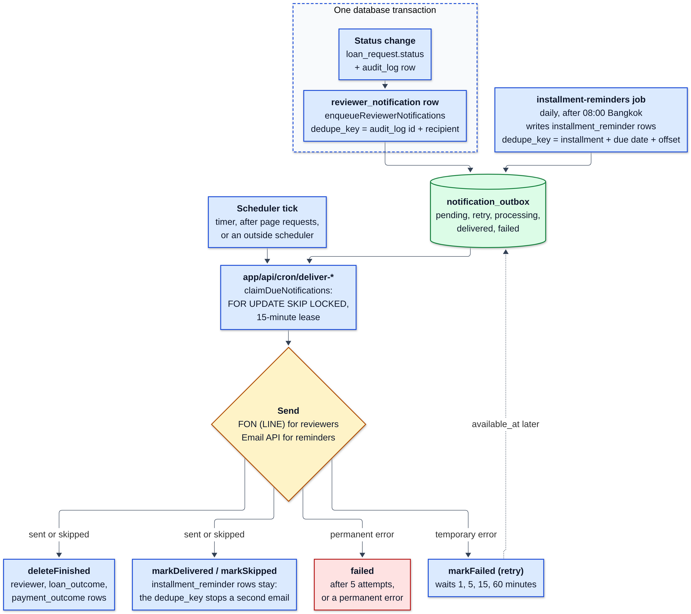
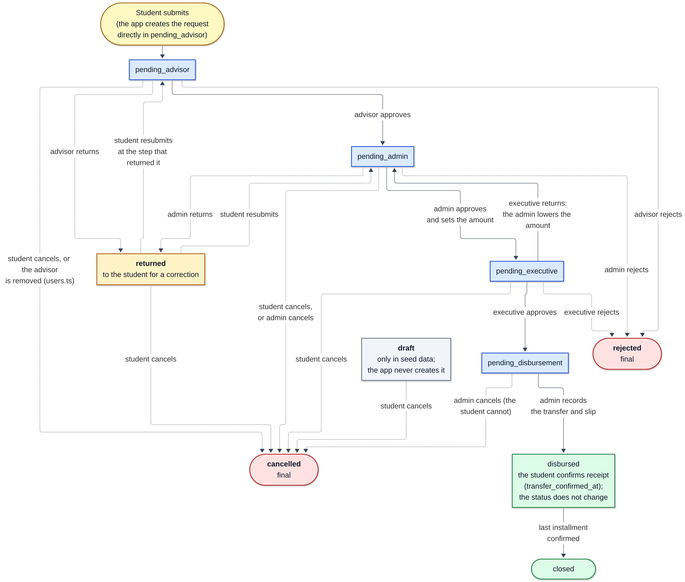

# metang Maintenance Guide

Version covered: metang 0.1.0 (`package.json` version `0.1.0`)
Document version: 1.10 draft
Date: 2026-10-02

---

## Contents

- [1. About this guide](#1-about-this-guide)
  - [1.1 Purpose](#11-purpose)
  - [1.2 Audience and required skills](#12-audience-and-required-skills)
  - [1.3 Software version covered](#13-software-version-covered)
  - [1.4 Conventions](#14-conventions)
- [2. System overview](#2-system-overview)
  - [2.1 Components](#21-components)
  - [2.2 How the components connect](#22-how-the-components-connect)
  - [2.3 How notifications work](#23-how-notifications-work)
  - [2.4 Locations of data, logs, configuration, and backups](#24-locations-of-data-logs-configuration-and-backups)
  - [2.5 Known limitations of version 0.1.0](#25-known-limitations-of-version-010)
- [3. Access and permissions](#3-access-and-permissions)
  - [3.1 Maintenance accounts](#31-maintenance-accounts)
  - [3.2 Application roles](#32-application-roles)
  - [3.3 Add the first SuperAdmin or an advisor](#33-add-the-first-superadmin-or-an-advisor)
  - [3.4 Where credentials are stored](#34-where-credentials-are-stored)
- [4. Routine maintenance](#4-routine-maintenance)
  - [4.1 Schedule](#41-schedule)
  - [4.2 Health check](#42-health-check)
  - [4.3 Retry failed notifications](#43-retry-failed-notifications)
  - [4.4 Check the review backlog](#44-check-the-review-backlog)
  - [4.5 Verify backups](#45-verify-backups)
  - [4.6 Check database and storage usage](#46-check-database-and-storage-usage)
  - [4.7 Remove old delivered notifications (optional)](#47-remove-old-delivered-notifications-optional)
  - [4.8 Review unused slip files](#48-review-unused-slip-files)
  - [4.9 Reconcile the fund balance](#49-reconcile-the-fund-balance)
  - [4.10 Renew secrets before they expire](#410-renew-secrets-before-they-expire)
  - [4.11 Check that HTTPS works](#411-check-that-https-works)
- [5. Backup and restore](#5-backup-and-restore)
  - [5.1 What to back up](#51-what-to-back-up)
  - [5.2 Take a manual database backup](#52-take-a-manual-database-backup)
  - [5.3 Back up slip files](#53-back-up-slip-files)
  - [5.4 Restore the database](#54-restore-the-database)
  - [5.5 Verify a restore](#55-verify-a-restore)
- [6. Updates and upgrades](#6-updates-and-upgrades)
  - [6.1 Pre-update checklist](#61-pre-update-checklist)
  - [6.2 Update procedure](#62-update-procedure)
  - [6.3 Rollback procedure](#63-rollback-procedure)
  - [6.4 Run the application as a container on your own server](#64-run-the-application-as-a-container-on-your-own-server)
- [7. Configuration reference](#7-configuration-reference)
  - [7.1 Environment variables](#71-environment-variables)
  - [7.2 In-app system settings](#72-in-app-system-settings)
  - [7.3 Scheduled job settings](#73-scheduled-job-settings)
  - [7.4 Fixed values (change needs a code update)](#74-fixed-values-change-needs-a-code-update)
- [8. Monitoring](#8-monitoring)
- [9. Troubleshooting](#9-troubleshooting)
- [10. Error messages](#10-error-messages)
  - [10.1 Sign-in and access](#101-sign-in-and-access)
  - [10.2 Student loan requests](#102-student-loan-requests)
  - [10.3 Repayments and slips](#103-repayments-and-slips)
  - [10.4 Staff review and disbursement](#104-staff-review-and-disbursement)
  - [10.5 SuperAdmin](#105-superadmin)
  - [10.6 Notifications and scheduled jobs](#106-notifications-and-scheduled-jobs)
  - [10.7 Startup and maintainer tools](#107-startup-and-maintainer-tools)
- [11. Getting support](#11-getting-support)
- [12. Glossary](#12-glossary)
- [13. Document history](#13-document-history)

---

## 1. About this guide

### 1.1 Purpose

This guide tells you how to keep the metang student emergency loan system running after
delivery. It covers routine checks, backups, updates, configuration, monitoring, and the
problems you are most likely to see.

metang is a web application for the CMU Faculty of Nursing emergency loan fund. Students
apply for a loan, an advisor, an admin, and the executive approve it, an admin records the
bank transfer, and the student repays in installments by uploading bank-transfer slips.

### 1.2 Audience and required skills

This guide is for the IT staff who operate metang after delivery.

You need these skills:

- Use the web dashboards of your host (for example Vercel) and of your database host.
- Set environment variables on your host. Production secrets are environment variables (Section 3.4).
- Run commands in a terminal (Linux, macOS, or Windows with WSL).
- Read and run simple SQL statements in a SQL client or in the SQL console of your database host.

You do not need to read the source code for routine tasks (Sections 3, 4, 5, 8, 9, 10).
Updates and upgrades (Section 6) need a copy of the source repository and Node.js.

A developer who changes the code uses the developer guide (`docs/documentation/developer-guide.en.md`)
instead. It covers the set-up of a development computer, the repository, the tests, the database
changes, and the diagrams.

### 1.3 Software version covered

| Item | Value |
|---|---|
| Application | metang `0.1.0` |
| Framework | Next.js `16.2.10`, React `19.2.4` |
| Database access | Prisma `7.9.1` with PostgreSQL |
| Node.js | `24` (from `.nvmrc`) |
| Database migrations | 26, the latest is `20261002130000_audit_log_actor_snapshot` |
| Base path | `/metang` (`basePath` in `next.config.ts`) |

### 1.4 Conventions

- `Code format` marks a command, file name, path, setting name, table name, or exact text.
- Commands are complete. Copy them exactly. Replace only text that the step tells you to
  replace, for example `replace-with-email@cmu.ac.th`.
- SQL statements run in the SQL console of your database host, or in a SQL client, unless the step
  says otherwise.
- Bold text such as **Settings** > **Environment Variables** is a menu path in a web dashboard.
- `Not tested:` marks a step that the authors wrote from the code but did not run. Test it before
  you rely on it.

Warnings use this format and come before the step they apply to:

> **WARNING:** What can go wrong. How to avoid it.

---

## 2. System overview

### 2.1 Components

metang is one Next.js web application. It has no servers that you manage. All parts run on
hosted services.

| Component | Service | What it does |
|---|---|---|
| Web application | Your host (the Vercel demo uses serverless functions) | Serves all pages and the API under `/metang/api/`. |
| Scheduled jobs | Chosen at server start by `instrumentation.ts` (`lib/jobs/runtime.ts`) from `JOB_RUNNER` | `timer` (default): the server runs the five jobs on its own timers (`next start`, `npm run dev`). `request`: `proxy.ts` runs the jobs that are due after each page request, for a host that stops idle instances, such as Vercel. `off`: an outside scheduler calls the routes. |
| Database | PostgreSQL database | Stores staff users, roles, loan requests with their borrowers, approvals, installments, payments, the fund ledger, the notification outbox, the audit log, and system settings. |
| Slip storage | A private bucket (`bank_payment_slips`) that the application reaches through the Supabase Storage REST API (`lib/slip-storage.ts`). The code does not support another object store without a change. | Stores bank-transfer slip files (images of 1 MB or less) for disbursements and repayments. |
| Sign-in | CMU Entra ID (OAuth 2.0) and CMU BasicInfo API | Signs users in with their CMU IT Account and reads their profile. |
| Reviewer notifications | CMU LINE notification API ("FON") | Sends LINE messages to the advisor, admin, or executive who must act on a request. |
| Student emails | CMU Email API (Outlook) | Sends repayment due-date and overdue reminders to students. Since 2026-10-01 the application sends no other automatic email to students: it no longer tells them when their request is rejected, when the loan is disbursed, or when an admin confirms or rejects a repayment slip. |
| Secrets | Environment variables on the host that runs the application (Section 3.4) | Hold all passwords, keys, and tokens. The application needs no secret store. Only the development team uses Infisical, for its `dev` secrets. |

All pages and API routes are served under the base path `/metang`, for example
`https://<host>/metang/login` and `https://<host>/metang/api/cron/deliver-fon`. A request to an
old path without `/metang` (`/`, `/login`, `/student/...`, `/api/...`,
`/openapi.json`, and most public files) gets a temporary `307` redirect to the same path under
`/metang` (`redirects()` in `next.config.ts`). The browser repeats a `POST` with its body after
this redirect. A scheduler outside the application (Section 2.3) may not follow redirects, so it
must call the paths that start with `/metang/api/cron/`.

The base path `/metang` is the default. The build reads a different one from the environment
variable `PUBLIC_SUBPATH` (Section 7.1), for example a server that serves the application
under `/loan`. The value is fixed when the application is built: change it, then build again. The
server must start with the same value.

The sign-in cookies (`cmu_session` and `cmu_oauth_transaction`) are set for the base path only, for example
`Path=/metang`. Other applications on the same domain do not receive them. When the application is
served from the root (`PUBLIC_SUBPATH` empty), the path is `/`. Sessions that were issued before
this change have a cookie with path `/`. Such a cookie keeps working until the user signs in again
or signs out; both actions remove it.

Behind a reverse proxy, the proxy must tell the application which address the browser used.
Next.js reads only `X-Forwarded-Proto` by itself and takes the host from its own listen address
(for example `127.0.0.1:3000`), so the application reads the public host from `X-Forwarded-Host`,
or from `Host` when that is not set (`lib/public-origin.ts`). The same-origin check on POST
requests and the redirects after sign-in and sign-out depend on it. With nginx:

```nginx
proxy_set_header Host $host;
proxy_set_header X-Forwarded-Host $host;
proxy_set_header X-Forwarded-Proto $scheme;
```

On Vercel, set `JOB_RUNNER=request` in the project environment variables. Vercel stops a function
between requests, so timers cannot run. The jobs run after page requests instead, and they run late
on a quiet site (Section 2.3). The repository has no `vercel.json`, so the Hobby plan is enough.

The team runs no production site. The client receives the source code and the database schema
only. The only running deployment is a demo on Vercel with fake data
(`https://metang-seven.vercel.app/metang`). This guide describes two setups for a host that
someone sets up later: Vercel with a hosted database, and a server that keeps running (Section 6.4).
Use the parts that match your host and ignore the rest.

### 2.2 How the components connect



The dotted line shows that the host gives all secrets and settings to the application as
environment variables. The application never reads a secret store.

The jobs run inside the application. With `JOB_RUNNER=timer` the job scheduler runs them on timers,
and with `JOB_RUNNER=request` they run after page requests. Both call the route code directly
(Section 2.3). A scheduler outside the application is needed only with `JOB_RUNNER=off`.

When a signed-out user opens a protected page, such as a link in a notification email, the
application sends them to `/metang/login?next=<page>`. After CMU sign-in,
`/metang/api/auth/callback` returns them to that page instead of their role home page. `proxy.ts` passes the current page to the
page guard, and `lib/return-path.ts` rejects any value that is not a page on this site.

Staff pages are server components, so everything their query returns is written into the page HTML,
where anyone signed in to that role can read it in the browser. Each page therefore calls its own
query in `db/queries/loan-requests.ts` (for example `getVerifySlipRequests`), and the query decides
which loans and fields the page gets: bank details, slip links, and repayment history are included
only for pages whose screen shows them. When you add a field to a staff screen, add it to that page's
query too. Do not widen a query to "everything" to make a field appear.

### 2.3 How notifications work

For most notifications, the application does not send at the moment an event happens. It writes
a row to the `notification_outbox` table. A scheduled job then claims up to 20 rows and sends them.
A row that failed is marked `retry` or `failed`. A row that was sent, or skipped because it was no
longer needed, is deleted from the table, so the table keeps no history of it. A row stays only
while it waits, retries, or has failed. The exception is the `installment_reminder` row: it stays
with status `delivered`, because its unique key is what stops a restarted server from sending the
same reminder again. Rows of the types `reviewer_notification`, `loan_outcome`, and
`payment_outcome` are deleted.



The diagram shows the life of one outbox row. Its source is
`docs/documentation/images/developer-guide/notification-flow.mmd`.

Two manual actions send at once and do not use the outbox. They write no `notification_outbox`
row, keep no delivery history, and are not retried:

- A LINE reminder to the current reviewer (`POST /metang/api/notifications/fon`). The student of the
  request, its advisor, or any admin, SuperAdmin, or executive can send it. The same request and
  status can be sent again only after 60 seconds. Each server instance keeps its own 60-second
  timer in memory.
- A due-date email to a student (`POST /metang/api/notifications/outlook`), for an admin or SuperAdmin.
  Version 0.1.0 has no button for this.

Reviewer notifications write one outbox row for each recipient. A step with three admins writes
three rows.

| Scheduled job | Schedule in `lib/jobs/start-scheduler.ts` | What it does |
|---|---|---|
| `/metang/api/cron/installment-reminders` | Once a day, at the first check after 08:00 Bangkok time | Finds unpaid installments whose due date is 3, 1, or 0 days away, or 1, 3, or 7 days past (Bangkok dates). Writes one `installment_reminder` row per installment and offset. |
| `/metang/api/cron/deliver-reminders` | Every 3 minutes | Sends `installment_reminder` rows by email through the CMU Email API. It uses the overdue wording when the due date is before today in Bangkok. It skips an installment that is already settled or whose loan is not disbursed. |
| `/metang/api/cron/deliver-fon` | Every minute | Sends `reviewer_notification` rows by LINE through the FON API. |
| `/metang/api/cron/deliver-loan-outcomes` | Every 3 minutes | Sends `loan_outcome` rows by email through the CMU Email API. Since 2026-10-01 the application no longer writes these rows, so the job sends only rows that were queued before that date. A rejection by the advisor, admin, or executive, or an admin cancel, wrote one row; the email names who rejected and the reason. A disbursement wrote one row; the email states the amount and the first installment. |
| `/metang/api/cron/deliver-payment-outcomes` | Every 3 minutes | Sends `payment_outcome` rows by email through the CMU Email API. Since 2026-10-01 the application no longer writes these rows, so the job sends only rows that were queued before that date. An admin's confirm or reject of a repayment slip wrote one row. A rejection email includes the reviewer's reason. |

Students get automatic email only from the two installment reminder jobs. `installment-reminders`
runs once a day, at the first check after 08:00 Bangkok time, and writes one outbox row for each
unpaid installment whose due date is 3, 1, or 0 days away, or 1, 3, or 7 days past.
`deliver-reminders` sends the rows. The subject is `แจ้งเตือนกำหนดชำระเงินกู้ยืม งวดที่ N` before or
on the due date, and `แจ้งเตือนเกินกำหนดชำระเงินกู้ยืม งวดที่ N` when the due date is past. The
overdue text gives the days late, the amount still owed, and the original due date.

The application no longer writes `loan_outcome` rows (loan disbursed, request rejected, admin
cancel) or `payment_outcome` rows (repayment slip confirmed or rejected). The two delivery routes
above stay scheduled and send only rows that were queued before 2026-10-01, so rows of these two
types can still exist in `notification_outbox`. The manual due-date email
(`POST /metang/api/notifications/outlook`) and the LINE messages to reviewers did not change.

At server start, `instrumentation.ts` logs which trigger it chose:

- `Job scheduler started: ...`: this server runs the jobs itself and checks them once a minute
  (`JOB_RUNNER=timer`, the default). It needs `CRON_SECRET`.
- `Job scheduler: running due jobs after page requests (proxy.ts)`: `JOB_RUNNER=request`. See "Jobs
  after page requests" below. It needs `CRON_SECRET`.
- `Job scheduler not started (...)`: `JOB_RUNNER=off`, a `JOB_RUNNER` value that is not `timer`,
  `request`, or `off` (the text names it), or AWS Lambda or Netlify with no `JOB_RUNNER`. Something
  outside must call the `/metang/api/cron/` routes.

`JOB_RUNNER` picks the trigger: `timer`, `request`, or `off`. A job that is still
running is not started again. Several server instances can run the scheduler at the same time:
each outbox row is claimed by one instance only, and every notification has a unique key. If the
server restarts after 08:00, the daily reminder job runs again that day. This is safe, because
it creates no duplicate rows.

Delivery rules:

- A row gets at most 5 attempts. Waits between attempts are 1, 5, 15, then 60 minutes.
- After 5 failed attempts, or after a permanent error, the row status becomes `failed`.
  The application never retries a `failed` row by itself.
- A claimed row is locked for 15 minutes. If a job stops during delivery, the next run after
  15 minutes claims the row again.
- Students get emails only. LINE messages go only to reviewers.
- A reminder that is no longer needed (for example, the installment was paid) is marked
  `delivered` with an empty `delivered_at` and a reason in `last_error`. A row of any other type
  that is no longer needed is deleted instead.
- If `installment-reminders` does not run on a day, the reminders for that day are not
  created later. There is no catch-up.

#### Jobs after page requests (`JOB_RUNNER=request`)

A host that stops idle instances, such as Vercel, keeps no timers between requests. Set
`JOB_RUNNER=request` there. `proxy.ts` then runs after a request to a page under `/admin`,
`/advisor`, `/demo`, `/executive`, `/student`, or `/superadmin`. After it sends the answer, it runs
every job that is due, with the same intervals as the built-in scheduler. A redirect to the sign-in
page counts as a request. A request to `/metang/api/` does not.

What this means:

- With no page request, no job runs, and an outbox row waits for the next request. The daily
  `installment-reminders` job runs at the first request after 08:00 Bangkok time. Reviewer LINE
  messages and student emails can be late by the time between page requests. To avoid this, let an
  uptime monitor open `https://<host>/metang/student` every few minutes. The redirect to the
  sign-in page is enough.
- Each running instance remembers its own last run times. A new instance runs every job once on its
  first request (the daily job only after 08:00 Bangkok time). Two instances can run the same job
  at the same time. This is safe (see above).
- A job runs inside the time limit of the host function. On the Vercel Hobby plan it is 300 seconds.
- `CRON_SECRET` and `APP_BASE_URL` must be set. Without `CRON_SECRET`, the log shows
  `Due jobs not run: CRON_SECRET is not set`.
- On Vercel, `JOB_RUNNER=request` is required. Without it the server starts timers that Vercel
  stops between requests, so jobs run only while an instance happens to be awake.
- For a schedule that does not depend on page requests, set `JOB_RUNNER=off` and call the routes
  from outside (next section). On the Vercel Pro plan, a `vercel.json` with the `/metang/api/cron/`
  paths does this.

#### Jobs on a host that stops idle servers

Container platforms that stop or scale an idle instance (for example Cloud Run or Knative) can
stop the built-in timers. Set `JOB_RUNNER=request`, or set `JOB_RUNNER=off` and let a scheduler outside the
application call the five routes. Each call is a `GET` with the header
`Authorization: Bearer <CRON_SECRET>`. A missing or wrong secret returns `401`. Use the public
address and the sub path of the deployment (`PUBLIC_SUBPATH`, `/metang` by default). System cron
example, with the intervals of `lib/jobs/start-scheduler.ts`:

```cron
# m   h  dom mon dow  command  (server time zone: UTC; the daily job runs at 08:00 Bangkok time)
0     1  *   *   *    curl -fsS -H "Authorization: Bearer $CRON_SECRET" https://<host>/metang/api/cron/installment-reminders
*/3   *  *   *   *    curl -fsS -H "Authorization: Bearer $CRON_SECRET" https://<host>/metang/api/cron/deliver-reminders
*     *  *   *   *    curl -fsS -H "Authorization: Bearer $CRON_SECRET" https://<host>/metang/api/cron/deliver-fon
*/3   *  *   *   *    curl -fsS -H "Authorization: Bearer $CRON_SECRET" https://<host>/metang/api/cron/deliver-payment-outcomes
*/3   *  *   *   *    curl -fsS -H "Authorization: Bearer $CRON_SECRET" https://<host>/metang/api/cron/deliver-loan-outcomes
```

Set `CRON_SECRET` in the environment of the cron user (a Kubernetes `CronJob` or a systemd timer
works the same way). Use the public `https` address, not an internal one, and do not rely on a
redirect: a scheduler that does not follow redirects would stop without an error. Check that it
works with `curl -i` on one route: `200` and a JSON body with a count means the job ran.

### 2.4 Locations of data, logs, configuration, and backups

| What | Where |
|---|---|
| Application data | PostgreSQL database, schema `public`. Main tables: `app_user`, `user_role`, `loan_request`, `loan_approval`, `installment`, `payment`, `fund_transaction`, `notification_outbox`, `audit_log`, `system_setting`, `_prisma_migrations`. Table `app_user` holds staff only. Each `loan_request` row holds its borrower in the columns `student_code`, `student_name_th`, `student_name_en`, `student_email`, `student_phone`, and `student_education_level`. The schema is in `db/schema.prisma` (tables and relations), `db/migrations/` (the SQL, with the CHECK constraints and triggers that Prisma cannot describe), and `db/schema.dbml` (a copy for dbdiagram.io). In `psql`, `\dt` lists the tables and `\d <table>` shows the columns, constraints, and triggers of one table. |
| Slip files | Slip storage: a private bucket `bank_payment_slips` (or the name in `SUPABASE_SLIP_BUCKET`) that the application reaches through the Supabase Storage REST API (`lib/slip-storage.ts`). The code does not support another object store without a change. Object names are `disbursement/<loan-id>-<timestamp>.<ext>` and `repayment/<loan-id>-<timestamp>.<ext>`. |
| Secrets and environment settings | Production: environment variables on the host that runs the application. Use the file for `docker run --env-file`, the secret settings of your host, or, on Vercel, the project **Settings** > **Environment Variables** (Section 3.4). Development: the shared secret store of the development team is Infisical project `721bea71-5be4-426d-9b76-23e2e4333286`, environment `dev`. The application never reads Infisical. |
| In-app settings (bank account and office contact shown to users) | Table `system_setting` (one row). Edited by a SuperAdmin in the application. |
| Scheduled job definitions | `lib/jobs/start-scheduler.ts` in the repository. |
| Application logs | The log of your host. On Vercel: Dashboard > project > **Logs**. The application writes errors to the console only. There is no other log store and no error-tracking service. |
| Audit trail of user actions | Table `audit_log` (actor, action, entity, before and after values). A staff actor is in `actor_id`. A student actor is in `actor_student_code`. Exactly one is set. The table is append-only: a database trigger blocks `UPDATE`, `DELETE`, and `TRUNCATE`. |
| Notification delivery state | Table `notification_outbox` (status, attempts, last error). It holds waiting, retrying, and failed rows, and the sent installment reminders. Rows of every other type are deleted when they are sent or skipped. |
| Backups | The automatic backups of your database host, if your plan includes them (check the plan). The repository has no backup script. See Section 5. |

### 2.5 Known limitations of version 0.1.0

These gaps exist in the delivered software. They affect maintenance.

| Limitation | Effect | Reference |
|---|---|---|
| No automatic cleanup of old data | `audit_log`, `payment`, `fund_transaction`, and slip files grow forever. In `notification_outbox` only the sent installment reminders and the `failed` rows stay. | Section 4.7 |
| Failed slip uploads leave unused files | A disbursement retry, or a repayment that fails after its upload, leaves a slip file that no row uses. The repayment route checks the loan before the upload, so this happens only when the insert fails or two submissions arrive at the same time. | Section 4.8 |
| No backup of slip files | Database backups do not include slip files. | Section 5 |
| No monitoring or alerting | Nobody is told when a job fails. You must check by hand. | Section 8 |
| Ways to run the scheduled jobs | With `JOB_RUNNER=request` (needed on Vercel), the jobs run only after page requests, so they wait while nobody opens a page, the daily reminder job included. AWS Lambda and Netlify run nothing until `JOB_RUNNER` is set, or an outside scheduler calls the routes. | Section 2.3 |
| No automatic deployment | GitHub Actions checks every push (Section 6), but nothing deploys the result. Updates are manual: `npm test` runs the unit tests, `npm run api:test` runs the API tests (Section 6.2). No production host is set up. | Section 6 |
| No screen for the first SuperAdmin or for the `advisor` role | The first SuperAdmin must be added with SQL. You must also add each advisor with SQL, because sign-in does not create an `app_user` row. Later admins and SuperAdmins are added on the SuperAdmin screen. No screen grants `advisor` (Section 3.2). | Section 3.3 |
| Some fields on the SuperAdmin contact and bank settings screen are not saved to the database | Opening hours, the closed-days note, and the faculty address details are kept only in the browser (`localStorage` key `metang-system-address`) of the person who saved them. Other users do not see the change. The bank code is not stored: the screen finds it again from the stored bank name. | Section 7.2 |
| Loan reports are printed from the browser | There is no server-generated PDF file. The report uses the browser print dialog. | None |
| Automated tests check source text, not a running user interface | Passing tests do not prove that the pages work. Test by hand after each update. | Section 6.2 |

---

## 3. Access and permissions

### 3.1 Maintenance accounts

You need these accounts. Never share one account between people.

| Account | Used for | Who issues it |
|---|---|---|
| Vercel project member | Deployments, logs, environment variables, rollback | Vercel project owner (only if you host on Vercel) |
| Database host member | Read and change data, backups, usage, database password. Also access to the storage project, only if the client uses Supabase Storage. | Owner of the account at your database host |
| Infisical project member | Read and change the `dev` secrets of the development team | Infisical project admin (development team only, optional; a production host does not need it) |
| CMU Entra app registration access | Callback URL, client secret renewal | CMU ITSC |
| CMU Email API client | Student emails | CMU Faculty of Nursing MIS (`docs/Email_API_Manual.md`) |
| CMU LINE FON API token | Reviewer LINE messages | CMU ITSC / MIS |
| metang SuperAdmin role | Grant roles, fund ledger, system settings | Another SuperAdmin, or SQL for the first one (Section 3.3) |
| Git repository access | Updates (Section 6) | An owner of the GitHub organization `SE67-Metang-s-Project`. The repository `SE67-Metang-s-Project/metang` is public: anyone can clone it, but write access needs an organization owner. After hand-over, the owner of the client's copy of the repository gives access to that copy. |

### 3.2 Application roles

A student has no `app_user` row and no `user_role` row. The application treats a CMU sign-in with
a Nursing student ID as a student. The SuperAdmin screen (**ตั้งค่าระบบ** > **ผู้ใช้และบทบาท**) adds
`admin` and `super_admin` users, and edits the `executive` in place (name and email). No screen
adds an `advisor`: add one with the SQL of Section 3.3, using `advisor` in place of `super_admin`,
and record who ran it.

| Role | Can do |
|---|---|
| `student` (no `user_role` row) | Apply for a loan, correct and resubmit, cancel until the executive approves (not in `pending_disbursement` or later), upload repayment slips. |
| `advisor` | Approve, return, or reject requests of their own advisees. A comment is required. Read the repayment slips of the loans that they advise. An advisor never also holds `admin` or `super_admin` (409 `ADVISOR_ADMIN_CONFLICT`). When a SuperAdmin removes the `advisor` role, the requests of that advisor in `pending_advisor` are cancelled, and the students apply again. |
| `admin` | Review requests, set the approved amount, record disbursement with a slip, confirm or reject repayment slips, cancel a request in `pending_admin` or `pending_disbursement`. The due-date email API (`POST /metang/api/notifications/outlook`) is open to admins, but version 0.1.0 has no button for it. |
| `executive` | Final decision: approve, return to the admin, or reject. The database allows only one `executive`, and the application never removes the role: the SuperAdmin edits the executive in place with **แก้ไข** (see below). The current executive also holds `advisor` (migration `20261001140000_executive_holds_advisor`). While the executive holds both roles, the `advisor` role cannot be removed (`EXECUTIVE_ADVISOR_LOCKED`). |
| `super_admin` | Everything an admin can do, plus add and delete `admin` and `super_admin` users, edit the executive, grant and revoke roles, record fund transactions, and edit system settings. The last `super_admin` cannot be removed in the application. |

The status of a loan request moves as the diagram shows. Dotted lines show a return to the student,
a rejection, or a cancel.



- The application creates every request in `pending_advisor`. The status `draft` exists in the
  database, but the application never sets it.
- A student cancels in `draft`, `returned`, `pending_advisor`, `pending_admin`, or
  `pending_executive`. An admin or SuperAdmin cancels in `pending_admin` or `pending_disbursement`.
  Nobody cancels a `disbursed` loan.
- After the transfer, the student confirms receipt on the screen. The database status stays
  `disbursed`, but the student screen then shows the label "กำลังชำระ" (repaying). The label is
  not a status: a SQL query on `loan_request.status` never returns it. The column
  `transfer_confirmed_at` holds the time of the confirmation.
- A student has at most one open request. Open means any status other than `closed`, `rejected`,
  or `cancelled`.

In a production build (`NODE_ENV=production`) the sign-in button starts the nurse sign-in mode. It lets in only a student ID that
matches the Faculty of Nursing pattern `^\d{2}12\d{5}$` and an employee with organization code
`12` (Nursing staff). Any other CMU account gets `not_eligible` at sign-in, even if a SuperAdmin
gave it a role. Add a person who is not Nursing staff only after you check that their CMU profile
has organization code `12`. The application also checks this rule on every request, so
a session of any other account stops working at once. Under `next dev` the button starts the
general mode and any CMU account can sign in. `DEBUG_MODE=true` (Section 7.1) gives a production build the general mode too. `INFISICAL_ENV` does not change the mode.

Role changes have side effects:

- When a SuperAdmin revokes the `admin` role and the user then holds neither `admin` nor
  `super_admin`, that admin's requests in `pending_admin` and `pending_executive` move to the
  SuperAdmin who revoked the role. A user who still holds one of the two roles keeps the requests.
  The audit log records `loan_request.admin_reassigned` for each request.
- Deleting an `admin` or `super_admin` user removes those two roles and moves the same requests to
  the SuperAdmin who deletes. If nothing else points at the person, the application also deletes
  the `app_user` row (`rowDeleted: true`), and the same email can be added again. Nothing else
  points at the person when the user holds no other role, and no loan (as advisor or assigned
  admin), approval, payment confirmation, or fund transaction names the user. Otherwise the row
  stays (`rowDeleted: false`), so past records keep the name. A person who keeps another role, such
  as `advisor`, can still sign in. Only the SuperAdmin screen deletes users. The delete is refused
  for the last `super_admin` (`FINAL_SUPER_ADMIN`), for the `executive` (edit the executive
  instead), for a user with neither role (`NOT_MANAGED_USER`), and for your own account
  (`SELF_DEMOTION`): promote a successor, and the successor deletes you. The `user.deleted` audit
  row has `before` (`email`, `fullNameTh`, and `roles`) and `after` (the roles left, and
  `rowDeleted`).
- Add user needs the Thai name and the English name. A blank English name gives 422
  `VALIDATION_ERROR`. The `user.created` audit row records both names.
- Add user and Edit accept only addresses at `cmu.ac.th`, the domain the email API sends to. Add
  user refuses an address, or an account name before `@`, that belongs to a person who holds any
  role (`admin`, `super_admin`, `advisor`, or `executive`): 409 `EMAIL_ALREADY_IN_USE`. A person
  who was removed and kept a row with no roles gets the role back on that same row, and the
  recorded names stay. The `user_role.granted` audit row then has `before.roles` `[]` and
  `after.rehired` `true`.
- An `advisor` never also holds `admin` or `super_admin`. A grant of one to a holder of the other
  fails with `ADVISOR_ADMIN_CONFLICT`. When a SuperAdmin removes the `advisor` role, the requests
  of that advisor in `pending_advisor` become `cancelled`, and the audit log records
  `loan_request.cancelled` for each request. Requests past the advisor step stay.
- Nobody removes their own `super_admin` role, even when another SuperAdmin exists
  (`SELF_DEMOTION`): promote a successor, and the successor removes it.
- The executive is never removed. The role cannot be revoked (`EXECUTIVE_ROLE_LOCKED`) or deleted.
  **แก้ไข** (`PATCH /api/super-admin/users/{id}`) always edits the executive in place: the names,
  the email, and the account name change on the same user. The user keeps the id, the roles, and
  the history, so past decisions then show the new name. The audit action is `user.updated`. An
  email or account name that belongs to another user is refused (`EMAIL_ALREADY_IN_USE`). Only the
  executive can be edited (`NOT_EXECUTIVE`).
- The audit log records these user changes as `user.created`, `user.updated`, `user.deleted`,
  `user_role.granted`, and `user_role.removed`.
- An `executive` grant to a second person fails with `EXECUTIVE_ALREADY_EXISTS`.
- A returned request stays with the `admin` who forwarded it (`assignedAdminId`). Since commit
  `c2f0d9b` the admin and SuperAdmin pages hide a `pending_admin` request assigned to another
  admin, as `GET /api/admin/loan-requests` and the decide route already did.
- Known screen defects in `components/superadmin/setting/UserRolesTab.tsx`, not yet fixed. Both a refused delete (for example your own account) and a refused role removal show
  the `ไม่สามารถ...คนสุดท้ายได้` message, because the screen treats any 409 as that error. On the
  executive row, the role selector grants the new role first and then fails to remove
  `executive`, so the user can end up with both roles. A SuperAdmin who picks another role on
  their own row ends up with both roles for the same reason. Not tested: the executive row since
  the executive holds `advisor`. The grant of `admin` or `super_admin` can now fail first with
  `ADVISOR_ADMIN_CONFLICT`, and then the user keeps one role. The selector shows the highest role
  (`super_admin`, then `executive`, then `admin`), so picking it again does nothing: remove the
  extra role with `POST /api/super-admin/users/{id}/roles` and `action: remove`.

### 3.3 Add the first SuperAdmin or an advisor

Purpose: give one person the `super_admin` role on a new or restored database. The
application has no screen for this. To add an advisor, use `advisor` in place of `super_admin`
in step 5. Do not give `advisor` to a person who holds `admin` or `super_admin`. Do not give
`admin` or `super_admin` to an advisor. The application refuses both (`ADVISOR_ADMIN_CONFLICT`).
SQL does not.

Prerequisites:

- Access to the production database in a SQL client or in the SQL console of your database host.
- The person's CMU email, account name, and Thai full name. Sign-in does not create an
  `app_user` row.

> **WARNING:** A role added with SQL is not written to `audit_log`. Record who ran the
> statement and when, for example in the change ticket.

Steps:

1. Open the SQL console of your database host, or connect a SQL client to the production database.
2. Open a new SQL window.
3. Run this query. Replace `replace-with-email@cmu.ac.th` with the person's CMU email, in
   lowercase. The application stores emails in lowercase, and the comparison is case-sensitive.

   ```sql
   SELECT id, email, full_name_th FROM app_user WHERE email = 'replace-with-email@cmu.ac.th';
   ```

   Expected result: one row for a known person, or no row for a new person.
4. If step 3 returned no row, add the person. Replace the three values. Use the lowercase text
   before `@` as the account name.

   ```sql
   INSERT INTO app_user (email, cmu_account, full_name_th)
   VALUES ('replace-with-email@cmu.ac.th', 'replace-with-account-name', 'replace-with-full-name');
   ```

   Expected result: `INSERT 0 1`.
5. Run this statement with the same email.

   ```sql
   INSERT INTO user_role (user_id, role)
   SELECT id, 'super_admin'::user_role_name FROM app_user
   WHERE email = 'replace-with-email@cmu.ac.th';
   ```

   Expected result: `INSERT 0 1`.
6. Ask the person to sign out and sign in again. The next sign-in replaces the Thai name with the
   name from CMU.

Expected result: the person can open the SuperAdmin pages and grant other roles there.

To undo: a second SuperAdmin revokes the role in the application. If no other SuperAdmin
exists, run the statement below.

> **WARNING:** The application protects the last SuperAdmin, but SQL does not. This statement
> can leave the system with no SuperAdmin. Check first that another SuperAdmin exists.

```sql
DELETE FROM user_role WHERE role = 'super_admin'::user_role_name
AND user_id = (SELECT id FROM app_user WHERE email = 'replace-with-email@cmu.ac.th');
```

### 3.4 Where credentials are stored

- Production secrets are plain environment variables on the host that runs the application. Set
  them where your host keeps its environment variables:
  - on a server, the file that you give to `docker run --env-file` (Section 6.4, step 4), for
    example `/etc/metang/app.env`;
  - on another platform, the secret or environment settings of that platform;
  - on the Vercel demo, the project **Settings** > **Environment Variables**.
- The application never reads Infisical. You do not need Infisical to run, update, or back up
  the application.
- Infisical is only the shared secret store of the development team. It holds the `dev`
  environment (Infisical project `721bea71-5be4-426d-9b76-23e2e4333286`).
- A local `.env` file on a development computer holds `INFISICAL_ENV=dev` and development
  settings only. Never commit `.env`. It is in `.gitignore`.
- The production database password is in the connection settings of your database host.
- A host may not keep earlier values of a secret. Keep a copy of every production secret in a
  password manager or safe (Section 5.1).
- This guide never contains a secret value. Section 7.1 lists which settings are secrets.

> **WARNING:** `.env` normally holds `INFISICAL_ENV=dev`, so the `npm run db:*` commands act on
> development data. If you point `.env` or your shell at production values, every
> `npm run db:*` command except `db:generate` can act on the production database.
> `npm run db:seed` and `npm run db:reset` have no production check. `db:reset` deletes all
> users, loans, payments, ledger rows, notifications, and audit history. Use production values
> only for the production steps of Sections 5.2 to 5.4 and 6.2, and remove them from the shell
> afterwards.
>
> If the Infisical CLI is not installed, `scripts/with-infisical.mjs` runs the command without
> Infisical. The command then uses the values in `.env` and in the shell, and `INFISICAL_ENV`
> selects nothing. The script still stops when `.env` is missing or has no `INFISICAL_ENV`.

---

## 4. Routine maintenance

### 4.1 Schedule

| Task | Frequency | Time | Section |
|---|---|---|---|
| Health check | Every working day | 5 min | 4.2 |
| Retry failed notifications | Every working day, after the health check | 5 min | 4.3 |
| Check the review backlog | Weekly | 5 min | 4.4 |
| Verify backups and take an off-site backup | Weekly | 15 min | 4.5, 5.2 |
| Check database and storage usage | Monthly | 10 min | 4.6 |
| Reconcile the fund balance | Monthly | 15 min | 4.9 |
| Remove old delivered notifications | Every 6 months (optional) | 15 min | 4.7 |
| Review unused slip files | Every 6 months | 20 min | 4.8 |
| Renew secrets before they expire | Before each expiry date, at least yearly | 30 min | 4.10 |
| Check that HTTPS works | Monthly | 2 min | 4.11 |

### 4.2 Health check

Purpose: find a stopped job or a broken integration before users report it.

Prerequisites: access to the log of your host (for example Vercel) and to your database host.

Steps:

1. Open the site address of your deployment followed by `/metang/login`.
   Expected result: the sign-in page shows the button **เข้าสู่ระบบด้วย CMU Account**.
   If it shows `ผู้ดูแลระบบต้องตั้งค่า CMU Entra environment variables ก่อนเปิดใช้งาน`, the
   sign-in settings are missing (Section 9).
2. Check that the scheduled jobs run.
   - With `JOB_RUNNER=request` (Vercel): open a page such as `/metang/student` and read the host
     **Logs** for 2 minutes. Expected result: the line
     `Job scheduler: running due jobs after page requests (proxy.ts)`, and no
     `Scheduled job ... returned` lines. `Due jobs not run: CRON_SECRET is not set` means that
     `CRON_SECRET` is missing.
   - On a server that keeps running: search the server log for `Job scheduler started` after the
     last restart. Expected result: the line is present and lists five cron jobs. If it
     shows `Job scheduler not started: CRON_SECRET is not set`, set `CRON_SECRET` and restart.
3. In the same log, filter the last 24 hours for errors.
   Expected result: no repeated errors. Look up any message in Section 10.
4. In the SQL console of your database host, run:

   ```sql
   SELECT event_type, status, count(*) FROM notification_outbox
   GROUP BY event_type, status ORDER BY event_type, status;
   ```

   Expected result: `failed` counts do not increase from day to day.
5. Run this query to find rows that are waiting too long:

   ```sql
   SELECT id, event_type, status, attempt_count, available_at, last_error
   FROM notification_outbox
   WHERE status IN ('pending', 'retry', 'processing')
     AND available_at < now() - interval '30 minutes'
   ORDER BY available_at;
   ```

   Expected result: no rows. Rows here mean the delivery jobs are not running (Section 9).

### 4.3 Retry failed notifications

Purpose: resend notifications that failed 5 times, after you fix the cause.

Prerequisites: the cause is fixed (for example, an expired token was renewed).

Steps:

1. Run this query and read `last_error`:

   ```sql
   SELECT id, event_type, attempt_count, last_error, updated_at
   FROM notification_outbox WHERE status = 'failed'
   ORDER BY updated_at DESC LIMIT 50;
   ```

2. Fix the cause. Use Section 9 and Section 10.

> **WARNING:** A retry can send a message that is no longer correct, for example an old
> reminder. Retry only rows that are still useful. The delivery jobs skip reviewer messages
> when the request status changed since the message was created.

3. Run this statement to retry one row. Replace `replace-with-row-id` with the `id` from step 1.

   ```sql
   UPDATE notification_outbox
   SET status = 'retry', attempt_count = 0, available_at = now()
   WHERE id = 'replace-with-row-id' AND status = 'failed';
   ```

   Expected result: `UPDATE 1`.
4. Wait 5 minutes and run this query with the same `id`:

   ```sql
   SELECT id, status, attempt_count, delivered_at, last_error
   FROM notification_outbox WHERE id = 'replace-with-row-id';
   ```

Expected result: for an installment reminder, the status is `delivered`. For any other type
(for example a reviewer notice), the query returns no row, because a sent row is deleted.

To undo: no undo is needed. A row that fails again returns to `failed` after 5 attempts.

### 4.4 Check the review backlog

Purpose: find requests and slips that wait for staff action, so they are not forgotten.

Prerequisites: access to a SQL client or to the SQL console of your database host.

Steps:

1. Run:

   ```sql
   SELECT status, count(*), min(updated_at) AS oldest FROM loan_request
   WHERE status IN ('pending_advisor', 'pending_admin', 'pending_executive', 'pending_disbursement')
   GROUP BY status;
   ```

2. Run:

   ```sql
   SELECT count(*), min(created_at) AS oldest FROM payment WHERE status = 'pending_review';
   ```

Expected result: the `oldest` values are recent. Tell the fund office about old items.

### 4.5 Verify backups

Purpose: make sure a recent backup exists before you need it.

Prerequisites: access to the dashboard of your database host.

Steps:

1. Open the backups page of your database host.
2. Check the date of the newest backup.
   Expected result: a backup from the last 24 hours.
   If the page says backups are not available, your plan has no automatic backups. Take a manual
   backup every week (Section 5.2).
3. Check the date of the newest off-site backup file (Section 5.2 and Section 5.3).

### 4.6 Check database and storage usage

Purpose: avoid a service stop when a limit of your plan is reached.

Prerequisites: access to the dashboard of your database host, with permission to see usage.

Steps:

1. Open the usage page of your database host.
2. Note the database size and the size of slip storage. Use the usage page of the host of each one.
3. Compare them with the limits of your plan.
4. Run this query to see which tables grow:

   ```sql
   SELECT relname, n_live_tup, pg_size_pretty(pg_total_relation_size(relid)) AS size
   FROM pg_stat_user_tables ORDER BY pg_total_relation_size(relid) DESC;
   ```

Expected result: usage is below 80% of each limit. If not, clean up (Section 4.7, 4.8) or
upgrade the plan.

### 4.7 Remove old delivered notifications (optional)

Purpose: keep `notification_outbox` small. The application deletes a row of the types
`reviewer_notification`, `loan_outcome`, and `payment_outcome` by itself when it is sent or
skipped. The `delivered` rows that stay are the sent installment reminders and the rows of any type
that were sent before this behavior started. Only these need cleanup.

Prerequisites:

- The fund office agrees on how long to keep them (this guide uses 180 days as an example).
  Keep reminder rows at least 2 days. A restarted server can run the daily reminder job again on
  the same day, and the sent row stops a second reminder. The unique key of a reminder holds the
  due date and the number of days to the due date, so a later day makes a new key.
- A backup from today (Section 5.2).

> **WARNING:** Deleted rows cannot be recovered without a backup restore. Take a backup
> first. Delete only `delivered` rows. Never delete `pending`, `retry`, or `processing` rows,
> because they are messages that are not sent yet.

Steps:

1. Count the rows that will be deleted:

   ```sql
   SELECT count(*) FROM notification_outbox
   WHERE status = 'delivered' AND updated_at < now() - interval '180 days';
   ```

2. Delete them:

   ```sql
   DELETE FROM notification_outbox
   WHERE status = 'delivered' AND updated_at < now() - interval '180 days';
   ```

   Expected result: `DELETE n`, where `n` equals the count from step 1.

To undo: restore the rows from the backup (Section 5.4).

Do not delete rows from `audit_log`, `fund_transaction`, `payment`, `loan_request`, or
`installment`. They are the financial and audit record. A database trigger blocks `UPDATE`
and `DELETE` on `fund_transaction`. The only exception is a session that sets
`methang.allow_fund_mutation = 'on'`, which `db/seed.ts` uses. The trigger does not block
`TRUNCATE`. Triggers also block `UPDATE`, `DELETE`, and `TRUNCATE` on `audit_log`. The only
exception is a session that sets `methang.allow_audit_mutation = 'on'`, which `db/seed.ts` and
`db/clear.ts` use. `audit_log.actor_id` has no foreign key, so an audit row stays after the
staff user is deleted.

### 4.8 Review unused slip files

Purpose: find slip files that no database row uses. Failed uploads and retries leave them
behind.

Prerequisites: access to a SQL client or to the SQL console of your database host, and access to
the console of slip storage. The fund office contact for approval.

Steps:

1. Run this query. It lists objects of slip storage that no payment or fund transaction references.
   Run it in the database of the project that holds slip storage, because only that database has
   the `storage` schema. On the application database of a separate host it fails with
   `relation "storage.objects" does not exist`.

   ```sql
   SELECT name, created_at FROM storage.objects
   WHERE bucket_id = 'bank_payment_slips'
     AND name NOT IN (SELECT slip_path FROM payment WHERE slip_path IS NOT NULL)
     AND name NOT IN (SELECT slip_path FROM fund_transaction WHERE slip_path IS NOT NULL)
   ORDER BY created_at;
   ```

2. Keep the list with the maintenance record.

> **WARNING:** Slip files are financial evidence. Do not delete a file until the fund office
> confirms it is not needed. Deleting a row from `storage.objects` with SQL does not delete
> the file correctly. Delete files only in the **Storage** console of slip storage.

3. If the fund office approves, open **Storage** > `bank_payment_slips`, select the listed
   files, and delete them.

Expected result: the query in step 1 returns no rows.

To undo: none. A deleted Storage file is gone. Keep an off-site copy first (Section 5.3).

### 4.9 Reconcile the fund balance

Purpose: confirm that the fund ledger in metang matches the real bank account.

Prerequisites: access to a SQL client or to the SQL console of your database host. The fund account
bank statement for the same date.
All amounts in metang are whole baht.

Steps:

1. Run:

   ```sql
   SELECT SUM(amount * direction) AS balance_baht FROM fund_transaction;
   ```

2. Compare the result with the bank statement of the fund account on the same date.

Expected result: the values match. If they differ, a SuperAdmin records a
`credit_adjustment` or `debit_adjustment` with a note in the application. Never edit
`fund_transaction` with SQL.

Limits on a correcting transaction:

- Every kind except `top_up` needs a note.
- The database trigger `fund_transaction_check_balance` rejects a row that makes the balance
  negative.
- The application rejects a `withdrawal` or `debit_adjustment` larger than the fund capacity:
  the cash balance minus the amount that loan requests not yet paid out can still take
  (`INSUFFICIENT_FUND_CAPACITY`). A large correcting debit can be blocked while such requests
  are open. Record it after they are disbursed, or in smaller parts.

### 4.10 Renew secrets before they expire

Purpose: prevent sign-in, notification, or storage failures caused by an expired or leaked
secret.

Prerequisites: access to the place where your host keeps its environment variables (Section 3.4),
and to the issuer of the secret.

| Secret | Effect when it stops working | Notes |
|---|---|---|
| `CLIENT_SECRET` | Nobody can sign in (`token_exchange_failed`). | Entra client secrets have an expiry date. Ask CMU ITSC for the date. |
| `SESSION_SECRET` | Changing it signs out every user. | At least 32 characters. Create one with `openssl rand -base64 32`. |
| `CRON_SECRET` | The job scheduler does not start. Outside callers of `/metang/api/cron/` get `401 Unauthorized`. | The scheduler sends it as `Authorization: Bearer <value>`. Restart the server after a change. |
| `NOTIFY_API_TOKEN` | LINE messages fail. | Issued by CMU. |
| `EMAIL_API_CLIENT_ID`, `EMAIL_API_CLIENT_SECRET` | All student emails fail: the due-date and overdue reminders, and any older outcome rows that still wait (Section 2.3). | Issued by the CMU Faculty of Nursing, which runs the Email API at `https://mis.nurse.cmu.ac.th/thesis` (`docs/Email_API_Manual.md`). |
| `SUPABASE_SERVICE_ROLE_KEY` | Slip upload and slip viewing fail. | Issued by the host of slip storage, in the API settings of its project. |
| Database password in `DATABASE_URL` and `DIRECT_URL` | The whole application fails. | The connection settings of your database host. |

> **WARNING:** Changing a secret on the host does not change the running application.
> The new value takes effect only after a new production deployment or a restart.
> Changing `SESSION_SECRET` signs out all users. Do it outside office hours.

Steps:

1. Get the new value from the issuer.
2. Open the place where your host keeps its environment variables: the file that you give to
   `docker run --env-file` (for example `/etc/metang/app.env`), the secret settings of your host,
   or, on Vercel, the project **Settings** > **Environment Variables** (Production).
3. Replace the value of the secret. Also replace the copy in your password manager or safe
   (Section 5.1).
4. Redeploy or restart the application. On Vercel, open **Deployments**, open the menu of the
   current production deployment, and select **Redeploy**.
   Expected result: the new deployment becomes **Ready**. The Build Command is `npm run build`.
   It runs `prisma generate` and then `next build`, and needs no `.env`.
   On a server with a container, remove the container and start it again with the `docker run`
   command of Section 6.4, step 4. The command `docker restart` does not read the env file again.
5. Do the health check (Section 4.2).

To undo: put the old value back and redeploy or restart, if the old value is still valid.

### 4.11 Check that HTTPS works

Purpose: users must reach the site over HTTPS. The sign-in cookie is marked `Secure` in
production.

Prerequisites: a web browser.

Steps:

1. Open the production URL in a browser.
2. Check that the address starts with `https://` and the browser shows no certificate warning.

Expected result: the certificate is valid. If you use Vercel, Vercel renews certificates for
domains it manages.

---

## 5. Backup and restore

### 5.1 What to back up

| Item | Included in the automatic database backup | How to back it up |
|---|---|---|
| Database (all tables in schema `public`) | Yes, if your plan includes automatic backups. Check how many days your plan keeps. | The automatic backup of your database host, plus a weekly manual dump (5.2). |
| Slip files in `bank_payment_slips` | No. Database backups contain only file metadata. | Manual download (5.3). |
| Secrets | No | The environment settings of your host hold the live values (Section 3.4). Export a copy to a password manager or safe. |
| Scheduled jobs and code | Not applicable | The Git repository. |

Store off-site backup files outside your database host, in storage that the client controls.
Backup files contain personal data and bank account numbers.
Encrypt them and limit access.

### 5.2 Take a manual database backup

Purpose: keep a database copy that does not depend on the plan of your database host.

Prerequisites:

- PostgreSQL client tools (`pg_dump`, `pg_restore`). The major version must be the same as, or
  newer than, the version of the database server. To see the version, run `SHOW server_version;`.
  On 2026-09-28 the dev database showed `17.6`, so use version 17 or newer.
- The production `DIRECT_URL` is set in your shell. Copy the value from the secret settings of
  your host (Section 3.4). Run `read -rs DIRECT_URL`, paste the value, and press Enter. Then run
  `export DIRECT_URL`. This keeps the value out of the shell history. Do not save the value in a
  file of the repository. Close the terminal when you finish.

Note: the direct connection string can differ from the pooler string. The direct host of some
database hosts has an IPv6 address only (for example `db.<project-ref>.supabase.co` in
`.env.example`). If `pg_dump` stops with `Network is unreachable` or cannot find the host, your
network has no IPv6. Then use the connection string of the connection pooler of your database host
(session mode, port `5432`). Find it in the connection settings of your database host.
Do not give `DATABASE_URL` to `pg_dump` unchanged. If it contains the Prisma parameter
`pgbouncer=true`, `psql` and `pg_dump` stop with `invalid URI query parameter: "pgbouncer"`.

Steps:

1. Open a terminal in an empty folder.
2. Run:

   ```bash
   pg_dump "$DIRECT_URL" --format=custom --schema=public --no-owner --no-privileges --file="metang-$(LC_ALL=C date +%Y%m%d).dump"
   ```

   Expected result: a file named `metang-YYYYMMDD.dump` and no error. `LC_ALL=C` keeps the
   year in the Gregorian calendar. With a Thai locale (`LC_TIME=th_TH.UTF-8`), `date` writes
   the Buddhist year, for example `25690928`.
3. Check that the file is readable:

   ```bash
   pg_restore --list "metang-$(LC_ALL=C date +%Y%m%d).dump" | grep -c "TABLE DATA"
   ```

   Expected result: a number of 11 or more. Version 0.1.0 has 10 application tables and the
   table `_prisma_migrations`.
4. Run the queries in Section 5.5, step 1 and step 2, and the balance query in Section 4.9.
   Write the results next to the file name. Section 5.5 compares a restore with these values.
5. Move the file to the off-site backup location.

### 5.3 Back up slip files

Purpose: keep a copy of the slip files. Database backups do not include them.

The delivered software has no tool for this. This procedure uses the Supabase Storage REST API
(`lib/slip-storage.ts`), the same API that the application uses. The code does not support another
object store without a change. It was tested on the dev project on 2026-09-28.

Prerequisites:

- `psql` and `curl`.
- These variables are set in your shell, with the production values from the secret settings of
  your host (Section 3.4): `DIRECT_URL`, `SUPABASE_URL`, `SUPABASE_SERVICE_ROLE_KEY`, and
  `SUPABASE_SLIP_BUCKET`. Set each one as Section 5.2 shows for `DIRECT_URL`: run
  `read -rs NAME`, paste the value, press Enter, and run `export NAME`. If your host does not set
  `SUPABASE_SLIP_BUCKET`, use `bank_payment_slips`. The script stops if `SUPABASE_SLIP_BUCKET`
  is not set. Close the terminal when you finish.
- A network connection that can reach `DIRECT_URL` (see the note in Section 5.2).
- `DIRECT_URL` points to the database of the project that holds slip storage, because the script
  reads `storage.objects`. If the application database is a separate database, set `DIRECT_URL` to
  the storage project for this script only.

Steps:

1. Open a terminal in the folder of the database backup of the same date.
2. Save this text as `backup-slips.sh`:

   ```sh
   #!/bin/sh
   set -u
   out="slips-$(LC_ALL=C date +%Y%m%d)"
   psql "$DIRECT_URL" -At -c "SELECT name FROM storage.objects
     WHERE bucket_id = '$SUPABASE_SLIP_BUCKET' AND name NOT LIKE '%.emptyFolderPlaceholder'" |
   while IFS= read -r name; do
     mkdir -p "$out/$(dirname "$name")"
     urlpath=$(printf '%s' "$name" | sed 's#//#/%2F#g')
     printf 'header = "Authorization: Bearer %s"\nheader = "apikey: %s"\n' \
       "$SUPABASE_SERVICE_ROLE_KEY" "$SUPABASE_SERVICE_ROLE_KEY" |
       curl -sSf -K - -o "$out/$name" \
         "$SUPABASE_URL/storage/v1/object/authenticated/$SUPABASE_SLIP_BUCKET/$urlpath" ||
       echo "FAILED: $name"
   done
   echo "Files downloaded: $(find "$out" -type f | wc -l)"
   ```

   The script gives the service role key to `curl` on standard input, so the key is not in the
   process list. It changes `//` in a file name to `/%2F`. The Storage API returns `400` for a
   path that contains `//`. The dev bucket has one such file. The application did not make it,
   because the application does not use this name format.
3. Run:

   ```bash
   chmod +x backup-slips.sh
   ./backup-slips.sh
   ```

   Expected result: no `FAILED:` lines, and the last line is `Files downloaded: N`.
4. Run this query. Expected result: the count is the same as `N`.

   ```sql
   SELECT count(*) FROM storage.objects
   WHERE bucket_id = 'bank_payment_slips' AND name NOT LIKE '%.emptyFolderPlaceholder';
   ```

   Replace `bank_payment_slips` with the value of `SUPABASE_SLIP_BUCKET` if it is different.

   Note: a count of all rows in `storage.objects` includes folder placeholders. These are
   objects named `.emptyFolderPlaceholder`, not slip files. On 2026-09-28 the dev
   bucket had 83 rows: 81 slip files and 2 placeholders. The script downloaded 81 files.
5. Store the folder `slips-YYYYMMDD` with the database backup.

Not tested: a download from the console of slip storage, and the S3-compatible endpoint of slip
storage (for example with rclone).

### 5.4 Restore the database

Purpose: return the database to the state of a backup after data loss or corruption.

> **WARNING:** A restore replaces the current data. Every change made after the backup is
> lost. Take a new backup of the current state first (Section 5.2), even if it is damaged.
> Tell users that the system is unavailable. Restore into a new, empty database when you can,
> and switch the application to it only after you verify it.

Option A: automatic backup of your database host (only if your plan includes it)

1. Open the backups page of your database host.
2. Select the backup and select **Restore**.
3. Confirm. Expected result: the database is unavailable for some minutes, then returns.
4. Continue with Section 5.5.

Option B: manual dump file

Prerequisites: an empty target database, or approval to replace the current one. `DIRECT_URL` is
set in your shell to the connection string of the target database (Section 5.2). For a new
database, use the string of the new database, not the string of the damaged one. Close the
terminal when you finish.

Test record: on 2026-09-28 these steps were done once with the dev project: Section 5.2, the
download in Section 5.3, step 2 of Option B, and Section 5.5 steps 1 to 3. The dump
(PostgreSQL 17 client tools) was restored into a local, empty PostgreSQL 17 database with the
command in step 2. The command ran two times: into the empty database, and again over the
restored data. Both runs ended with exit code 0 and no messages. Row counts, the fund balance,
the latest migration, and the sequence values were the same as in the dev project.

Not tested: a restore into a new database, the bucket and upload in step 3, the settings
change in step 4, and Section 5.5 steps 4 and 5. Test them once before you need them in an
incident.

Test record of 2026-10-02 for step 2 since migrations `20261001160000_immutable_audit_log` and
`20261002130000_audit_log_actor_snapshot`: a custom-format dump of a local PostgreSQL 17 database
with all 26 migrations and one audit row was restored with the command of step 2 into an empty
database, and again over the restored data. Both runs ended with exit code 0, and the restored
audit row kept its `actor_name` and `actor_role`. `pg_restore` creates the triggers after it loads
the data, so the trigger `audit_log_snapshot_actor` does not rewrite the rows. Not tested: this
step with a dump of the dev project since these migrations.

1. Tell users to stop work until the restore is verified. The application has no maintenance
   mode.
2. Run this command. It drops and re-creates each table from the file.

   ```bash
   pg_restore --clean --if-exists --no-owner --no-privileges --dbname "$DIRECT_URL" metang-YYYYMMDD.dump
   ```

   Replace `metang-YYYYMMDD.dump` with the file name. Expected result: the command ends
   without `error:` lines. Messages about objects that do not exist are normal with
   `--if-exists`.
3. If slip storage is empty (new project), create a **private** bucket named
   `bank_payment_slips` and upload the slip files from Section 5.3 with the same folder
   structure.
4. If you restored into a new database, change these settings to the values of the new database
   and the new slip storage, in the place where your host keeps its environment variables
   (Section 3.4). Then redeploy or restart (Section 7.1).

   | Setting | New value |
   |---|---|
   | `DATABASE_URL` | Connection string of the new database (the connection pooler, session mode, if your database host has one). |
   | `DIRECT_URL` | Direct connection string of the new database (see the note in Section 5.2). |
   | `SUPABASE_URL` | `https://<new-project-ref>.supabase.co` |
   | `SUPABASE_SERVICE_ROLE_KEY` | Service role key of the new slip storage project. |
   | `SUPABASE_SLIP_BUCKET` | The bucket name from step 3. Not set means `bank_payment_slips`. |

5. Continue with Section 5.5.

### 5.5 Verify a restore

1. Run:

   ```sql
   SELECT migration_name FROM _prisma_migrations
   WHERE finished_at IS NOT NULL AND rolled_back_at IS NULL
   ORDER BY finished_at DESC LIMIT 1;
   ```

   Expected result: the value recorded at backup time (Section 5.2, step 4). For version
   0.1.0 with all migrations applied, it is `20261002120000_drop_app_user_phone`.
2. Run:

   ```sql
   SELECT (SELECT count(*) FROM app_user) AS users,
          (SELECT count(*) FROM loan_request) AS loans,
          (SELECT count(*) FROM payment) AS payments,
          (SELECT count(*) FROM fund_transaction) AS ledger_rows,
          (SELECT count(*) FROM system_setting) AS settings;
   ```

   Expected result: counts match the values recorded at backup time (Section 5.2, step 4).
   `settings` is `1`.
3. Run the fund balance query from Section 4.9. Expected result: the balance recorded at
   backup time.
4. Sign in as a SuperAdmin. Open a disbursed loan and open its slip.
   Expected result: the slip image opens. A slip that was uploaded as a PDF before the image-only
   rule is sent as a file download, not shown in the page.
5. Do the health check (Section 4.2).

---

## 6. Updates and upgrades

Updates need the source repository, Node.js 24, and npm. The GitHub workflow `CI`
(`.github/workflows/ci.yml`) runs on every push to every branch: lint, type check, build, the unit
tests, and the API tests. It does not deploy: there is no automatic deployment, because no
production host is set up. `CI` passed on `main` at commit `ff20972` on 2026-09-30: all three jobs
(unit tests, lint with type check and build, and API tests) were green.
The workflow **Migrate production database** has never run, because the team has no production
database. It needs a production database and the GitHub environment `production` (Section 6.2,
after step 8). GitHub Actions never deploys. If you use Vercel and someone connects a Vercel
project to the repository, Vercel deploys each push to its production branch on its own. The
repository has no `vercel.json`.

### 6.1 Pre-update checklist

- [ ] Read the change list. Note every new folder under `db/migrations/`.
- [ ] Read the SQL of each new migration. Look for `DROP`, `RENAME`, and data updates.
- [ ] Open the **Actions** tab of the GitHub repository and check that the `CI` run for the
      commit you deploy is green.
- [ ] Take a database backup (Section 5.2).
- [ ] Note the current production deployment on your host (on Vercel: **Deployments**), for
      rollback.
- [ ] Choose a time with few users. Tell the fund office.
- [ ] On the maintainer computer, run the checks in step 6.2.1 to 6.2.4 with no errors.

### 6.2 Update procedure

1. Get the new version of the repository and open a terminal in its folder.
2. Install dependencies:

   ```bash
   npm ci
   ```

   Expected result: no errors. Prisma Client is generated automatically. `npm ci` also turns
   on the pre-push hook (`.githooks/pre-push`), which runs `npm run lint` and `npx tsc --noEmit`
   before every `git push`. Do not skip it with `git push --no-verify` on `main`.
3. Run the code checks:

   ```bash
   npm run lint
   npx tsc --noEmit
   ```

   Expected result: `npm run lint` reports no error and no warning on a clean clone. `npx tsc --noEmit` prints nothing.

   Then run the unit tests. They read the source files and need no database:

   ```bash
   npm test
   ```

   Expected result: the summary line `ℹ fail 0`. At the time of writing, 584 tests pass. A
   failure needs a developer. CI runs the same command.
4. Run the API tests. They use a temporary local PostgreSQL in Docker (port `5433`) and a
   test app on port `8081`. They never touch the real database.

   ```bash
   npm run api:test
   ```

   Expected result: `✓ suite passed, container removed`. On version 0.1.0 the command first runs
   three database test files (`tests/db/role-access-matrix.test.ts`,
   `tests/db/advisor-removal.test.ts`, and `tests/db/home-path.test.ts`): 47 tests pass. Then it
   runs the Bruno collection twice: the endpoints with 41 requests, 2 tests, and 148 assertions,
   then the ordered workflow with 28 requests, 14 tests, and 62 assertions. Docker must be
   running. If a test fails, the container `metang-test` stays up for inspection. Remove it with
   `docker rm -f metang-test`.

   To run steps 3 and 4 and the build in the order of CI with one command, run
   `npm run ci:local` (Docker must be running). It stops at the first failed check. When it ends,
   pass or fail, it deletes the build output in `.next` and the container `metang-test`. Stop every
   `npm run dev` and `npm run start` server of this folder first: the command refuses to start
   while one is running (developer guide, Section 4.3). Add `-- --install` to run `npm ci` first.
   That deletes `node_modules` before it installs. Expected result: the last line is
   `✓ all CI checks passed`.

> **WARNING:** In steps 5 to 8 you give your shell the production `DIRECT_URL`. While it is set,
> every `npm run db:*` command except `db:generate` can act on the production database. Never run
> `npm run db:push`, `npm run db:migrate`,
> `npm run db:seed`, or `npm run db:reset` against production. `db:reset` deletes all users,
> loans, payments, ledger rows, notifications, and audit history. Use only the two commands in
> steps 6 and 7. If you have a `.env`, keep it at `INFISICAL_ENV=dev`, and do not put production
> values in it (Section 3.4).

> **WARNING:** Take a database backup before you apply
> `20261001120000_student_identity_on_loan_request`. The migration deletes the `app_user` rows
> that belong to students only, and all `user_role` rows with the role `student`. You cannot
> reverse it. After it runs, the `users` count in the query of Section 5.5 is lower by the
> number of `app_user` rows it deleted.

5. Set the production `DIRECT_URL` in your shell. Copy the value from the secret settings of your
   host (Section 3.4). Run the first command, paste the value, and press Enter:

   ```bash
   read -rs DIRECT_URL
   export DIRECT_URL
   ```

   This keeps the value out of the shell history. A `DIRECT_URL` that is already set in the shell
   has priority over the one in `.env`.
6. Check the migration state:

   ```bash
   npx prisma migrate status
   ```

   Expected result: a list of migrations that are not yet applied, or "Database schema is up
   to date". Do not use `npm run db:status` here: that script goes through the Infisical wrapper.
7. Apply the new migrations:

   ```bash
   npm run db:deploy:env
   ```

   Expected result: each new migration is reported as applied.
8. Remove the production value from your shell:

   ```bash
   unset DIRECT_URL
   ```

   Instead of steps 5 to 8, you can apply the migrations with the migration image
   (Section 6.4, step 3). Use it for a database inside a private network. You can also use the
   GitHub workflow **Migrate production database**: **Actions** tab > **Migrate production
   database** > **Run workflow** on
   `main`. Tick the backup box (Section 5.2), type `migrate production`, and a reviewer of the
   `production` environment approves the run. The workflow runs `prisma migrate deploy` with
   `DIRECT_URL` from the secret of the GitHub environment `production`, on a GitHub runner, so the
   database must be reachable from the internet. Set
   it up once: in the repository **Settings** > **Environments**, create `production`, add required
   reviewers, and add `DIRECT_URL` as a secret of that environment. Do not add it as a repository
   secret, because the run would skip the approval.
9. Deploy the application to production with the tool of your host.
   On Vercel, push to the production branch, or run `vercel deploy --prod`.

   Note: the Build Command is `npm run build`. It runs `prisma generate` and then `next build`.
   CI runs it with placeholder database addresses and no `.env` file, so it works on any build
   server. The build reads no secret. `npm run build:infisical` is the same build with the `dev`
   secrets from Infisical, for a development computer. Do not use it for a production build.
10. Wait until the deployment is **Ready**.
11. Do the health check (Section 4.2). Sign in with each role you can and open its main page.

Expected result: the new version runs, and the notification outbox continues to empty.

### 6.3 Rollback procedure

Application rollback, only if you use Vercel (on a server, start the previous image tag, Section
6.4):

1. Open Vercel **Deployments**.
2. Open the menu of the previous production deployment and select **Instant Rollback**
   (on the Hobby plan, only the last previous deployment is available).
3. Expected result: the previous version serves users within a minute.

Note: an Instant Rollback does not rebuild. The previous deployment keeps the environment
variables it was built with, so a setting that you changed after that build is not used.

Database rollback:

Prisma migrations in this project have no "down" scripts. Several migrations cannot be
reversed, for example `20260905110000_remove_payment_ocr` (drops columns) and
`20260906030000_custom_loan_request_ids` (changes all loan IDs). Migration
`20261001120000_student_identity_on_loan_request` deletes the `app_user` rows that belong to
students only, and all `user_role` rows with the role `student`. Migration
`20261001130000_drop_loan_request_additional_note` drops a column. Migration
`20261001160000_immutable_audit_log` removes the foreign key from `audit_log.actor_id` to
`app_user`. After a staff row is deleted, its audit rows have no matching user, so the key cannot
be added again. Migration `20261002120000_drop_app_user_phone` drops the unused column
`app_user.phone`. Do not plan to reverse any of these four.

> **WARNING:** Restoring the pre-update backup deletes all data written after the backup.
> Prefer a new corrective migration from the developers when the data loss is not acceptable.

1. If the new code fails only because of the new migration, roll back the application first,
   then decide with the developers.
2. If the database must return to its earlier state, restore the backup from the pre-update
   checklist (Section 5.4) and verify it (Section 5.5).

### 6.4 Run the application as a container on your own server

Use this when the application does not run on Vercel. The repository has a `Dockerfile`, a
`.dockerignore`, and a sample reverse proxy setup in `deploy/nginx.conf.example`. The images need
no Infisical. The application reads all settings from environment variables (Section 7.1), and
you give them with `docker run --env-file` (step 4).
The application image was built and started in a container, and the sign-in page, static files, and
an API route answered under the sub path. The migration image was built and run against an empty
PostgreSQL container: all 19 migrations that the repository had then were applied, a second run
reported "No pending migrations to apply", and it also worked when only `DATABASE_URL` was given.
On 2026-09-30 the repository had 20 migrations, and `npx prisma migrate deploy` applied all 20 to an
empty PostgreSQL 17 container. That run did not use the migration image.
On 2026-10-01 the repository had 22 migrations. `npm run api:test` applied all 22 to an empty
PostgreSQL 17 container, and `prisma migrate diff` between `db/migrations` and `db/schema.prisma`
showed no difference.
On 2026-10-02 the repository has 26 migrations, and `npm run api:test` applied all 26 to an empty
PostgreSQL 17 container. A comparison of the migrated database with `db/schema.prisma` (`prisma
migrate diff --from-config-datasource --to-schema db/schema.prisma --exit-code`, with `DIRECT_URL`
set to the migrated database) reported no difference. Not tested: the migration image with the
four newest ones (`20261001140000_executive_holds_advisor`,
`20261001160000_immutable_audit_log`, `20261002120000_drop_app_user_phone`, and
`20261002130000_audit_log_actor_snapshot`).
Not tested: both images on a production server, including the connection to its PostgreSQL
(for example its TLS setting).

1. Choose the sub path. The default is `/metang`. The sub path is fixed when the image is built
   (Section 2.1), so build one image for each sub path.
2. Build the image and the migration image from the release you want:

   ```bash
   docker build --build-arg PUBLIC_SUBPATH=/metang -t metang:<version> .
   docker build --target migrate -t metang-migrate:<version> .
   ```

   Expected result: both builds end without an error. The migration image does not contain the built
   application, so it does not depend on the sub path. The image contains no secret: the build uses
   placeholder database addresses that are set only for the commands that need them.
3. Back up the database (Section 5.2). Then apply the migrations. `DIRECT_URL` is the direct or
   session-pooler connection of the database (`DATABASE_URL` is used when `DIRECT_URL` is not set):

   ```bash
   docker run --rm -e DIRECT_URL="postgresql://..." metang-migrate:<version>
   ```

   Expected result: each new migration is reported as applied, or "No pending migrations to
   apply". On an empty database (the first deployment) all migrations in `db/migrations/` are
   applied in order. The result was compared with `db/schema.prisma` using `prisma migrate diff`
   and has no difference, so a new database needs no other step.
4. Put the settings of Section 7.1 in a file that only the server administrator can read, for
   example `/etc/metang/app.env`. One `NAME=value` per line, without quotes. Then start the
   application:

   ```bash
   docker run -d --name metang --restart unless-stopped \
     -p 127.0.0.1:3000:3000 --env-file /etc/metang/app.env metang:<version>
   ```

   Set `APP_BASE_URL` to the public address without a path, for example `https://<host>`. Set
   `CRON_SECRET`. The container runs as the user `node` and listens on port 3000.
5. Set up the reverse proxy from `deploy/nginx.conf.example`. The `location` prefix must equal the
   sub path, and the proxy must set `Host`, `X-Forwarded-Host`, and `X-Forwarded-Proto` (Section
   2.1). Set `client_max_body_size 2m`, because slips can be up to 1 MB and the upload adds a
   little. The nginx default of `1m` refuses a slip that is close to the limit. Change
   `proxy_pass` from `http://app:3000` to `http://127.0.0.1:3000`: the example uses the container
   name `app`, and step 4 publishes the port on `127.0.0.1`.
6. Jobs: the container runs the notification jobs itself while it keeps running (Section 2.3).
   On a platform that stops idle containers, set `JOB_RUNNER=request`, or set `JOB_RUNNER=off` and
   call the routes from outside (end of Section 2.3).
7. Register the sign-in address in CMU Entra for this host, as a redirect URI of the Web
   platform: `https://<host>/<sub path>/api/auth/callback`. It is the value of `CALLBACK_URL`, and
   it must be identical in both places. Register it before the first sign-in on the new host.
   Also register `https://<host>/<sub path>/login` if you use federated sign-out
   (`/api/auth/logout?federated=true`, which no page calls yet). The normal sign-out button
   needs no Entra address.
8. Do the health check (Section 4.2). Open `https://<host>/<sub path>/login`: expected result is
   the sign-in page.

Rollback: start the previous image tag with the same settings (`docker rm -f metang`, then the
`docker run` command above with the old tag). The database follows the rules of Section 6.3.

> **WARNING:** `next build` copies the `.env` files it finds into `.next/standalone`. The
> `.dockerignore` keeps `.env` out of the image build. If you build the standalone output without
> Docker (`NEXT_OUTPUT=standalone`), build it on a computer without a `.env` file, or delete
> `.next/standalone/.env` before you copy the output to the server.

---

## 7. Configuration reference

### 7.1 Environment variables

These are plain environment variables. Set them where your host keeps its environment variables:
the file for `docker run --env-file` (Section 6.4), the secret settings of your host, or, on
Vercel, the project **Settings** > **Environment Variables** (Section 3.4). The application never
reads Infisical. Every change needs a new production deployment ("Redeploy") or a restart before
it takes effect.

| Setting | Default | Valid values | Effect | Redeploy required | Secret |
|---|---|---|---|---|---|
| `DATABASE_URL` | None. Startup fails with `DATABASE_URL is not set`. | PostgreSQL URL of the connection pooler of your database host (session mode), with `sslmode=require` | Database connection of the application. | Yes | Yes |
| `DIRECT_URL` | The value of `DATABASE_URL` (`prisma.config.ts`) | PostgreSQL URL, direct connection | Used by migrations (`npm run db:*`) and manual backups. | No (maintainer tools only) | Yes |
| `AUTH_URL` | None | URL | CMU Entra authorize endpoint. | Yes | No |
| `TOKEN_URL` | None | URL | CMU Entra token endpoint. | Yes | No |
| `CALLBACK_URL` | None | URL, exactly as registered in Entra, for example `https://<host>/metang/api/auth/callback` | Where CMU Entra returns after sign-in. Include the sub path. The old path `https://<host>/api/auth/callback` still works while it is registered: the `/api/:path*` redirect sends the browser on to `/metang/api/auth/callback`. Change the value and the Entra registration together. If only one changes, sign-in fails with `token_exchange_failed`. | Yes, and register it in Entra | No |
| `LOGOUT_URL` | None | Entra logout URL | Required: if it is missing or not a URL, the sign-in page shows the missing-settings banner and sign-in fails with `configuration`. The application uses the value only for federated sign-out (`/api/auth/logout?federated=true`, not called by any page yet). It sets its `post_logout_redirect_uri` to `https://<host>/<sub path>/login`, whatever the value contains, so that address must be registered in Entra. | Yes | No |
| `CLIENT_ID` | None | Entra application ID | OAuth client. | Yes | No |
| `CLIENT_SECRET` | None | Entra client secret | OAuth client secret. | Yes | Yes |
| `SCOPE` | None | Space-separated scopes, for example `api://cmu/Mis.Account.Read.Me.Basicinfo offline_access` | Permissions requested at sign-in. | Yes | No |
| `BASICINFO_URL` | None | URL | CMU profile API. | Yes | No |
| `SESSION_SECRET` | None | Text of 32 characters or more | Encrypts the sign-in cookies. Changing it signs out all users. | Yes | Yes |
| `PUBLIC_SUBPATH` | Not set (`/metang`) | A path such as `/loan` or `loan`. A missing leading `/` and a trailing `/` are corrected | Sub path under which all pages and API routes are served (`lib/base-path.ts`). Empty or `/` serves the application from the root and turns off the redirects from old paths. Also change by hand: `CALLBACK_URL` and its Entra registration, the callback and post-logout (`/login`) addresses registered in Entra, the URLs of an outside job scheduler (if you use one), and `servers` in `next.openapi.json` (then run `npm run openapi:generate`). | Yes, and a new build | No |
| `NEXT_OUTPUT` | Not set | `standalone` or not set | Build time only. `standalone` makes `next build` write a self-contained server to `.next/standalone`. The `Dockerfile` sets it (Section 6.4). | Yes, and a new build | No |
| `APP_BASE_URL` | Development: `http://localhost:8080`. Production: none. | Absolute `https://` URL of the production site, for example `https://<host>` | Base of links in LINE messages and emails. In production (`NODE_ENV=production`) the value is required: if it is not set, every delivery job run returns `500` with `APP_BASE_URL is not set` before it claims rows, so notifications wait in the outbox. In development, links point to localhost. A path in the value is not used: links start with the base path (`/metang` by default, for example `/metang/student/...`), so `https://<host>` and `https://<host>/metang` give the same links. If the value is not a valid `http` or `https` URL, every delivery job run returns `500` before it claims rows, so notifications wait in the outbox. | Yes | No |
| `CRON_SECRET` | None. The job scheduler does not start, and `/metang/api/cron/` returns `401`. | Random text | Protects `/metang/api/cron/` routes. The job scheduler uses it too. | Yes | Yes |
| `JOB_RUNNER` | Not set (`timer`; nothing runs on AWS Lambda or Netlify) | `timer`, `request`, `off`, or not set | `timer`: the server runs the jobs on its own timers. `request`: the jobs run after page requests, for a host that stops idle instances, such as Vercel. `off`: an outside scheduler calls the routes. Any other value runs nothing, and the log names it (Section 2.3). | Yes (restart) | No |
| `NOTIFY_API_URL` | None | URL | CMU LINE FON API. | Yes | No |
| `NOTIFY_API_TOKEN` | None | Token | FON API token. | Yes | Yes |
| `EMAIL_API_URL` | None | URL | CMU Email API base URL. | Yes | No |
| `EMAIL_API_CLIENT_ID` | None | Client ID | Email API client. | Yes | No |
| `EMAIL_API_CLIENT_SECRET` | None | Client secret | Email API secret. | Yes | Yes |
| `SUPABASE_URL` | None | `https://<project-ref>.supabase.co` | Address of slip storage, reached through the Supabase Storage REST API (`lib/slip-storage.ts`). The code does not support another object store without a change. | Yes | No |
| `SUPABASE_SERVICE_ROLE_KEY` | None | Supabase service role key | Full access to slip storage through the Supabase Storage REST API (`lib/slip-storage.ts`). The code does not support another object store without a change. | Yes | Yes |
| `SUPABASE_SLIP_BUCKET` | `bank_payment_slips` | Name of a private bucket | Bucket for slip files in slip storage (Supabase Storage REST API, `lib/slip-storage.ts`). The code does not support another object store without a change. | Yes | No |
| `INFISICAL_ENV` | None. A command that needs it stops with `Missing INFISICAL_ENV in .env` (Section 10.7). | `dev` | Development tooling only. Set it only in the local `.env` of a development computer, never on a production host. The application never reads it. Selects the environment of the development team's Infisical store for `npm run dev`, `npm run build:infisical`, `npm run start:infisical`, and `npm run db:*` (except `db:generate` and `db:deploy:env`). The script passes any name on, but the team uses only `dev`. Selects nothing when the Infisical CLI is not installed, but the file must still contain it (Section 3.4). | Not applicable | No |
| `DEV_API_BYPASS` | Off | `true` or not set | Development and demo only. Must not be set on a production site that holds real data. Works only under `next dev` (`NODE_ENV=development`) or with `DEBUG_MODE=true`. `INFISICAL_ENV` is not checked. | Not applicable | No |
| `DEBUG_MODE` | Off | `true` or not set | Turns on the development shortcuts on a deployed build: the API bypass (`DEV_API_BYPASS`, `DEV_AS_<ROLE>`), the `/metang/demo` pages, and skipping the student Nursing check. It also opens sign-in to any CMU account (the general mode, as in `next dev`), so `not_eligible` no longer appears. A sign-in lands on the page of the account's own role; a `DEV_AS_<ROLE>` page is used only for an account with no role that is not a student. For a debug deployment on fake data only: anyone who opens the site acts as the enabled role, any CMU account can sign in, and the admin role can send real emails and LINE messages. | Yes (redeploy) | No |
| `DEV_AS_ADVISOR`, `DEV_AS_ADMIN`, `DEV_AS_SUPERADMIN`, `DEV_AS_EXECUTIVE` | Off | `true` or not set | Development and debug deployments only. Must not be set on a site that holds real data. Same condition as `DEV_API_BYPASS`. | Not applicable | No |
| `DEV_ADVISOR_USER_ID`, `DEV_ADMIN_USER_ID`, `DEV_SUPERADMIN_USER_ID`, `DEV_EXECUTIVE_USER_ID` | Built-in test users | User UUID | Development and debug deployments only. Must not be set on a site that holds real data. | Not applicable | No |

`NODE_ENV` is set by Next.js and by the host. Do not set it by hand: the Nursing-only sign-in
rule (Section 3.2) trusts it, so a stray `NODE_ENV=development` on a production host turns the
rule off. It also lets every `DEV_*` setting take effect. The hosting platform also sets
`AWS_LAMBDA_FUNCTION_NAME`, `NETLIFY`, and `NEXT_RUNTIME`. The application reads the first two only
to keep the timers off when `JOB_RUNNER` is not set (Section 2.3).

`.env.example` does not list the `DEV_*_USER_ID` settings. It lists `DEBUG_MODE` as a comment.

### 7.2 In-app system settings

A SuperAdmin edits these in the application (SuperAdmin settings, contact and bank
information). They are stored in the one-row table `system_setting`. Changes take effect
immediately. Every change is written to `audit_log` with the action `system_setting.updated`.

| Setting | Required | Valid values | Effect |
|---|---|---|---|
| Bank name (`bankName`) | Yes | Text, at most 200 characters | Bank shown to students for repayment. |
| Account name (`accountName`) | Yes | Text, at most 200 characters | Account name shown to students. |
| Account number (`accountNumber`) | Yes | Text, at most 50 characters. The screen accepts only 10 digits in the form `xxx-x-xxxxx-x`. | Account number shown to students. |
| Office location, Thai (`contactLocationTh`) | Yes | Text, at most 500 characters | Contact block. |
| Office location, English (`contactLocationEn`) | No | Text, at most 500 characters | Contact block. |
| Phone (`contactPhone`) | Yes | At most 32 characters: digits, `+`, `-`, spaces, parentheses | Contact block. |
| Extension (`contactExt`) | No | Text, at most 50 characters | Contact block. |
| Email (`contactEmail`) | Yes | Valid email, at most 254 characters | Contact block. |

Only the eight settings above are stored in the database. The same screen also shows opening
hours, a closed-days note, and faculty address details. Version 0.1.0 saves those values only in
the browser of the person who edits them (`localStorage` key `metang-system-address`). Other
users keep seeing the default values. The screen also shows a bank code. It is not stored: the
screen finds it from the stored bank name each time.

The student contact footer shows fixed opening hours and a fixed holiday note (from
`ContactFooter.tsx`). It shows the stored phone, extension, email, and location. If the settings
request fails, it shows sample values.

After installation, the settings row holds sample values, for example account number
`521-0-12345-6`. Users see them until a SuperAdmin enters the real values.

### 7.3 Scheduled job settings

Change a schedule in `lib/jobs/start-scheduler.ts`. The built-in timers and the runs after page requests both use it. Then deploy (Section 6).

| Job | Setting | Value |
|---|---|---|
| `/metang/api/cron/installment-reminders` | Schedule | `dailyAtBangkokHour(8)` |
| `/metang/api/cron/deliver-reminders` | Schedule | `everyMinutes(3)` |
| `/metang/api/cron/deliver-fon` | Schedule | `everyMinutes(1)` |
| `/metang/api/cron/deliver-payment-outcomes` | Schedule | `everyMinutes(3)` |
| `/metang/api/cron/deliver-loan-outcomes` | Schedule | `everyMinutes(3)` |

### 7.4 Fixed values (change needs a code update)

| Value | Setting |
|---|---|
| Slip file types accepted by the server (both slip uploads) | `image/jpeg`, `image/png`, `image/gif`, `image/webp`, `image/bmp`, `image/avif`. PDF, SVG, HEIC and TIFF are refused. |
| Slip file size limit on the server (both slip uploads) | 1 MB |
| Repayment slip accepted by the student form | JPG or PNG, at most 1 MB |
| Installments per loan | 1 to 3 (server check and database `CHECK`) |
| How long a browser keeps a slip it has opened (`Cache-Control: private, max-age=300`) | 300 seconds |
| Sign-in session lifetime | 8 hours |
| Sign-in attempt lifetime | 10 minutes |
| Notification attempts | 5, with waits of 1, 5, 15, and 60 minutes |
| Notification claim lock | 15 minutes |
| Rows per delivery job run | 20, with 5 sent at the same time |
| Reminder days before due date | 3, 1, and 0 |
| Reminder days after due date (overdue, while the installment is unpaid) | 1, 3, and 7 |
| Manual LINE reminder cool-down | 60 seconds for each request and status |
| Time zone for dates and loan IDs | `Asia/Bangkok` |
| Loan ID format | `REQ` + date `YYYYMMDD` + 4-digit number. The number wraps after `9999`. |
| Executive accounts | 1 at most |
| Highest approved amount accepted by the review screen | 500,000 baht (checked in the browser only) |

---

## 8. Monitoring

The delivered software sends no alerts. Check these items by hand (Section 4.2), or set up
alerts in the dashboards of your host and of your database host, for example Vercel. The alert
features depend on the plan.

| What to monitor | Where | Normal value | Warning threshold | Action |
|---|---|---|---|---|
| Sign-in page responds | `/metang/login` in a browser | Page loads with the CMU sign-in button | Error page or no response | Section 9, "Site does not load". |
| Scheduled jobs run | The host **Logs**: `Job scheduler started` (timers) or `Job scheduler: running due jobs after page requests` (request) at startup, and `Scheduled job` lines when a job did work or failed | `deliver-fon` every minute, `deliver-reminders`, `deliver-payment-outcomes`, and `deliver-loan-outcomes` every 3 minutes, `installment-reminders` once a day | No run for 10 minutes with `JOB_RUNNER=timer`, or with `request` and page requests in that time, or status `401` or `500` | Section 9, "Notifications are not sent". |
| Waiting notifications | SQL in Section 4.2 step 5 | 0 rows | Any row older than 30 minutes | Section 9. |
| Failed notifications | SQL in Section 4.2 step 4 | Count does not increase | Any new `failed` row | Section 4.3. |
| Application errors | The host log (on Vercel: **Logs**), level Error | Few, not repeated | The same error more than 10 times in one hour | Section 10. |
| Database size | Usage page of your database host | Below 80% of plan | Above 80% | Section 4.6. |
| Storage size | Usage page of the host of slip storage | Below 80% of plan | Above 80% | Section 4.6, 4.8. |
| Database connections | Connections or reports page of your database host | Well below the pooler limit | Near the limit, or errors about too many connections | Section 9. |
| Backups | Backups page of your database host | Backup less than 24 hours old | Older than 24 hours, or none | Section 4.5. |
| Fund balance | SQL in Section 4.9 | Equals the bank statement | Any difference | Section 4.9. |
| Loans created today (ID limit) | Query below the table | Far below 10,000 per day | Above 9,000 in one day | Contact support. |

Query for loans created today:

```sql
SELECT count(*) FROM loan_request
WHERE id LIKE concat('REQ', to_char(now() AT TIME ZONE 'Asia/Bangkok', 'YYYYMMDD'), '%');
```

---

## 9. Troubleshooting

| Symptom | Likely cause | Fix | Procedure |
|---|---|---|---|
| Notifications stop, and an outside scheduler gets `307` for its `/api/cron/` calls | The scheduler calls a path without `/metang`. It gets the `307` redirect and may treat it as the final response. | Call the paths that start with `/metang/api/cron/`. | 2.1 |
| Notifications are late or stop on serverless hosting | The host stops idle instances and `JOB_RUNNER=request` is not set (timers do not survive between requests). Or, with `request`, nobody opened a page for a while, or `CRON_SECRET` or `APP_BASE_URL` is missing. On AWS Lambda or Netlify with no `JOB_RUNNER`, nothing runs. | Set `JOB_RUNNER=request`, `CRON_SECRET`, and `APP_BASE_URL`. For on-time delivery, let an uptime monitor open `/metang/student` every few minutes. Or set `JOB_RUNNER=off` and add an outside scheduler that calls the `/metang/api/cron/` routes with `CRON_SECRET`, or host metang on a server that keeps running (`next start`). | 2.3 |
| Build fails with `Missing .env. Create it from .env.example and set INFISICAL_ENV.` | The build runs `npm run build:infisical` (or `npm run db:*`) on a machine without `.env`. | Use `npm run build` (no Infisical). On a development computer, you can instead create `.env` with `INFISICAL_ENV=dev`. On a server or build host, never use Infisical: apply migrations with `npm run db:deploy:env`, which reads `DIRECT_URL` from the environment. | 6.2 |
| Site does not load, every page returns an error | Missing `DATABASE_URL`, database down, or a failed deployment. | Check the host log for `DATABASE_URL is not set`. Check the status of your database host. Roll back if a deployment caused it. | 4.2, 6.3 |
| Sign-in page shows `ผู้ดูแลระบบต้องตั้งค่า CMU Entra environment variables ก่อนเปิดใช้งาน` | One of the CMU Entra settings is missing. | Set all settings in Section 7.1 from `AUTH_URL` to `SESSION_SECRET`. Redeploy. | 4.10 |
| Sign-in fails with `ไม่สามารถยืนยันการเข้าสู่ระบบกับ CMU ได้` (`token_exchange_failed`) | `CLIENT_SECRET` expired or wrong, or `CALLBACK_URL` not registered. | Renew the client secret. Check the callback URL in Entra. | 4.10 |
| Sign-in fails with `คำขอเข้าสู่ระบบหมดอายุหรือไม่ถูกต้อง กรุณาลองใหม่` (`invalid_state`) | The user waited more than 10 minutes, used two tabs, or `SESSION_SECRET` changed during sign-in. | Ask the user to close the tab and sign in again. | None |
| All users are signed out at once | `SESSION_SECRET` changed. | Expected after a change. Users sign in again. | 4.10 |
| A student sees `ระบบนี้อนุญาตให้นักศึกษาปริญญาตรี ภาคปกติ คณะพยาบาลศาสตร์ หรือบุคลากรคณะพยาบาลศาสตร์เท่านั้น` | The CMU profile is not a Nursing student ID and not Nursing staff. | Expected behavior. Confirm the person's faculty. | 3.2 |
| A staff member sees `ไม่มีสิทธิ์เข้าถึงหน้านี้ (403 Forbidden)` | The user has no `app_user` row, or no role for that page. | If the user needs `admin` or `super_admin` and has no row, a SuperAdmin adds the user. If the user needs `advisor` and has no row, run the SQL of Section 3.3. If the row exists, a SuperAdmin grants the role. | 3.2, 3.3 |
| Nobody can manage roles | No `super_admin` exists (new or restored database). | Add the first SuperAdmin with SQL. | 3.3 |
| Notifications are not sent, outbox rows wait | The jobs do not run: `JOB_RUNNER=off` or an unknown `JOB_RUNNER` value, `CRON_SECRET` is missing (`Job scheduler not started: CRON_SECRET is not set`), the host stops idle instances and `JOB_RUNNER=request` is not set, or `APP_BASE_URL` is not valid. | Set `CRON_SECRET`. Set `JOB_RUNNER` to `timer` or `request`. Fix `APP_BASE_URL`. Restart the server or redeploy. | 2.3, 4.2 |
| Outbox rows become `failed` with a LINE error | `NOTIFY_API_TOKEN` or `NOTIFY_API_URL` wrong or expired. | Renew, redeploy, then retry the rows. | 4.10, 4.3 |
| Outbox rows become `failed` with an email error | Email API credentials wrong or expired, or the student email is not `@cmu.ac.th`. | Renew credentials, redeploy, retry. | 4.10, 4.3 |
| Every save or upload returns `403 FORBIDDEN` with `A same-origin JSON request is required`, or sign-in and sign-out send the browser to an internal address such as `127.0.0.1:3000` | The reverse proxy does not pass the public host. The application sees its own address as the origin. | Set `Host` (or `X-Forwarded-Host`) and `X-Forwarded-Proto` in the proxy (Section 2.1). Restart the proxy. | 2.1 |
| Delivery jobs return `500` with `APP_BASE_URL is not set` (or the manual email returns `422` with the same text) | `APP_BASE_URL` is not set in production. | Set it to the production address, for example `https://<host>`, without a path. Redeploy. | 7.1 |
| Links in LINE messages or emails open `localhost` | The server runs with `NODE_ENV` other than `production` and no `APP_BASE_URL` (for example `next dev`). | Set `APP_BASE_URL`. Run the production build with `next start`. | 7.1 |
| Delivery jobs return `500` with `APP_BASE_URL must be a valid URL` or `APP_BASE_URL must use HTTP or HTTPS` | `APP_BASE_URL` has a wrong value. | Fix the value. Redeploy. | 7.1 |
| Students get no reminder emails, and no `installment_reminder` rows exist | The daily `installment-reminders` job did not run. With `JOB_RUNNER=request`, it runs at the first page request after 08:00 Bangkok time, so a day with no page request creates none. | Check the host **Logs** for `Scheduled job /api/cron/installment-reminders` and see Section 2.3. Missed days are not created later. | 2.3, 4.2 |
| Students do not get the email about a rejected request, a disbursement, or a confirmed or rejected repayment slip | Expected since 2026-10-01: the application no longer sends these emails or queues `loan_outcome` and `payment_outcome` rows. Students get email only from the due-date and overdue reminders. A row of these types that was queued before that date still sends; if one waits, the job scheduler is not running or the Email API fails. Look for such rows in `notification_outbox`. | No fix for new requests. For an older row that waits, use the same fixes as for reminder emails, and retry `failed` rows after the fix. | 2.3, 4.2, 4.3 |
| Slip upload fails with `Unable to upload slip` | Slip storage settings wrong, bucket missing, or service role key expired. | Check `SUPABASE_URL`, `SUPABASE_SERVICE_ROLE_KEY`, and that the private bucket exists. | 4.10 |
| Slip does not open, `Unable to read slip` | Same as above, or the file was deleted from slip storage. | Check the slip storage settings. Check that the file exists in **Storage**. | 4.8 |
| Student sees `ไม่พบข้อมูลบัญชีรับชำระเงิน` | The `system_setting` row is missing (`System settings are not initialized`). | Restore the row from a backup, or ask the developers to re-apply the default row. | 5.4 |
| Admin cannot disburse: `Insufficient fund balance for this disbursement` | The fund ledger balance is lower than the approved amount. | A SuperAdmin raises **วงเงินรวม** in **ตั้งค่าระบบ** > **วงเงินระบบ**. The screen records a `credit_adjustment`. The API also accepts `top_up` (Section 4.9). | 4.9 |
| SuperAdmin cannot add a second executive | Only one `executive` is allowed, and its role cannot be removed. | Use **แก้ไข** on the executive row with the new person's email. | 3.2 |
| Users see `The request changed; please retry` often | Two people changed the same record at the same time. | Ask the user to reload and retry. If frequent, check database load. | 8 |
| The executive or SuperAdmin financial overview shows all zeros | The overview could not read the database. It returns zeros with HTTP `200` instead of an error, and logs `Unable to load executive financial overview from DB` or `Unable to load financial overview from DB for SuperAdmin`. | Check the host log and the database connection. | 8 |
| Slow first page after a quiet period | Database connections were closed after 5 minutes idle, and serverless functions were cold. | Normal. The next requests are faster. | None |

---

## 10. Error messages

The API returns errors as `{ "error": { "code": "...", "message": "..." } }`. Staff pages
show Thai text. Student pages show Thai or English. The tables below list the exact text.
Text in angle brackets, such as `<amount>`, is filled in by the application.

Not listed: messages of the developer test pages under `/metang/demo/` (they work only under `next dev`
or with `DEBUG_MODE=true`), messages of developer build scripts, and code checks that users
cannot reach.

### 10.1 Sign-in and access

| Code or message | Meaning | Action |
|---|---|---|
| `configuration` / `ยังไม่ได้ตั้งค่า CMU Entra สำหรับแอปนี้` | A CMU Entra setting is missing or not a valid URL, or `SESSION_SECRET` is shorter than 32 characters. The log shows `Unable to start CMU login` with the cause. | Set the settings in Section 7.1. Redeploy. |
| `ผู้ดูแลระบบต้องตั้งค่า CMU Entra environment variables ก่อนเปิดใช้งาน` | Same cause, shown as a banner on `/metang/login`. | Same as above. |
| `access_denied` / `การเข้าสู่ระบบถูกยกเลิก` | The user cancelled at CMU Entra. | The user signs in again. |
| `invalid_callback` / `ข้อมูลตอบกลับจาก CMU ไม่ครบถ้วน กรุณาลองใหม่` | The CMU response was incomplete, or the sign-in cookie was missing. | The user signs in again. Check that cookies are allowed. |
| `invalid_state` / `คำขอเข้าสู่ระบบหมดอายุหรือไม่ถูกต้อง กรุณาลองใหม่` | The sign-in attempt expired (10 minutes) or did not match. | The user signs in again. |
| `token_exchange_failed` / `ไม่สามารถยืนยันการเข้าสู่ระบบกับ CMU ได้` | CMU Entra refused the token request. | Check `CLIENT_ID`, `CLIENT_SECRET`, `CALLBACK_URL`. |
| `profile_failed` / `เข้าสู่ระบบสำเร็จ แต่ไม่สามารถอ่านข้อมูลบัญชี CMU ได้` | The CMU BasicInfo API failed. | Check `BASICINFO_URL` and `SCOPE`. Contact CMU ITSC if the API is down. |
| `not_eligible` / `ระบบนี้อนุญาตให้นักศึกษาปริญญาตรี ภาคปกติ คณะพยาบาลศาสตร์ หรือบุคลากรคณะพยาบาลศาสตร์เท่านั้น` | Nurse sign-in mode (the production default): the person is not a Nursing student or Nursing staff. The log shows `CMU nursing SSO rejected by access policy`. | Expected for outsiders. For a person who must have access, check their `student_id` or `organization_code` in the CMU profile. |
| `login_failed` / `เกิดข้อผิดพลาดระหว่างเข้าสู่ระบบ กรุณาลองใหม่` | Unexpected error during sign-in, for example a failed request to CMU. The log shows `CMU login callback failed`. | Check the host log. |
| `Failed to sync user to database during CMU login callback` (in logs) | The application cannot refresh the names of a staff `app_user` row at sign-in. Sign-in still succeeds. | Check the database connection. |
| `CMU token exchange failed` / `CMU BasicInfo request failed` (in logs) | The logged causes of `token_exchange_failed` and `profile_failed`. | See those rows. |
| `กรุณาเข้าสู่ระบบก่อนใช้งาน` / `ไม่พบข้อมูลการเข้าสู่ระบบ หรือเซสชันหมดอายุ กรุณาเข้าสู่ระบบด้วย CMU IT Account เพื่อเข้าใช้งาน` | Not signed in, or the 8-hour session expired. In production it also appears for a signed-in account that fails the Nursing faculty check (Section 3.2): the application treats that session as signed out. | The user signs in. A person outside the faculty gets `not_eligible` and cannot use the application. |
| `ไม่มีสิทธิ์เข้าถึงหน้านี้ (403 Forbidden)` / `บัญชี CMU ของคุณยังไม่มีสิทธิ์ในการเข้าถึงหน้านี้ หากคุณมีหน้าที่รับผิดชอบในส่วนนี้ กรุณาติดต่อผู้ดูแลระบบเพื่อกำหนดสิทธิ์การใช้งาน` | The user has no `app_user` row or no role for the page. | A SuperAdmin grants the role. If the user has no row, see the 403 row in Section 9. |
| `เกิดข้อผิดพลาดในการตรวจสอบสิทธิ์` / `เกิดข้อผิดพลาดในการตรวจสอบสิทธิ์การเข้าใช้งาน กรุณาลองใหม่อีกครั้ง` | Unexpected error while checking access. | Check the host log. |
| `Error code: <code>` (below the text on the error page) | The error code of the access problem. | Include it in a support request. |
| `Student session rejected` with reason `student_id_not_eligible`, `employee_not_nursing`, or `profile_not_eligible` (in logs) | A signed-in user failed the Nursing faculty check for the student functions. A production build rejects such an account earlier, and `next dev` or `DEBUG_MODE=true` skips this check, so these reasons appear only when `NODE_ENV` is neither `development` nor `production`. They do not appear in normal operation. | Expected for users outside the faculty. |
| `Student session rejected` with reason `missing_or_invalid_session` or `missing_student_id` (in logs) | A student page was opened without a session, or by a CMU account that has no student ID. In production it also appears when the account failed the Nursing faculty check. | Expected. Staff use the staff pages. |
| `UNAUTHORIZED`: `Authentication required` (HTTP 401) | API call without a valid session. | The user signs in again. |
| `UNAUTHORIZED`: `Advisor access required` (401), `FORBIDDEN`: `Advisor access required` (403) | The user is not signed in (401 on the list), or the signed-in user is not an advisor. | Grant the `advisor` role if correct. |
| `FORBIDDEN`: `Admin access required` / `Executive access required` / `SuperAdmin access required` / `Super Admin access required` / `Loan request access required` (403) | The user lacks the role. | Grant the role if correct. |
| `FORBIDDEN`: `A same-origin request is required` / `A same-origin JSON request is required` (403) | The `Origin` or `Referer` header does not match the site address of the request (security check). The JSON form also fires when the request is not `application/json`. | The user reloads the page. If it repeats, check that a proxy or browser extension does not remove the `Origin` and `Referer` headers. |
| `เซสชันหมดอายุ`: `เซสชันการเข้าสู่ระบบหมดอายุหรือไม่ได้รับอนุญาต กรุณาเข้าสู่ระบบใหม่อีกครั้ง` / `Your session has expired or is not authorized. Please sign in again.` | Student page received 401 or 403. | The student signs in again. |
| `กรุณาเข้าสู่ระบบใหม่ (Session หมดอายุ)` | Staff page received 401. | Sign in again. |
| `ไม่มีสิทธิ์ดำเนินการสำหรับบทบาทนี้` | Staff page received 403. | Check the user's role. |

### 10.2 Student loan requests

| Code or message | Meaning | Action |
|---|---|---|
| `NOT_FOUND`: `Loan request not found` (404) / `ไม่พบข้อมูลคำร้อง`: `ไม่พบข้อมูลคำร้องขอกู้ยืมที่ระบุ` / `The loan request could not be found.` | The request does not exist or belongs to another user. | Check the request ID. |
| `ไม่พบคำร้องที่ต้องการแก้ไข หรือคำร้องอาจถูกลบไปแล้ว` | The request to correct was not found. | Reload the dashboard. |
| `VALIDATION_ERROR`: `A JSON request body is required` (422) | The phone number request had no valid body. | Reload and retry. |
| `CONFLICT`: `Submit a loan request before saving a phone number` (409) | The student has no open loan request. The phone number is stored on the open `loan_request` row. | The student submits a loan request first. |
| `VALIDATION_ERROR` (422) with a field message | A form value is invalid. The student page shows the title `ข้อมูลไม่ถูกต้อง` and one of the messages below. | The student corrects the form. |
| `ไม่พบข้อมูลอาจารย์ที่ปรึกษาที่เลือก หรือชื่ออาจารย์ซ้ำซ้อนในระบบ` (`advisorName is ambiguous or not found`) | The chosen advisor does not exist or two advisors have the same name. | Check that the advisor has the `advisor` role and a unique name. |
| `จำนวนเงินกู้ยืมไม่ถูกต้อง กรุณาระบุจำนวนเงินที่ถูกต้อง` | Invalid amount. | Correct the amount. |
| `ชั้นปีการศึกษาไม่ถูกต้อง กรุณาเลือกชั้นปี 1-4` | Invalid study year. | Choose year 1 to 4. |
| `กรุณาระบุวัตถุประสงค์การกู้ยืม` | Purpose is empty. | Enter a purpose. |
| `เลขที่บัญชีธนาคารไม่ถูกต้อง กรุณากรอกเลขที่บัญชี 10 หลัก` / `กรุณากรอกเลขที่บัญชีธนาคาร 10 หลัก` | Bank account number is not 10 digits. | Correct the number. |
| `กรุณากรอกชื่อบัญชีธนาคาร` | Account name is empty. | Enter it. |
| `กรุณาเลือกหรือระบุธนาคาร` | Bank is empty. | Choose a bank. |
| `จำนวนงวดการชำระไม่ถูกต้อง (1-4 งวด)` | Installment count is not 1 to 3. The message says 1-4, but the server and the database accept only 1 to 3. | Choose 1, 2, or 3. |
| `เบอร์โทรศัพท์ไม่ถูกต้อง กรุณากรอกเบอร์โทรศัพท์ 10 หลัก` / `กรุณากรอกเบอร์โทรศัพท์ 10 หลัก` / `กรุณากรอกเบอร์โทรศัพท์ที่ถูกต้อง (เบอร์มือถือ 10 หลัก หรือเบอร์บ้าน 9 หลัก)` | The phone number is not valid. The server accepts a 10-digit mobile number (starting `06`, `08`, or `09`) or a 9-digit landline (starting `02` to `05` or `07`). | Correct it. |
| `กรุณากรอกจำนวนเงินที่ถูกต้อง` / `จำนวนเงินไม่อยู่ในวงเงินที่ใช้ได้` (`Amount is outside available credit limit`) | The amount is empty, not a number, 0 or less, or above the loan limit shown on the form. | Correct the amount. |
| `ไม่พบข้อมูลระดับการศึกษา` (`Education level not found`) | Shown on the form in place of the education level. The fifth digit of the student code is not 0, 1, 3, or 5. The application reads the education level from that digit. | Contact support with the student code. |
| `ไม่พบข้อมูลคำร้องหมายเลข "<id>" หรือคำร้องนี้อาจถูกลบไปแล้ว` / `ไม่พบข้อมูลคำร้องขอกู้ยืมในระบบ` | The detail page found no request with that ID, or the student has no request. | Check the link or the request ID. |
| `VALIDATION_ERROR`: `installmentCount is invalid`, `studentYear is invalid`, `phoneNumber is invalid` (422) | A value sent by the form is not valid. | Reload and retry. Report to support if it repeats. |
| `กรุณากรอกจำนวนเงินที่มากกว่า 0 บาท` | Amount is 0 or less. | Correct it. |
| `โปรดระบุข้อมูลในช่องนี้` | A required field is empty. | Fill it in. |
| `ไม่พบข้อมูลบัญชี CMU Account ในเซสชัน กรุณาเข้าสู่ระบบใหม่` (`CMU account is missing`) | The session has no CMU email and no CMU account name. | Sign in again. |
| `ข้อมูลที่กรอกไม่ถูกต้อง กรุณาตรวจสอบความถูกต้องของข้อมูล` / `Some details are invalid. Please check them and try again.` | Other validation error. | Check the form. |
| `CONFLICT`: `You already have an open loan request` (409) / `มีคำร้องที่กำลังดำเนินการอยู่แล้ว`: `ท่านมีคำร้องขอกู้ยืมที่กำลังดำเนินการอยู่แล้ว ระบบอนุญาตให้เปิดได้ครั้งละ 1 คำร้อง` / `You already have a loan request in progress. Only one request can be open at a time.` | One open request per student is allowed. | Expected. |
| `INSUFFICIENT_FUND_CAPACITY`: `The requested amount is more than the fund can currently lend` (409) | The fund cannot cover the request. | A SuperAdmin tops up the fund, or the student asks for less. |
| `CONFLICT`: `The request is no longer available for resubmission` (409) / `คำร้องมีการเปลี่ยนแปลง`: `คำร้องนี้ได้รับการเปลี่ยนแปลงหรือไม่อยู่ในสถานะที่แก้ไขได้แล้ว กรุณาตรวจสอบสถานะล่าสุด` | The request is no longer in `returned` status. | Reload the page. |
| `CONFLICT`: `The request can no longer be cancelled` (409) | The request is already approved by the executive (`pending_disbursement`), disbursed, closed, rejected, or cancelled. | Expected. |
| `ไม่สามารถยกเลิกคำร้องได้ กรุณาลองใหม่อีกครั้ง` / `Unable to cancel the request. Please try again.` | Cancel failed. | Retry. Check logs if it repeats. |
| `CONFLICT`: `The loan transfer cannot be confirmed in its current status` (409) | The student confirmed receipt of a loan that is not `disbursed`, for example one still `pending_disbursement`. A loan that is already confirmed returns 200 and is not changed. | Expected. The student confirms after the admin records the transfer. |
| `ไม่สามารถยืนยันการรับเงินได้ กรุณาลองใหม่อีกครั้ง` / `Unable to confirm receipt. Please try again.` | Confirm receipt failed. | Retry. Check logs if it repeats. |
| `ยังเตรียมข้อมูลไม่สำเร็จ กรุณาลองอีกครั้ง` / `The request could not be prepared. Please try again.` | The correction form could not load. | Retry. |
| `CONFLICT`: `The request changed; please try again` (409) | Another change happened at the same time. | Retry. |
| `INTERNAL_ERROR`: `Unable to list loan requests`, `Unable to create loan request`, `Unable to resubmit loan request`, `Unable to cancel loan request`, `Unable to confirm loan transfer`, `Unable to list advisors` (500) | Server error. | Check the host log. |
| `เกิดข้อผิดพลาดจากเซิร์ฟเวอร์`: `ระบบเซิร์ฟเวอร์ขัดข้องชั่วคราว กรุณารอสักครู่แล้วลองใหม่อีกครั้ง` / `The server is temporarily unavailable. Please wait a moment and try again.` | Student page received a 5xx error. | Check the host log. |
| `การเชื่อมต่อขัดข้อง`: `ไม่สามารถเชื่อมต่อเซิร์ฟเวอร์ได้ กรุณาตรวจสอบการเชื่อมต่ออินเทอร์เน็ต` / `Unable to reach the server. Please check your internet connection.` (or `ไม่สามารถเชื่อมต่อเซิร์ฟเวอร์ได้: <browser error>` / `Unable to reach the server <browser error>`) | The browser could not reach the server. | Check the network and site status. |
| `เกิดข้อผิดพลาด`: `เกิดข้อผิดพลาดที่ไม่ทราบสาเหตุ กรุณาลองใหม่อีกครั้ง` / `An unexpected error occurred. Please try again.` | Other error. | Retry. Check logs. |

### 10.3 Repayments and slips

| Code or message | Meaning | Action |
|---|---|---|
| `VALIDATION_ERROR`: `A slip file is required` (422) | No file was attached. The student repayment screen shows `ยังไม่ได้แนบสลิป`. | Attach a slip. |
| `VALIDATION_ERROR`: `Unsupported slip file type` (422) / `ไฟล์สลิปไม่ถูกต้อง` | The server reads the first bytes of the file and accepts only JPEG, PNG, GIF, WebP, BMP, or AVIF images, whatever type the browser reports. PDF is refused. The student repayment screen shows `ประเภทไฟล์ไม่รองรับ`. | Use an image. Save or photograph a PDF as JPEG or PNG. |
| `VALIDATION_ERROR`: `Slip file exceeds the 1MB limit` (422) | File larger than 1 MB. | Use a smaller image, for example a screenshot. |
| `กรุณาอัปโหลดไฟล์ JPG หรือ PNG` (`Please upload a JPG or PNG file.`) | The student repayment form accepts only JPG or PNG. | Upload a JPG or PNG image. |
| `ไฟล์รูปภาพต้องมีขนาดไม่เกิน 1 MB` (`The image file must be 1 MB or smaller.`) | The student repayment form accepts images of 1 MB or less. | Use a smaller image, for example a screenshot. |
| `กรุณาระบุจำนวนเงินเป็นจำนวนเต็มบาท` (`Enter a whole number of baht.`) | The repayment amount is not a whole number of baht. | Enter whole baht. |
| `จำนวนเงินที่ระบุเกินยอดหนี้คงค้างทั้งหมด หากโอนเงินแล้ว โปรดติดต่อเจ้าหน้าที่เพื่อดำเนินการต่อ` | The repayment amount is more than the total balance. | If the student already transferred more, the fund office arranges a refund. |
| `VALIDATION_ERROR`: `paidAt is invalid` / `paidAt cannot be in the future` (422) | The transfer date is missing, not a date, or in the future. | Enter the real transfer date. |
| `INTERNAL_ERROR`: `Unable to upload slip` (500) | Slip storage refused the upload. | Check the slip storage settings (Section 9). |
| `CONFLICT`: `You have no loan open for repayment` (409) / `ไม่มีสัญญาที่ต้องชำระคืน`: `ไม่พบสัญญากู้ยืมที่อยู่ระหว่างชำระคืน กรุณาตรวจสอบสถานะล่าสุด` | The student has no disbursed loan. | Expected. |
| `CONFLICT`: `Confirm receipt of the loan transfer before repaying` (409, internal code `TRANSFER_NOT_CONFIRMED`) / `ยังไม่ได้ยืนยันการรับเงิน`: `กรุณายืนยันการรับเงินก่อนชำระ` / `Please confirm receipt before paying` | The student has not confirmed receipt of the disbursed loan. The check runs before the slip upload, so no file is stored. | The student clicks **ยืนยันการรับเงิน** first. |
| `CONFLICT`: `A payment is already awaiting review` (409) / `มีหลักฐานการชำระรอตรวจสอบอยู่แล้ว`: `กรุณารอผู้ดูแลระบบตรวจสอบหลักฐานการชำระครั้งก่อนให้เสร็จสิ้น แล้วจึงส่งหลักฐานใหม่` | A previous slip waits for review. | An admin reviews the earlier slip first. |
| `VALIDATION_ERROR`: `amount exceeds the remaining repayment (<amount>)` (422) | The amount is more than the balance. | Enter the remaining amount or less. |
| `CONFLICT`: `This loan has nothing left to repay` (409) / `ชำระครบแล้ว`: `สัญญากู้ยืมนี้ไม่มียอดค้างชำระแล้ว` | The loan is fully repaid. | Expected. |
| `INTERNAL_ERROR`: `Unable to submit repayment` (500) | Server error. | Check logs. The uploaded file may now be unused (Section 4.8). |
| `ไม่สามารถส่งหลักฐานการชำระเงินได้ กรุณาลองใหม่อีกครั้ง` / `Unable to submit the payment. Please try again.` | Submit failed. | Retry. |
| `ไม่พบข้อมูลบัญชีรับชำระเงิน`: `ระบบยังไม่สามารถแสดงบัญชีสำหรับชำระเงินได้ กรุณาลองใหม่ภายหลังหรือติดต่อเจ้าหน้าที่` / `Payment account unavailable`: `The payment account cannot be shown right now. Please try again later or contact the office.` | The payment account settings could not load. | Check `system_setting` (Section 9). |
| `Unable to load system settings (<status>)` | The page could not read the system settings. | Check `system_setting` and the host log. |
| `ไม่สามารถคัดลอกเลขที่บัญชีได้` / `Could not copy account number.` | The browser blocked copying. | Copy by hand. |
| `NOT_FOUND`: `Slip not found` (404) | No slip for this record. | Check the record. |
| `FORBIDDEN`: `Not allowed to read this slip` (403) | The user may not view this slip. | Expected. |
| `INTERNAL_ERROR`: `Unable to read slip` (500) | Slip storage could not return the file. The log line `Supabase Storage download failed with HTTP <status>` names the reason. | Check the slip storage settings. |
| `VALIDATION_ERROR`: `id must be a payment uuid, not an installment id` (422) | Wrong ID type in the request. | Report to support. |

### 10.4 Staff review and disbursement

| Code or message | Meaning | Action |
|---|---|---|
| `CONFLICT`: `The request was already decided` (409) | Someone else decided first. | Reload the page. |
| `CONFLICT`: `The request changed; please retry` (409) / `ข้อมูลคำร้องมีการเปลี่ยนแปลง กรุณาลองใหม่อีกครั้ง` | Concurrent change, or the user's role was removed during the action. | Reload and retry. |
| `VALIDATION_ERROR`: `approvedAmount is invalid` (422) | Approved amount missing or not a positive whole number. | Enter a valid amount. |
| `VALIDATION_ERROR`: `approvedAmount is only allowed for approval`, `decision is invalid`, `comment is invalid` (422) | An amount was sent with a return or reject, the decision is unknown, or the comment is longer than 500 characters. | Reload and retry. Shorten the comment. |
| `VALIDATION_ERROR`: `status is invalid` (422) | The admin queue was opened with an unknown status filter. | Open the queue from the menu. |
| `VALIDATION_ERROR`: `page and limit must be positive integers, and q at most 100 characters`, followed by `; filter is one of <list>`, `; tab is one of <list>`, or `; degree a known education level` (422) | A list page of a staff screen was opened with a wrong `page`, `limit`, `q`, `filter`, `tab`, or `degree` value. | Open the list from the menu. |
| `VALIDATION_ERROR`: `Invalid request body` (422) | The admin cancel request had a body that is not valid JSON. | Reload and retry. |
| `VALIDATION_ERROR`: `approvedAmount cannot exceed the requested amount` (422) / `ไม่สามารถปรับวงเงินมากกว่าที่ขอได้ (สูงสุด <amount>)` | Approved more than requested. | Lower the amount. |
| `ไม่สามารถระบุวงเงินเกินวงเงินระบบ (สูงสุด <amount>)` | Amount above the system loan limit. | Lower the amount. |
| `กรุณาระบุวงเงินที่มากกว่า 0 บาท` | Amount is 0 or less. | Correct it. |
| `VALIDATION_ERROR`: `approvedAmount must be reduced after an executive return` (422) / `ผู้บริหารส่งกลับมาแก้ไข กรุณาปรับลดวงเงินก่อนส่งพิจารณาใหม่` | The executive returned the request. The admin must lower the amount. | Lower the amount. |
| `CONFLICT`: `A request returned by the executive cannot be returned to the student` (409) | Not allowed after an executive return. | Approve with a lower amount or reject. |
| `VALIDATION_ERROR`: `A comment is required when reducing the approved amount` (422) | No comment for a lowered amount. | Add a comment. |
| `กรุณาระบุความเห็นประกอบการพิจารณา`, `กรุณาระบุสิ่งที่ต้องการให้นักศึกษาแก้ไข`, `กรุณาระบุเหตุผลในการยกเลิกคำร้อง`, `กรุณาระบุเหตุผลที่ไม่อนุมัติ` | A comment is required for this decision. | Add a comment. |
| `CONFLICT`: `The request has no assigned Admin` (409) | The executive cannot decide before an admin is assigned. | An admin reviews the request first. |
| `CONFLICT`: `The loan is no longer awaiting disbursement` (409) | The status changed. | Reload. |
| `CONFLICT`: `The loan was already disbursed` (409) | A disbursement already exists. | Expected. Do not transfer twice. |
| `INSUFFICIENT_FUNDS`: `Insufficient fund balance for this disbursement` (409) | The fund balance is too low. | A SuperAdmin records a top-up. |
| `คำร้องนี้ถูกดำเนินการไปแล้ว หรือเกิดข้อขัดแย้ง`, `ไม่พบข้อมูลคำร้องนี้ในระบบ`, `เกิดข้อผิดพลาดในการบันทึกข้อมูล`, `เกิดข้อผิดพลาดในการส่งข้อมูล` | Disbursement or decision form errors (409, 404, other, network). | Reload and retry. Check logs if it repeats. |
| `NOT_FOUND`: `Payment not found` (404) / `ไม่พบรายการชำระเงินนี้ในระบบ` | The payment does not exist. | Reload. |
| `CONFLICT`: `The payment was already reviewed` (409) / `สลิปนี้ได้รับการตรวจสอบไปแล้ว` / `สลิปนี้ได้รับการตรวจสอบไปแล้ว หรือเกิดข้อขัดแย้ง` | Someone else reviewed it. | Reload. |
| `CONFLICT`: `The payment exceeds the total remaining balance; contact the student to arrange a refund` (409) | Confirming would overpay the loan. | Contact the student about a refund. |
| `CONFLICT`: `The loan is not open for repayment` (409) / `คำร้องนี้ไม่อยู่ในสถานะที่รับชำระเงินได้` | The loan is not in `disbursed` status. | Check the loan status. |
| `CONFLICT`: `The payment was already credited to the fund` (409) / `รายการชำระเงินนี้ถูกบันทึกเข้ากองทุนแล้ว` | The repayment is already in the ledger. | Expected. |
| `A note is required when rejecting a payment` (422) / `กรุณาระบุเหตุผลที่ปฏิเสธสลิป` | Reject without a reason. | Enter a reason. |
| `note is invalid` (422) / `เหตุผลต้องมีความยาวไม่เกิน 500 ตัวอักษร` | Reason longer than 500 characters. | Shorten it. |
| `ข้อมูลที่ส่งไม่ถูกต้อง`, `เกิดข้อผิดพลาดในการบันทึกผลการตรวจสอบสลิป`, `ไม่สามารถเชื่อมต่อเซิร์ฟเวอร์ได้ กรุณาตรวจสอบการเชื่อมต่อแล้วลองใหม่อีกครั้ง`, `คำขอไม่ถูกต้อง กรุณารีเฟรชหน้าแล้วลองใหม่ หากยังพบปัญหาโปรดแจ้งผู้ดูแลระบบสูงสุด` | Other slip review errors (422, other, network, same-origin check). | Reload and retry. |
| `INTERNAL_ERROR`: `Unable to decide loan request`, `Unable to get loan request`, `Unable to disburse loan request`, `Unable to decide payment`, `Unable to get payment`, `Unable to list payments` (500) | Server error. | Check the host log. |
| `INTERNAL_ERROR`: `Unable to list admin queue`, `Unable to list advisor queue`, `Unable to list advisor queue for executive`, `Unable to list executive queue`, `Unable to list verify-slip requests`, `Unable to list disbursement requests`, `Unable to list students` (500) | Server error. | Check the host log. |
| `ไม่สามารถโหลดข้อมูลสถิติทางการเงินได้ กรุณาตรวจสอบการเชื่อมต่อ API` | The financial overview could not load. | Check logs. |

### 10.5 SuperAdmin

| Code or message | Meaning | Action |
|---|---|---|
| `NOT_FOUND`: `User not found` (404) | Unknown user. | Reload the list. |
| `CONFLICT`: `Role is already granted` (409) | The user has the role. | None. |
| `CONFLICT`: `Role is not currently granted` (409) | The user does not have the role. | None. |
| `FINAL_SUPER_ADMIN`: `The final SuperAdmin role cannot be removed` (409) / `ไม่สามารถยกเลิกบทบาทผู้ดูแลระบบสูงสุดคนสุดท้ายได้` | At least one SuperAdmin must remain. | Grant another SuperAdmin first. |
| `EXECUTIVE_ROLE_LOCKED`: `The executive role cannot be removed; edit the executive's name and email instead` (409) | Removing the `executive` role. | Use **แก้ไข** on the executive row. |
| `SELF_DEMOTION`: `You cannot remove your own SuperAdmin role` (409) | A SuperAdmin removing their own `super_admin` role. | Promote a successor; the successor removes the role. |
| `EXECUTIVE_ALREADY_EXISTS`: `มีผู้บริหารในระบบอยู่แล้ว ไม่สามารถแต่งตั้งเพิ่มได้ (จำกัด 1 คน)` (409) / `มีผู้บริหารในระบบแล้ว (<name>) กรุณาเปลี่ยนบทบาทผู้บริหารเดิมก่อน` | Only one executive is allowed. | Use **แก้ไข** on the current executive's row with the new person's email. |
| `CONFLICT`: `The role assignment changed; please retry` (409) | Concurrent change. | Retry. |
| `CONFLICT`: `The loan assignment changed; please retry` (409) | The requests of a removed user changed at the same time, during a role removal or a delete. | Retry. |
| `CONFLICT`: `The user changed; please retry` (409) | Two changes to the same user at the same time (Add user, Edit, or Delete). | Retry. |
| `ADVISOR_ADMIN_CONFLICT`: `An advisor cannot also be an admin or SuperAdmin` (409) | A grant of `admin` or `super_admin` to an advisor, or of `advisor` to an admin or SuperAdmin. | Do not give both roles to one person. |
| `EXECUTIVE_ADVISOR_LOCKED`: `The executive is also an advisor; the advisor role cannot be removed from the executive` (409) | Removing `advisor` from the executive. | None. |
| `CONFLICT`: `อีเมลนี้มีผู้ใช้งานในระบบแล้ว` (409) | Add user: the email, or its account name before `@`, belongs to a person who holds a role. Edit executive: it belongs to another user. | Use another email. |
| `FINAL_SUPER_ADMIN`: `ไม่สามารถลบผู้ดูแลระบบสูงสุดคนสุดท้ายได้ (ต้องมีผู้ดูแลระบบสูงสุดอย่างน้อย 1 คนในระบบ)` (409) | Deleting the last SuperAdmin. | Add another SuperAdmin first. |
| `BAD_REQUEST`: `ไม่สามารถลบผู้บริหารได้ กรุณาแก้ไขข้อมูลผู้บริหารแทน` (400) | Deleting the executive. | Edit the executive instead. |
| `SELF_DEMOTION`: `ไม่สามารถลบบัญชีของตนเองได้ กรุณาแต่งตั้งผู้ดูแลระบบสูงสุดคนใหม่ แล้วให้ผู้ดูแลระบบสูงสุดคนนั้นลบบัญชีของคุณ` (409) | A SuperAdmin deleting their own account. | Promote a successor; the successor deletes the account. |
| `CONFLICT`: `ผู้ใช้งานนี้ไม่ได้เป็นผู้ดูแลระบบหรือผู้ดูแลระบบสูงสุด` (409) | Deleting a user who has neither `admin` nor `super_admin`. | None. |
| `CONFLICT`: `แก้ไขได้เฉพาะข้อมูลผู้บริหารเท่านั้น` (409) | Editing a user who does not hold the `executive` role. | Reload the list. |
| `VALIDATION_ERROR`: `กรุณาระบุชื่อ-นามสกุล`, `กรุณาระบุอีเมลที่ถูกต้อง`, `กรุณาระบุอีเมล CMU (ลงท้ายด้วย @cmu.ac.th)`, `บทบาทต้องเป็น 'admin' หรือ 'super_admin'`, `Invalid JSON request`, `Request body must be an object` (422) | Add-user or edit-user form values that are not valid. | Correct the form. |
| `VALIDATION_ERROR`: `กรุณาระบุชื่อ-นามสกุลภาษาอังกฤษ` (422) | Add user: the English name is missing or blank. | Enter the English name. |
| `VALIDATION_ERROR`: `ชื่อ-นามสกุลต้องไม่เกิน 200 ตัวอักษร` (422) | A Thai or English name in Add user or Edit is longer than 200 characters. | Shorten the name. |
| `ไม่สามารถโหลดรายชื่อผู้ใช้จากฐานข้อมูลได้`, `ไม่สามารถเพิ่มบทบาทผู้ใช้ได้`, `เกิดข้อผิดพลาดในการเปลี่ยนบทบาท` | Role screen errors. | Retry. Check logs. |
| `VALIDATION_ERROR`: `request body is invalid`, `action is invalid`, `role is invalid` (422) | Invalid role request: the body is not an object, the action is not grant or remove, or the role is not advisor, admin, super_admin, or executive. | Report to support. |
| `VALIDATION_ERROR`: `amount is invalid` / `kind is invalid` (422) | Fund amount not a positive whole number, or an unknown transaction kind. | Correct it. |
| `ยอดคงเหลือไม่สามารถติดลบได้`, `ข้อมูลไม่ถูกต้อง กรุณาตรวจสอบจำนวนเงินและเหตุผล`, `เกิดข้อขัดแย้ง กรุณาลองใหม่` | Budget screen: the balance would go negative, the amount or reason is not valid, or a concurrent change happened. | Lower the amount, correct the form, or retry. |
| `ไม่มีสิทธิ์แก้ไขการตั้งค่าระบบ`, `ข้อมูลมีการเปลี่ยนแปลง กรุณาลองใหม่อีกครั้ง`, `บันทึกข้อมูลไม่สำเร็จ กรุณาลองใหม่`, `ข้อมูลไม่ถูกต้อง กรุณาตรวจสอบอีกครั้ง`, `กรุณากรอกหมายเลขบัญชีในรูปแบบ xxx-x-xxxxx-x` | Contact settings screen: no SuperAdmin role, a concurrent change, a save error, or a value that is not valid (Section 7.2). The screen also shows `กรุณาระบุ...` under an empty required field. The last message means that the account number is not 10 digits in the form `xxx-x-xxxxx-x`. | Check the role, then retry or correct the value. |
| `VALIDATION_ERROR`: `A note is required for this transaction kind` (422) | Only `top_up` may have no note. | Add a note. |
| `INSUFFICIENT_FUNDS`: `The fund balance cannot go negative` (409) | Withdrawal larger than the balance. | Lower the amount. |
| `INSUFFICIENT_FUND_CAPACITY`: `The fund's cash must cover every loan request not yet paid out; at most <amount> can be taken out` (409) | The withdrawal would leave too little for approved loans. | Withdraw at most the shown amount. |
| `กรุณาระบุเหตุผลการปรับวงเงิน`, `ไม่สามารถโหลดข้อมูลวงเงินได้ กรุณาตรวจสอบการเชื่อมต่อ API`, `เกิดข้อผิดพลาดในการโหลดข้อมูล`, `เกิดข้อผิดพลาดในการบันทึกข้อมูล` | Budget screen errors. | Add the reason, or retry. |
| `INTERNAL_ERROR`: `System settings are not initialized` (500) | The `system_setting` row is missing. | Restore it (Section 9). |
| `VALIDATION_ERROR`: `<field> is required`, `<field> is invalid`, `contactPhone is invalid`, `contactEmail is invalid`, `at least one field is required` (422) / `กรุณากรอกข้อมูลให้ครบถ้วนและถูกต้อง` | Invalid system settings value. See Section 7.2. | Correct the value. |
| `ไม่สามารถโหลดข้อมูลและการติดต่อได้ กรุณาลองใหม่อีกครั้ง`, `เกิดข้อผิดพลาดในการบันทึกข้อมูล กรุณาลองใหม่อีกครั้ง`, `ไม่สามารถแสดงข้อมูลและการติดต่อได้` | Contact settings screen errors. | Retry. |
| `INTERNAL_ERROR`: `Unable to list fund transactions`, `Unable to create fund transaction`, `Unable to read system settings`, `Unable to update system settings`, `Unable to mutate user role`, `Unable to list users and roles`, `Unable to create/add user`, `Unable to update user`, `Unable to delete user` (500) | Server error. | Check the host log. |

### 10.6 Notifications and scheduled jobs

| Code or message | Meaning | Action |
|---|---|---|
| `UNAUTHORIZED`: `Unauthorized` (401) on `/metang/api/cron/` | `CRON_SECRET` is not set, or the request header is wrong. | Set `CRON_SECRET`. Restart the server. |
| `disbursed loan has no approved amount or installment schedule` (`last_error` of a `loan_outcome` row that was queued before 2026-10-01) | The disbursed loan has no installment rows. The email was not sent. The application no longer writes `loan_outcome` rows, so you see this only for an older row. | Report to support with the loan ID. |
| `Job scheduler not started: CRON_SECRET is not set` (server log) | The built-in scheduler was chosen (`JOB_RUNNER=timer`, or not set on a server that keeps running) but `CRON_SECRET` is missing. | Set `CRON_SECRET`. Restart the server. |
| `Job scheduler: running due jobs after page requests (proxy.ts)` (server log) | Normal with `JOB_RUNNER=request`. A new instance logs it at start. | None. |
| `Due jobs not run: CRON_SECRET is not set` (server log) | With `JOB_RUNNER=request`, a page request found `CRON_SECRET` missing. | Set `CRON_SECRET`. Redeploy. |
| `Job scheduler not started (<reason>). Call the /api/cron routes from an outside scheduler.` (server log) | `JOB_RUNNER=off`, an unknown `JOB_RUNNER` value (the text names it), or AWS Lambda or Netlify with no `JOB_RUNNER`. | Add an outside scheduler, or set `JOB_RUNNER=timer` or `request`. |
| `Scheduled job <path> returned <status>: <body>` / `Scheduled job <path> failed` (server log) | A job run failed. The body is one of the messages in this section. | Fix the cause. The job runs again on its next interval. |
| `INTERNAL_ERROR` (500) with `APP_BASE_URL is not set`, `APP_BASE_URL must be a valid URL`, or `APP_BASE_URL must use HTTP or HTTPS` | `APP_BASE_URL` is missing (production) or wrong. | Set or fix it. Redeploy. |
| `RATE_LIMITED`: `A notification for this step was already sent recently` (429) | A manual LINE reminder was sent in the last 60 seconds. | Wait one minute. |
| `CONFLICT`: `The loan has no reviewer awaiting action` (409) | The request is not waiting for a reviewer. | None. |
| `CONFLICT`: `No reviewer is available to notify for this loan` (409) | No user has the needed role. | Grant the role (Section 3.2). |
| `FORBIDDEN`: `Not allowed to notify reviewers for this loan` (403) | The user may not send this reminder. | None. |
| `INTERNAL_ERROR`: `Unable to resolve notification recipients` (500) | The reviewers of the request could not be read from the database. The log shows `Unable to resolve reviewer recipients`. | Check the database connection and the host log. |
| `INTERNAL_ERROR` (500) with a LINE client message (see below), or `Unable to send reviewer notification` | The manual LINE reminder could not be sent to any reviewer. | Check `NOTIFY_API_URL` and `NOTIFY_API_TOKEN`. |
| `NOT_FOUND`: `No outstanding installment for this loan` (404) | Nothing to remind. | None. |
| `CONFLICT`: `The loan is not currently disbursed` / `This installment has no remaining balance` (409) | Reminder not possible. | None. |
| `VALIDATION_ERROR`: `Unable to build reminder email`, or the build error text such as `studentEmail must be a valid @cmu.ac.th address` (422, or in `last_error` of an outbox row) | The reminder email could not be built from the student data. The student has no valid CMU email. | Check `loan_request.student_email` of the loan. The application copies the email to the loan at submit and at resubmit. |
| `INTERNAL_ERROR`: `Unable to send reminder email`, or an Email client message (see below) (500) | The Email API refused or did not answer. | Check the Email API settings. |
| `NOTIFY_API_URL must be a valid URL`, `Notification API did not respond in time`, `Unable to connect to notification API`, `Notification API returned invalid JSON` (in logs or `last_error`) | LINE client errors: a wrong setting, a timeout, no connection, or a bad answer from the FON API. | Check `NOTIFY_API_URL` and the FON API status. Retry the rows (Section 4.3). |
| `EMAIL_API_URL must be a valid URL`, `Unable to connect to Email API GetToken endpoint`, `Unable to connect to Email API SendEmail endpoint`, `Email API returned invalid JSON`, `Email API returned an unexpected response` (in logs or `last_error`) | Email client errors: a wrong setting, no connection, or a bad answer from the CMU Email API. | Check `EMAIL_API_URL` and the credentials (Section 4.10). Retry the rows (Section 4.3). |
| `No reviewer recipient resolved for loan <id> at status <status>` (in logs) | No user has the role that must review the request, so no LINE message was queued. | Grant the role (Section 3.2). |
| `VALIDATION_ERROR`: `Request body must be valid JSON` / `loanId is invalid` (422) | Wrong request. | Report to support. |
| `Missing required environment variable: <name>` (in logs) | A required setting is missing. | Set it in Section 7.1. Redeploy. |
| `requestId is required to build a reviewer deep link`, `color must be a 6-digit HEX color`, `weblink must be a valid URL`, `idempotencyKey must contain 1-255 printable ASCII characters`, `idempotencyKey cannot be reused with a different notification payload` (in logs or `last_error`) | A LINE message was built with invalid data. | Report to support with the outbox row `id`. |

### 10.7 Startup and maintainer tools

| Message | Meaning | Action |
|---|---|---|
| `DATABASE_URL is not set` | The application has no database setting. | Set `DATABASE_URL`. Redeploy. |
| `SESSION_SECRET must contain at least 32 characters` | The session secret is too short. | Create a new one (Section 4.10). |
| `<name> must be a valid URL` | A CMU Entra URL setting is not a valid URL. | Fix the value. |
| `Missing .env. Create it from .env.example and set INFISICAL_ENV.` | An `npm run` command that uses Infisical needs a local `.env`. These are `npm run dev`, `db:*` (except `db:generate` and `db:deploy:env`), `build:infisical`, and `start:infisical`. | On a development computer, create `.env` with `INFISICAL_ENV=dev`. On a production host, do not use these commands. Use `npm run build`, `npm run start`, and `npm run db:deploy:env`. |
| `Missing INFISICAL_ENV in .env. Set it to the Infisical environment to use.` | `.env` exists but has no `INFISICAL_ENV`. The command stops instead of guessing `dev`. | Add `INFISICAL_ENV=dev` to `.env`. |
| `Usage: node scripts/with-infisical.mjs <command> [...args]` | The wrapper script ran with no command. | Use the `npm run` commands in Section 6. |
| `Cannot backfill loan_request.student_code: a borrower has no student code` (from `npm run db:deploy:env`, the migration image, the GitHub workflow, or `npm run db:deploy`) | A loan has a student without a student code. The migration `20261001120000_student_identity_on_loan_request` runs as one transaction (`BEGIN` to `COMMIT`), so nothing is committed when it stops here. | Find the loan with `SELECT l.id FROM loan_request l JOIN app_user u ON u.id = l.student_id WHERE u.student_code IS NULL;` Then ask the developers before you apply the migrations again. |
| `Supabase Storage upload failed with HTTP <status>: <text>` / `Supabase Storage sign failed with HTTP <status>: <text>` (in logs) | Slip storage refused the request. | Check the bucket and the service role key. |
| `Unsupported slip content type: <type>` / `Slip exceeds the 1048576-byte limit` (in logs) | A slip failed the storage checks. | Students and admins upload an image of 1 MB or less. |
| `the app exited early with code <code>` / `nothing is listening on 8081` (from `npm run api:test`) | The test app did not start, often because another `npm run dev` runs in the same folder. | Stop the other server and retry. |
| `another next dev server is running (pid <pid>, <url>)` / `port 8081 is already in use` (from `npm run api:test`) | The check before the tests found a running dev server or a used port. | Stop the other server or program and retry. |
| `docker is required` / `postgres did not become ready within 60s` / `the app did not start within 120s` (from `npm run api:test`) | Docker is missing or slow, or the test app was slow to start. | Start Docker and retry. |
| `prisma migrate deploy failed` / `seed failed` (from `npm run api:test`) | The test database could not be prepared. It is a local container, not the real database. | Read the lines above the message. Report to the developers. |

---

## 11. Getting support

Contact support when:

- A fix in Section 9 does not work.
- You see a `500` error or an `INTERNAL_ERROR` that repeats.
- The fund balance does not match the bank statement and the cause is not clear.
- You need a database change other than the SQL in this guide.
- You suspect a leaked secret or unauthorized access. Renew the secret first (Section 4.10).

Contact details: enter the support team, email, phone, and service hours here at hand-over.

Include this information:

1. The metang version (`0.1.0` or later) and the deployment ID of your host.
2. The time the problem started, in Bangkok time.
3. The exact error message or code from Section 10, and a screenshot.
4. The user's role and the loan request ID (`REQ...`), if any. Do not send passwords, tokens,
   bank account numbers, or slip images by email.
5. The host log lines for that time.
6. The result of the SQL queries in Section 4.2 steps 4 and 5.
7. The steps to reproduce the problem.

---

## 12. Glossary

| Term | Meaning |
|---|---|
| Advisor | A lecturer who approves the requests of their own students. Role `advisor`. |
| Admin | Fund office staff who review requests, disburse loans, and review repayment slips. Role `admin`. |
| Approved amount | The loan amount set by the admin. It can be lower than the requested amount. |
| Audit log | Table `audit_log`. A record of staff and student actions with before and after values. Rows cannot be changed or deleted. |
| CMU Entra ID | The CMU sign-in service (Microsoft Entra ID) used for all users. |
| Cron job | A scheduled job at a `/metang/api/cron/` route. The job scheduler inside the server runs it on the schedule in `lib/jobs/start-scheduler.ts`, on timers (`JOB_RUNNER=timer`) or after page requests (`JOB_RUNNER=request`). With `JOB_RUNNER=off`, an outside scheduler calls it. |
| Disbursement | The bank transfer of the approved amount to the student. An admin records it with a slip. |
| Executive | The one person who gives final approval. Role `executive`. |
| FON | The CMU LINE notification API used to message reviewers. |
| Fund ledger | Table `fund_transaction`. Every money movement of the fund. Rows cannot be changed or deleted. |
| Infisical | The shared secret store of the development team, for the `dev` environment. The application does not use it, and a production host does not need it. |
| Installment | One scheduled repayment of a loan. A loan has 1 to 3 installments. |
| Loan request | A student's application. Its ID has the form `REQYYYYMMDDNNNN`. |
| Loan status | The stage of a loan request: `draft`, `returned`, `pending_advisor`, `pending_admin`, `pending_executive`, `pending_disbursement`, `disbursed`, `closed`, `rejected`, `cancelled`. Section 3.2 shows how a request moves between them. |
| Maintainer | The person who performs the tasks in this guide. |
| Migration | A versioned database change in `db/migrations/`. Applied with `npm run db:deploy:env` (or `npm run db:deploy` with Infisical, for the development team), with the GitHub workflow **Migrate production database**, or with the migration image (Section 6.4). |
| Notification outbox | Table `notification_outbox`. Messages that wait to be sent, retry, or failed. A sent installment reminder also stays, so that it is not sent twice. |
| Production | The live system that users use. Its secrets are environment variables on the host that runs it (Section 3.4). |
| Redeploy | Build and publish the application again on your host (for example Vercel) so that new settings take effect. |
| Repayment slip | A JPG or PNG image of a bank transfer that a student uploads to repay. |
| Slip link | The address `/api/payments/{id}/slip` or `/api/fund-transactions/{id}/slip`. It needs a signed-in user who may read that slip, and it answers with the image itself. No storage address is ever returned. |
| Slip storage | The private bucket `bank_payment_slips`, reached through the Supabase Storage REST API. |
| SuperAdmin | The system owner in the application. Role `super_admin`. |
| System settings | The bank account and office contact details in table `system_setting`. |

---

## 13. Document history

| Version | Date | Author | Changes |
|---|---|---|---|
| 1.0 draft | 2026-09-28 | metang development team (Git user `nacs-970`) | First version. Written from the repository at commit `f7fc3cd`, plus the change (student email on slip confirmation or rejection), student emails on request rejection and disbursement, and the backend job scheduler. |
| 1.1 draft | 2026-09-28 | metang development team | Corrected against the code at commit `d05ac00`. Scheduled jobs on Vercel, student cancel and executive return, eligibility rules, installment count (1 to 3), phone and slip rules, notifications sent without the outbox, fund ledger limits, the production database warning, unit tests, rollback behavior, and missing error messages in Section 10. |
| 1.2 draft | 2026-09-29 | metang development team | SuperAdmin user and role screen, roles and audit actions, and error codes brought up to the code of 2026-09-29. The deploy platform is not chosen: `[TO VERIFY]` markers that assume Vercel or Supabase now say so, and markers for facts that the client or CMU ITSC will supply at hand-over were removed. |
| 1.3 draft | 2026-09-29 | metang development team | Delete keeps the account row of a person with history, nobody deletes their own account, and Add user and Edit accept CMU addresses only. |
| 1.4 draft | 2026-09-30 | metang development team | Sections 5.3 and 5.4: the two untested procedures are now plain "Not tested" notes, not `[TO VERIFY]` markers. |
| 1.5 draft | 2026-09-30 | metang development team | User management brought up to the code of commit `c2f0d9b`. Delete never removes the account row and refuses your own account with 409 `SELF_DEMOTION`, the executive is replaced with **แก้ไข** and a new email (`executive.handed_over`), the executive role cannot be revoked, the new error codes, and admins no longer see another admin's returned request. The screen defects of `UserRolesTab.tsx` are recorded in Section 3.2. |
| 1.6 draft | 2026-09-30 | metang development team | The client takes the source code and the database and chooses the host, so the `[TO VERIFY]` markers are gone. Section 2.1 says the team runs no production site. The markers for Vercel, Supabase, and Infisical are plain "only if you use it" notes. The production URL and log location markers are removed. The convention for `[TO VERIFY]` is replaced by `Not tested:`. Section 6.4 states the migration count of 2026-09-30 (20). |
| 1.7 draft | 2026-09-30 | metang development team | Section 6 checked again. The CI result is now commit `ff20972`, the unit test count is 522, and the lint warning count is 4. |
| 1.8 draft | 2026-10-01 | metang development team | Checked against commit `7ebabc3`. Students have no `app_user` row, and a loan request holds its borrower. Migration count and latest name. First-SuperAdmin and advisor SQL. Phone-number, education-level, and account-number messages. Students now get email only from the due-date and overdue reminders. |
| 1.9 draft | 2026-10-01 | metang development team | Sign-in rule (Section 3.2): a production build lets in only Nursing students and Nursing staff (`organization_code` 12) and checks it on every request, so staff without that code cannot sign in. The sign-in mode follows `NODE_ENV`, not `INFISICAL_ENV`. Scheduled jobs (Sections 2.1, 2.3, 7.1, 7.3, 9, 10): the new setting `JOB_RUNNER` (`timer`, `request`, `off`) replaces `ENABLE_JOB_SCHEDULER` and the `VERCEL` detection. `vercel.json` is removed. On a host that stops idle instances, such as Vercel, set `request`: `proxy.ts` then runs the jobs after page requests. Unit test count is 573. New setting `DEBUG_MODE` (Section 7.1) turns on the development shortcuts on a deployed debug build and opens sign-in to any CMU account (Section 3.2), and the development check no longer reads `INFISICAL_ENV`. A sign-in lands on the page of the account's own role first, and a `DEV_AS_<ROLE>` page is used only for an account with no role. The `/metang/demo` pages read `DEBUG_MODE` on each request, and the server logs a warning at start when a production build has it on. `.env.example` loses the unused `EXT_PORT` and the second, too short `SESSION_SECRET`, and gains `DEBUG_MODE` as a comment. |
| 1.10 draft | 2026-10-02 | metang development team | Checked against the code of 2026-10-02 (commits `95ec92d` to `403e36b`). Section 3.2: the executive is edited in place (`user.updated`, no `executive.handed_over`); a deleted staff user loses the `app_user` row when nothing names it (`rowDeleted`); an advisor never also holds `admin` or `super_admin`; removing `advisor` cancels the requests in `pending_advisor`; the executive also holds `advisor`. `audit_log` is append-only (migration `20261001160000_immutable_audit_log`). The repository has 26 migrations (Sections 1.3, 5.5, 6.3, 6.4); `20261002120000_drop_app_user_phone` drops the unused `app_user.phone`. Add user needs the English name. The Thai role labels are now ผู้ดูแลระบบ (Admin) and ผู้ดูแลระบบสูงสุด (SuperAdmin), and the quoted messages in Section 10 follow them. The team runs no production site, the client receives the source code and the database schema only, and Vercel is a demo with fake data: Vercel-only text is marked, and the Vercel cron remark is removed (Sections 2.1, 3.1, 4, 6, 8, 9, 10, 11, 12). Corrections: the cookie name `cmu_oauth_transaction`; `LOGOUT_URL` is required; `INFISICAL_ENV` has no default; `db:generate` and `db:deploy:env` do not use `INFISICAL_ENV`; `npm run build` runs `prisma generate` first; lint shows no warning; `npm run api:test` also runs three database test files; the Section 10.4 and 10.5 messages that were missing. Secrets: Infisical is only the development team's shared secret store for `dev`. Production secrets are plain environment variables on the host, and the production procedures use `DIRECT_URL` and `npm run db:deploy:env`, not an Infisical `prod` environment (Sections 1.2, 2.1, 2.2, 2.4, 3.1, 3.4, 4.10, 5.1 to 5.4, 6.2, 6.4, 7.1, 9, 10.7, 12). Database wording is now neutral: only slip storage names Supabase. A table of contents is added at the top. A sent or skipped outbox row is now deleted from `notification_outbox`, except an installment reminder, which keeps the status `delivered` (Sections 2.3, 2.5, 4.3, 4.7). Migration `20261002130000_audit_log_actor_snapshot` (columns `audit_log.actor_name` and `actor_role`, trigger `audit_log_snapshot_actor`): migration count 26 and latest migration in the version table, and Sections 5.4 and 6.4. Section 6.2: the unit test count is 584, and `npm run ci:local` runs all checks in the order of CI. Section 10.3: the student repayment screen shows Thai messages for a missing or an unsupported slip (commit `4d177b2`). Section 1.2 points developers to the developer guide. Section 2.3 shows the life of an outbox row, and Section 3.2 shows the loan status flow and the cancel rules (diagrams from `images/developer-guide/`). Section 2.4 names the schema files and the `psql` commands that show the tables. The `npm run ci:local` paragraph in Section 6.2 is shorter. |
