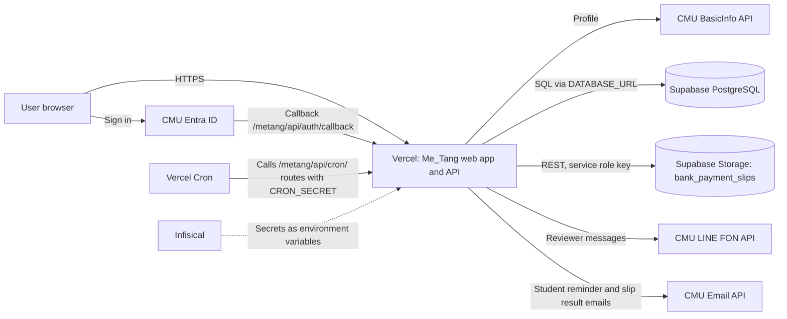

# Me_Tang Maintenance Guide

Version covered: Me_Tang 0.1.0 (`package.json` version `0.1.0`)
Document version: 1.1 draft
Date: 2026-09-28

---

## 1. About this guide

### 1.1 Purpose

This guide tells you how to keep the Me_Tang student emergency loan system running after
delivery. It covers routine checks, backups, updates, configuration, monitoring, and the
problems you are most likely to see.

Me_Tang is a web application for the CMU Faculty of Nursing emergency loan fund. Students
apply for a loan, an advisor, an admin, and the executive approve it, an admin records the
bank transfer, and the student repays in installments by uploading bank-transfer slips.

### 1.2 Audience and required skills

This guide is for the IT staff who operate Me_Tang after delivery
`[TO VERIFY: confirm the receiving team and their skill level with the client]`.

You need these skills:

- Use the web dashboards of Vercel, Supabase, and Infisical.
- Run commands in a terminal (Linux, macOS, or Windows with WSL).
- Read and run simple SQL statements in the Supabase SQL Editor.

You do not need to read the source code for routine tasks (Sections 3, 4, 5, 8, 9, 10).
Updates and upgrades (Section 6) need a copy of the source repository and Node.js.

### 1.3 Software version covered

| Item | Value |
|---|---|
| Application | Me_Tang `0.1.0` |
| Framework | Next.js `16.2.10`, React `19.2.4` |
| Database access | Prisma `7.9.1` with PostgreSQL |
| Node.js | `24` (from `.nvmrc`) |
| Database migrations | 19, the latest is `20260929120000_loan_request_transfer_confirmed` |
| Base path | `/metang` (`basePath` in `next.config.ts`) |

### 1.4 Conventions

- `Code format` marks a command, file name, path, setting name, table name, or exact text.
- Commands are complete. Copy them exactly. Replace only text that the step tells you to
  replace, for example `replace-with-email@cmu.ac.th`.
- SQL statements run in the Supabase Dashboard: **SQL Editor** unless the step says otherwise.
- Bold text such as **Database** > **Backups** is a menu path in a web dashboard.
- `[TO VERIFY: ...]` marks a fact that the authors could not confirm from the delivered
  software. Confirm it before you rely on it.

Warnings use this format and come before the step they apply to:

> **WARNING:** What can go wrong. How to avoid it.

---

## 2. System overview

### 2.1 Components

Me_Tang is one Next.js web application. It has no servers that you manage. All parts run on
hosted services.

| Component | Service | What it does |
|---|---|---|
| Web application | Vercel (serverless functions) | Serves all pages and the API under `/metang/api/`. |
| Scheduled jobs | Chosen at server start by `instrumentation.ts` (`lib/jobs/runtime.ts`) | On Vercel (`VERCEL=1`): Vercel Cron calls the five `/metang/api/cron/` routes from `vercel.json`. On a server that keeps running (`next start`, `npm run dev`): the server runs the same five jobs on its own timers. |
| Database | Supabase PostgreSQL | Stores users, roles, loan requests, approvals, installments, payments, the fund ledger, the notification outbox, the audit log, and system settings. |
| Slip storage | Supabase Storage, private bucket `bank_payment_slips` | Stores bank-transfer slip files (JPEG, PNG, PDF) for disbursements and repayments. |
| Sign-in | CMU Entra ID (OAuth 2.0) and CMU BasicInfo API | Signs users in with their CMU IT Account and reads their profile. |
| Reviewer notifications | CMU LINE notification API ("FON") | Sends LINE messages to the advisor, admin, or executive who must act on a request. |
| Student emails | CMU Email API (Outlook) | Sends repayment due-date reminders to students. Tells students when their request is rejected, when the loan is disbursed, and when an admin confirms or rejects a repayment slip. |
| Secrets | Infisical, environments `dev` and `prod` | Stores all passwords, keys, and tokens. |

All pages and API routes are served under the base path `/metang`, for example
`https://<host>/metang/login` and `https://<host>/metang/api/cron/deliver-fon`. A request to an
old path without `/metang` (`/`, `/login`, `/student/...`, `/user/...`, `/api/...`,
`/openapi.json`, and most public files) gets a temporary `307` redirect to the same path under
`/metang` (`redirects()` in `next.config.ts`). The browser repeats a `POST` with its body after
this redirect. Vercel Cron does not follow redirects, so every `path` in `vercel.json` must start
with `/metang/api/cron/`.

The Vercel project needs the Pro plan or higher. The `vercel.json` schedules run every minute and
every 3 minutes, and the Hobby plan allows only daily cron jobs (Section 2.3).

`[TO VERIFY: the production Vercel project, the Vercel plan in use, the Supabase project, and the Supabase plan. Production deployment (Jira NAT-15) was not complete when this guide was written.]`

### 2.2 How the components connect



On a server that keeps running (`next start`), Vercel Cron is not used. The job scheduler inside
the application runs the same jobs by calling the route code directly (Section 2.3).

When a signed-out user opens a protected page, such as a link in a notification email, the
application sends them to `/metang/login?next=<page>`. After CMU sign-in,
`/metang/api/auth/callback` returns them to that page instead of their role home page. `proxy.ts` passes the current page to the
page guard, and `lib/return-path.ts` rejects any value that is not a page on this site.

### 2.3 How notifications work

For most notifications, the application does not send at the moment an event happens. It writes
a row to the `notification_outbox` table. A scheduled job then claims up to 20 rows, sends them,
and marks each row `delivered`, `retry`, or `failed`.

Two manual actions send at once and do not use the outbox. They write no `notification_outbox`
row, keep no delivery history, and are not retried:

- A LINE reminder to the current reviewer (`POST /metang/api/notifications/fon`). The student of the
  request, its advisor, or any admin, SuperAdmin, or executive can send it. The same request and
  status can be sent again only after 60 seconds. Each server instance keeps its own 60-second
  timer in memory.
- A due-date email to a student (`POST /metang/api/notifications/outlook`), for an admin or SuperAdmin.
  Version 0.1.0 has no button for this.

Reviewer notifications write one outbox row for each recipient. A step with three admins writes
three rows.

| Scheduled job | Schedule in `lib/jobs/start-scheduler.ts` | What it does |
|---|---|---|
| `/metang/api/cron/installment-reminders` | Once a day, at the first check after 08:00 Bangkok time | Finds unpaid installments due today, in 1 day, and in 3 days (Bangkok dates). Writes one `installment_reminder` row per installment and offset. |
| `/metang/api/cron/deliver-reminders` | Every 3 minutes | Sends `installment_reminder` rows by email through the CMU Email API. |
| `/metang/api/cron/deliver-fon` | Every minute | Sends `reviewer_notification` rows by LINE through the FON API. |
| `/metang/api/cron/deliver-loan-outcomes` | Every 3 minutes | Sends `loan_outcome` rows by email through the CMU Email API. A rejection by the advisor, admin, or executive writes one row; the email names who rejected and the reason. A disbursement writes one row; the email states the amount and the first installment. |
| `/metang/api/cron/deliver-payment-outcomes` | Every 3 minutes | Sends `payment_outcome` rows by email through the CMU Email API. An admin's confirm or reject of a repayment slip writes one row. A rejection email includes the reviewer's reason. |

At server start, `instrumentation.ts` logs which trigger it chose:

- `Job scheduler started: ...`: this server runs the jobs itself and checks them once a minute.
  This is the default on any host that is not serverless. It needs `CRON_SECRET`.
- `Job scheduler: using Vercel Cron from vercel.json`: the host is Vercel. Vercel calls the jobs.
  The schedules in `vercel.json` need the Vercel Pro plan.
- `Job scheduler not started (...)`: a serverless host without a scheduler (AWS Lambda, Netlify),
  or `ENABLE_JOB_SCHEDULER=false`. Something outside must call the `/metang/api/cron/` routes.

`ENABLE_JOB_SCHEDULER=true` forces the built-in scheduler; `false` turns it off. A job that is still
running is not started again. Several server instances can run the scheduler at the same time:
each outbox row is claimed by one instance only, and every notification has a unique key. If the
server restarts after 08:00, the daily reminder job runs again that day. This is safe, because
it creates no duplicate rows.

Delivery rules:

- A row gets at most 5 attempts. Waits between attempts are 1, 5, 15, then 60 minutes.
- After 5 failed attempts, or after a permanent error, the row status becomes `failed`.
  The application never retries a `failed` row by itself.
- A claimed row is locked for 15 minutes. If a job stops during delivery, the next run after
  15 minutes claims the row again.
- Students get emails only. LINE messages go only to reviewers.
- A reminder that is no longer needed (for example, the installment was paid) is marked
  `delivered` with an empty `delivered_at` and a reason in `last_error`.
- If `installment-reminders` does not run on a day, the reminders for that day are not
  created later. There is no catch-up.

### 2.4 Locations of data, logs, configuration, and backups

| What | Where |
|---|---|
| Application data | Supabase PostgreSQL, schema `public`. Main tables: `app_user`, `user_role`, `loan_request`, `loan_approval`, `installment`, `payment`, `fund_transaction`, `notification_outbox`, `audit_log`, `system_setting`, `_prisma_migrations`. |
| Slip files | Supabase Storage bucket `bank_payment_slips` (or the name in `SUPABASE_SLIP_BUCKET`). Object names are `disbursement/<loan-id>-<timestamp>.<ext>` and `repayment/<loan-id>-<timestamp>.<ext>`. |
| Secrets and environment settings | Infisical project `721bea71-5be4-426d-9b76-23e2e4333286`, environments `dev` and `prod`. Vercel project **Settings** > **Environment Variables** `[TO VERIFY: how production secrets reach Vercel, by Infisical integration or by manual copy]`. |
| In-app settings (bank account and office contact shown to users) | Table `system_setting` (one row). Edited by a SuperAdmin in the application. |
| Scheduled job definitions | `lib/jobs/start-scheduler.ts` in the repository. |
| Application logs | Vercel Dashboard: project > **Logs**. The application writes errors to the console only. There is no other log store and no error-tracking service. |
| Audit trail of user actions | Table `audit_log` (actor, action, entity, before and after values). |
| Notification delivery history | Table `notification_outbox` (status, attempts, last error). |
| Backups | Supabase automatic daily backups on the Pro plan or higher only. The repository has no backup script. See Section 5. |

### 2.5 Known limitations of version 0.1.0

These gaps exist in the delivered software. They affect maintenance.

| Limitation | Effect | Reference |
|---|---|---|
| No automatic cleanup of old data | `notification_outbox`, `audit_log`, `payment`, `fund_transaction`, and slip files grow forever. | Section 4.7 |
| Failed slip uploads leave unused files | A disbursement retry, or a repayment whose database insert fails, leaves a slip file that no row uses. | Section 4.8 |
| No backup of slip files | Supabase database backups do not include Storage files. | Section 5 |
| No monitoring or alerting | Nobody is told when a job fails. You must check by hand. | Section 8 |
| Two ways to run the scheduled jobs | On Vercel, the `vercel.json` schedules need the Pro plan (Hobby allows only daily jobs and rejects the deployment). On other serverless hosts, an outside scheduler must call the routes. | Section 2.3 |
| No continuous delivery pipeline and no npm script for the unit tests | Updates are manual. `npm run api:test` runs the API tests. The unit tests in `tests/` run with `npx tsx --test` (Section 6.2). (Jira NAT-213 and NAT-209, open.) | Section 6 |
| No SuperAdmin setup screen | The first SuperAdmin must be added with SQL. | Section 3.3 |
| Some fields on the SuperAdmin contact and bank settings screen are not saved to the database | Opening hours, the closed-days note, and the faculty address details are kept only in the browser (`localStorage` key `metang-system-address`) of the person who saved them. Other users do not see the change. The bank code is not stored: the screen finds it again from the stored bank name. (Jira NAT-200/NAT-203 are marked Done, but this part is not built.) | Section 7.2 |
| Loan reports are printed from the browser | There is no server-generated PDF file. The report uses the browser print dialog. | None |
| Automated tests check source text, not a running user interface | Passing tests do not prove that the pages work. Test by hand after each update. | Section 6.2 |

---

## 3. Access and permissions

### 3.1 Maintenance accounts

You need these accounts. Never share one account between people.

| Account | Used for | Who issues it |
|---|---|---|
| Vercel project member | Deployments, logs, cron job status, environment variables, rollback | Vercel project owner `[TO VERIFY]` |
| Supabase project member | SQL Editor, backups, Storage, usage, database password | Supabase organization owner `[TO VERIFY]` |
| Infisical project member | Read and change secrets in `dev` and `prod` | Infisical project admin `[TO VERIFY]` |
| CMU Entra app registration access | Callback URL, client secret renewal | CMU ITSC `[TO VERIFY]` |
| CMU Email API client | Student emails | CMU Faculty of Nursing MIS (`docs/Email_API_Manual.md`) |
| CMU LINE FON API token | Reviewer LINE messages | CMU ITSC / MIS `[TO VERIFY: issuer of the FON API token]` |
| Me_Tang SuperAdmin role | Grant roles, fund ledger, system settings | Another SuperAdmin, or SQL for the first one (Section 3.3) |
| Git repository access | Updates (Section 6) | An owner of the GitHub organization `SE67-Metang-s-Project`. The repository `SE67-Metang-s-Project/metang` is public: anyone can clone it, but write access needs an organization owner `[TO VERIFY: confirm who takes ownership after hand-over]` |

### 3.2 Application roles

A user gets the `student` role automatically at first sign-in when the CMU profile is a
student account. A SuperAdmin grants every other role in the application.

| Role | Can do |
|---|---|
| `student` | Apply for a loan, correct and resubmit, cancel until the executive approves (not in `pending_disbursement` or later), upload repayment slips. |
| `advisor` | Approve, return, or reject requests of their own advisees. A comment is required. |
| `admin` | Review requests, set the approved amount, record disbursement with a slip, confirm or reject repayment slips. The due-date email API (`POST /metang/api/notifications/outlook`) is open to admins, but version 0.1.0 has no button for it. |
| `executive` | Final decision: approve, return to the admin, or reject. The database allows only one `executive`. |
| `super_admin` | Everything an admin can do, plus grant and revoke roles, record fund transactions, and edit system settings. The last `super_admin` cannot be removed in the application. |

Any CMU account can sign in. Staff pages depend only on the roles that a SuperAdmin grants.
The student functions need a student ID that matches the Faculty of Nursing pattern
`^\d{2}12\d{5}$`. The organization code check (`12`, Nursing staff) runs only in the separate
nurse sign-in mode (`/metang/api/auth/nurse/login`). The sign-in page does not link to that mode.

Role changes have side effects:

- When a SuperAdmin revokes the `admin` role, that admin's requests in `pending_admin` and
  `pending_executive` move to the SuperAdmin who revoked the role. The audit log records
  `loan_request.admin_reassigned`.
- To change the executive, revoke the role from the current executive first. A second
  `executive` grant fails with `EXECUTIVE_ALREADY_EXISTS`.

### 3.3 Add the first SuperAdmin

Purpose: give one person the `super_admin` role on a new or restored database. The
application has no screen for this.

Prerequisites:

- Supabase SQL Editor access to the production project.
- The person has signed in to Me_Tang at least once, so their `app_user` row exists.

> **WARNING:** A role added with SQL is not written to `audit_log`. Record who ran the
> statement and when, for example in the change ticket.

Steps:

1. Open the Supabase Dashboard and select the production project.
2. Open **SQL Editor**.
3. Run this query. Replace `replace-with-email@cmu.ac.th` with the person's CMU email, in
   lowercase. The application stores emails in lowercase, and the comparison is case-sensitive.

   ```sql
   SELECT id, email, full_name_th FROM app_user WHERE email = 'replace-with-email@cmu.ac.th';
   ```

   Expected result: exactly one row.
4. Run this statement with the same email.

   ```sql
   INSERT INTO user_role (user_id, role)
   SELECT id, 'super_admin'::user_role_name FROM app_user
   WHERE email = 'replace-with-email@cmu.ac.th';
   ```

   Expected result: `INSERT 0 1`.
5. Ask the person to sign out and sign in again.

Expected result: the person can open the SuperAdmin pages and grant other roles there.

To undo: a second SuperAdmin revokes the role in the application. If no other SuperAdmin
exists, run the statement below.

> **WARNING:** The application protects the last SuperAdmin, but SQL does not. This statement
> can leave the system with no SuperAdmin. Check first that another SuperAdmin exists.

```sql
DELETE FROM user_role WHERE role = 'super_admin'::user_role_name
AND user_id = (SELECT id FROM app_user WHERE email = 'replace-with-email@cmu.ac.th');
```

### 3.4 Where credentials are stored

- All secrets are in Infisical, environment `prod` for production and `dev` for development.
- A local `.env` file on a maintainer's computer holds only `INFISICAL_ENV` and development
  settings. Never commit `.env`. It is in `.gitignore`.
- The production database password is in the Supabase Dashboard: **Project Settings** >
  **Database**.
- This guide never contains a secret value. Section 7.1 lists which settings are secrets.

> **WARNING:** With `INFISICAL_ENV=prod` in `.env`, every `npm run db:*` command acts on the
> production database, and `npm run build` uses the production secrets. `npm run db:seed` and
> `npm run db:reset` have no
> production check. `db:reset` deletes all users, loans, payments, ledger rows, notifications,
> and audit history. Keep `INFISICAL_ENV=dev` except during the production steps of Section 6.2.
>
> If the Infisical CLI is not installed, `scripts/with-infisical.mjs` runs the command without
> Infisical. The command then uses the values in `.env` and in the shell, and `INFISICAL_ENV`
> has no effect.

---

## 4. Routine maintenance

### 4.1 Schedule

| Task | Frequency | Time | Section |
|---|---|---|---|
| Health check | Every working day | 5 min | 4.2 |
| Retry failed notifications | Every working day, after the health check | 5 min | 4.3 |
| Check the review backlog | Weekly | 5 min | 4.4 |
| Verify backups and take an off-site backup | Weekly | 15 min | 4.5, 5.2 |
| Check database and storage usage | Monthly | 10 min | 4.6 |
| Reconcile the fund balance | Monthly | 15 min | 4.9 |
| Remove old delivered notifications | Every 6 months (optional) | 15 min | 4.7 |
| Review unused slip files | Every 6 months | 20 min | 4.8 |
| Renew secrets before they expire | Before each expiry date, at least yearly | 30 min | 4.10 |
| Check that HTTPS works | Monthly | 2 min | 4.11 |

### 4.2 Health check

Purpose: find a stopped job or a broken integration before users report it.

Prerequisites: Vercel and Supabase access.

Steps:

1. Open the production site address `[TO VERIFY: production URL]` followed by `/metang/login`.
   Expected result: the sign-in page shows the button **เข้าสู่ระบบด้วย CMU Account**.
   If it shows `ผู้ดูแลระบบต้องตั้งค่า CMU Entra environment variables ก่อนเปิดใช้งาน`, the
   sign-in settings are missing (Section 9).
2. Check that the scheduled jobs run `[TO VERIFY: log location on the production host]`.
   - On Vercel: open the project **Settings** > **Cron Jobs** and the **Logs**. Expected result:
     five `/metang/api/cron/` jobs, and recent calls return `200`. A `401` means that `CRON_SECRET` is
     missing or wrong. The log line at startup is
     `Job scheduler: using Vercel Cron from vercel.json`.
   - On a server that keeps running: search the server log for `Job scheduler started` after the
     last restart. Expected result: the line is present and lists five cron jobs. If it
     shows `Job scheduler not started: CRON_SECRET is not set`, set `CRON_SECRET` and restart.
3. In the same log, filter the last 24 hours for errors.
   Expected result: no repeated errors. Look up any message in Section 10.
4. In the Supabase SQL Editor, run:

   ```sql
   SELECT event_type, status, count(*) FROM notification_outbox
   GROUP BY event_type, status ORDER BY event_type, status;
   ```

   Expected result: `failed` counts do not increase from day to day.
5. Run this query to find rows that are waiting too long:

   ```sql
   SELECT id, event_type, status, attempt_count, available_at, last_error
   FROM notification_outbox
   WHERE status IN ('pending', 'retry', 'processing')
     AND available_at < now() - interval '30 minutes'
   ORDER BY available_at;
   ```

   Expected result: no rows. Rows here mean the delivery jobs are not running (Section 9).

### 4.3 Retry failed notifications

Purpose: resend notifications that failed 5 times, after you fix the cause.

Prerequisites: the cause is fixed (for example, an expired token was renewed).

Steps:

1. Run this query and read `last_error`:

   ```sql
   SELECT id, event_type, attempt_count, last_error, updated_at
   FROM notification_outbox WHERE status = 'failed'
   ORDER BY updated_at DESC LIMIT 50;
   ```

2. Fix the cause. Use Section 9 and Section 10.

> **WARNING:** A retry can send a message that is no longer correct, for example an old
> reminder. Retry only rows that are still useful. The delivery jobs skip reviewer messages
> when the request status changed since the message was created.

3. Run this statement to retry one row. Replace `replace-with-row-id` with the `id` from step 1.

   ```sql
   UPDATE notification_outbox
   SET status = 'retry', attempt_count = 0, available_at = now()
   WHERE id = 'replace-with-row-id' AND status = 'failed';
   ```

   Expected result: `UPDATE 1`.
4. Wait 5 minutes and run this query with the same `id`:

   ```sql
   SELECT id, status, attempt_count, delivered_at, last_error
   FROM notification_outbox WHERE id = 'replace-with-row-id';
   ```

Expected result: the status is `delivered`.

To undo: no undo is needed. A row that fails again returns to `failed` after 5 attempts.

### 4.4 Check the review backlog

Purpose: find requests and slips that wait for staff action, so they are not forgotten.

Prerequisites: Supabase SQL Editor access.

Steps:

1. Run:

   ```sql
   SELECT status, count(*), min(updated_at) AS oldest FROM loan_request
   WHERE status IN ('pending_advisor', 'pending_admin', 'pending_executive', 'pending_disbursement')
   GROUP BY status;
   ```

2. Run:

   ```sql
   SELECT count(*), min(created_at) AS oldest FROM payment WHERE status = 'pending_review';
   ```

Expected result: the `oldest` values are recent. Tell the fund office about old items
`[TO VERIFY: target review time agreed with the fund office]`.

### 4.5 Verify backups

Purpose: make sure a recent backup exists before you need it.

Prerequisites: Supabase Dashboard access.

Steps:

1. Open the Supabase Dashboard: **Database** > **Backups**.
2. Check the date of the newest backup.
   Expected result: a backup from the last 24 hours.
   If the page says backups are not available, the project is on the Free plan. Take a manual
   backup every week (Section 5.2).
3. Check the date of the newest off-site backup file (Section 5.2 and Section 5.3).

### 4.6 Check database and storage usage

Purpose: avoid a service stop when the Supabase plan limit is reached.

Prerequisites: Supabase Dashboard access, with permission to see organization usage.

Steps:

1. Open the Supabase Dashboard: **Organization** > **Usage**.
2. Note the database size and the storage size.
3. Compare them with the plan limits `[TO VERIFY: Supabase plan and its limits]`.
4. Run this query to see which tables grow:

   ```sql
   SELECT relname, n_live_tup, pg_size_pretty(pg_total_relation_size(relid)) AS size
   FROM pg_stat_user_tables ORDER BY pg_total_relation_size(relid) DESC;
   ```

Expected result: usage is below 80% of each limit. If not, clean up (Section 4.7, 4.8) or
upgrade the plan.

### 4.7 Remove old delivered notifications (optional)

Purpose: keep `notification_outbox` small. The application never deletes rows from it.

Prerequisites:

- The fund office agrees on how long to keep delivery history
  `[TO VERIFY: retention period; 180 days is used below as an example]`.
- A backup from today (Section 5.2).

> **WARNING:** Deleted rows cannot be recovered without a backup restore. Take a backup
> first. Delete only `delivered` rows. Never delete `pending`, `retry`, or `processing` rows,
> because they are messages that are not sent yet.

Steps:

1. Count the rows that will be deleted:

   ```sql
   SELECT count(*) FROM notification_outbox
   WHERE status = 'delivered' AND updated_at < now() - interval '180 days';
   ```

2. Delete them:

   ```sql
   DELETE FROM notification_outbox
   WHERE status = 'delivered' AND updated_at < now() - interval '180 days';
   ```

   Expected result: `DELETE n`, where `n` equals the count from step 1.

To undo: restore the rows from the backup (Section 5.4).

Do not delete rows from `audit_log`, `fund_transaction`, `payment`, `loan_request`, or
`installment`. They are the financial and audit record. A database trigger blocks `UPDATE`
and `DELETE` on `fund_transaction`. The only exception is a session that sets
`methang.allow_fund_mutation = 'on'`, which `db/seed.ts` uses. The trigger does not block
`TRUNCATE`.

### 4.8 Review unused slip files

Purpose: find slip files that no database row uses. Failed uploads and retries leave them
behind.

Prerequisites: Supabase SQL Editor and Storage access. The fund office contact for approval.

Steps:

1. Run this query. It lists Storage objects that no payment or fund transaction references.

   ```sql
   SELECT name, created_at FROM storage.objects
   WHERE bucket_id = 'bank_payment_slips'
     AND name NOT IN (SELECT slip_path FROM payment WHERE slip_path IS NOT NULL)
     AND name NOT IN (SELECT slip_path FROM fund_transaction WHERE slip_path IS NOT NULL)
   ORDER BY created_at;
   ```

2. Keep the list with the maintenance record.

> **WARNING:** Slip files are financial evidence. Do not delete a file until the fund office
> confirms it is not needed. Deleting a row from `storage.objects` with SQL does not delete
> the file correctly. Delete files only in the Supabase Dashboard: **Storage**.

3. If the fund office approves, open **Storage** > `bank_payment_slips`, select the listed
   files, and delete them.

Expected result: the query in step 1 returns no rows.

To undo: none. A deleted Storage file is gone. Keep an off-site copy first (Section 5.3).

### 4.9 Reconcile the fund balance

Purpose: confirm that the fund ledger in Me_Tang matches the real bank account.

Prerequisites: Supabase SQL Editor access. The fund account bank statement for the same date.
All amounts in Me_Tang are whole baht.

Steps:

1. Run:

   ```sql
   SELECT SUM(amount * direction) AS balance_baht FROM fund_transaction;
   ```

2. Compare the result with the bank statement of the fund account on the same date.

Expected result: the values match. If they differ, a SuperAdmin records a
`credit_adjustment` or `debit_adjustment` with a note in the application. Never edit
`fund_transaction` with SQL.

Limits on a correcting transaction:

- Every kind except `top_up` needs a note.
- The database trigger `fund_transaction_check_balance` rejects a row that makes the balance
  negative.
- The application rejects a `withdrawal` or `debit_adjustment` larger than the fund capacity:
  the cash balance minus the amount that loan requests not yet paid out can still take
  (`INSUFFICIENT_FUND_CAPACITY`). A large correcting debit can be blocked while such requests
  are open. Record it after they are disbursed, or in smaller parts.

### 4.10 Renew secrets before they expire

Purpose: prevent sign-in, notification, or storage failures caused by an expired or leaked
secret.

Prerequisites: access to Infisical `prod` and to the issuer of the secret.

| Secret | Effect when it stops working | Notes |
|---|---|---|
| `CLIENT_SECRET` | Nobody can sign in (`token_exchange_failed`). | Entra client secrets have an expiry date `[TO VERIFY: expiry date from CMU ITSC]`. |
| `SESSION_SECRET` | Changing it signs out every user. | At least 32 characters. Create one with `openssl rand -base64 32`. |
| `CRON_SECRET` | The job scheduler does not start. Outside callers of `/metang/api/cron/` get `401 Unauthorized`. | The scheduler sends it as `Authorization: Bearer <value>`. Restart the server after a change. |
| `NOTIFY_API_TOKEN` | LINE messages fail. | Issued by CMU `[TO VERIFY]`. |
| `EMAIL_API_CLIENT_ID`, `EMAIL_API_CLIENT_SECRET` | All student emails fail: reminders, request results, disbursements, and repayment slip results. | Issued by the CMU Faculty of Nursing, which runs the Email API at `https://mis.nurse.cmu.ac.th/thesis` (`docs/Email_API_Manual.md`). |
| `SUPABASE_SERVICE_ROLE_KEY` | Slip upload and slip viewing fail. | Supabase Dashboard: **Project Settings** > **API**. |
| Database password in `DATABASE_URL` and `DIRECT_URL` | The whole application fails. | Supabase Dashboard: **Project Settings** > **Database**. |

> **WARNING:** Changing a secret in Infisical does not change the running application.
> The new value takes effect only after a new production deployment. Changing
> `SESSION_SECRET` signs out all users. Do it outside office hours.

Steps:

1. Get the new value from the issuer.
2. Open Infisical, select the project, and select the `prod` environment.
3. Replace the value of the secret.
4. Copy the value to Vercel **Settings** > **Environment Variables** (Production), if the
   project does not sync from Infisical `[TO VERIFY]`.
5. In Vercel, open **Deployments**, open the menu of the current production deployment, and
   select **Redeploy**.
   Expected result: the new deployment becomes **Ready**. If the build fails with
   `Missing .env`, the Build Command is `npm run build`. Set it to `next build` (Section 9).
6. Do the health check (Section 4.2).

To undo: put the old value back and redeploy, if the old value is still valid.

### 4.11 Check that HTTPS works

Purpose: users must reach the site over HTTPS. The sign-in cookie is marked `Secure` in
production.

Prerequisites: a web browser.

Steps:

1. Open the production URL in a browser.
2. Check that the address starts with `https://` and the browser shows no certificate warning.

Expected result: the certificate is valid. Vercel renews certificates for domains it manages
`[TO VERIFY: custom domain and who manages its DNS]`.

---

## 5. Backup and restore

### 5.1 What to back up

| Item | Included in Supabase daily backup | How to back it up |
|---|---|---|
| Database (all tables in schema `public`) | Yes, on Pro plan or higher. Pro keeps 7 days. | Supabase automatic backup, plus a weekly manual dump (5.2). |
| Slip files in `bank_payment_slips` | No. Database backups contain only file metadata. | Manual download (5.3). |
| Secrets | No | Infisical keeps secret history. Export a copy to a password manager or safe `[TO VERIFY: client policy]`. |
| Scheduled jobs and code | Not applicable | The Git repository. |

Store off-site backup files outside Supabase, in storage that the client controls
`[TO VERIFY: storage location]`. Backup files contain personal data and bank account numbers.
Encrypt them and limit access.

### 5.2 Take a manual database backup

Purpose: keep a database copy that does not depend on the Supabase plan.

Prerequisites:

- PostgreSQL client tools (`pg_dump`, `pg_restore`). The major version must be the same as, or
  newer than, the Supabase database version. To see the version, run `SHOW server_version;`.
  On 2026-09-28 the dev project showed `17.6`, so use version 17 or newer.
- Infisical CLI, signed in with `infisical login`, with read access to `prod`.

Note: `.env.example` sets `DIRECT_URL` to the direct connection (`db.<project-ref>.supabase.co`).
This host can have an IPv6 address only, if the project has no IPv4 add-on. If `pg_dump` stops
with `Network is unreachable` or cannot find the host, your network has no IPv6. Then use the
**Session pooler** connection string (port `5432`) from the Supabase Dashboard: **Connect**.
Do not give `DATABASE_URL` to `pg_dump` unchanged. If it contains the Prisma parameter
`pgbouncer=true`, `psql` and `pg_dump` stop with `invalid URI query parameter: "pgbouncer"`.

Steps:

1. Open a terminal in an empty folder.
2. Run:

   ```bash
   infisical run --projectId 721bea71-5be4-426d-9b76-23e2e4333286 --env prod -- sh -c 'pg_dump "$DIRECT_URL" --format=custom --schema=public --no-owner --no-privileges --file="metang-$(LC_ALL=C date +%Y%m%d).dump"'
   ```

   Expected result: a file named `metang-YYYYMMDD.dump` and no error. `LC_ALL=C` keeps the
   year in the Gregorian calendar. With a Thai locale (`LC_TIME=th_TH.UTF-8`), `date` writes
   the Buddhist year, for example `25690928`.
3. Check that the file is readable:

   ```bash
   pg_restore --list "metang-$(LC_ALL=C date +%Y%m%d).dump" | grep -c "TABLE DATA"
   ```

   Expected result: a number of 11 or more. Version 0.1.0 has 10 application tables and the
   table `_prisma_migrations`.
4. Run the queries in Section 5.5, step 1 and step 2, and the balance query in Section 4.9.
   Write the results next to the file name. Section 5.5 compares a restore with these values.
5. Move the file to the off-site backup location.

### 5.3 Back up slip files

Purpose: keep a copy of the slip files. Supabase backups do not include them.

The delivered software has no tool for this. This procedure uses the Supabase Storage REST API,
the same API that the application uses. It was tested on the dev project on 2026-09-28.

Prerequisites:

- `psql` and `curl`.
- Infisical CLI, signed in with `infisical login`, with read access to `prod`.
- A network connection that can reach `DIRECT_URL` (see the note in Section 5.2).
- `SUPABASE_SLIP_BUCKET` is set in Infisical `prod`. The script stops if it is not set.

Steps:

1. Open a terminal in the folder of the database backup of the same date.
2. Save this text as `backup-slips.sh`:

   ```sh
   #!/bin/sh
   set -u
   out="slips-$(LC_ALL=C date +%Y%m%d)"
   psql "$DIRECT_URL" -At -c "SELECT name FROM storage.objects
     WHERE bucket_id = '$SUPABASE_SLIP_BUCKET' AND name NOT LIKE '%.emptyFolderPlaceholder'" |
   while IFS= read -r name; do
     mkdir -p "$out/$(dirname "$name")"
     urlpath=$(printf '%s' "$name" | sed 's#//#/%2F#g')
     printf 'header = "Authorization: Bearer %s"\nheader = "apikey: %s"\n' \
       "$SUPABASE_SERVICE_ROLE_KEY" "$SUPABASE_SERVICE_ROLE_KEY" |
       curl -sSf -K - -o "$out/$name" \
         "$SUPABASE_URL/storage/v1/object/authenticated/$SUPABASE_SLIP_BUCKET/$urlpath" ||
       echo "FAILED: $name"
   done
   echo "Files downloaded: $(find "$out" -type f | wc -l)"
   ```

   The script gives the service role key to `curl` on standard input, so the key is not in the
   process list. It changes `//` in a file name to `/%2F`. The Storage API returns `400` for a
   path that contains `//`. The dev bucket has one such file. The application did not make it,
   because the application does not use this name format.
3. Run:

   ```bash
   chmod +x backup-slips.sh
   infisical run --projectId 721bea71-5be4-426d-9b76-23e2e4333286 --env prod -- ./backup-slips.sh
   ```

   Expected result: no `FAILED:` lines, and the last line is `Files downloaded: N`.
4. Run this query. Expected result: the count is the same as `N`.

   ```sql
   SELECT count(*) FROM storage.objects
   WHERE bucket_id = 'bank_payment_slips' AND name NOT LIKE '%.emptyFolderPlaceholder';
   ```

   Replace `bank_payment_slips` with the value of `SUPABASE_SLIP_BUCKET` if it is different.

   Note: a count of all rows in `storage.objects` includes folder placeholders. These are
   objects named `.emptyFolderPlaceholder`, not slip files. On 2026-09-28 the dev
   bucket had 83 rows: 81 slip files and 2 placeholders. The script downloaded 81 files.
5. Store the folder `slips-YYYYMMDD` with the database backup.

`[TO VERIFY: the Supabase Dashboard download and the S3-compatible endpoint (for example with
rclone) were not tested.]`

### 5.4 Restore the database

Purpose: return the database to the state of a backup after data loss or corruption.

> **WARNING:** A restore replaces the current data. Every change made after the backup is
> lost. Take a new backup of the current state first (Section 5.2), even if it is damaged.
> Tell users that the system is unavailable. Restore into a new, empty Supabase project when
> you can, and switch the application to it only after you verify it.

Option A: Supabase automatic backup (Pro plan or higher)

1. Open the Supabase Dashboard: **Database** > **Backups**.
2. Select the backup and select **Restore**.
3. Confirm. Expected result: the project is unavailable for some minutes, then returns.
4. Continue with Section 5.5.

Option B: manual dump file

Prerequisites: an empty target database, or approval to replace the current one.

Test record: on 2026-09-28 these steps were done once with the dev project: Section 5.2, the
download in Section 5.3, step 2 of Option B, and Section 5.5 steps 1 to 3. The dump
(PostgreSQL 17 client tools) was restored into a local, empty PostgreSQL 17 database with the
command in step 2. The command ran two times: into the empty database, and again over the
restored data. Both runs ended with exit code 0 and no messages. Row counts, the fund balance,
the latest migration, and the sequence values were the same as in the dev project.

`[TO VERIFY: these were not tested: a restore into a new Supabase project, the bucket and
upload in step 3, the settings change in step 4, and Section 5.5 steps 4 and 5. Test them once
before you need them in an incident.]`

1. Tell users to stop work until the restore is verified. The application has no maintenance
   mode.
2. Run this command. It drops and re-creates each table from the file.

   ```bash
   infisical run --projectId 721bea71-5be4-426d-9b76-23e2e4333286 --env prod -- sh -c 'pg_restore --clean --if-exists --no-owner --no-privileges --dbname "$DIRECT_URL" metang-YYYYMMDD.dump'
   ```

   Replace `metang-YYYYMMDD.dump` with the file name. Expected result: the command ends
   without `error:` lines. Messages about objects that do not exist are normal with
   `--if-exists`.
3. If the Storage bucket is empty (new project), create a **private** bucket named
   `bank_payment_slips` and upload the slip files from Section 5.3 with the same folder
   structure.
4. If you restored into a new Supabase project, change these settings in Infisical `prod`
   (and in Vercel if it does not sync) to the values of the new project. Then redeploy
   (Section 7.1).

   | Setting | New value |
   |---|---|
   | `DATABASE_URL` | Session pooler connection string of the new project. |
   | `DIRECT_URL` | Direct connection string of the new project (see the note in Section 5.2). |
   | `SUPABASE_URL` | `https://<new-project-ref>.supabase.co` |
   | `SUPABASE_SERVICE_ROLE_KEY` | Service role key of the new project. |
   | `SUPABASE_SLIP_BUCKET` | The bucket name from step 3. Not set means `bank_payment_slips`. |

5. Continue with Section 5.5.

### 5.5 Verify a restore

1. Run:

   ```sql
   SELECT migration_name FROM _prisma_migrations
   WHERE finished_at IS NOT NULL AND rolled_back_at IS NULL
   ORDER BY finished_at DESC LIMIT 1;
   ```

   Expected result: the value recorded at backup time (Section 5.2, step 4). For version
   0.1.0 with all migrations applied, it is `20260929120000_loan_request_transfer_confirmed`.
2. Run:

   ```sql
   SELECT (SELECT count(*) FROM app_user) AS users,
          (SELECT count(*) FROM loan_request) AS loans,
          (SELECT count(*) FROM payment) AS payments,
          (SELECT count(*) FROM fund_transaction) AS ledger_rows,
          (SELECT count(*) FROM system_setting) AS settings;
   ```

   Expected result: counts match the values recorded at backup time (Section 5.2, step 4).
   `settings` is `1`.
3. Run the fund balance query from Section 4.9. Expected result: the balance recorded at
   backup time.
4. Sign in as a SuperAdmin. Open a disbursed loan and open its slip.
   Expected result: the slip image or PDF opens.
5. Do the health check (Section 4.2).

---

## 6. Updates and upgrades

Updates need the source repository, Node.js 24, and npm. There is no continuous delivery
pipeline (Jira NAT-213 is open). `[TO VERIFY: whether Vercel deploys automatically from the
Git branch `main`. `vercel.json` has no `git` settings, so a Vercel project that is connected to
the repository deploys each push to its production branch.]`

### 6.1 Pre-update checklist

- [ ] Read the change list. Note every new folder under `db/migrations/`.
- [ ] Read the SQL of each new migration. Look for `DROP`, `RENAME`, and data updates.
- [ ] Take a database backup (Section 5.2).
- [ ] Note the current production deployment in Vercel **Deployments**, for rollback.
- [ ] Choose a time with few users. Tell the fund office.
- [ ] On the maintainer computer, run the checks in step 6.2.1 to 6.2.4 with no errors.

### 6.2 Update procedure

1. Get the new version of the repository and open a terminal in its folder.
2. Install dependencies:

   ```bash
   npm ci
   ```

   Expected result: no errors. Prisma Client is generated automatically.
3. Run the code checks:

   ```bash
   npm run lint
   npx tsc --noEmit
   ```

   Expected result: `npm run lint` reports `0 errors` (version 0.1.0 has 3 warnings about unused
   variables). `npx tsc --noEmit` prints nothing.

   Then run the unit tests. They read the source files and need no database:

   ```bash
   npx tsx --test tests/*.test.ts tests/*.test.mjs
   ```

   Expected result: the summary line `ℹ fail 0`. On version 0.1.0, 16 tests fail (Jira
   NAT-209). Compare the failed test names with the previous version: a new failure needs a
   developer.
4. Run the API tests. They use a temporary local PostgreSQL in Docker (port `5433`) and a
   test app on port `8081`. They never touch the real database.

   ```bash
   npm run api:test
   ```

   Expected result: `✓ suite passed, container removed`. On version 0.1.0 the command runs
   the Bruno collection twice: 22 requests with 69 assertions, then the ordered workflow with
   22 requests and 50 assertions. Docker must be running. If a test fails, the
   container `metang-test` stays up for inspection. Remove it with `docker rm -f metang-test`.

> **WARNING:** When `INFISICAL_ENV=prod` is in `.env`, every `npm run db:*` command acts on
> the production database. Never run `npm run db:push`, `npm run db:migrate`,
> `npm run db:seed`, or `npm run db:reset` against production. `db:reset` deletes all users,
> loans, payments, ledger rows, notifications, and audit history.

5. Open `.env` and set `INFISICAL_ENV=prod`.
6. Check the migration state:

   ```bash
   npm run db:status
   ```

   Expected result: a list of migrations that are not yet applied, or "Database schema is up
   to date".
7. Apply the new migrations:

   ```bash
   npm run db:deploy
   ```

   Expected result: each new migration is reported as applied.
8. Open `.env` and set `INFISICAL_ENV=dev` again.
9. Deploy the application to production `[TO VERIFY: by Git push to the production branch, or
   by `vercel deploy --prod`]`.

   Note: `npm run build` fails on a computer or build server without a `.env` file, because
   `scripts/with-infisical.mjs` requires it. Set the Vercel **Build Command** to `next build`
   `[TO VERIFY with a test deployment]`.
10. Wait until the deployment is **Ready**.
11. Do the health check (Section 4.2). Sign in with each role you can and open its main page.

Expected result: the new version runs, and the notification outbox continues to empty.

### 6.3 Rollback procedure

Application rollback:

1. Open Vercel **Deployments**.
2. Open the menu of the previous production deployment and select **Instant Rollback**
   (on the Hobby plan, only the last previous deployment is available).
3. Expected result: the previous version serves users within a minute.

Note: an Instant Rollback does not rebuild. The previous deployment keeps the environment
variables it was built with, so a setting that you changed after that build is not used. Its
cron jobs also return to the schedules of that deployment.

Database rollback:

Prisma migrations in this project have no "down" scripts. Several migrations cannot be
reversed, for example `20260905110000_remove_payment_ocr` (drops columns) and
`20260906030000_custom_loan_request_ids` (changes all loan IDs).

> **WARNING:** Restoring the pre-update backup deletes all data written after the backup.
> Prefer a new corrective migration from the developers when the data loss is not acceptable.

1. If the new code fails only because of the new migration, roll back the application first,
   then decide with the developers.
2. If the database must return to its earlier state, restore the backup from the pre-update
   checklist (Section 5.4) and verify it (Section 5.5).

---

## 7. Configuration reference

### 7.1 Environment variables

Change these in Infisical `prod` (and in Vercel if it does not sync). Every change needs a new
production deployment ("Redeploy") before it takes effect.

| Setting | Default | Valid values | Effect | Redeploy required | Secret |
|---|---|---|---|---|---|
| `DATABASE_URL` | None. Startup fails with `DATABASE_URL is not set`. | PostgreSQL URL of the Supabase Session pooler, with `sslmode=require` | Database connection of the application. | Yes | Yes |
| `DIRECT_URL` | The value of `DATABASE_URL` (`prisma.config.ts`) | PostgreSQL URL, direct connection | Used by migrations (`npm run db:*`) and manual backups. | No (maintainer tools only) | Yes |
| `AUTH_URL` | None | URL | CMU Entra authorize endpoint. | Yes | No |
| `TOKEN_URL` | None | URL | CMU Entra token endpoint. | Yes | No |
| `CALLBACK_URL` | None | URL, exactly as registered in Entra, for example `https://<host>/metang/api/auth/callback` | Where CMU Entra returns after sign-in. The old path `https://<host>/api/auth/callback` also works: the `/api/:path*` redirect sends the browser on to `/metang/api/auth/callback`. Change the value and the Entra registration together. If only one changes, sign-in fails with `token_exchange_failed`. | Yes, and register it in Entra | No |
| `LOGOUT_URL` | None | Entra logout URL with `post_logout_redirect_uri` | Sign-out redirect. | Yes | No |
| `CLIENT_ID` | None | Entra application ID | OAuth client. | Yes | No |
| `CLIENT_SECRET` | None | Entra client secret | OAuth client secret. | Yes | Yes |
| `SCOPE` | None | Space-separated scopes, for example `api://cmu/Mis.Account.Read.Me.Basicinfo offline_access` | Permissions requested at sign-in. | Yes | No |
| `BASICINFO_URL` | None | URL | CMU profile API. | Yes | No |
| `SESSION_SECRET` | None | Text of 32 characters or more | Encrypts the sign-in cookies. Changing it signs out all users. | Yes | Yes |
| `APP_BASE_URL` | `http://localhost:8080` | Absolute `https://` URL of the production site, for example `https://<host>` | Base of links in LINE messages and emails. If not set, links point to localhost. A path in the value is not used: links start with `/metang` (for example `/metang/student/...`), so `https://<host>` and `https://<host>/metang` give the same links. If the value is not a valid `http` or `https` URL, every delivery job run returns `500` before it claims rows, so notifications wait in the outbox. | Yes | No |
| `CRON_SECRET` | None. The job scheduler does not start, and `/metang/api/cron/` returns `401`. | Random text | Protects `/metang/api/cron/` routes. The job scheduler uses it too. | Yes | Yes |
| `ENABLE_JOB_SCHEDULER` | Not set (detect the host) | `true`, `false`, or not set | `true` forces the built-in scheduler, `false` turns it off. Not set: built-in scheduler on servers that keep running, Vercel Cron on Vercel (Section 2.3). | Yes (restart) | No |
| `NOTIFY_API_URL` | None | URL | CMU LINE FON API. | Yes | No |
| `NOTIFY_API_TOKEN` | None | Token | FON API token. | Yes | Yes |
| `EMAIL_API_URL` | None | URL | CMU Email API base URL. | Yes | No |
| `EMAIL_API_CLIENT_ID` | None | Client ID | Email API client. | Yes | No |
| `EMAIL_API_CLIENT_SECRET` | None | Client secret | Email API secret. | Yes | Yes |
| `SUPABASE_URL` | None | `https://<project-ref>.supabase.co` | Supabase Storage address. | Yes | No |
| `SUPABASE_SERVICE_ROLE_KEY` | None | Supabase service role key | Full access to Storage. | Yes | Yes |
| `SUPABASE_SLIP_BUCKET` | `bank_payment_slips` | Name of a private bucket | Bucket for slip files. | Yes | No |
| `INFISICAL_ENV` | `dev` | `dev` or `prod` | Only in a maintainer's local `.env`. Selects the Infisical environment for `npm run dev`, `npm run build`, and `npm run db:*`. Has no effect when the Infisical CLI is not installed (Section 3.4). | Not applicable | No |
| `DEV_API_BYPASS` | Off | `true` or not set | Development only. Must not be set in production. Works only when `INFISICAL_ENV=dev` and `NODE_ENV=development`. | Not applicable | No |
| `DEV_AS_ADVISOR`, `DEV_AS_ADMIN`, `DEV_AS_SUPERADMIN`, `DEV_AS_EXECUTIVE` | Off | `true` or not set | Development only. Must not be set in production. Same condition as `DEV_API_BYPASS`. | Not applicable | No |
| `DEV_ADVISOR_USER_ID`, `DEV_ADMIN_USER_ID`, `DEV_SUPERADMIN_USER_ID`, `DEV_EXECUTIVE_USER_ID` | Test user IDs | User UUID | Development only. Must not be set in production. | Not applicable | No |
| `EXT_PORT` | Not used | Port number | Appears in `.env.example` only. The application does not read it. | Not applicable | No |

`NODE_ENV` is set by Next.js and Vercel. Do not set it by hand. The hosting platform also sets
`VERCEL`, `AWS_LAMBDA_FUNCTION_NAME`, `NETLIFY`, and `NEXT_RUNTIME`. The application reads them to
choose the job scheduler (Section 2.3).

`.env.example` differs from this table in two places. It does not list `ENABLE_JOB_SCHEDULER` or
the `DEV_*_USER_ID` settings. It sets `SESSION_SECRET` twice, and the second value is shorter
than 32 characters. Delete the second line when you create a `.env` from it.

### 7.2 In-app system settings

A SuperAdmin edits these in the application (SuperAdmin settings, contact and bank
information). They are stored in the one-row table `system_setting`. Changes take effect
immediately. Every change is written to `audit_log` with the action `system_setting.updated`.

| Setting | Required | Valid values | Effect |
|---|---|---|---|
| Bank name (`bankName`) | Yes | Text, at most 200 characters | Bank shown to students for repayment. |
| Account name (`accountName`) | Yes | Text, at most 200 characters | Account name shown to students. |
| Account number (`accountNumber`) | Yes | Text, at most 50 characters | Account number shown to students. |
| Office location, Thai (`contactLocationTh`) | Yes | Text, at most 500 characters | Contact block. |
| Office location, English (`contactLocationEn`) | No | Text, at most 500 characters | Contact block. |
| Phone (`contactPhone`) | Yes | At most 32 characters: digits, `+`, `-`, spaces, parentheses | Contact block. |
| Extension (`contactExt`) | No | Text, at most 50 characters | Contact block. |
| Email (`contactEmail`) | Yes | Valid email, at most 254 characters | Contact block. |

Only the eight settings above are stored in the database. The same screen also shows opening
hours, a closed-days note, and faculty address details. Version 0.1.0 saves those values only in
the browser of the person who edits them (`localStorage` key `metang-system-address`). Other
users keep seeing the default values. The screen also shows a bank code. It is not stored: the
screen finds it from the stored bank name each time.

After installation, the settings row holds sample values, for example account number
`521-0-12345-6`. Users see them until a SuperAdmin enters the real values.

### 7.3 Scheduled job settings

Change a schedule in both `lib/jobs/start-scheduler.ts` (built-in scheduler) and `vercel.json` (Vercel Cron), then deploy (Section 6). A test checks that both list the same jobs.

| Job | Setting | Value |
|---|---|---|
| `/metang/api/cron/installment-reminders` | Schedule | `dailyAtBangkokHour(8)` |
| `/metang/api/cron/deliver-reminders` | Schedule | `everyMinutes(3)` |
| `/metang/api/cron/deliver-fon` | Schedule | `everyMinutes(1)` |
| `/metang/api/cron/deliver-payment-outcomes` | Schedule | `everyMinutes(3)` |
| `/metang/api/cron/deliver-loan-outcomes` | Schedule | `everyMinutes(3)` |

### 7.4 Fixed values (change needs a code update)

| Value | Setting |
|---|---|
| Slip file types accepted by the server and the admin disbursement form | `image/jpeg`, `image/png`, `application/pdf` |
| Slip file size limit on the server and the admin disbursement form | 10 MB |
| Repayment slip accepted by the student form | JPG or PNG, at most 1 MB |
| Installments per loan | 1 to 3 (server check and database `CHECK`) |
| Signed slip link lifetime | 300 seconds |
| Sign-in session lifetime | 8 hours |
| Sign-in attempt lifetime | 10 minutes |
| Notification attempts | 5, with waits of 1, 5, 15, and 60 minutes |
| Notification claim lock | 15 minutes |
| Rows per delivery job run | 20, with 5 sent at the same time |
| Reminder days before due date | 3, 1, and 0 |
| Manual LINE reminder cool-down | 60 seconds for each request and status |
| Time zone for dates and loan IDs | `Asia/Bangkok` |
| Loan ID format | `REQ` + date `YYYYMMDD` + 4-digit number. The number wraps after `9999`. |
| Executive accounts | 1 at most |
| Highest approved amount accepted by the review screen | 500,000 baht (checked in the browser only) |

---

## 8. Monitoring

The delivered software sends no alerts. Check these items by hand (Section 4.2), or set up
alerts in Vercel and Supabase `[TO VERIFY: available alert features on the chosen plans]`.

| What to monitor | Where | Normal value | Warning threshold | Action |
|---|---|---|---|---|
| Sign-in page responds | `/metang/login` in a browser | Page loads with the CMU sign-in button | Error page or no response | Section 9, "Site does not load". |
| Scheduled jobs run | On Vercel: **Settings** > **Cron Jobs** and the **Logs** of each `/metang/api/cron/` call. On a server that keeps running: `Job scheduler started` at startup and `Scheduled job` lines when a job did work or failed | `deliver-fon` every minute, `deliver-reminders`, `deliver-payment-outcomes`, and `deliver-loan-outcomes` every 3 minutes, `installment-reminders` once a day | No run for 10 minutes, or status `401` or `500` | Section 9, "Notifications are not sent". |
| Waiting notifications | SQL in Section 4.2 step 5 | 0 rows | Any row older than 30 minutes | Section 9. |
| Failed notifications | SQL in Section 4.2 step 4 | Count does not increase | Any new `failed` row | Section 4.3. |
| Application errors | Vercel **Logs**, level Error | Few, not repeated | The same error more than 10 times in one hour | Section 10. |
| Database size | Supabase **Usage** | Below 80% of plan | Above 80% | Section 4.6. |
| Storage size | Supabase **Usage** | Below 80% of plan | Above 80% | Section 4.6, 4.8. |
| Database connections | Supabase **Reports** > **Database** | Well below the pooler limit | Near the limit, or errors about too many connections | Section 9. |
| Backups | Supabase **Database** > **Backups** | Backup less than 24 hours old | Older than 24 hours, or none | Section 4.5. |
| Fund balance | SQL in Section 4.9 | Equals the bank statement | Any difference | Section 4.9. |
| Loans created today (ID limit) | Query below the table | Far below 10,000 per day | Above 9,000 in one day | Contact support. |

Query for loans created today:

```sql
SELECT count(*) FROM loan_request
WHERE id LIKE concat('REQ', to_char(now() AT TIME ZONE 'Asia/Bangkok', 'YYYYMMDD'), '%');
```

---

## 9. Troubleshooting

| Symptom | Likely cause | Fix | Procedure |
|---|---|---|---|
| Notifications stop on Vercel after a deployment, and **Logs** show no `/metang/api/cron/` calls | A `path` in `vercel.json` does not start with `/metang`. Vercel Cron gets the `307` redirect, treats it as the final response, and does not log the call. | Start every `path` in `vercel.json` with `/metang/api/cron/`. Redeploy. | 2.1 |
| Notifications stop on serverless hosting | On Vercel, Vercel Cron did not call the jobs: `CRON_SECRET` is missing, or the plan does not allow the `vercel.json` schedules. On other serverless hosts (AWS Lambda, Netlify), nothing calls the jobs. | On Vercel, set `CRON_SECRET` and check **Settings** > **Cron Jobs**. On other hosts, add an outside scheduler that calls the `/metang/api/cron/` routes with `CRON_SECRET`, or host Me_Tang on a server that keeps running (`next start`). | 2.3 |
| Build fails with `Missing .env. Create it from .env.example and set INFISICAL_ENV.` | The build runs `npm run build` on a machine without `.env`. | Set the Vercel Build Command to `next build`, or create `.env` with `INFISICAL_ENV`. | 6.2 |
| Site does not load, every page returns an error | Missing `DATABASE_URL`, database down, or a failed deployment. | Check Vercel **Logs** for `DATABASE_URL is not set`. Check Supabase project status. Roll back if a deployment caused it. | 4.2, 6.3 |
| Sign-in page shows `ผู้ดูแลระบบต้องตั้งค่า CMU Entra environment variables ก่อนเปิดใช้งาน` | One of the CMU Entra settings is missing. | Set all settings in Section 7.1 from `AUTH_URL` to `SESSION_SECRET`. Redeploy. | 4.10 |
| Sign-in fails with `ไม่สามารถยืนยันการเข้าสู่ระบบกับ CMU ได้` (`token_exchange_failed`) | `CLIENT_SECRET` expired or wrong, or `CALLBACK_URL` not registered. | Renew the client secret. Check the callback URL in Entra. | 4.10 |
| Sign-in fails with `คำขอเข้าสู่ระบบหมดอายุหรือไม่ถูกต้อง กรุณาลองใหม่` (`invalid_state`) | The user waited more than 10 minutes, used two tabs, or `SESSION_SECRET` changed during sign-in. | Ask the user to close the tab and sign in again. | None |
| All users are signed out at once | `SESSION_SECRET` changed. | Expected after a change. Users sign in again. | 4.10 |
| A student sees `ระบบนี้อนุญาตให้นักศึกษาปริญญาตรี ภาคปกติ คณะพยาบาลศาสตร์ หรือบุคลากรคณะพยาบาลศาสตร์เท่านั้น` | The CMU profile is not a Nursing student ID and not Nursing staff. | Expected behavior. Confirm the person's faculty. | 3.2 |
| A staff member sees `ไม่มีสิทธิ์เข้าถึงหน้านี้ (403 Forbidden)` | The user has no role for that page. | A SuperAdmin grants the role. | 3.2 |
| Nobody can manage roles | No `super_admin` exists (new or restored database). | Add the first SuperAdmin with SQL. | 3.3 |
| Notifications are not sent, outbox rows wait | The jobs do not run: `ENABLE_JOB_SCHEDULER=false`, `CRON_SECRET` is missing (`Job scheduler not started: CRON_SECRET is not set`, or `401` on Vercel Cron calls), the host is serverless without Vercel Cron, or `APP_BASE_URL` is not valid. | Set `CRON_SECRET`. Remove `ENABLE_JOB_SCHEDULER=false`. Fix `APP_BASE_URL`. Restart the server or redeploy. | 2.3, 4.2 |
| Outbox rows become `failed` with a LINE error | `NOTIFY_API_TOKEN` or `NOTIFY_API_URL` wrong or expired. | Renew, redeploy, then retry the rows. | 4.10, 4.3 |
| Outbox rows become `failed` with an email error | Email API credentials wrong or expired, or the student email is not `@cmu.ac.th`. | Renew credentials, redeploy, retry. | 4.10, 4.3 |
| Links in LINE messages or emails open `localhost` | `APP_BASE_URL` not set in production. | Set it to the production URL. Redeploy. | 7.1 |
| Delivery jobs return `500` with `APP_BASE_URL must be a valid URL` or `APP_BASE_URL must use HTTP or HTTPS` | `APP_BASE_URL` has a wrong value. | Fix the value. Redeploy. | 7.1 |
| Students get no reminder emails, and no `installment_reminder` rows exist | The daily `installment-reminders` job did not run. | Check Vercel cron logs. Missed days are not created later. | 2.3, 4.2 |
| Students do not get the email about a rejected request, a disbursement, or a confirmed or rejected repayment slip | The job scheduler is not running, or the Email API fails. Look for `loan_outcome` and `payment_outcome` rows in `notification_outbox`. | Same fixes as for reminder emails. Retry `failed` rows after the fix. | 4.2, 4.3 |
| Slip upload fails with `Unable to upload slip` | Supabase Storage settings wrong, bucket missing, or service role key expired. | Check `SUPABASE_URL`, `SUPABASE_SERVICE_ROLE_KEY`, and that the private bucket exists. | 4.10 |
| Slip does not open, `Unable to read slip` | Same as above, or the file was deleted from Storage. | Check Storage settings. Check that the file exists in **Storage**. | 4.8 |
| Student sees `ไม่พบข้อมูลบัญชีรับชำระเงิน` | The `system_setting` row is missing (`System settings are not initialized`). | Restore the row from a backup, or ask the developers to re-apply the default row. | 5.4 |
| Admin cannot disburse: `Insufficient fund balance for this disbursement` | The fund ledger balance is lower than the approved amount. | A SuperAdmin raises **วงเงินรวม** in **ตั้งค่าระบบ** > **วงเงินระบบ**. The screen records a `credit_adjustment`. The API also accepts `top_up` (Section 4.9). | 4.9 |
| SuperAdmin cannot add a second executive | Only one `executive` is allowed. | Remove the role from the current executive first. | 3.2 |
| Users see `The request changed; please retry` often | Two people changed the same record at the same time. | Ask the user to reload and retry. If frequent, check database load. | 8 |
| The executive or SuperAdmin financial overview shows all zeros | The overview could not read the database. It returns zeros with HTTP `200` instead of an error, and logs `Unable to load executive financial overview from DB` or `Unable to load financial overview from DB for SuperAdmin`. | Check the Vercel logs and the database connection. | 8 |
| Slow first page after a quiet period | Database connections were closed after 5 minutes idle, and serverless functions were cold. | Normal. The next requests are faster. | None |

---

## 10. Error messages

The API returns errors as `{ "error": { "code": "...", "message": "..." } }`. Staff pages
show Thai text. Student pages show Thai or English. The tables below list the exact text.
Text in angle brackets, such as `<amount>`, is filled in by the application.

Not listed: messages of the developer test pages under `/metang/demo/` (they work only in a
development environment), messages of developer build scripts, and code checks that users
cannot reach.

### 10.1 Sign-in and access

| Code or message | Meaning | Action |
|---|---|---|
| `configuration` / `ยังไม่ได้ตั้งค่า CMU Entra สำหรับแอปนี้` | A CMU Entra setting is missing or not a valid URL, or `SESSION_SECRET` is shorter than 32 characters. The log shows `Unable to start CMU login` with the cause. | Set the settings in Section 7.1. Redeploy. |
| `ผู้ดูแลระบบต้องตั้งค่า CMU Entra environment variables ก่อนเปิดใช้งาน` | Same cause, shown as a banner on `/metang/login`. | Same as above. |
| `access_denied` / `การเข้าสู่ระบบถูกยกเลิก` | The user cancelled at CMU Entra. | The user signs in again. |
| `invalid_callback` / `ข้อมูลตอบกลับจาก CMU ไม่ครบถ้วน กรุณาลองใหม่` | The CMU response was incomplete, or the sign-in cookie was missing. | The user signs in again. Check that cookies are allowed. |
| `invalid_state` / `คำขอเข้าสู่ระบบหมดอายุหรือไม่ถูกต้อง กรุณาลองใหม่` | The sign-in attempt expired (10 minutes) or did not match. | The user signs in again. |
| `token_exchange_failed` / `ไม่สามารถยืนยันการเข้าสู่ระบบกับ CMU ได้` | CMU Entra refused the token request. | Check `CLIENT_ID`, `CLIENT_SECRET`, `CALLBACK_URL`. |
| `profile_failed` / `เข้าสู่ระบบสำเร็จ แต่ไม่สามารถอ่านข้อมูลบัญชี CMU ได้` | The CMU BasicInfo API failed. | Check `BASICINFO_URL` and `SCOPE`. Contact CMU ITSC if the API is down. |
| `not_eligible` / `ระบบนี้อนุญาตให้นักศึกษาปริญญาตรี ภาคปกติ คณะพยาบาลศาสตร์ หรือบุคลากรคณะพยาบาลศาสตร์เท่านั้น` | Nurse sign-in mode only: the person is not a Nursing student or Nursing staff. The log shows `CMU nursing SSO rejected by access policy`. | Expected. |
| `login_failed` / `เกิดข้อผิดพลาดระหว่างเข้าสู่ระบบ กรุณาลองใหม่` | Unexpected error during sign-in, for example a failed request to CMU. The log shows `CMU login callback failed`. | Check Vercel logs. |
| `Failed to sync user to database during CMU login callback` (in logs) | The user record could not be saved at sign-in. Sign-in still succeeds. | Check the database connection. Roles or the student record may be out of date for that user. |
| `CMU token exchange failed` / `CMU BasicInfo request failed` (in logs) | The logged causes of `token_exchange_failed` and `profile_failed`. | See those rows. |
| `กรุณาเข้าสู่ระบบก่อนใช้งาน` / `ไม่พบข้อมูลการเข้าสู่ระบบ หรือเซสชันหมดอายุ กรุณาเข้าสู่ระบบด้วย CMU IT Account เพื่อเข้าใช้งาน` | Not signed in, or the 8-hour session expired. | The user signs in. |
| `ไม่มีสิทธิ์เข้าถึงหน้านี้ (403 Forbidden)` / `บัญชี CMU ของคุณยังไม่มีสิทธิ์ในการเข้าถึงหน้านี้ หากคุณมีหน้าที่รับผิดชอบในส่วนนี้ กรุณาติดต่อผู้ดูแลระบบเพื่อกำหนดสิทธิ์การใช้งาน` | The user has no role for the page. | A SuperAdmin grants the role. |
| `เกิดข้อผิดพลาดในการตรวจสอบสิทธิ์` / `เกิดข้อผิดพลาดในการตรวจสอบสิทธิ์การเข้าใช้งาน กรุณาลองใหม่อีกครั้ง` | Unexpected error while checking access. | Check Vercel logs. |
| `Error code: <code>` (below the text on the error page) | The error code of the access problem. | Include it in a support request. |
| `Student session rejected` with reason `student_id_not_eligible`, `employee_not_nursing`, or `profile_not_eligible` (in logs) | A signed-in user failed the Nursing faculty check for the student functions. | Expected for users outside the faculty. |
| `Student session rejected` with reason `missing_or_invalid_session` or `missing_student_id` (in logs) | A student page was opened without a session, or by a CMU account that has no student ID. | Expected. Staff use the staff pages. |
| `UNAUTHORIZED`: `Authentication required` (HTTP 401) | API call without a valid session. | The user signs in again. |
| `UNAUTHORIZED`: `Advisor access required` (401), `FORBIDDEN`: `Advisor access required` (403) | The user is not signed in (401 on the list), or the signed-in user is not an advisor. | Grant the `advisor` role if correct. |
| `FORBIDDEN`: `Admin access required` / `Executive access required` / `SuperAdmin access required` / `Super Admin access required` / `Loan request access required` (403) | The user lacks the role. | Grant the role if correct. |
| `FORBIDDEN`: `A same-origin request is required` / `A same-origin JSON request is required` (403) | The `Origin` or `Referer` header does not match the site address of the request (security check). The JSON form also fires when the request is not `application/json`. | The user reloads the page. If it repeats, check that a proxy or browser extension does not remove the `Origin` and `Referer` headers. |
| `เซสชันหมดอายุ`: `เซสชันการเข้าสู่ระบบหมดอายุหรือไม่ได้รับอนุญาต กรุณาเข้าสู่ระบบใหม่อีกครั้ง` / `Your session has expired or is not authorized. Please sign in again.` | Student page received 401 or 403. | The student signs in again. |
| `กรุณาเข้าสู่ระบบใหม่ (Session หมดอายุ)` | Staff page received 401. | Sign in again. |
| `ไม่มีสิทธิ์ดำเนินการสำหรับบทบาทนี้` | Staff page received 403. | Check the user's role. |

### 10.2 Student loan requests

| Code or message | Meaning | Action |
|---|---|---|
| `NOT_FOUND`: `Loan request not found` (404) / `ไม่พบข้อมูลคำร้อง`: `ไม่พบข้อมูลคำร้องขอกู้ยืมที่ระบุ` / `The loan request could not be found.` | The request does not exist or belongs to another user. | Check the request ID. |
| `ไม่พบคำร้องที่ต้องการแก้ไข หรือคำร้องอาจถูกลบไปแล้ว` | The request to correct was not found. | Reload the dashboard. |
| `VALIDATION_ERROR`: `A JSON request body is required` (422) | The phone number request had no valid body. | Reload and retry. |
| `VALIDATION_ERROR` (422) with a field message | A form value is invalid. The student page shows the title `ข้อมูลไม่ถูกต้อง` and one of the messages below. | The student corrects the form. |
| `ไม่พบข้อมูลอาจารย์ที่ปรึกษาที่เลือก หรือชื่ออาจารย์ซ้ำซ้อนในระบบ` (`advisorName is ambiguous or not found`) | The chosen advisor does not exist or two advisors have the same name. | Check that the advisor has the `advisor` role and a unique name. |
| `จำนวนเงินกู้ยืมไม่ถูกต้อง กรุณาระบุจำนวนเงินที่ถูกต้อง` | Invalid amount. | Correct the amount. |
| `ชั้นปีการศึกษาไม่ถูกต้อง กรุณาเลือกชั้นปี 1-4` | Invalid study year. | Choose year 1 to 4. |
| `กรุณาระบุวัตถุประสงค์การกู้ยืม` | Purpose is empty. | Enter a purpose. |
| `เลขที่บัญชีธนาคารไม่ถูกต้อง กรุณากรอกเลขที่บัญชี 10 หลัก` / `กรุณากรอกเลขที่บัญชีธนาคาร 10 หลัก` | Bank account number is not 10 digits. | Correct the number. |
| `กรุณากรอกชื่อบัญชีธนาคาร` | Account name is empty. | Enter it. |
| `กรุณาเลือกหรือระบุธนาคาร` | Bank is empty. | Choose a bank. |
| `จำนวนงวดการชำระไม่ถูกต้อง (1-4 งวด)` | Installment count is not 1 to 3. The message says 1-4, but the server and the database accept only 1 to 3. | Choose 1, 2, or 3. |
| `เบอร์โทรศัพท์ไม่ถูกต้อง กรุณากรอกเบอร์โทรศัพท์ 10 หลัก` / `กรุณากรอกเบอร์โทรศัพท์ 10 หลัก` / `กรุณากรอกเบอร์โทรศัพท์ที่ถูกต้อง (เบอร์มือถือ 10 หลัก หรือเบอร์บ้าน 9 หลัก)` | The phone number is not valid. The server accepts a 10-digit mobile number (starting `06`, `08`, or `09`) or a 9-digit landline (starting `02` to `05` or `07`). | Correct it. |
| `กรุณากรอกจำนวนเงินที่ถูกต้อง` / `จำนวนเงินไม่อยู่ในวงเงินที่ใช้ได้` (`Amount is outside available credit limit`) | The amount is empty, not a number, 0 or less, or above the loan limit shown on the form. | Correct the amount. |
| `ไม่พบข้อมูลระดับการศึกษา` (`Education level not found`) | Shown on the form in place of the education level when the student record has none. | Contact support with the student's CMU account. |
| `ไม่พบข้อมูลคำร้องหมายเลข "<id>" หรือคำร้องนี้อาจถูกลบไปแล้ว` / `ไม่พบข้อมูลคำร้องขอกู้ยืมในระบบ` | The detail page found no request with that ID, or the student has no request. | Check the link or the request ID. |
| `VALIDATION_ERROR`: `installmentCount is invalid`, `studentYear is invalid` (422) | A value sent by the form is not valid. | Reload and retry. Report to support if it repeats. |
| `กรุณากรอกจำนวนเงินที่มากกว่า 0 บาท` | Amount is 0 or less. | Correct it. |
| `โปรดระบุข้อมูลในช่องนี้` | A required field is empty. | Fill it in. |
| `ไม่พบข้อมูลบัญชี CMU Account ในเซสชัน กรุณาเข้าสู่ระบบใหม่` (`CMU account is missing`) | The session has no CMU account. | Sign in again. |
| `ข้อมูลบัญชี CMU ไม่ตรงกับข้อมูลนักศึกษาในระบบ` (`CMU identity does not match the existing student`) | The CMU profile does not match the stored student record. | Contact support with the student's CMU account. |
| `ข้อมูลที่กรอกไม่ถูกต้อง กรุณาตรวจสอบความถูกต้องของข้อมูล` / `Some details are invalid. Please check them and try again.` | Other validation error. | Check the form. |
| `CONFLICT`: `You already have an open loan request` (409) / `มีคำร้องที่กำลังดำเนินการอยู่แล้ว`: `ท่านมีคำร้องขอกู้ยืมที่กำลังดำเนินการอยู่แล้ว ระบบอนุญาตให้เปิดได้ครั้งละ 1 คำร้อง` / `You already have a loan request in progress. Only one request can be open at a time.` | One open request per student is allowed. | Expected. |
| `INSUFFICIENT_FUND_CAPACITY`: `The requested amount is more than the fund can currently lend` (409) | The fund cannot cover the request. | A SuperAdmin tops up the fund, or the student asks for less. |
| `CONFLICT`: `The request is no longer available for resubmission` (409) / `คำร้องมีการเปลี่ยนแปลง`: `คำร้องนี้ได้รับการเปลี่ยนแปลงหรือไม่อยู่ในสถานะที่แก้ไขได้แล้ว กรุณาตรวจสอบสถานะล่าสุด` | The request is no longer in `returned` status. | Reload the page. |
| `CONFLICT`: `The request can no longer be cancelled` (409) | The request is already approved by the executive (`pending_disbursement`), disbursed, closed, rejected, or cancelled. | Expected. |
| `ไม่สามารถยกเลิกคำร้องได้ กรุณาลองใหม่อีกครั้ง` / `Unable to cancel the request. Please try again.` | Cancel failed. | Retry. Check logs if it repeats. |
| `CONFLICT`: `The loan transfer cannot be confirmed in its current status` (409) | The student confirmed receipt of a loan that is not `disbursed`, for example one still `pending_disbursement`. A loan that is already confirmed returns 200 and is not changed. | Expected. The student confirms after the admin records the transfer. |
| `ไม่สามารถยืนยันการรับเงินได้ กรุณาลองใหม่อีกครั้ง` / `Unable to confirm receipt. Please try again.` | Confirm receipt failed. | Retry. Check logs if it repeats. |
| `ยังเตรียมข้อมูลไม่สำเร็จ กรุณาลองอีกครั้ง` / `The request could not be prepared. Please try again.` | The correction form could not load. | Retry. |
| `CONFLICT`: `The request changed; please try again` (409) | Another change happened at the same time. | Retry. |
| `INTERNAL_ERROR`: `Unable to list loan requests`, `Unable to create loan request`, `Unable to resubmit loan request`, `Unable to cancel loan request`, `Unable to confirm loan transfer`, `Unable to list advisors` (500) | Server error. | Check Vercel logs. |
| `เกิดข้อผิดพลาดจากเซิร์ฟเวอร์`: `ระบบเซิร์ฟเวอร์ขัดข้องชั่วคราว กรุณารอสักครู่แล้วลองใหม่อีกครั้ง` / `The server is temporarily unavailable. Please wait a moment and try again.` | Student page received a 5xx error. | Check Vercel logs. |
| `การเชื่อมต่อขัดข้อง`: `ไม่สามารถเชื่อมต่อเซิร์ฟเวอร์ได้ กรุณาตรวจสอบการเชื่อมต่ออินเทอร์เน็ต` / `Unable to reach the server. Please check your internet connection.` (or `ไม่สามารถเชื่อมต่อเซิร์ฟเวอร์ได้: <browser error>` / `Unable to reach the server <browser error>`) | The browser could not reach the server. | Check the network and site status. |
| `เกิดข้อผิดพลาด`: `เกิดข้อผิดพลาดที่ไม่ทราบสาเหตุ กรุณาลองใหม่อีกครั้ง` / `An unexpected error occurred. Please try again.` | Other error. | Retry. Check logs. |

### 10.3 Repayments and slips

| Code or message | Meaning | Action |
|---|---|---|
| `VALIDATION_ERROR`: `A slip file is required` (422) | No file was attached. | Attach a slip. |
| `VALIDATION_ERROR`: `Unsupported slip file type` (422) / `ไฟล์สลิปไม่ถูกต้อง` | The server accepts only JPEG, PNG, or PDF. | Use a JPEG or PNG (students), or a JPEG, PNG, or PDF (admin disbursement). |
| `VALIDATION_ERROR`: `Slip file exceeds the 10MB limit` (422) | File larger than 10 MB. | Use a smaller file. |
| `กรุณาอัปโหลดไฟล์ JPG หรือ PNG` (`Please upload a JPG or PNG file.`) | The student repayment form accepts only JPG or PNG. | Upload a JPG or PNG image. |
| `ไฟล์รูปภาพต้องมีขนาดไม่เกิน 1 MB` (`The image file must be 1 MB or smaller.`) | The student repayment form accepts images of 1 MB or less. | Use a smaller image, for example a screenshot. |
| `กรุณาระบุจำนวนเงินเป็นจำนวนเต็มบาท` (`Enter a whole number of baht.`) | The repayment amount is not a whole number of baht. | Enter whole baht. |
| `จำนวนเงินที่ระบุเกินยอดหนี้คงค้างทั้งหมด หากโอนเงินแล้ว โปรดติดต่อเจ้าหน้าที่เพื่อดำเนินการต่อ` | The repayment amount is more than the total balance. | If the student already transferred more, the fund office arranges a refund. |
| `VALIDATION_ERROR`: `paidAt is invalid` / `paidAt cannot be in the future` (422) | The transfer date is missing, not a date, or in the future. | Enter the real transfer date. |
| `INTERNAL_ERROR`: `Unable to upload slip` (500) | Supabase Storage refused the upload. | Check Storage settings (Section 9). |
| `CONFLICT`: `You have no loan open for repayment` (409) / `ไม่มีสัญญาที่ต้องชำระคืน`: `ไม่พบสัญญากู้ยืมที่อยู่ระหว่างชำระคืน กรุณาตรวจสอบสถานะล่าสุด` | The student has no disbursed loan. | Expected. |
| `CONFLICT`: `Confirm receipt of the loan transfer before repaying` (409, internal code `TRANSFER_NOT_CONFIRMED`) / `ยังไม่ได้ยืนยันการรับเงิน`: `กรุณายืนยันการรับเงินก่อนชำระ` / `Please confirm receipt before paying` | The student has not confirmed receipt of the disbursed loan. The check runs after the slip upload, so the uploaded file is then unused (Section 4.8). | The student clicks **ยืนยันการรับเงิน** first. |
| `CONFLICT`: `A payment is already awaiting review` (409) / `มีหลักฐานการชำระรอตรวจสอบอยู่แล้ว`: `กรุณารอเจ้าหน้าที่ตรวจสอบหลักฐานการชำระครั้งก่อนให้เสร็จสิ้น แล้วจึงส่งหลักฐานใหม่` | A previous slip waits for review. | An admin reviews the earlier slip first. |
| `VALIDATION_ERROR`: `amount exceeds the remaining repayment (<amount>)` (422) | The amount is more than the balance. | Enter the remaining amount or less. |
| `CONFLICT`: `This loan has nothing left to repay` (409) / `ชำระครบแล้ว`: `สัญญากู้ยืมนี้ไม่มียอดค้างชำระแล้ว` | The loan is fully repaid. | Expected. |
| `INTERNAL_ERROR`: `Unable to submit repayment` (500) | Server error. | Check logs. The uploaded file may now be unused (Section 4.8). |
| `ไม่สามารถส่งหลักฐานการชำระเงินได้ กรุณาลองใหม่อีกครั้ง` / `Unable to submit the payment. Please try again.` | Submit failed. | Retry. |
| `ไม่พบข้อมูลบัญชีรับชำระเงิน`: `ระบบยังไม่สามารถแสดงบัญชีสำหรับชำระเงินได้ กรุณาลองใหม่ภายหลังหรือติดต่อเจ้าหน้าที่` / `Payment account unavailable`: `The payment account cannot be shown right now. Please try again later or contact the office.` | The payment account settings could not load. | Check `system_setting` (Section 9). |
| `Unable to load system settings (<status>)` | The page could not read the system settings. | Check `system_setting` and Vercel logs. |
| `ไม่สามารถคัดลอกเลขที่บัญชีได้` / `Could not copy account number.` | The browser blocked copying. | Copy by hand. |
| `NOT_FOUND`: `Slip not found` (404) | No slip for this record. | Check the record. |
| `FORBIDDEN`: `Not allowed to read this slip` (403) | The user may not view this slip. | Expected. |
| `INTERNAL_ERROR`: `Unable to read slip` (500) | Storage could not create a signed link. | Check Storage settings. |
| `VALIDATION_ERROR`: `id must be a payment uuid, not an installment id` (422) | Wrong ID type in the request. | Report to support. |

### 10.4 Staff review and disbursement

| Code or message | Meaning | Action |
|---|---|---|
| `CONFLICT`: `The request was already decided` (409) | Someone else decided first. | Reload the page. |
| `CONFLICT`: `The request changed; please retry` (409) / `ข้อมูลคำร้องมีการเปลี่ยนแปลง กรุณาลองใหม่อีกครั้ง` | Concurrent change, or the user's role was removed during the action. | Reload and retry. |
| `VALIDATION_ERROR`: `approvedAmount is invalid` (422) | Approved amount missing or not a positive whole number. | Enter a valid amount. |
| `VALIDATION_ERROR`: `approvedAmount is only allowed for approval`, `decision is invalid`, `comment is invalid` (422) | An amount was sent with a return or reject, the decision is unknown, or the comment is longer than 500 characters. | Reload and retry. Shorten the comment. |
| `VALIDATION_ERROR`: `status is invalid` (422) | The admin queue was opened with an unknown status filter. | Open the queue from the menu. |
| `VALIDATION_ERROR`: `approvedAmount cannot exceed the requested amount` (422) / `ไม่สามารถปรับวงเงินมากกว่าที่ขอได้ (สูงสุด <amount>)` | Approved more than requested. | Lower the amount. |
| `ไม่สามารถระบุวงเงินเกินวงเงินระบบ (สูงสุด <amount>)` | Amount above the system loan limit. | Lower the amount. |
| `กรุณาระบุวงเงินที่มากกว่า 0 บาท` | Amount is 0 or less. | Correct it. |
| `VALIDATION_ERROR`: `approvedAmount must be reduced after an executive return` (422) / `ผู้บริหารส่งกลับมาแก้ไข กรุณาปรับลดวงเงินก่อนส่งพิจารณาใหม่` | The executive returned the request. The admin must lower the amount. | Lower the amount. |
| `CONFLICT`: `A request returned by the executive cannot be returned to the student` (409) | Not allowed after an executive return. | Approve with a lower amount or reject. |
| `VALIDATION_ERROR`: `A comment is required when reducing the approved amount` (422) | No comment for a lowered amount. | Add a comment. |
| `กรุณาระบุความเห็นประกอบการพิจารณา`, `กรุณาระบุสิ่งที่ต้องการให้นักศึกษาแก้ไข`, `กรุณาระบุเหตุผลในการยกเลิกคำร้อง`, `กรุณาระบุเหตุผลที่ไม่อนุมัติ` | A comment is required for this decision. | Add a comment. |
| `CONFLICT`: `The request has no assigned Admin` (409) | The executive cannot decide before an admin is assigned. | An admin reviews the request first. |
| `CONFLICT`: `The loan is no longer awaiting disbursement` (409) | The status changed. | Reload. |
| `CONFLICT`: `The loan was already disbursed` (409) | A disbursement already exists. | Expected. Do not transfer twice. |
| `INSUFFICIENT_FUNDS`: `Insufficient fund balance for this disbursement` (409) | The fund balance is too low. | A SuperAdmin records a top-up. |
| `คำร้องนี้ถูกดำเนินการไปแล้ว หรือเกิดข้อขัดแย้ง`, `ไม่พบข้อมูลคำร้องนี้ในระบบ`, `เกิดข้อผิดพลาดในการบันทึกข้อมูล`, `เกิดข้อผิดพลาดในการส่งข้อมูล` | Disbursement or decision form errors (409, 404, other, network). | Reload and retry. Check logs if it repeats. |
| `NOT_FOUND`: `Payment not found` (404) / `ไม่พบรายการชำระเงินนี้ในระบบ` | The payment does not exist. | Reload. |
| `CONFLICT`: `The payment was already reviewed` (409) / `สลิปนี้ได้รับการตรวจสอบไปแล้ว` / `สลิปนี้ได้รับการตรวจสอบไปแล้ว หรือเกิดข้อขัดแย้ง` | Someone else reviewed it. | Reload. |
| `CONFLICT`: `The payment exceeds the total remaining balance; contact the student to arrange a refund` (409) | Confirming would overpay the loan. | Contact the student about a refund. |
| `CONFLICT`: `The loan is not open for repayment` (409) / `คำร้องนี้ไม่อยู่ในสถานะที่รับชำระเงินได้` | The loan is not in `disbursed` status. | Check the loan status. |
| `CONFLICT`: `The payment was already credited to the fund` (409) / `รายการชำระเงินนี้ถูกบันทึกเข้ากองทุนแล้ว` | The repayment is already in the ledger. | Expected. |
| `A note is required when rejecting a payment` (422) / `กรุณาระบุเหตุผลที่ปฏิเสธสลิป` | Reject without a reason. | Enter a reason. |
| `note is invalid` (422) / `เหตุผลต้องมีความยาวไม่เกิน 500 ตัวอักษร` | Reason longer than 500 characters. | Shorten it. |
| `ข้อมูลที่ส่งไม่ถูกต้อง`, `เกิดข้อผิดพลาดในการบันทึกผลการตรวจสอบสลิป`, `ไม่สามารถเชื่อมต่อเซิร์ฟเวอร์ได้ กรุณาตรวจสอบการเชื่อมต่อแล้วลองใหม่อีกครั้ง`, `คำขอไม่ถูกต้อง กรุณารีเฟรชหน้าแล้วลองใหม่ หากยังพบปัญหาโปรดแจ้งผู้ดูแลระบบ` | Other slip review errors (422, other, network, same-origin check). | Reload and retry. |
| `INTERNAL_ERROR`: `Unable to decide loan request`, `Unable to get loan request`, `Unable to disburse loan request`, `Unable to decide payment`, `Unable to get payment`, `Unable to list payments` (500) | Server error. | Check Vercel logs. |
| `ไม่สามารถโหลดข้อมูลสถิติทางการเงินได้ กรุณาตรวจสอบการเชื่อมต่อ API` | The financial overview could not load. | Check logs. |

### 10.5 SuperAdmin

| Code or message | Meaning | Action |
|---|---|---|
| `NOT_FOUND`: `User not found` (404) | Unknown user. | Reload the list. |
| `CONFLICT`: `Role is already granted` (409) | The user has the role. | None. |
| `CONFLICT`: `Role is not currently granted` (409) | The user does not have the role. | None. |
| `FINAL_SUPER_ADMIN`: `The final SuperAdmin role cannot be removed` (409) / `ไม่สามารถยกเลิกบทบาทผู้ดูแลระบบคนสุดท้ายได้` | At least one SuperAdmin must remain. | Grant another SuperAdmin first. |
| `EXECUTIVE_ALREADY_EXISTS`: `มีผู้บริหารในระบบอยู่แล้ว ไม่สามารถแต่งตั้งเพิ่มได้ (จำกัด 1 คน)` (409) / `มีผู้บริหารในระบบแล้ว (<name>) กรุณาเปลี่ยนบทบาทผู้บริหารเดิมก่อน` | Only one executive is allowed. | Remove the current executive role first. |
| `CONFLICT`: `The role assignment changed; please retry` (409) | Concurrent change. | Retry. |
| `ไม่สามารถโหลดรายชื่อผู้ใช้จากฐานข้อมูลได้`, `ไม่สามารถเพิ่มบทบาทผู้ใช้ได้`, `เกิดข้อผิดพลาดในการเปลี่ยนบทบาท` | Role screen errors. | Retry. Check logs. |
| `VALIDATION_ERROR`: `request body is invalid`, `action is invalid`, `role is invalid` (422) | Invalid role request. | Report to support. |
| `VALIDATION_ERROR`: `amount is invalid` / `kind is invalid` (422) | Fund amount not a positive whole number, or an unknown transaction kind. | Correct it. |
| `ยอดคงเหลือไม่สามารถติดลบได้`, `ข้อมูลไม่ถูกต้อง กรุณาตรวจสอบจำนวนเงินและเหตุผล`, `เกิดข้อขัดแย้ง กรุณาลองใหม่` | Budget screen: the balance would go negative, the amount or reason is not valid, or a concurrent change happened. | Lower the amount, correct the form, or retry. |
| `ไม่มีสิทธิ์แก้ไขการตั้งค่าระบบ`, `ข้อมูลมีการเปลี่ยนแปลง กรุณาลองใหม่อีกครั้ง`, `บันทึกข้อมูลไม่สำเร็จ กรุณาลองใหม่`, `ข้อมูลไม่ถูกต้อง กรุณาตรวจสอบอีกครั้ง` | Contact settings screen: no SuperAdmin role, a concurrent change, a save error, or a value that is not valid (Section 7.2). The screen also shows `กรุณาระบุ...` under an empty required field. | Check the role, then retry or correct the value. |
| `VALIDATION_ERROR`: `A note is required for this transaction kind` (422) | Only `top_up` may have no note. | Add a note. |
| `INSUFFICIENT_FUNDS`: `The fund balance cannot go negative` (409) | Withdrawal larger than the balance. | Lower the amount. |
| `INSUFFICIENT_FUND_CAPACITY`: `The fund's cash must cover every loan request not yet paid out; at most <amount> can be taken out` (409) | The withdrawal would leave too little for approved loans. | Withdraw at most the shown amount. |
| `กรุณาระบุเหตุผลการปรับวงเงิน`, `ไม่สามารถโหลดข้อมูลวงเงินได้ กรุณาตรวจสอบการเชื่อมต่อ API`, `เกิดข้อผิดพลาดในการโหลดข้อมูล`, `เกิดข้อผิดพลาดในการบันทึกข้อมูล` | Budget screen errors. | Add the reason, or retry. |
| `INTERNAL_ERROR`: `System settings are not initialized` (500) | The `system_setting` row is missing. | Restore it (Section 9). |
| `VALIDATION_ERROR`: `<field> is required`, `<field> is invalid`, `contactPhone is invalid`, `contactEmail is invalid`, `at least one field is required` (422) / `กรุณากรอกข้อมูลให้ครบถ้วนและถูกต้อง` | Invalid system settings value. See Section 7.2. | Correct the value. |
| `ไม่สามารถโหลดข้อมูลและการติดต่อได้ กรุณาลองใหม่อีกครั้ง`, `เกิดข้อผิดพลาดในการบันทึกข้อมูล กรุณาลองใหม่อีกครั้ง`, `ไม่สามารถแสดงข้อมูลและการติดต่อได้` | Contact settings screen errors. | Retry. |
| `INTERNAL_ERROR`: `Unable to list fund transactions`, `Unable to create fund transaction`, `Unable to read system settings`, `Unable to update system settings`, `Unable to mutate user role`, `Unable to list users and roles` (500) | Server error. | Check Vercel logs. |

### 10.6 Notifications and scheduled jobs

| Code or message | Meaning | Action |
|---|---|---|
| `UNAUTHORIZED`: `Unauthorized` (401) on `/metang/api/cron/` | `CRON_SECRET` is not set, or the request header is wrong. | Set `CRON_SECRET`. Restart the server. |
| `disbursed loan has no approved amount or installment schedule` (`last_error` of a `loan_outcome` row) | The disbursed loan has no installment rows. The email was not sent. | Report to support with the loan ID. |
| `Job scheduler not started: CRON_SECRET is not set` (server log) | The built-in scheduler was chosen (a server that keeps running, or `ENABLE_JOB_SCHEDULER=true`) but `CRON_SECRET` is missing. | Set `CRON_SECRET`. Restart the server. |
| `Job scheduler: using Vercel Cron from vercel.json` (server log) | Normal on Vercel. Vercel Cron calls the jobs. | None. |
| `Job scheduler not started (<reason>). Call the /api/cron routes from an outside scheduler.` (server log) | `ENABLE_JOB_SCHEDULER=false`, or a serverless host without a scheduler. | Add an outside scheduler, or remove `ENABLE_JOB_SCHEDULER=false`. |
| `Scheduled job <path> returned <status>: <body>` / `Scheduled job <path> failed` (server log) | A job run failed. The body is one of the messages in this section. | Fix the cause. The job runs again on its next interval. |
| `INTERNAL_ERROR` (500) with `APP_BASE_URL must be a valid URL` or `APP_BASE_URL must use HTTP or HTTPS` | Wrong `APP_BASE_URL`. | Fix it. Redeploy. |
| `RATE_LIMITED`: `A notification for this step was already sent recently` (429) | A manual LINE reminder was sent in the last 60 seconds. | Wait one minute. |
| `CONFLICT`: `The loan has no reviewer awaiting action` (409) | The request is not waiting for a reviewer. | None. |
| `CONFLICT`: `No reviewer is available to notify for this loan` (409) | No user has the needed role. | Grant the role (Section 3.2). |
| `FORBIDDEN`: `Not allowed to notify reviewers for this loan` (403) | The user may not send this reminder. | None. |
| `INTERNAL_ERROR`: `Unable to resolve notification recipients` (500) | The reviewers of the request could not be read from the database. The log shows `Unable to resolve reviewer recipients`. | Check the database connection and Vercel logs. |
| `INTERNAL_ERROR` (500) with a LINE client message (see below), or `Unable to send reviewer notification` | The manual LINE reminder could not be sent to any reviewer. | Check `NOTIFY_API_URL` and `NOTIFY_API_TOKEN`. |
| `NOT_FOUND`: `No outstanding installment for this loan` (404) | Nothing to remind. | None. |
| `CONFLICT`: `The loan is not currently disbursed` / `This installment has no remaining balance` (409) | Reminder not possible. | None. |
| `studentEmail must be a valid @cmu.ac.th address` | The student has no valid CMU email. | Check the `app_user` email. |
| `VALIDATION_ERROR`: `Unable to build reminder email`, or the build error text such as `studentEmail must be a valid @cmu.ac.th address` (422) | The reminder email could not be built from the student data. | Check the student's `app_user` email. |
| `INTERNAL_ERROR`: `Unable to send reminder email`, or an Email client message (see below) (500) | The Email API refused or did not answer. | Check the Email API settings. |
| `NOTIFY_API_URL must be a valid URL`, `Notification API did not respond in time`, `Unable to connect to notification API`, `Notification API returned invalid JSON` (in logs or `last_error`) | LINE client errors: a wrong setting, a timeout, no connection, or a bad answer from the FON API. | Check `NOTIFY_API_URL` and the FON API status. Retry the rows (Section 4.3). |
| `EMAIL_API_URL must be a valid URL`, `Unable to connect to Email API GetToken endpoint`, `Unable to connect to Email API SendEmail endpoint`, `Email API returned invalid JSON`, `Email API returned an unexpected response` (in logs or `last_error`) | Email client errors: a wrong setting, no connection, or a bad answer from the CMU Email API. | Check `EMAIL_API_URL` and the credentials (Section 4.10). Retry the rows (Section 4.3). |
| `No reviewer recipient resolved for loan <id> at status <status>` (in logs) | No user has the role that must review the request, so no LINE message was queued. | Grant the role (Section 3.2). |
| `VALIDATION_ERROR`: `Request body must be valid JSON` / `loanId is invalid` (422) | Wrong request. | Report to support. |
| `Missing required environment variable: <name>` (in logs) | A required setting is missing. | Set it in Section 7.1. Redeploy. |
| `requestId is required to build a reviewer deep link`, `color must be a 6-digit HEX color`, `weblink must be a valid URL`, `idempotencyKey must contain 1-255 printable ASCII characters`, `idempotencyKey cannot be reused with a different notification payload` (in logs or `last_error`) | A LINE message was built with invalid data. | Report to support with the outbox row `id`. |

### 10.7 Startup and maintainer tools

| Message | Meaning | Action |
|---|---|---|
| `DATABASE_URL is not set` | The application has no database setting. | Set `DATABASE_URL`. Redeploy. |
| `SESSION_SECRET must contain at least 32 characters` | The session secret is too short. | Create a new one (Section 4.10). |
| `<name> must be a valid URL` | A CMU Entra URL setting is not a valid URL. | Fix the value. |
| `Missing .env. Create it from .env.example and set INFISICAL_ENV.` | An `npm run` command needs a local `.env`. | Create `.env` with `INFISICAL_ENV=dev`. |
| `Missing INFISICAL_ENV in .env. Set it to the Infisical environment to use.` | `.env` exists but has no `INFISICAL_ENV`. The command stops instead of guessing `dev`. | Add `INFISICAL_ENV=dev` to `.env`. |
| `Usage: node scripts/with-infisical.mjs <command> [...args]` | The wrapper script ran with no command. | Use the `npm run` commands in Section 6. |
| `Supabase Storage upload failed with HTTP <status>: <text>` / `Supabase Storage sign failed with HTTP <status>: <text>` (in logs) | Supabase Storage refused the request. | Check the bucket and the service role key. |
| `Unsupported slip content type: <type>` / `Slip exceeds the 10485760-byte limit` (in logs) | A slip failed the storage checks. | Students upload a JPG or PNG of 1 MB or less. Admins upload a JPEG, PNG, or PDF of 10 MB or less. |
| `the app exited early with code <code>` / `nothing is listening on 8081` (from `npm run api:test`) | The test app did not start, often because another `npm run dev` runs in the same folder. | Stop the other server and retry. |
| `another next dev server is running (pid <pid>, <url>)` / `port 8081 is already in use` (from `npm run api:test`) | The check before the tests found a running dev server or a used port. | Stop the other server or program and retry. |
| `docker is required` / `postgres did not become ready within 60s` / `the app did not start within 120s` (from `npm run api:test`) | Docker is missing or slow, or the test app was slow to start. | Start Docker and retry. |
| `prisma migrate deploy failed` / `seed failed` (from `npm run api:test`) | The test database could not be prepared. It is a local container, not the real database. | Read the lines above the message. Report to the developers. |

---

## 11. Getting support

Contact support when:

- A fix in Section 9 does not work.
- You see a `500` error or an `INTERNAL_ERROR` that repeats.
- The fund balance does not match the bank statement and the cause is not clear.
- You need a database change other than the SQL in this guide.
- You suspect a leaked secret or unauthorized access. Renew the secret first (Section 4.10).

Contact details: `[TO VERIFY: support team, email, phone, and service hours]`

Include this information:

1. The Me_Tang version (`0.1.0` or later) and the Vercel deployment ID.
2. The time the problem started, in Bangkok time.
3. The exact error message or code from Section 10, and a screenshot.
4. The user's role and the loan request ID (`REQ...`), if any. Do not send passwords, tokens,
   bank account numbers, or slip images by email.
5. The Vercel log lines for that time.
6. The result of the SQL queries in Section 4.2 steps 4 and 5.
7. The steps to reproduce the problem.

---

## 12. Glossary

| Term | Meaning |
|---|---|
| Advisor | A lecturer who approves the requests of their own students. Role `advisor`. |
| Admin | Fund office staff who review requests, disburse loans, and review repayment slips. Role `admin`. |
| Approved amount | The loan amount set by the admin. It can be lower than the requested amount. |
| Audit log | Table `audit_log`. A record of staff actions with before and after values. |
| CMU Entra ID | The CMU sign-in service (Microsoft Entra ID) used for all users. |
| Cron job | A scheduled job at a `/metang/api/cron/` route. On Vercel, Vercel Cron calls it on the schedule in `vercel.json`. On a server that keeps running, the job scheduler inside the server runs it on the schedule in `lib/jobs/start-scheduler.ts`. |
| Disbursement | The bank transfer of the approved amount to the student. An admin records it with a slip. |
| Executive | The one person who gives final approval. Role `executive`. |
| FON | The CMU LINE notification API used to message reviewers. |
| Fund ledger | Table `fund_transaction`. Every money movement of the fund. Rows cannot be changed or deleted. |
| Infisical | The secret store with environments `dev` and `prod`. |
| Installment | One scheduled repayment of a loan. A loan has 1 to 3 installments. |
| Loan request | A student's application. Its ID has the form `REQYYYYMMDDNNNN`. |
| Loan status | The stage of a loan request: `draft`, `returned`, `pending_advisor`, `pending_admin`, `pending_executive`, `pending_disbursement`, `disbursed`, `closed`, `rejected`, `cancelled`. |
| Maintainer | The person who performs the tasks in this guide. |
| Migration | A versioned database change in `db/migrations/`. Applied with `npm run db:deploy`. |
| Notification outbox | Table `notification_outbox`. Messages that wait to be sent, or were sent. |
| Production | The live system that users use. Secrets in Infisical `prod`. |
| Redeploy | Build and publish the application again in Vercel so that new settings take effect. |
| Repayment slip | A JPG or PNG image of a bank transfer that a student uploads to repay. |
| Signed link | A temporary (300 seconds) address that opens one slip file. |
| Slip storage | The private Supabase Storage bucket `bank_payment_slips`. |
| SuperAdmin | The system owner in the application. Role `super_admin`. |
| System settings | The bank account and office contact details in table `system_setting`. |

---

## 13. Document history

| Version | Date | Author | Changes |
|---|---|---|---|
| 1.0 draft | 2026-09-28 | Me_Tang development team (Git user `nacs-970`) `[TO VERIFY: real author names]` | First version for Jira NAT-214. Written from the repository at commit `f7fc3cd`, plus the Jira NAT-206 change (student email on slip confirmation or rejection), student emails on request rejection and disbursement, and the backend job scheduler. |
| 1.1 draft | 2026-09-28 | Me_Tang development team | Jira NAT-240: corrected against the code at commit `d05ac00`. Scheduled jobs on Vercel, student cancel and executive return, eligibility rules, installment count (1 to 3), phone and slip rules, notifications sent without the outbox, fund ledger limits, the production database warning, unit tests, rollback behavior, and missing error messages in Section 10. |
