# คู่มือการใช้งานระบบ metang สำหรับอาจารย์ที่ปรึกษา ผู้ดูแลระบบ ผู้บริหาร และผู้ดูแลระบบสูงสุด

ระบบที่ครอบคลุม: metang 0.1.0
ฉบับเอกสาร: 0.11 ฉบับร่าง
วันที่: 2026-10-02

> ภาพหน้าจอทั้งหมดถ่ายจากระบบทดสอบที่ใช้ข้อมูลสมมติ ชื่อ รหัส เลขบัญชี และสลิปในภาพไม่ใช่ข้อมูลจริง

---

## 1. เกี่ยวกับคู่มือนี้

คู่มือนี้อธิบายงานในระบบ metang ของผู้ใช้ 4 บทบาท

| บทบาท | งานหลัก | หัวข้อ |
|---|---|---|
| อาจารย์ที่ปรึกษา | พิจารณาคำร้องของนักศึกษาในความดูแล ดูประวัติของนักศึกษา | 4 |
| ผู้ดูแลระบบ (Admin) | ตรวจสอบเอกสารและวงเงิน โอนเงินให้นักศึกษา ตรวจสอบสลิปชำระเงินคืน | 5 |
| ผู้บริหาร | อนุมัติคำร้องขั้นสุดท้าย ดูภาพรวมการเงินและข้อมูลนักศึกษา | 6 |
| ผู้ดูแลระบบสูงสุด (SuperAdmin) | งานทั้งหมดของผู้ดูแลระบบ (Admin) เพิ่ม แก้ไข ลบ และกำหนดบทบาทผู้ใช้ ปรับวงเงินระบบ แก้ไขบัญชีรับชำระและข้อมูลติดต่อ | 7 |

ข้อความ **ตัวหนา** คือชื่อปุ่ม ชื่อช่อง หรือข้อความบนหน้าจอ ตรงตามที่ระบบแสดง

### 1.1 ลำดับการพิจารณาคำร้อง

1. นักศึกษายื่นคำร้อง สถานะ **รออาจารย์พิจารณา**
2. อาจารย์ที่ปรึกษาพิจารณา เมื่ออนุมัติ สถานะเป็น **รอผู้ดูแลระบบตรวจสอบ**
3. ผู้ดูแลระบบตรวจสอบเอกสารและวงเงิน เมื่อส่งพิจารณา สถานะเป็น **รอผู้บริหารอนุมัติ**
4. ผู้บริหารอนุมัติ สถานะเป็น **รอเบิกจ่ายเงิน**
5. ผู้ดูแลระบบโอนเงินและแนบสลิป สถานะเป็น **โอนเงินแล้ว**
6. นักศึกษาชำระคืนเป็นงวด ผู้ดูแลระบบตรวจสอบสลิปทุกงวด เมื่อชำระครบ สถานะเป็น **เสร็จสิ้น**

การส่งกลับแก้ไขในแต่ละขั้น:

| ผู้ส่งกลับ | คำร้องกลับไปที่ |
|---|---|
| อาจารย์ที่ปรึกษา | นักศึกษา |
| ผู้ดูแลระบบ | นักศึกษา |
| ผู้บริหาร | ผู้ดูแลระบบ เพื่อปรับลดวงเงิน คำร้องไม่กลับไปที่นักศึกษา |

ทุกการตัดสินใจต้องมีความเห็นหรือเหตุผล ระบบไม่ส่งคำร้องต่อหากช่องความเห็นว่าง

### 1.2 ความหมายของสถานะคำร้อง

| สถานะบนหน้าจอเจ้าหน้าที่ | ความหมาย |
|---|---|
| รออาจารย์พิจารณา (ในหน้าของอาจารย์แสดงเป็น **รอพิจารณา**) | รออาจารย์ที่ปรึกษาพิจารณา |
| รอผู้ดูแลระบบตรวจสอบ | รอผู้ดูแลระบบตรวจสอบเอกสารและวงเงิน |
| รอผู้บริหารอนุมัติ | รอผู้บริหารอนุมัติขั้นสุดท้าย |
| รอเบิกจ่ายเงิน | ผู้บริหารอนุมัติแล้ว รอผู้ดูแลระบบโอนเงิน |
| โอนเงินแล้ว (ในตาราง **นักศึกษาในความดูแล** แสดงเป็น **อยู่ระหว่างผ่อนชำระ**) | ผู้ดูแลระบบโอนเงินแล้ว นักศึกษาอยู่ระหว่างชำระคืน |
| เสร็จสิ้น | นักศึกษาชำระครบแล้ว |
| ส่งกลับแก้ไข | คำร้องอยู่ที่นักศึกษาเพื่อแก้ไข |
| ไม่อนุมัติ | ผู้พิจารณาไม่อนุมัติคำร้อง |
| ยกเลิกคำร้อง | นักศึกษายกเลิกคำร้อง หรือผู้ดูแลระบบยกเลิกคำร้องที่หน้า **เบิกจ่ายหนี้** |

---

## 2. เข้าสู่ระบบและเมนู

**ขั้นตอน:**

1. เปิดเว็บไซต์ระบบ
2. คลิก **เข้าสู่ระบบด้วย CMU Account** แล้วลงชื่อเข้าใช้ด้วย CMU Account ในหน้าของ Microsoft

   

3. ระบบแสดงหน้าหลักของบทบาทที่ได้รับสิทธิ์ บทบาทกำหนดโดยผู้ดูแลระบบสูงสุด
   ระบบจริงรับเฉพาะบุคลากรคณะพยาบาลศาสตร์ แม้ได้รับบทบาทแล้ว บัญชีของบุคลากรสังกัดอื่นเข้าสู่ระบบไม่ได้
   หากบัญชีมีหลายบทบาท ระบบเปิดหน้าหลักของบทบาทสูงสุดก่อน ตามลำดับ ผู้ดูแลระบบสูงสุด ผู้บริหาร ผู้ดูแลระบบ อาจารย์ที่ปรึกษา
4. หากหน้าจอกว้างน้อยกว่า 1576 พิกเซล คลิกปุ่มเมนู (☰) ที่มุมซ้ายบนเพื่อเปิดเมนู หน้าจอที่กว้างกว่านั้นแสดงเมนูอยู่ด้านซ้ายตลอด คลิกชื่อเมนูเพื่อไปยังหน้านั้น

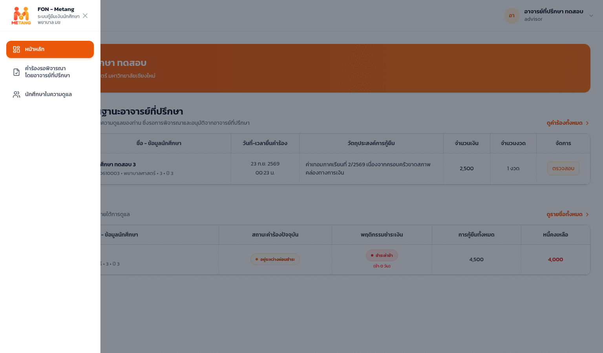

| บทบาท | เมนู |
|---|---|
| อาจารย์ที่ปรึกษา | **หน้าหลัก**, **คำร้องรอพิจารณา โดยอาจารย์ที่ปรึกษา**, **นักศึกษาในความดูแล** |
| ผู้ดูแลระบบ | **หน้าหลัก**, **คำร้องรอตรวจสอบ**, **เบิกจ่ายหนี้**, **ตรวจสอบสลิปชำระเงิน** |
| ผู้บริหาร | **หน้าหลัก**, **คำร้องรอพิจารณา โดยอาจารย์ที่ปรึกษา**, **คำร้องรอพิจารณา โดยผู้บริหาร**, **นักศึกษาในความดูแล** |
| ผู้ดูแลระบบสูงสุด | **หน้าหลัก**, **คำร้องรอตรวจสอบ**, **เบิกจ่ายหนี้**, **ตรวจสอบสลิปชำระเงิน**, **ตั้งค่าระบบ** |

**ออกจากระบบ:** คลิกชื่อของท่านที่มุมขวาบน แล้วคลิก **ออกจากระบบ**

**การแบ่งหน้า:** รายการที่มีมากกว่า 5 แถวแบ่งเป็นหน้าละ 5 แถว ใช้ปุ่มลูกศร < > หรือปุ่มเลขหน้าใต้ตารางเพื่อเปลี่ยนหน้า
ระบบกลับไปหน้า 1 เมื่อเปลี่ยนตัวกรองหรือคำค้นหา แต่ละตารางในหน้าหลักมีปุ่มเลขหน้าของตัวเอง

---

## 3. การแจ้งเตือนทาง LINE

เมื่อมีคำร้องรอท่านดำเนินการ ระบบส่งข้อความทาง LINE พร้อมเลขที่คำร้อง ชื่อนักศึกษา และจำนวนเงิน

| ข้อความ | ผู้รับ | หน้าที่ต้องเปิด |
|---|---|---|
| มีคำร้องใหม่รอการตรวจสอบ | อาจารย์ที่ปรึกษาของนักศึกษา | คำร้องรอพิจารณา โดยอาจารย์ที่ปรึกษา |
| มีคำร้องรอการพิจารณาจากผู้ดูแลระบบ | ผู้ดูแลระบบ | คำร้องรอตรวจสอบ |
| มีคำร้องรอการอนุมัติจากผู้บริหาร | ผู้บริหาร | คำร้องรอพิจารณา โดยผู้บริหาร |
| มีคำร้องรอการโอนเงิน | ผู้ดูแลระบบ | เบิกจ่ายหนี้ |

---

## 4. อาจารย์ที่ปรึกษา

### 4.1 หน้าหลัก

หน้าหลักแสดง **คำร้องรอพิจารณา • ในฐานะอาจารย์ที่ปรึกษา** และ **นักศึกษาในความดูแล** แต่ละตารางแสดงหน้าละ 5 แถว
ถ้ามีมากกว่า 5 แถวให้กดปุ่มเลขหน้าใต้ตาราง คลิก **ดูคำร้องทั้งหมด** หรือ **ดูรายชื่อทั้งหมด** เพื่อเปิดหน้าที่มีตัวกรองและช่องค้นหา

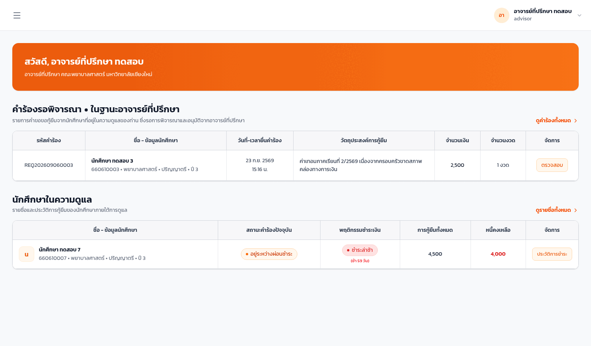

### 4.2 พิจารณาคำร้อง

**วัตถุประสงค์:** อนุมัติ ส่งกลับแก้ไข หรือไม่อนุมัติคำร้องของนักศึกษาในความดูแล

**สิ่งที่ต้องมี:** คำร้องมีสถานะ **รอพิจารณา**

**ขั้นตอน:**

1. เปิดเมนู **คำร้องรอพิจารณา โดยอาจารย์ที่ปรึกษา** แท็บ **รอพิจารณา** แสดงคำร้องที่รอท่าน
   ค้นหาด้วยรหัสคำร้องหรือชื่อได้ที่ช่องค้นหา

   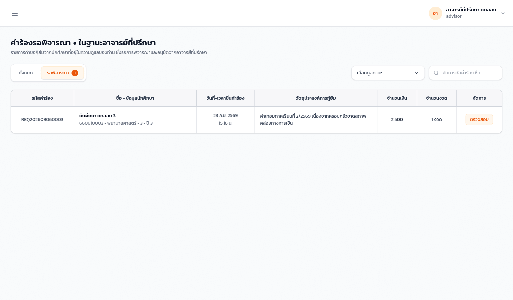

2. คลิก **ตรวจสอบ** ที่คำร้องที่ต้องการ ระบบแสดงหน้าต่าง **คำร้องรอพิจารณา**
3. ตรวจสอบ **ข้อมูลนักศึกษา**, **ข้อมูลการกู้ยืม**, **ตารางการชำระ**, **พฤติกรรมการชำระเงิน**
   และ **ติดตามสถานะคำร้อง** เลื่อนลงเพื่อดูข้อมูลทั้งหมด

   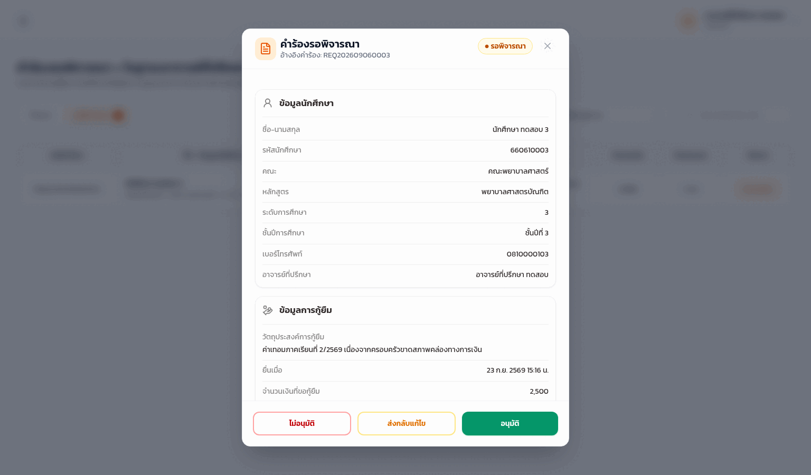

   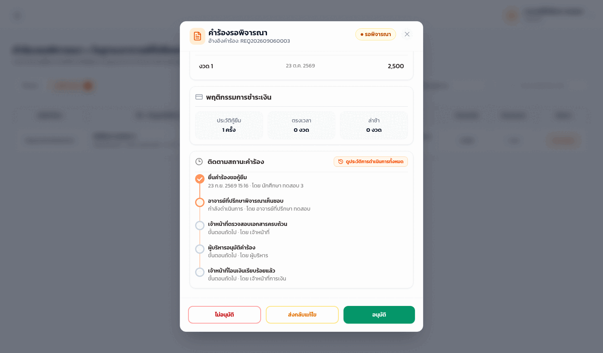

4. คลิกปุ่มผลการพิจารณา (ปุ่มเรียงจากซ้ายไปขวา: **ไม่อนุมัติ**, **ส่งกลับแก้ไข**, **อนุมัติ**)
   - **อนุมัติ**: ส่งคำร้องต่อให้ผู้ดูแลระบบ
   - **ส่งกลับแก้ไข**: ส่งคำร้องกลับให้นักศึกษาแก้ไข
   - **ไม่อนุมัติ**: ปิดคำร้อง นักศึกษาต้องยื่นคำร้องใหม่
5. กรอกความเห็นหรือเหตุผลในช่องที่ระบบแสดง ช่องนี้จำเป็นต้องกรอก ไม่เกิน 500 ตัวอักษร
   - อนุมัติ: **ความเห็นประกอบการพิจารณา**
   - ส่งกลับแก้ไข: **ระบุสิ่งที่ต้องการให้นักศึกษาแก้ไข**
   - ไม่อนุมัติ: **ระบุเหตุผลเพื่อแจ้งกลับให้นักศึกษาทราบ**
6. คลิก **ยืนยันอนุมัติ**, **ยืนยันส่งกลับแก้ไข** หรือ **ยืนยันไม่อนุมัติ** หากต้องการเปลี่ยนใจ คลิก **ยกเลิก**

   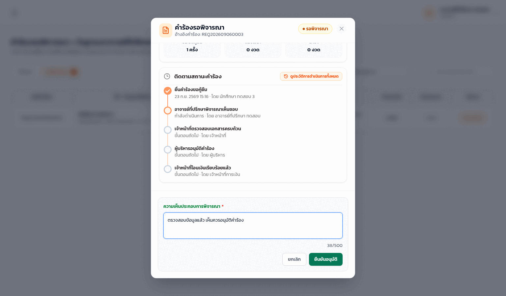

**ผลลัพธ์:** ระบบแสดง **ดำเนินการอนุมัติคำร้องเสร็จสิ้น** คลิก **เสร็จสิ้น** คำร้องออกจากแท็บ **รอพิจารณา**
นักศึกษาเห็นความเห็นของท่านในหน้าติดตามสถานะคำร้อง

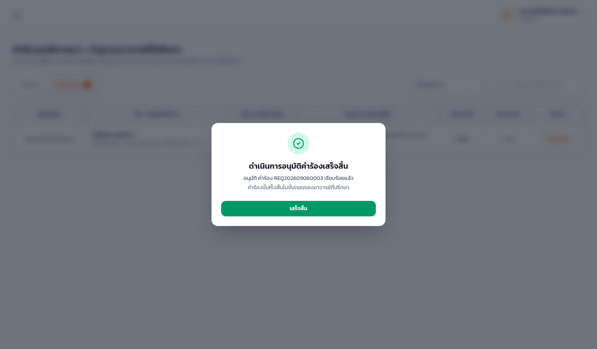

### 4.3 นักศึกษาในความดูแล

หน้านี้แสดงนักศึกษาในความดูแลที่ได้รับการโอนเงินแล้วและยังผ่อนชำระไม่ครบ นักศึกษาหนึ่งคนแสดงหนึ่งแถว
พร้อม **สถานะคำร้องปัจจุบัน**, **พฤติกรรมชำระเงิน**, **การกู้ยืมทั้งหมด** และ **หนี้คงเหลือ**

1. เปิดเมนู **นักศึกษาในความดูแล**
2. กรองด้วยแท็บ **ทั้งหมด**, **ชำระตรงเวลา** หรือ **เคยชำระล่าช้า** หรือเลือกระดับการศึกษา
3. คลิกแถวของนักศึกษา หรือปุ่ม **ประวัติการชำระ** เพื่อดู **ประวัติหลักฐานการชำระ**

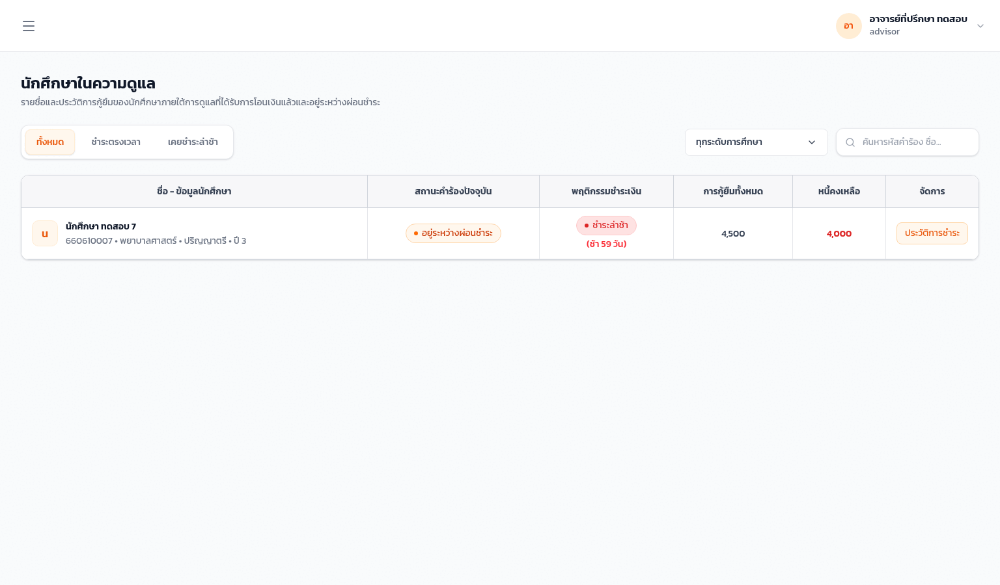

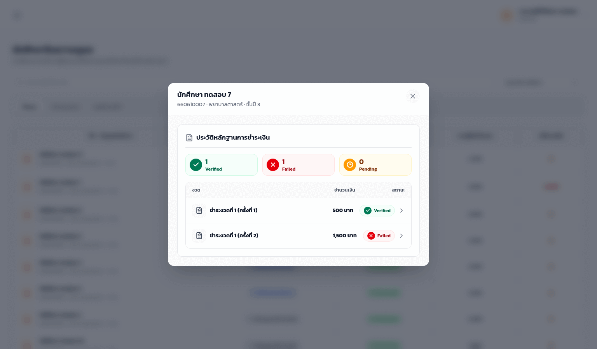

---

## 5. ผู้ดูแลระบบ (Admin)

### 5.1 หน้าหลัก

หน้าหลักแสดงงานที่รอผู้ดูแลระบบ 3 กลุ่ม: **คำร้องรอตรวจสอบ**, **รายการเบิกจ่าย** และ **ตรวจสอบสลิปชำระเงิน**
คลิก **ดูทั้งหมด →** เพื่อเปิดหน้าของงานนั้น

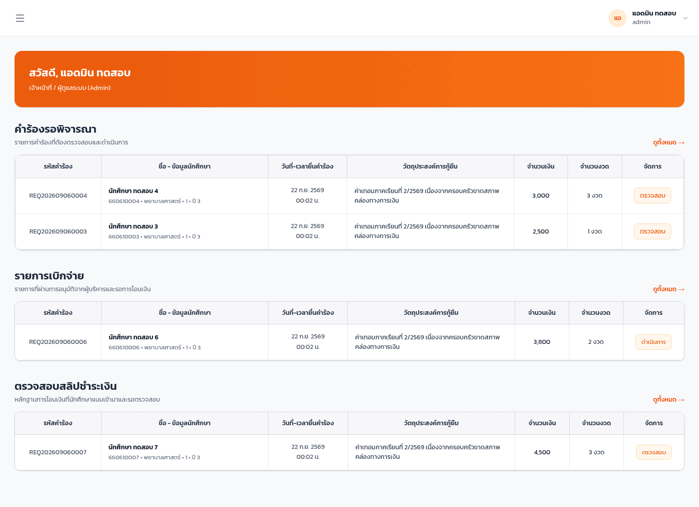

### 5.2 ตรวจสอบคำร้องและวงเงิน

**วัตถุประสงค์:** ตรวจสอบเอกสารและวงเงิน แล้วส่งคำร้องให้ผู้บริหาร ส่งกลับให้นักศึกษาแก้ไข หรือไม่อนุมัติ

**สิ่งที่ต้องมี:** คำร้องมีสถานะ **รอผู้ดูแลระบบตรวจสอบ**

> **หมายเหตุ:** เมื่อผู้ดูแลระบบคนหนึ่งส่งคำร้องให้ผู้บริหารแล้ว คำร้องนั้นผูกกับผู้ดูแลระบบคนนั้น
> ถ้าผู้บริหารส่งกลับ คำร้องจะแสดงเฉพาะในรายการของผู้ดูแลระบบคนเดิม

**ขั้นตอน:**

1. เปิดเมนู **คำร้องรอตรวจสอบ**

   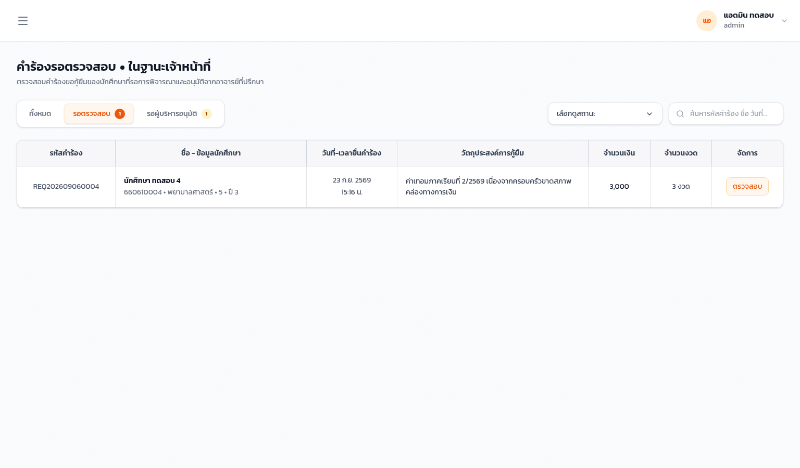

2. คลิก **ตรวจสอบ** ที่คำร้องที่ต้องการ แล้วตรวจสอบข้อมูลในหน้าต่าง **คำร้องรอพิจารณา**

   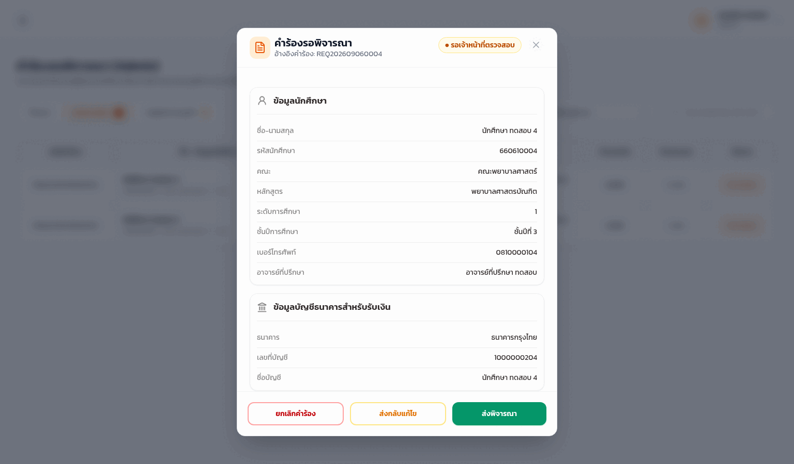

3. หากต้องการปรับลดวงเงิน:
   1. คลิก **ปรับวงเงิน** ข้าง **จำนวนเงินที่ขอกู้ยืม**
   2. กรอกวงเงินใหม่ วงเงินต้องมากกว่า 0 บาท และไม่เกินจำนวนที่นักศึกษาขอ
   3. คลิกปุ่มบันทึก (✓) ระบบแสดง **ปรับลดจาก ...** และคำนวณ **ตารางการชำระ** ใหม่

   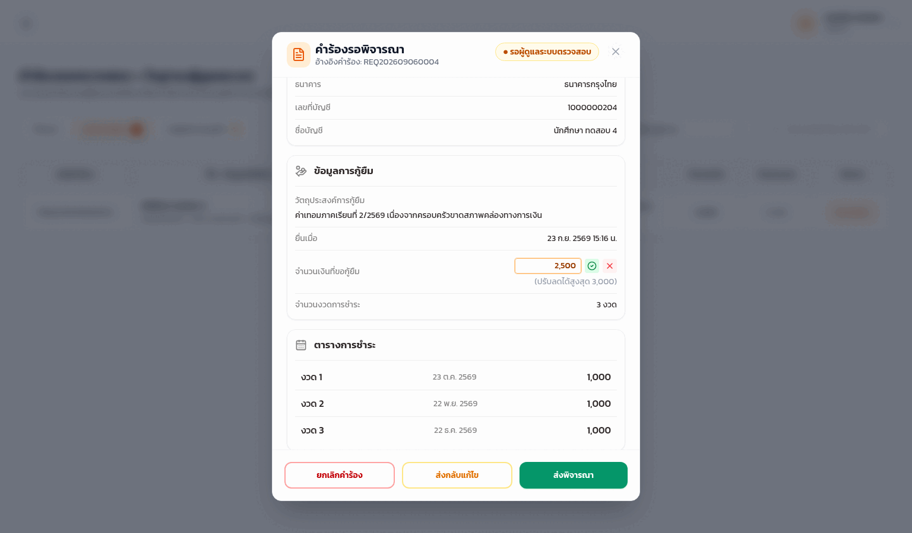

4. คลิกปุ่มผลการพิจารณา (ปุ่มเรียงจากซ้ายไปขวา: **ยกเลิกคำร้อง**, **ส่งกลับแก้ไข**, **ส่งพิจารณา**)
   - **ส่งพิจารณา**: ส่งคำร้องให้ผู้บริหาร พร้อมวงเงินที่ส่งพิจารณา
   - **ส่งกลับแก้ไข**: ส่งคำร้องกลับให้นักศึกษาแก้ไข
   - **ยกเลิกคำร้อง**: ไม่อนุมัติคำร้อง นักศึกษาเห็นสถานะ **ไม่อนุมัติโดยผู้ดูแลระบบ**
5. กรอกความเห็นหรือเหตุผลในช่องที่ระบบแสดง ช่องนี้จำเป็นต้องกรอก
   หากปรับลดวงเงิน ให้ระบุเหตุผลของการปรับลดในช่องนี้
6. คลิก **ยืนยันส่งพิจารณา**, **ยืนยันส่งกลับแก้ไข** หรือ **ยืนยันยกเลิกคำร้อง**

   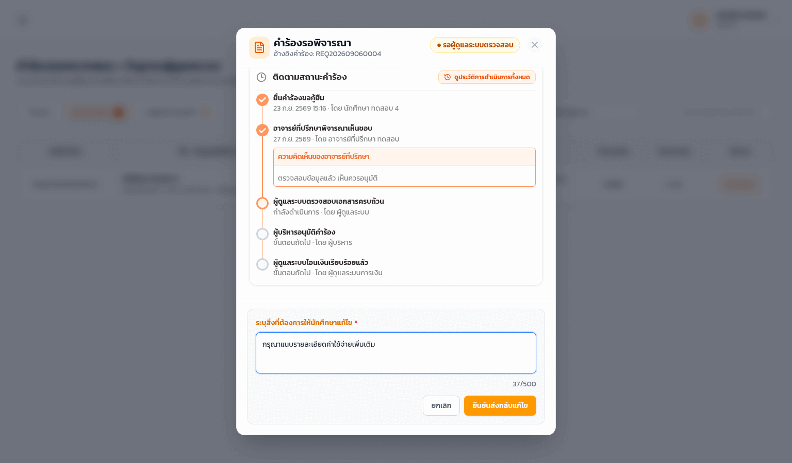

   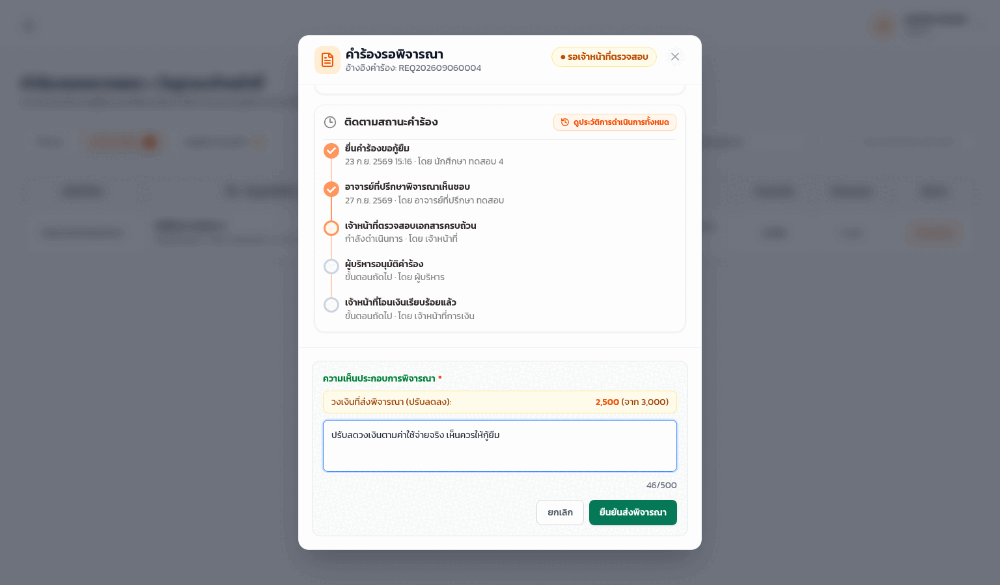

**ผลลัพธ์:** ระบบแสดง **ดำเนินการส่งพิจารณาคำร้องเสร็จสิ้น** คำร้องที่ส่งพิจารณามีสถานะ **รอผู้บริหารอนุมัติ**

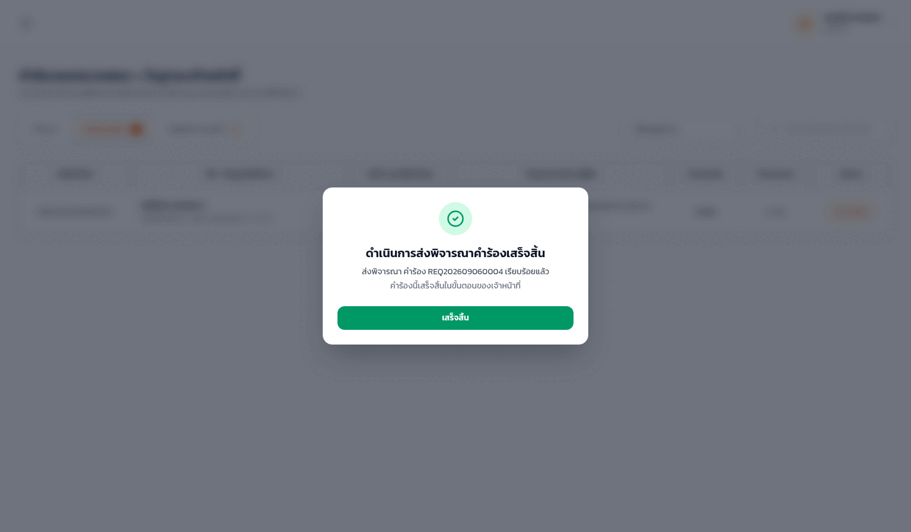

### 5.3 คำร้องที่ผู้บริหารส่งกลับ

ผู้บริหารส่งคำร้องกลับให้ผู้ดูแลระบบเพื่อปรับลดวงเงินเท่านั้น
คำร้องแสดงป้าย **ผู้บริหารให้แก้ไข** และข้อความ **ผู้บริหารส่งกลับมาแก้ไข**
คำร้องกลับไปที่ผู้ดูแลระบบคนที่ส่งให้ผู้บริหารเท่านั้น ผู้ดูแลระบบและผู้ดูแลระบบสูงสุดคนอื่นไม่เห็นคำร้องนี้
ในหน้า **คำร้องรอตรวจสอบ** และตัดสินแทนไม่ได้

1. เปิดคำร้องจาก **คำร้องรอตรวจสอบ** แล้วอ่านความเห็นของผู้บริหารใน **ติดตามสถานะคำร้อง**
2. คลิก **ปรับวงเงิน** แล้วกรอกวงเงินที่น้อยกว่าวงเงินเดิม ปุ่ม **ส่งพิจารณา** กดได้เมื่อปรับลดวงเงินแล้วเท่านั้น
3. คลิก **ส่งพิจารณา** กรอกเหตุผล แล้วคลิก **ยืนยันส่งพิจารณา**
   หรือคลิก **ยกเลิกคำร้อง** เพื่อไม่อนุมัติ ปุ่ม **ส่งกลับแก้ไข** ไม่แสดงสำหรับคำร้องนี้

### 5.4 เบิกจ่ายเงินให้นักศึกษา

**วัตถุประสงค์:** บันทึกการโอนเงินกู้ให้นักศึกษา พร้อมสลิปหลักฐาน

**สิ่งที่ต้องมี:**

- คำร้องมีสถานะ **รอเบิกจ่ายเงิน**
- โอนเงินเข้าบัญชีของนักศึกษาแล้ว และมีไฟล์สลิปเป็นรูปภาพ (แนะนำ JPG หรือ PNG) ขนาดไม่เกิน 1 MB ระบบไม่รับไฟล์ PDF

> **คำเตือน:** ตรวจสอบธนาคาร เลขที่บัญชี และชื่อบัญชีให้ตรงกับข้อมูลในคำร้องก่อนโอนเงินทุกครั้ง
> ระบบไม่มีปุ่มแก้ไขการเบิกจ่ายหลังยืนยันแล้ว

**ขั้นตอน:**

1. เปิดเมนู **เบิกจ่ายหนี้** ระบบแสดงหน้า **เบิกจ่ายเงินให้นักศึกษา** แท็บ **รอโอนเงิน** แสดงคำร้องที่รอท่าน
2. คลิก **ดำเนินการ** ที่คำร้องที่ต้องการ ระบบแสดงหน้าต่าง **ดำเนินการเบิกจ่ายเงิน** ป้ายสถานะมุมขวาบนแสดง **รอเบิกจ่าย**

   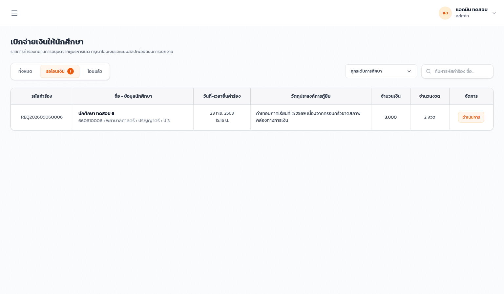

3. ตรวจสอบ **ข้อมูลบัญชีธนาคารสำหรับรับเงิน** และ **จำนวนเงินที่อนุมัติ (บาท)**
   คลิกไอคอนคัดลอกข้างเลขที่บัญชีเพื่อคัดลอกเลขบัญชีไปใช้ในแอปธนาคาร

   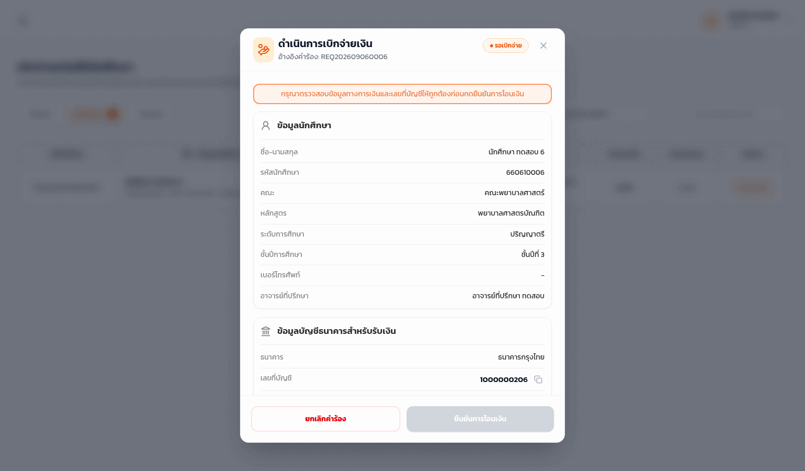

4. โอนเงินจากบัญชีของกองทุนเข้าบัญชีของนักศึกษา
5. ที่ **แนบสลิปหลักฐานการโอนเงิน** คลิกกรอบ **แตะเพื่ออัปโหลดหลักฐานการโอน** แล้วเลือกไฟล์รูปสลิป
   ระบบแสดงรูปตัวอย่างในกรอบ และชื่อไฟล์ใต้รูป
   คลิกรูปหรือ **ดูรูปแบบเต็ม** เพื่อดูรูปขนาดเต็ม หรือ **เปลี่ยนรูปภาพ** เพื่อเลือกไฟล์ใหม่
6. คลิก **ยืนยันการโอนเงิน** ปุ่มนี้เป็นสีเทาและกดไม่ได้จนกว่าจะแนบสลิป

   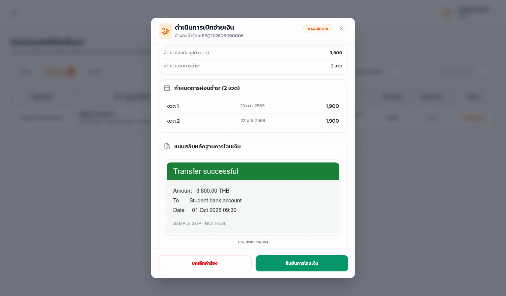

**ผลลัพธ์:** สถานะคำร้องเป็น **โอนเงินแล้ว** ระบบบันทึกรายการจ่ายในบัญชีกองทุน ระบบไม่ส่งอีเมลแจ้งนักศึกษาเมื่อโอนเงิน นักศึกษาเห็นสถานะในหน้าหลักของตน
คำร้องแสดงปุ่ม **ดูหลักฐาน** เพื่อเปิดสลิปที่แนบไว้ และปุ่ม **ดาวน์โหลดแบบคำร้อง (PDF)** เพื่อดูหรือพิมพ์แบบคำร้อง (ปุ่มนี้ไม่แสดงก่อนโอนเงิน)

> **หมายเหตุ:**
> - ปุ่ม **ยกเลิกคำร้อง** ใช้สำหรับยกเลิกคำร้องขอกู้ยืม โดยต้องระบุเหตุผลในการยกเลิกคำร้อง และกดยืนยันเพื่อดำเนินการยกเลิกคำร้อง
>   นักศึกษาเห็นสถานะ **ยกเลิกคำร้อง** พร้อมเหตุผลในประวัติการดำเนินการ ต่างจากปุ่ม **ยกเลิกคำร้อง** ในหน้า **คำร้องรอตรวจสอบ** (หัวข้อ 5.2) ที่นักศึกษาเห็น **ไม่อนุมัติโดยผู้ดูแลระบบ**
> - ข้อความใต้ช่องอัปโหลดเขียนว่า **รองรับ JPG หรือ PNG (ขนาดไม่เกิน 1MB)** ช่องเลือกไฟล์ยังให้เลือกไฟล์ PDF ได้ แต่ระบบรับเฉพาะไฟล์รูปภาพ (JPG, PNG, GIF, WebP, BMP, AVIF) ขนาดไม่เกิน 1 MB
>   ไม่รับไฟล์ PDF ระบบตรวจชนิดไฟล์จากเนื้อไฟล์ ไม่ใช่นามสกุล และแจ้งข้อผิดพลาดหลังคลิก **ยืนยันการโอนเงิน** (หัวข้อ 8)

### 5.5 ตรวจสอบสลิปชำระเงินคืน

**วัตถุประสงค์:** ยืนยันหรือปฏิเสธหลักฐานการชำระเงินคืนที่นักศึกษาส่งมา

**ขั้นตอน:**

1. เปิดเมนู **ตรวจสอบสลิปชำระเงิน** แล้วคลิก **ตรวจสอบ** ที่คำร้องที่ต้องการ

   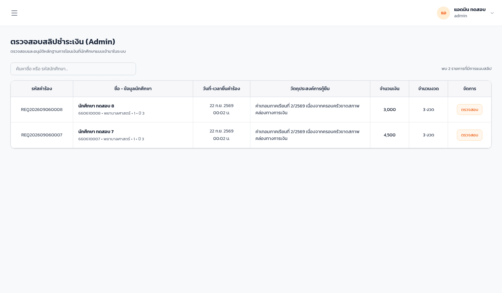

2. ระบบแสดง **ตรวจสอบการชำระเงิน** พร้อมตาราง **กำหนดการและประวัติการชำระเงิน**
   ตารางแสดงทุกงวด ทุกครั้งที่ส่ง ยอดเรียกเก็บ ยอดที่ชำระ และสถานะของสลิป
3. คลิกปุ่มสถานะ **รอตรวจสอบ** ของสลิปที่ต้องการตรวจ

   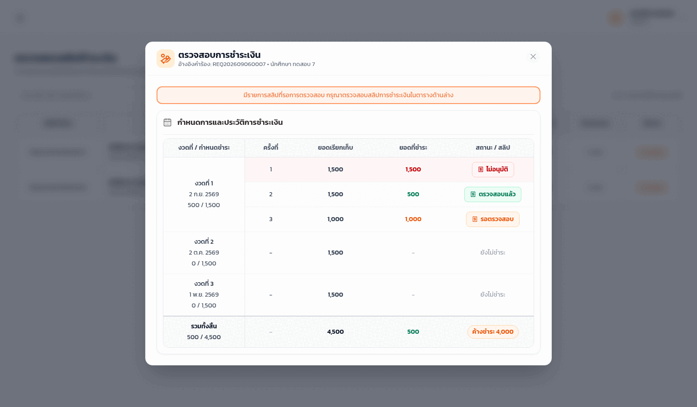

4. ในหน้าต่าง **ตรวจสอบสลิปการชำระเงิน** เทียบ **ยอดเงินที่โอนมา**, **วันที่โอน** และ **เวลาที่โอน**
   กับรูปสลิป คลิกรูปสลิปเพื่อดูภาพขนาดเต็ม

   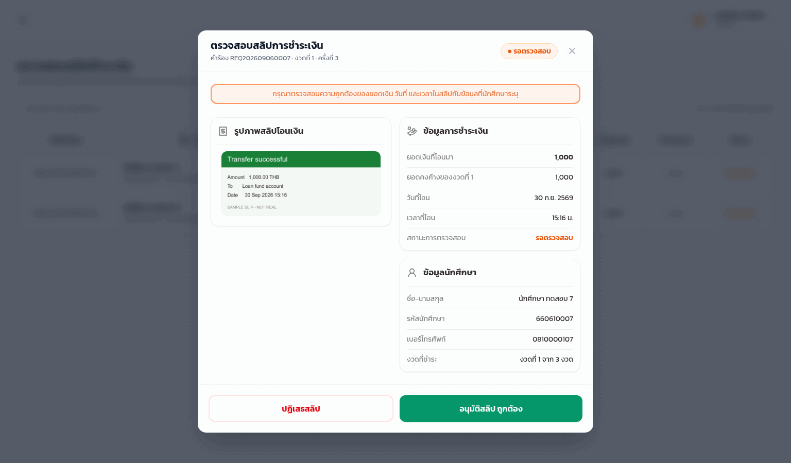

5. ทำอย่างใดอย่างหนึ่ง (ปุ่ม **ปฏิเสธสลิป** อยู่ซ้าย ปุ่ม **อนุมัติสลิป ถูกต้อง** อยู่ขวา)
   - สลิปถูกต้อง: คลิก **อนุมัติสลิป ถูกต้อง** แล้วคลิก **ยืนยัน**
   - สลิปไม่ถูกต้อง: คลิก **ปฏิเสธสลิป** กรอก **เหตุผลที่ปฏิเสธสลิป** แล้วคลิก **ยืนยัน**
     นักศึกษาเห็นเหตุผลนี้ในหน้าประวัติหลักฐานการชำระ (ระบบไม่ส่งอีเมล)

   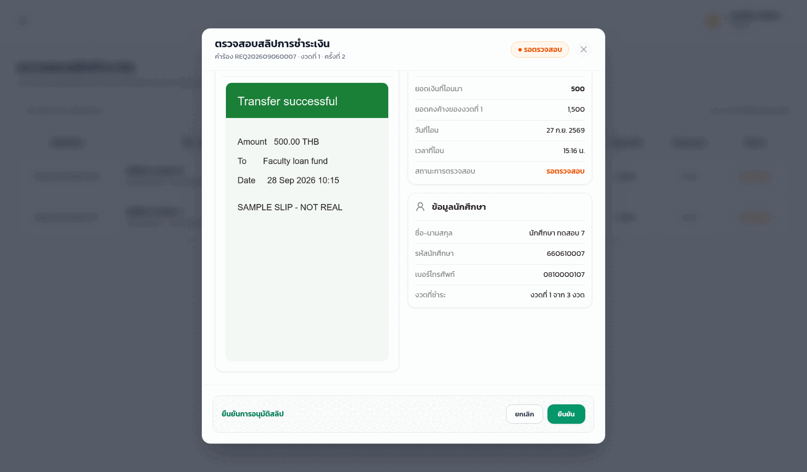

   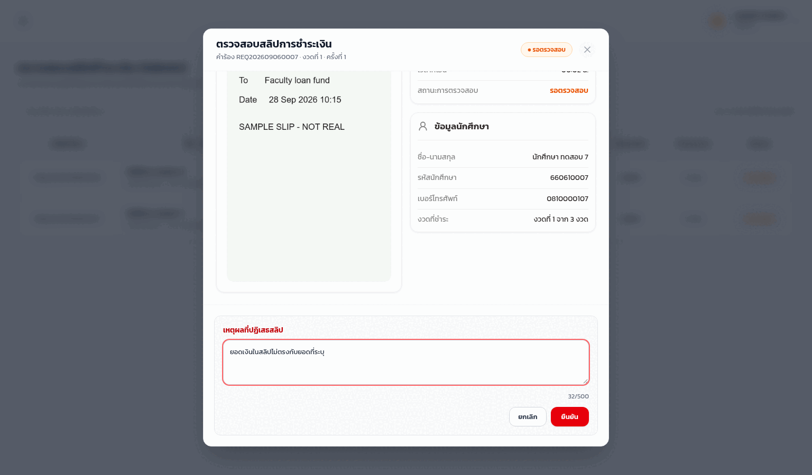

**ผลลัพธ์:** ตารางแสดงสลิปเป็น **ตรวจสอบแล้ว** หรือ **ไม่อนุมัติ** และยอดที่ชำระของงวดนั้น
ระบบไม่ส่งอีเมลแจ้งผลให้นักศึกษา นักศึกษาดูผลได้ในหน้าประวัติหลักฐานการชำระ เมื่อชำระครบทุกงวด สถานะคำร้องเป็น **เสร็จสิ้น**

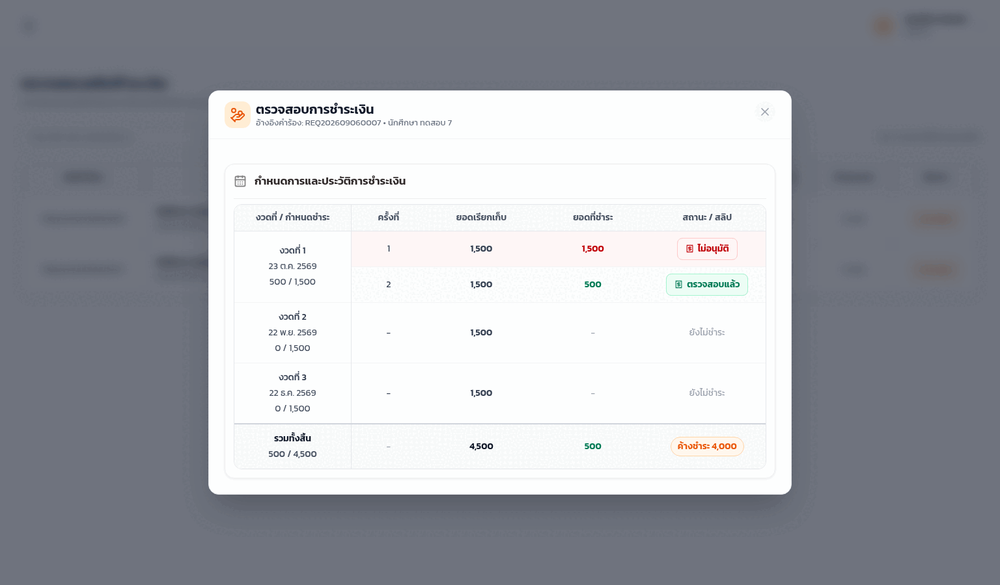

> **คำเตือน:** ถ้าระบบแสดง **รายการนี้มียอดโอนเกินยอดหนี้คงค้างทั้งหมด** ปุ่มปฏิเสธจะเป็น
> **ปฏิเสธสลิป · ติดต่อนักศึกษา** ให้ติดต่อนักศึกษาเพื่อคืนเงินส่วนเกินก่อนปิดรายการ

---

## 6. ผู้บริหาร

### 6.1 หน้าหลัก: รายงานและสถิติทางการเงิน

หน้าหลักแสดง **เงินทั้งหมดในระบบ**, **เงินคงเหลือในระบบ**, **เงินที่ค้างชำระทั้งหมด**, **เงินที่อยู่ระหว่างดำเนินการ**,
**สัดส่วนเงินในระบบ**, ยอดการกู้ยืมและการคืนเงินรายเดือน และจำนวนคำร้องรายเดือน
เลือกปีที่ต้องการดูได้ที่ตัวเลือกปีมุมขวาของกราฟแท่งแต่ละกราฟ (กราฟ **สัดส่วนเงินในระบบ** ไม่มีตัวเลือกปี) และสลับมุมมอง **รายเดือน** หรือ **รายไตรมาส** ได้ที่ปุ่มข้างตัวเลือกปี

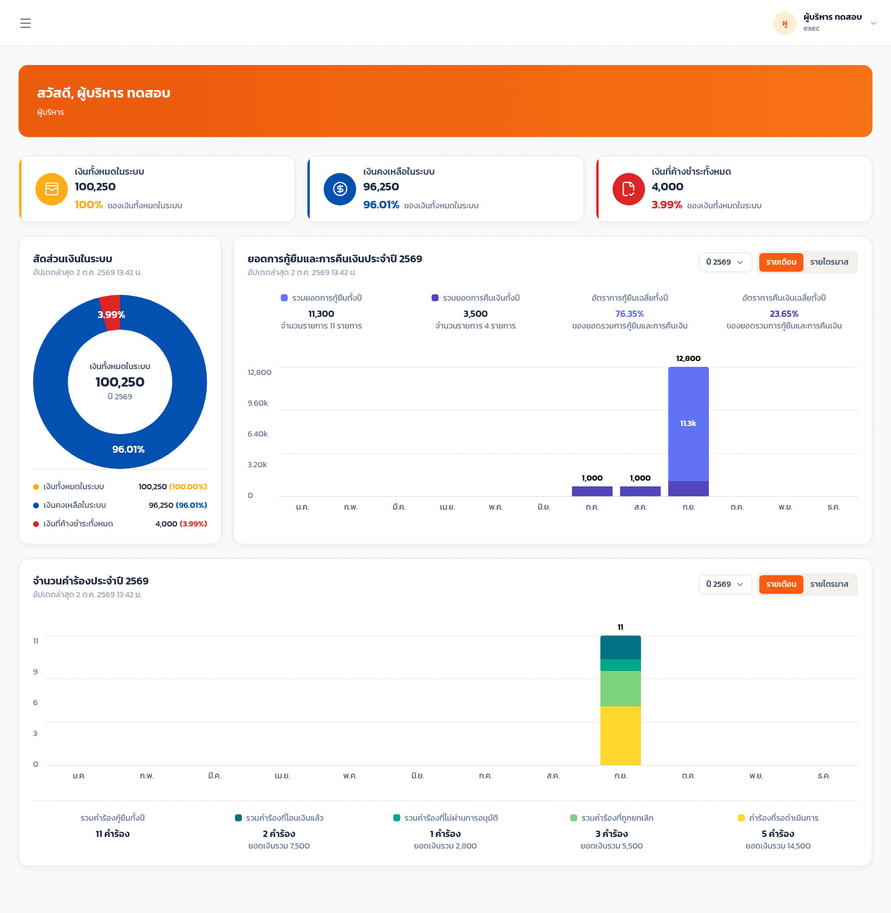

### 6.2 อนุมัติคำร้องขั้นสุดท้าย

**สิ่งที่ต้องมี:** คำร้องมีสถานะ **รอผู้บริหารอนุมัติ**

**ขั้นตอน:**

1. เปิดเมนู **คำร้องรอพิจารณา โดยผู้บริหาร** ระบบแสดงหน้า **คำร้องรอพิจารณา (ในฐานะผู้บริหาร)** แท็บ **รออนุมัติ** แสดงคำร้องที่รอท่าน

   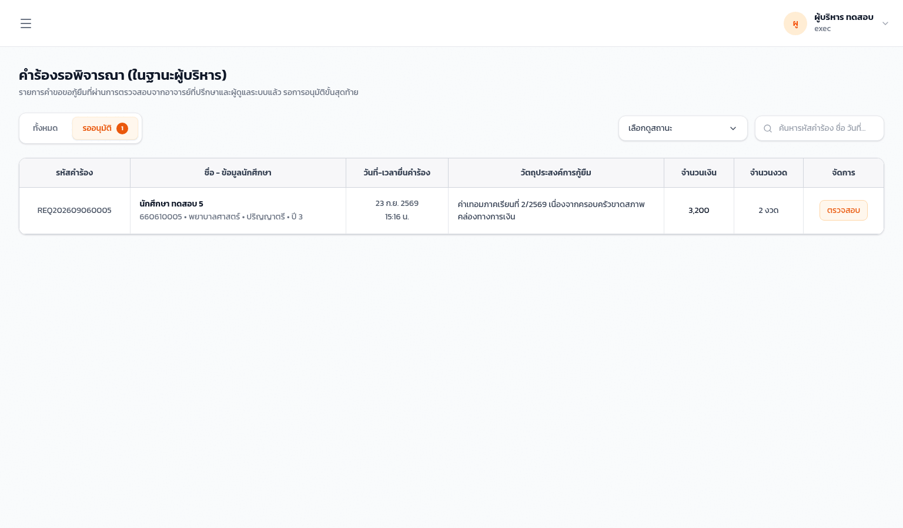

2. คลิก **ตรวจสอบ** แล้วตรวจสอบข้อมูลคำร้อง ความเห็นของอาจารย์และผู้ดูแลระบบแสดงใน **ติดตามสถานะคำร้อง**

   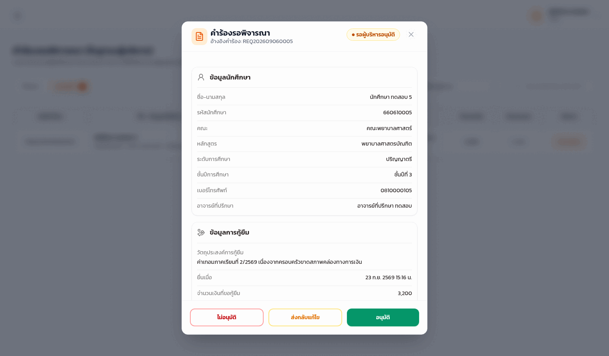

3. คลิกปุ่มผลการพิจารณา (ปุ่มเรียงจากซ้ายไปขวา: **ไม่อนุมัติ**, **ส่งกลับแก้ไข**, **อนุมัติ**)
   - **อนุมัติ**: คำร้องมีสถานะ **รอเบิกจ่ายเงิน** และไปที่ผู้ดูแลระบบเพื่อโอนเงิน
   - **ส่งกลับแก้ไข**: คำร้องกลับไปที่ผู้ดูแลระบบคนเดิมเพื่อปรับลดวงเงิน (หัวข้อ 5.3)
   - **ไม่อนุมัติ**: ปิดคำร้อง นักศึกษาเห็นสถานะ **ไม่อนุมัติโดยผู้บริหาร**
4. กรอกความเห็นหรือเหตุผล แล้วคลิก **ยืนยันอนุมัติ**, **ยืนยันส่งกลับแก้ไข** หรือ **ยืนยันไม่อนุมัติ**

   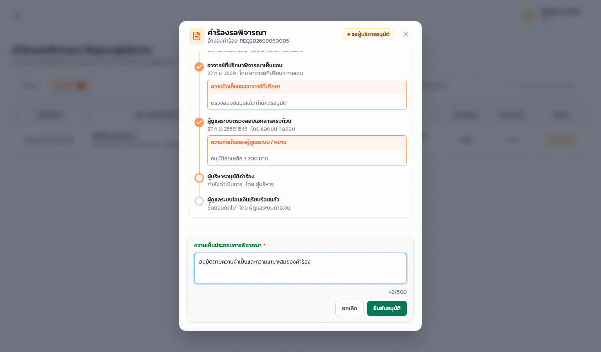

   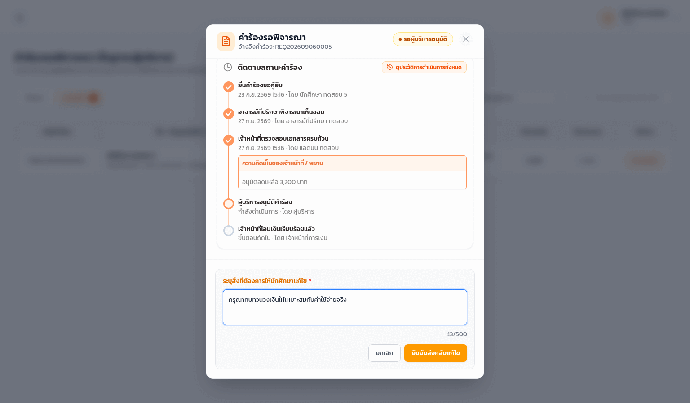

   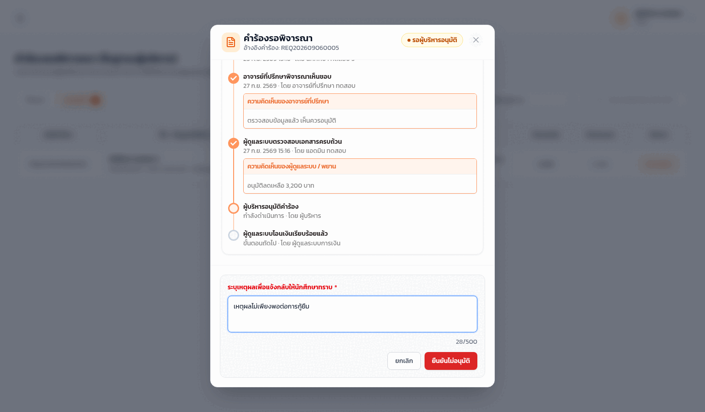

**ผลลัพธ์:** ระบบแสดง **ดำเนินการอนุมัติคำร้องเสร็จสิ้น** คลิก **เสร็จสิ้น**

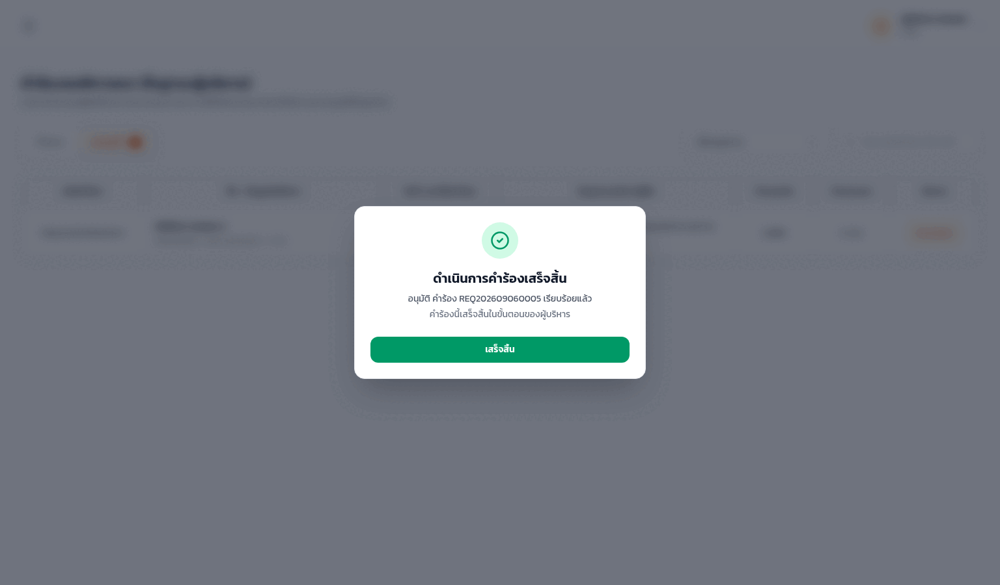

> **หมายเหตุ:** เมื่อกด **ส่งกลับแก้ไข** ช่องความเห็นเขียนว่า **ระบุสิ่งที่ต้องการให้นักศึกษาแก้ไข**
> แต่คำร้องไปที่ผู้ดูแลระบบ ไม่ไปที่นักศึกษา ให้เขียนความเห็นถึงผู้ดูแลระบบ

### 6.3 คำร้องในฐานะอาจารย์ที่ปรึกษา

ผู้บริหารที่เป็นอาจารย์ที่ปรึกษาของนักศึกษาด้วย พิจารณาคำร้องของนักศึกษาในความดูแลได้ที่เมนู
**คำร้องรอพิจารณา โดยอาจารย์ที่ปรึกษา** หน้า **คำร้องรอพิจารณา (ในฐานะอาจารย์ที่ปรึกษา)** แสดงเฉพาะคำร้องที่ท่านเป็นอาจารย์ที่ปรึกษา
ขั้นตอนเหมือนหัวข้อ 4.2

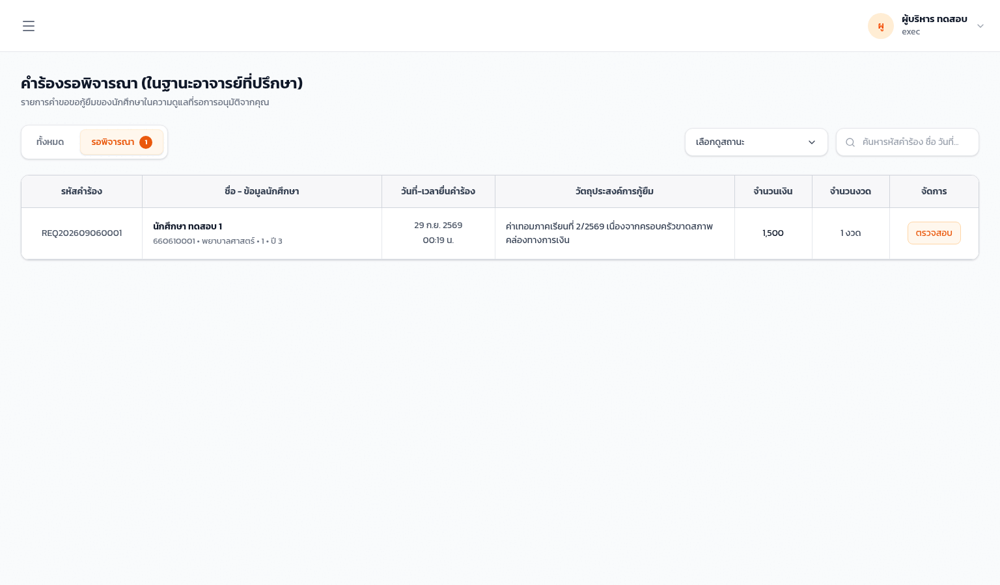

### 6.4 นักศึกษาในความดูแล

เมนู **นักศึกษาในความดูแล** ของผู้บริหารเปิดหน้า **นักศึกษาในความดูแล**
หน้านี้แสดงนักศึกษาทุกคนในระบบที่ได้รับการโอนเงินแล้วและยังมีหนี้คงเหลือ พร้อมสถานะคำร้องและหนี้คงเหลือ แสดงหน้าละ 5 แถว

1. กรองด้วยแท็บ **ทั้งหมด**, **ชำระตรงเวลา** หรือ **เคยชำระล่าช้า** หรือเลือกระดับการศึกษา
2. คลิกแถวของนักศึกษา หรือปุ่ม **ประวัติการชำระ** เพื่อดู **ประวัติหลักฐานการชำระ**

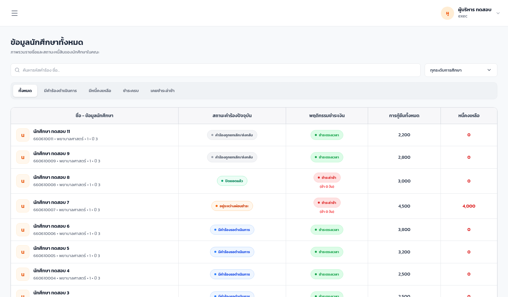

---

## 7. ผู้ดูแลระบบสูงสุด (SuperAdmin)

ผู้ดูแลระบบสูงสุดทำงานของผู้ดูแลระบบ (Admin) ได้ทั้งหมด และตั้งค่าระบบในเมนู **ตั้งค่าระบบ**
บทบาทนี้แสดงบนหน้าจอเป็น **ผู้ดูแลระบบสูงสุด** บางข้อความแสดงเป็นภาษาอังกฤษ **SuperAdmin** หรือ **Super Admin**

### 7.1 หน้าหลักและเมนู

หน้าหลักแสดงรายงานและสถิติทางการเงินชุดเดียวกับหน้าหลักของผู้บริหาร (หัวข้อ 6.1)

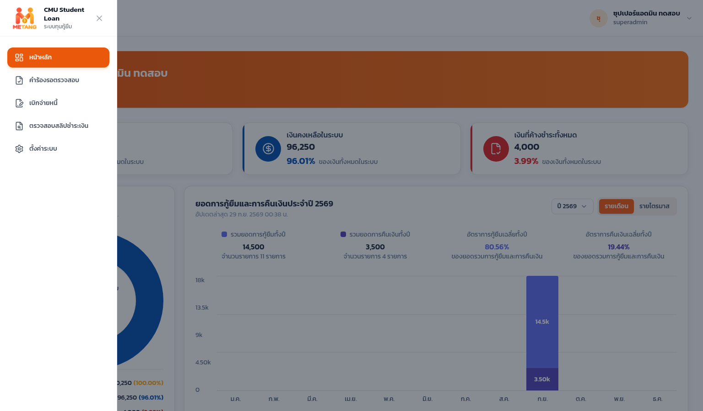

### 7.2 งานของผู้ดูแลระบบ (Admin)

ผู้ดูแลระบบสูงสุดใช้หน้าเดียวกับผู้ดูแลระบบ (Admin) และทำตามขั้นตอนเดียวกัน

| เมนู | ชื่อหน้า | ขั้นตอน |
|---|---|---|
| **คำร้องรอตรวจสอบ** | **คำร้องรอตรวจสอบ • ในฐานะผู้ดูแลระบบสูงสุด** | หัวข้อ 5.2 และ 5.3 |
| **เบิกจ่ายหนี้** | **เบิกจ่ายเงินให้นักศึกษา** | หัวข้อ 5.4 |
| **ตรวจสอบสลิปชำระเงิน** | **ตรวจสอบสลิปชำระเงิน** | หัวข้อ 5.5 |

หน้า **คำร้องรอตรวจสอบ • ในฐานะผู้ดูแลระบบสูงสุด** เปิดที่แท็บ **รอตรวจสอบ (Admin)**
คลิก **รอผู้บริหารอนุมัติ** หรือ **ทั้งหมด** เพื่อดูคำร้องในขั้นอื่น

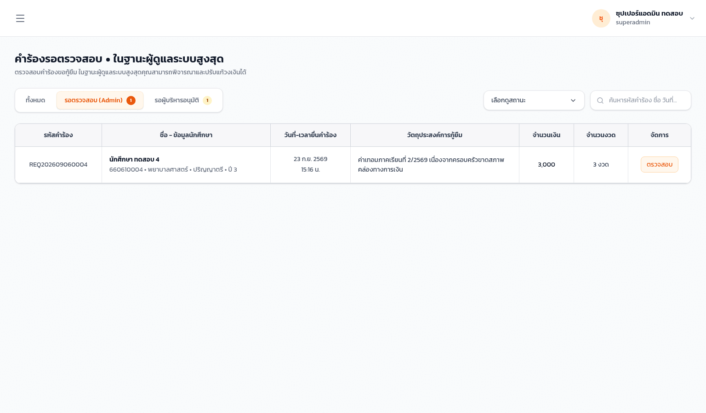

### 7.3 จัดการผู้ใช้และบทบาท

**วัตถุประสงค์:** เพิ่ม แก้ไข ลบ และเปลี่ยนบทบาทของผู้ดูแลระบบ ผู้บริหาร และผู้ดูแลระบบสูงสุด

**เปลี่ยนบทบาท**

1. คลิกเมนู **ตั้งค่าระบบ** ระบบแสดงหน้า **ศูนย์ควบคุมระบบ** ที่แท็บ **ผู้ใช้และบทบาท**
2. ค้นหาผู้ใช้ในช่อง **ค้นหาชื่อ / อีเมล / รหัส CMU** หรือเลือกบทบาทในตัวเลือก **เลือกดูบทบาท** (**ทุกบทบาท**, **ผู้ดูแลระบบ**, **ผู้บริหาร** หรือ **ผู้ดูแลระบบสูงสุด**)
   รายชื่อแสดงหน้าละ 5 คน ใช้ตัวเลือกเลขหน้าใต้ตารางเพื่อเปลี่ยนหน้า
   ระบบแสดงดาว (★) ข้างชื่อของผู้ที่มีบทบาท **ผู้ดูแลระบบสูงสุด** หรือ **ผู้บริหาร**
3. ในคอลัมน์ **บทบาท** เลือกบทบาทใหม่: **ผู้ดูแลระบบ**, **ผู้บริหาร** หรือ **ผู้ดูแลระบบสูงสุด**

   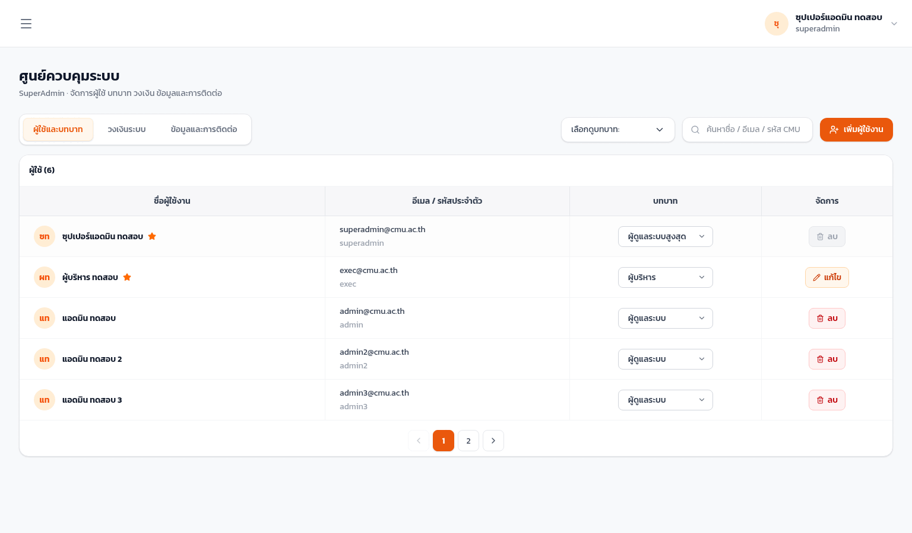

**ผลลัพธ์:** ระบบบันทึกทันทีโดยไม่ถามยืนยัน ระหว่างบันทึกแสดง **กำลังบันทึก...**
เมื่อสำเร็จแสดงข้อความ **เปลี่ยนบทบาทของ <ชื่อ> เป็น "<บทบาท>" เรียบร้อยแล้ว**
ระบบเพิ่มบทบาทใหม่ แล้วยกเลิกบทบาทเดิมในหน้านี้ (ผู้ดูแลระบบ หรือผู้ดูแลระบบสูงสุด) บทบาทผู้บริหารและบทบาทผู้ดูแลระบบสูงสุดของตนเองยกเลิกไม่ได้ (ดูเงื่อนไขด้านล่าง)
บทบาทอื่นที่ไม่ได้จัดการในหน้านี้ยังอยู่

เงื่อนไข:

- ระบบมีผู้บริหารได้ 1 คน ตัวเลือกของผู้ใช้อื่นแสดง **ผู้บริหาร (มีผู้บริหารแล้ว)** และเลือกไม่ได้
- ระบบไม่ยอมยกเลิกบทบาทผู้บริหาร เพราะต้องมีผู้บริหารเสมอ อย่าเปลี่ยนบทบาทในแถวของผู้บริหาร
  ถ้าเลือก **ผู้ดูแลระบบ** หรือ **ผู้ดูแลระบบสูงสุด** ในแถวของผู้บริหาร ระบบปฏิเสธตั้งแต่ขั้นเพิ่มบทบาท
  เพราะผู้บริหารเป็นอาจารย์ที่ปรึกษาด้วย และอาจารย์ที่ปรึกษาเป็นผู้ดูแลระบบหรือผู้ดูแลระบบสูงสุดไม่ได้
  หน้าจอแสดงข้อความภาษาอังกฤษ **An advisor cannot also be an admin or SuperAdmin** และไม่มีบทบาทใดเปลี่ยน
  หากต้องการเปลี่ยนผู้บริหาร ให้ใช้ **แก้ไขข้อมูลผู้บริหาร** ด้านล่าง
- ระบบไม่ยอมยกเลิกบทบาทของผู้ดูแลระบบสูงสุดคนสุดท้าย
- เมื่อเปลี่ยนบทบาทของผู้ดูแลระบบเป็นบทบาทอื่น คำร้องที่ผู้ดูแลระบบคนนั้นรับไว้ในสถานะ **รอผู้ดูแลระบบตรวจสอบ**
  และ **รอผู้บริหารอนุมัติ** ย้ายมาอยู่กับผู้ดูแลระบบสูงสุดที่เปลี่ยนบทบาท
- ยกเลิกบทบาทผู้ดูแลระบบสูงสุดของตนเองไม่ได้ แม้มีผู้ดูแลระบบสูงสุดคนอื่นอยู่
  ให้แต่งตั้งผู้ดูแลระบบสูงสุดคนใหม่ แล้วให้คนนั้นเปลี่ยนบทบาทของท่าน
  หากเลือกบทบาทอื่นในแถวของตนเอง ระบบเพิ่มบทบาทใหม่ให้ก่อนแล้วปฏิเสธการยกเลิก ท่านจึงมีทั้งสองบทบาท
  และยังเปิดเมนู **ตั้งค่าระบบ** ได้
- หากเปลี่ยนบทบาทของตนเองสำเร็จ ระบบโหลดหน้าใหม่ตามสิทธิ์ใหม่ทันที

**เพิ่มผู้ใช้**

ใช้เมื่อต้องการให้บุคลากรที่ยังไม่เคยเข้าสู่ระบบเป็นผู้ดูแลระบบหรือผู้ดูแลระบบสูงสุด

1. คลิก **เพิ่มผู้ใช้งาน** ระบบแสดงหน้าต่าง **เพิ่มผู้ใช้งานใหม่**
2. กรอก **ชื่อ-นามสกุล** (ภาษาไทย), **ชื่อ-นามสกุล (ภาษาอังกฤษ)** และ **อีเมล CMU / อีเมล** ต้องกรอกทั้ง 3 ช่อง อีเมลต้องลงท้ายด้วย @cmu.ac.th
   ระบบไม่รับอีเมลอื่น เช่น @gmail.com
3. เลือก **บทบาท**: **ผู้ดูแลระบบ** หรือ **ผู้ดูแลระบบสูงสุด**
4. คลิก **บันทึก**

**ผลลัพธ์:** ระบบแสดง **เพิ่มผู้ใช้งาน <ชื่อ> (<บทบาท>) เรียบร้อยแล้ว**
หากอีเมลหรือบัญชี CMU (ข้อความหน้าเครื่องหมาย @) ตรงกับผู้ใช้ที่ยังมีบทบาทอยู่
ระบบปฏิเสธและแสดง **อีเมลนี้มีผู้ใช้งานในระบบแล้ว** ไม่เพิ่มบทบาทและไม่เปลี่ยนชื่อ
หากตรงกับผู้ดูแลระบบหรือผู้ดูแลระบบสูงสุดที่ถูกลบไปแต่ระบบเก็บแถวผู้ใช้ไว้ ระบบให้บทบาทใหม่กับแถวเดิม
ชื่อภาษาไทยและภาษาอังกฤษเดิมไม่เปลี่ยน ระบบไม่ใช้ชื่อที่กรอกในหน้าต่างนี้
หน้าต่างนี้ตั้งผู้บริหารไม่ได้ ตั้งผู้บริหารคนใหม่ที่ **แก้ไขข้อมูลผู้บริหาร** ด้านล่าง

**แก้ไขข้อมูลผู้บริหาร**

ปุ่ม **แก้ไข** มีเฉพาะแถวของผู้บริหาร ใช้ทั้งแก้ชื่อของผู้บริหารคนเดิมและเปลี่ยนตัวผู้บริหาร

1. คลิก **แก้ไข** ที่แถวของผู้บริหาร ระบบแสดงหน้าต่างแก้ไขข้อมูลผู้บริหาร
2. แก้ **ชื่อ-นามสกุล (ภาษาไทย)** **ชื่อ-นามสกุล (ภาษาอังกฤษ)** หรือ **อีเมล**
3. คลิก **บันทึกข้อมูล**

**ผลลัพธ์:** ระบบแสดง **แก้ไขข้อมูลผู้บริหารเรียบร้อยแล้ว**
ระบบแก้ชื่อ อีเมล และบัญชี CMU ในบัญชีผู้บริหารเดิมโดยตรง ไม่สร้างผู้ใช้ใหม่
เมื่อเปลี่ยนอีเมล บัญชีนั้นเป็นของผู้บริหารคนใหม่ บทบาทและประวัติของบัญชียังอยู่
การตัดสินที่ผ่านมาแสดงชื่อใหม่ รายชื่อในหน้านี้อัปเดตทันที

> **คำเตือน:** ผู้บริหารคนใหม่ต้องเข้าสู่ระบบด้วยบัญชี CMU ที่ตรงกับอีเมลที่กรอก
> ระบบกำหนดบัญชี CMU จากข้อความหน้าเครื่องหมาย @ ตรวจอีเมลให้ถูกต้องก่อนคลิก **บันทึกข้อมูล**
> ระบบไม่รับอีเมลที่ไม่ลงท้ายด้วย cmu.ac.th
> ระบบไม่รับอีเมลหรือบัญชี CMU ที่เป็นของผู้ใช้คนอื่นอยู่แล้ว
> และไม่มอบบทบาทผู้บริหารให้ผู้ใช้ที่มีอยู่ในระบบ

**ลบผู้ใช้**

1. คลิก **ลบ** ที่แถวของผู้ดูแลระบบหรือผู้ดูแลระบบสูงสุด
2. อ่านข้อความในหน้าต่าง **ยืนยันการลบผู้ใช้งาน** แล้วคลิก **ยืนยันการลบ**

**ผลลัพธ์:** ระบบแสดง **ลบผู้ใช้งาน <ชื่อ> เรียบร้อยแล้ว**
คำร้องที่ผู้ใช้รับไว้ในสถานะ **รอผู้ดูแลระบบตรวจสอบ** และ **รอผู้บริหารอนุมัติ** ย้ายมาอยู่กับท่าน
ระบบลบผู้ใช้ออกจากระบบ ยกเว้นผู้ใช้ที่ยังมีบทบาทอื่น หรือมีคำร้อง การอนุมัติ การตรวจสลิป หรือรายการกองทุนที่อ้างถึงชื่อผู้ใช้
ในกรณีนั้นระบบเก็บแถวผู้ใช้ไว้ และยกเลิกเฉพาะบทบาทผู้ดูแลระบบและผู้ดูแลระบบสูงสุด เพื่อให้ประวัติยังแสดงชื่อเดิม
ผู้ใช้หายจากรายชื่อในหน้านี้ทั้งสองกรณี และเพิ่มอีเมลเดิมกลับเข้ามาได้

เงื่อนไข:

- ลบผู้บริหารไม่ได้ ใช้ **แก้ไข** แทน
- ลบบัญชีของตนเองไม่ได้ ให้แต่งตั้งผู้ดูแลระบบสูงสุดคนใหม่ แล้วให้คนนั้นลบบัญชีของท่าน
- ลบผู้ดูแลระบบสูงสุดคนสุดท้ายไม่ได้ ปุ่ม **ลบ** ของผู้ใช้คนนั้นถูกปิด

> **หมายเหตุ:** หน้านี้แสดงเฉพาะผู้ใช้ที่มีบทบาทผู้ดูแลระบบ ผู้บริหาร หรือผู้ดูแลระบบสูงสุดอยู่แล้ว
> นักศึกษาไม่มีบัญชีผู้ใช้ในระบบ ผู้ใช้ที่มีเฉพาะบทบาทอาจารย์ที่ปรึกษาไม่แสดงในรายชื่อ
> ในระบบฉบับ 0.1.0 การกำหนดอาจารย์ที่ปรึกษาทำจากหน้าจอนี้ไม่ได้
> ติดต่อผู้ดูแลระบบด้านเทคนิคตามคู่มือการดูแลระบบ หัวข้อ 3.2 และ 3.3

### 7.4 ปรับวงเงินระบบ

**วัตถุประสงค์:** เพิ่มหรือลดเงินในกองทุน เช่น เมื่อได้รับงบประมาณเพิ่ม

**ขั้นตอน:**

1. ในหน้า **ศูนย์ควบคุมระบบ** คลิกแท็บ **วงเงินระบบ**
2. ตรวจสอบกล่อง **สรุปการใช้วงเงิน**

   | รายการ | ความหมาย |
   |---|---|
   | วงเงินที่ปรับปรุง | ผลรวมของเงินที่ผู้ดูแลระบบสูงสุดเพิ่มหรือลดทั้งหมด |
   | เบิกจ่ายแล้ว | เงินที่โอนให้นักศึกษาแล้วทั้งหมด |
   | รออนุมัติ / ตรวจสอบ | วงเงินของคำร้องที่ผู้บริหารอนุมัติแล้วแต่ยังไม่โอน |
   | คงเหลือใช้งานได้ | เงินคงเหลือในกองทุนขณะนี้ รวมเงินที่นักศึกษาชำระคืนแล้ว |
   | อัตราการใช้ระบบ | (เบิกจ่ายแล้ว + รออนุมัติ / ตรวจสอบ) เทียบกับวงเงินที่ปรับปรุง |

3. กรอกยอดใหม่ในช่อง **วงเงินรวม** หรือคลิก **−** / **+** เพื่อลดหรือเพิ่มครั้งละ 1,000 บาท
4. กรอก **เหตุผลการปรับ** ช่องนี้ต้องกรอก
5. คลิก **บันทึกวงเงิน** ปุ่มนี้คลิกได้เมื่อยอดใหม่ต่างจากยอดเดิม คลิก **รีเซ็ต** เพื่อยกเลิกการแก้ไข

   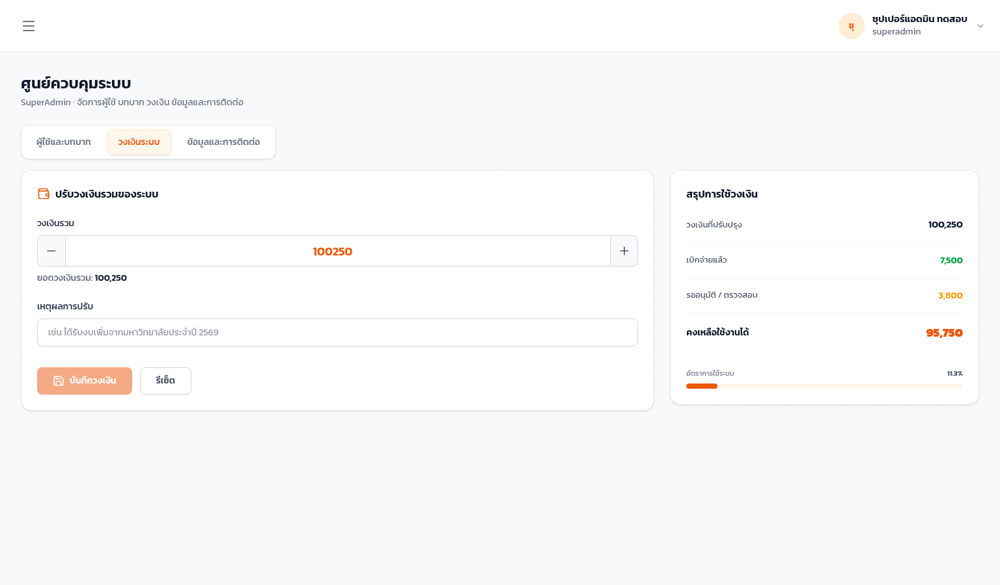

**ผลลัพธ์:** ระบบแสดง **บันทึกวงเงินสำเร็จ** และบันทึกส่วนต่างเป็นรายการเพิ่มหรือลดเงินในบัญชีกองทุน
รายการที่บันทึกแล้วแก้ไขหรือลบไม่ได้ หากกรอกผิด ให้ปรับวงเงินอีกครั้งเพื่อแก้ยอด

> **หมายเหตุ:** ลดวงเงินได้ไม่เกินเงินที่ยังไม่ถูกกันไว้ให้คำร้องที่ยังไม่โอนเงิน
> หากลดมากกว่านั้น ระบบไม่บันทึก และแสดง **เกิดข้อขัดแย้ง กรุณาลองใหม่**

### 7.5 บัญชีรับชำระและข้อมูลติดต่อ

**วัตถุประสงค์:** แก้ไขบัญชีธนาคารที่นักศึกษาใช้ชำระเงินคืน และข้อมูลติดต่อเจ้าหน้าที่

**ขั้นตอน:**

1. ในหน้า **ศูนย์ควบคุมระบบ** คลิกแท็บ **ข้อมูลและการติดต่อ**
2. ในส่วน **ข้อมูลธนาคาร** เลือก **ชื่อธนาคาร** กรอก **ชื่อเลขบัญชี / ชื่อบัญชี** และ **หมายเลขบัญชี**
   กรอกหมายเลขบัญชี 10 หลัก ระบบใส่เครื่องหมาย - ให้อัตโนมัติ (xxx-x-xxxxx-x)
   หากไม่มีธนาคารในรายการ เลือก **ธนาคารอื่นๆ** แล้วพิมพ์ชื่อธนาคาร
3. ในส่วน **ที่อยู่และการติดต่อ** กรอก **จุดติดต่อเจ้าหน้าที่ (ภาษาไทย)**, **Contact Location (English)** (ไม่บังคับ),
   **เบอร์โทรศัพท์หลัก**, **เบอร์ต่อภายใน (Ext.)** และ **อีเมลติดต่อทางการ** ช่องที่มีเครื่องหมาย * ต้องกรอก
4. คลิก **บันทึกข้อมูล**

   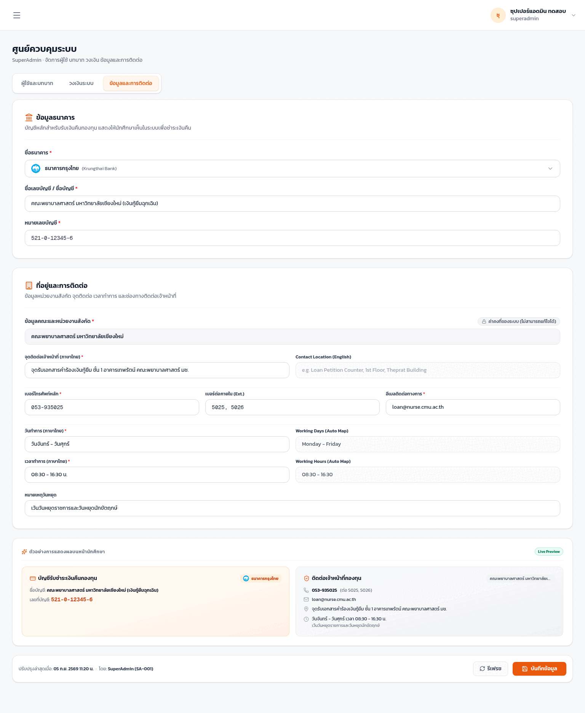

**ผลลัพธ์:** ระบบแสดง **บันทึกข้อมูลและการติดต่อเรียบร้อยแล้ว**
หลังแก้ไขข้อมูล ปุ่ม **คืนค่าเดิม** แสดงขึ้น คลิกเพื่อยกเลิกการแก้ไขที่ยังไม่บันทึก คลิก **รีเฟรช** เพื่อโหลดข้อมูลล่าสุด

> **หมายเหตุ:** เวลาทำการและวันหยุดที่นักศึกษาเห็นเป็นค่าคงที่ของระบบ (วันจันทร์ - วันศุกร์ เวลา 08:30 - 16:30 น.)
> หน้านี้แก้ไขไม่ได้
> ข้อมูลธนาคาร จุดติดต่อ เบอร์โทรศัพท์ และอีเมล บันทึกในระบบและทุกคนเห็น

---

## 8. ข้อความผิดพลาด

| ข้อความ | ความหมาย | วิธีแก้ |
|---|---|---|
| กรุณาระบุความเห็นประกอบการพิจารณา | กดยืนยันอนุมัติหรือส่งพิจารณาโดยไม่กรอกความเห็น | กรอกความเห็น |
| กรุณาระบุสิ่งที่ต้องการให้นักศึกษาแก้ไข | กดยืนยันส่งกลับแก้ไขโดยไม่กรอกความเห็น | กรอกสิ่งที่ต้องแก้ไข |
| กรุณาระบุเหตุผลที่ไม่อนุมัติ / กรุณาระบุเหตุผลในการยกเลิกคำร้อง | กดยืนยันไม่อนุมัติโดยไม่กรอกเหตุผล | กรอกเหตุผล |
| ผู้บริหารส่งกลับมาแก้ไข กรุณาปรับลดวงเงินก่อนส่งพิจารณาใหม่ | คำร้องที่ผู้บริหารส่งกลับยังไม่ได้ปรับลดวงเงิน | ปรับลดวงเงิน (หัวข้อ 5.3) |
| กรุณาระบุวงเงินที่มากกว่า 0 บาท | วงเงินใหม่เป็น 0 หรือว่าง | กรอกวงเงินใหม่ |
| ไม่สามารถปรับวงเงินมากกว่าที่ขอได้ (สูงสุด ...) | วงเงินใหม่มากกว่าจำนวนที่นักศึกษาขอ | กรอกวงเงินไม่เกินจำนวนที่ขอ |
| ไม่สามารถระบุวงเงินเกินวงเงินระบบ (สูงสุด ...) | วงเงินใหม่เกิน 500,000 บาท (ค่าคงที่ของหน้าจอ ไม่ใช่วงเงินระบบในหัวข้อ 7.4) | กรอกวงเงินไม่เกิน 500,000 บาท และไม่เกินจำนวนที่นักศึกษาขอ |
| The request was already decided / The request changed; please retry | ผู้ใช้อื่นดำเนินการคำร้องนี้ไปก่อน หรือสถานะคำร้องเปลี่ยน หน้าจอแสดงข้อความภาษาอังกฤษจากระบบ ข้อความภาษาไทย **คำร้องนี้ได้รับการพิจารณาไปแล้ว หรือเกิดข้อขัดแย้ง** เป็นข้อความสำรองเมื่อระบบไม่ส่งข้อความมา | ปิดหน้าต่าง แล้วโหลดหน้าใหม่ |
| คำร้องนี้ถูกดำเนินการไปแล้ว หรือเกิดข้อขัดแย้ง | ข้อความสำรองของหน้าเบิกจ่าย เมื่อระบบไม่ส่งข้อความมา ปกติหน้าจอแสดงข้อความภาษาอังกฤษในแถวถัดไป | โหลดหน้าใหม่ แล้วตรวจสอบสถานะ |
| Unsupported slip file type | ไฟล์สลิปเบิกจ่ายไม่ใช่รูปภาพที่ระบบรับ (เช่น PDF, SVG, HEIC) | เลือกไฟล์รูปภาพ JPG หรือ PNG ใหม่ |
| Slip file exceeds the 1MB limit | ไฟล์สลิปเบิกจ่ายใหญ่เกิน 1 MB | ลดขนาดรูปหรือถ่ายภาพหน้าจอใหม่ แล้วเลือกไฟล์ใหม่ |
| A slip file is required | กดยืนยันโดยไม่มีไฟล์สลิป หรือไฟล์ว่าง | เลือกไฟล์รูปสลิป |
| Insufficient fund balance for this disbursement | ยอดเงินในกองทุนน้อยกว่าจำนวนที่อนุมัติ | ให้ผู้ดูแลระบบสูงสุดเพิ่มวงเงินรวม (หัวข้อ 7.4) แล้วเบิกจ่ายอีกครั้ง |
| The loan is no longer awaiting disbursement / The loan was already disbursed / The request changed; please retry | ผู้ดูแลระบบอื่นเบิกจ่ายคำร้องนี้ไปก่อน หรือสถานะคำร้องเปลี่ยน | โหลดหน้าใหม่ แล้วตรวจสอบสถานะ |
| เกิดข้อผิดพลาดในการโหลดหน้า / ระบบพบข้อผิดพลาดที่ไม่คาดคิด กรุณาลองใหม่อีกครั้ง | หน้าเว็บทำงานผิดพลาด | คลิก **ลองใหม่อีกครั้ง** หรือ **กลับสู่หน้าหลัก** |
| ไม่พบข้อมูลคำร้องนี้ในระบบ | คำร้องถูกลบหรือไม่อยู่ในสิทธิ์ของท่าน | โหลดหน้าใหม่ |
| ไม่มีสิทธิ์ดำเนินการสำหรับบทบาทนี้ | บัญชีของท่านไม่มีสิทธิ์ของบทบาทนี้แล้ว | ติดต่อผู้ดูแลระบบสูงสุด |
| กรุณาเข้าสู่ระบบใหม่ (Session หมดอายุ) | ช่วงการเข้าสู่ระบบหมดอายุ | เข้าสู่ระบบใหม่ |
| รายการชำระเงินนี้ถูกบันทึกเข้ากองทุนแล้ว | สลิปนี้ถูกยืนยันและบันทึกในบัญชีกองทุนแล้ว | โหลดหน้าใหม่ ไม่ต้องยืนยันซ้ำ |
| สลิปนี้ได้รับการตรวจสอบไปแล้ว | มีผู้อื่นอนุมัติหรือปฏิเสธสลิปนี้ไปก่อน | โหลดหน้าใหม่ แล้วตรวจสอบสถานะสลิป |
| ข้อมูลคำร้องมีการเปลี่ยนแปลง กรุณาลองใหม่อีกครั้ง | คำร้องหรือสิทธิ์ของท่านเปลี่ยนระหว่างตรวจสลิป | โหลดหน้าใหม่ แล้วลองอีกครั้ง |
| คำร้องนี้ไม่อยู่ในสถานะที่รับชำระเงินได้ | คำร้องของสลิปนี้ไม่ได้อยู่ระหว่างชำระคืน | โหลดหน้าใหม่ แล้วตรวจสอบสถานะคำร้อง |
| กรุณาระบุเหตุผลที่ปฏิเสธสลิป | กดยืนยันปฏิเสธสลิปโดยไม่กรอกเหตุผล | กรอก **เหตุผลที่ปฏิเสธสลิป** |
| เหตุผลต้องมีความยาวไม่เกิน 500 ตัวอักษร | เหตุผลที่ปฏิเสธสลิปยาวเกิน 500 ตัวอักษร | ย่อเหตุผล |
| ไม่พบรายการชำระเงินนี้ในระบบ | ไม่พบสลิปนี้ในระบบ | โหลดหน้าใหม่ |
| ข้อมูลที่ส่งไม่ถูกต้อง | ข้อมูลที่ส่งตรวจสลิปไม่ถูกต้อง | โหลดหน้าใหม่ แล้วลองอีกครั้ง |
| มีผู้บริหารในระบบแล้ว (...) กรุณาเปลี่ยนบทบาทผู้บริหารเดิมก่อน | ระบบมีผู้บริหารแล้ว 1 คน | ใช้ **แก้ไข** ที่แถวของผู้บริหารเพื่อเปลี่ยนตัวผู้บริหาร (หัวข้อ 7.3) ไม่ต้องเปลี่ยนบทบาทของผู้บริหารเดิม |
| ไม่สามารถยกเลิกบทบาทผู้ดูแลระบบสูงสุดคนสุดท้ายได้ | ผู้ใช้นี้เป็นผู้ดูแลระบบสูงสุดคนสุดท้าย หรือท่านเปลี่ยนบทบาทของตนเองจากผู้ดูแลระบบสูงสุด หน้าจอแสดงข้อความนี้กับการยกเลิกบทบาททุกครั้งที่ระบบตอบว่าทำไม่ได้ | ผู้ดูแลระบบสูงสุดคนสุดท้าย: ให้บทบาท **ผู้ดูแลระบบสูงสุด** แก่ผู้ใช้อื่นก่อน บทบาทของตนเอง: ให้ผู้ดูแลระบบสูงสุดคนอื่นเปลี่ยนให้ หากผู้ใช้ได้รับบทบาทเพิ่มโดยไม่ตั้งใจ แจ้งทีมพัฒนา |
| An advisor cannot also be an admin or SuperAdmin | เลือก **ผู้ดูแลระบบ** หรือ **ผู้ดูแลระบบสูงสุด** ในแถวของผู้บริหาร (ผู้บริหารเป็นอาจารย์ที่ปรึกษาด้วย) ระบบไม่เพิ่มบทบาทใด | ใช้ **แก้ไข** ที่แถวของผู้บริหารเพื่อเปลี่ยนตัวผู้บริหาร (หัวข้อ 7.3) ไม่ต้องเปลี่ยนบทบาท |
| ไม่สามารถเพิ่มบทบาทผู้ใช้ได้ / เกิดข้อผิดพลาดในการเปลี่ยนบทบาท | เปลี่ยนบทบาทไม่สำเร็จ | โหลดหน้าใหม่ แล้วลองอีกครั้ง |
| กรุณากรอกชื่อ-นามสกุล / กรุณากรอกอีเมลให้ถูกต้อง | ช่องชื่อหรืออีเมลในหน้าต่างเพิ่มหรือแก้ไขผู้ใช้ว่างหรืออีเมลผิดรูปแบบ | กรอกให้ถูกต้อง |
| กรุณากรอกชื่อ-นามสกุลภาษาอังกฤษ / กรุณาระบุชื่อ-นามสกุลภาษาอังกฤษ | ช่อง **ชื่อ-นามสกุล (ภาษาอังกฤษ)** ในหน้าต่างเพิ่มผู้ใช้งานใหม่ว่างหรือมีแต่ช่องว่าง ข้อความแรกมาจากหน้าจอ ข้อความหลังมาจากระบบ ซึ่งปกติไม่แสดงเพราะหน้าจอตรวจก่อนส่ง (ช่องชื่อภาษาอังกฤษในหน้าต่างแก้ไขข้อมูลผู้บริหารไม่บังคับ) | กรอกชื่อภาษาอังกฤษ เช่น Mr. Somchai Jaidee |
| กรุณาระบุอีเมล CMU (ลงท้ายด้วย @cmu.ac.th) | อีเมลในหน้าต่างเพิ่มหรือแก้ไขผู้ใช้ไม่ใช่อีเมล CMU | ใช้อีเมล CMU |
| อีเมลนี้มีผู้ใช้งานในระบบแล้ว | อีเมลที่เพิ่ม หรืออีเมลใหม่ของผู้บริหาร ตรงกับผู้ใช้ที่ยังมีบทบาทอยู่ หรือมีบัญชี CMU (ข้อความหน้า @) ซ้ำกับผู้ใช้อื่น | ใช้อีเมลอื่น |
| แก้ไขได้เฉพาะข้อมูลผู้บริหารเท่านั้น | ผู้ใช้ในแถวไม่ได้เป็นผู้บริหารแล้ว (เช่น รายชื่อในหน้านี้ไม่เป็นปัจจุบัน) | โหลดหน้าใหม่ แล้วแก้ไขที่แถวของผู้บริหารคนปัจจุบัน |
| ไม่สามารถลบได้ เนื่องจากต้องมีผู้ดูแลระบบสูงสุด (Super Admin) อย่างน้อย 1 คนในระบบ / ไม่สามารถลบผู้ดูแลระบบสูงสุดคนสุดท้ายได้ (ต้องมีผู้ดูแลระบบสูงสุดอย่างน้อย 1 คนในระบบ) | ผู้ใช้ที่ลบเป็นผู้ดูแลระบบสูงสุดคนสุดท้าย หรือเป็นบัญชีของท่านเอง หน้าจอแสดงข้อความหลังนี้กับการลบทุกครั้งที่ระบบตอบว่าลบไม่ได้ | ผู้ดูแลระบบสูงสุดคนสุดท้าย: เพิ่มผู้ดูแลระบบสูงสุดอีกคนก่อน บัญชีของท่านเอง: ลบเองไม่ได้ แต่งตั้งผู้ดูแลระบบสูงสุดคนใหม่ แล้วให้คนนั้นลบบัญชีของท่าน |
| ไม่สามารถลบผู้บริหารได้ กรุณาแก้ไขข้อมูลผู้บริหารแทน | พยายามลบผู้บริหาร | ใช้ **แก้ไข** |
| ไม่สามารถเพิ่มผู้ใช้งานได้ / ไม่สามารถแก้ไขข้อมูลได้ / ไม่สามารถลบผู้ใช้งานได้ | บันทึกไม่สำเร็จ | โหลดหน้าใหม่ แล้วลองอีกครั้ง |
| กรุณาระบุเหตุผลการปรับวงเงิน | คลิก **บันทึกวงเงิน** โดยไม่กรอกเหตุผล | กรอก **เหตุผลการปรับ** |
| ยอดคงเหลือไม่สามารถติดลบได้ | พบได้ยาก ปกติการลดวงเงินเกินกว่าที่กองทุนให้ลดได้จะแสดง **เกิดข้อขัดแย้ง กรุณาลองใหม่** ตามแถวถัดไป | ลดยอดที่ต้องการปรับ |
| เกิดข้อขัดแย้ง กรุณาลองใหม่ | ลดวงเงินมากกว่าเงินที่ยังไม่ถูกกันไว้ให้คำร้อง หรือมีผู้อื่นปรับวงเงินพร้อมกัน | โหลดหน้าใหม่ ลดยอดที่ต้องการปรับ แล้วลองอีกครั้ง |
| ข้อมูลไม่ถูกต้อง กรุณาตรวจสอบจำนวนเงินและเหตุผล | จำนวนเงินหรือเหตุผลไม่ถูกต้อง | ตรวจสอบ **วงเงินรวม** และ **เหตุผลการปรับ** |
| ไม่สามารถโหลดข้อมูลวงเงินได้ กรุณาตรวจสอบการเชื่อมต่อ API | โหลดข้อมูลวงเงินไม่สำเร็จ | โหลดหน้าใหม่ |
| กรุณากรอกข้อมูลให้ครบถ้วนและถูกต้อง | ช่องที่ต้องกรอกในแท็บ **ข้อมูลและการติดต่อ** ว่างหรือไม่ถูกต้อง | แก้ไขช่องที่ระบบแสดงข้อความสีแดง |
| กรุณากรอกหมายเลขบัญชีในรูปแบบ xxx-x-xxxxx-x | หมายเลขบัญชีไม่ใช่ตัวเลข 10 หลักในรูปแบบ xxx-x-xxxxx-x | กรอกตัวเลข 10 หลัก ระบบใส่เครื่องหมาย - ให้เอง |
| ไม่สามารถโหลดข้อมูลและการติดต่อได้ กรุณาลองใหม่อีกครั้ง | โหลดข้อมูลติดต่อไม่สำเร็จ | คลิก **ลองใหม่อีกครั้ง** |
| เกิดข้อผิดพลาดในการบันทึกข้อมูล / เกิดข้อผิดพลาดในการส่งข้อมูล | ข้อผิดพลาดอื่น | ลองใหม่ หากยังไม่ได้ แจ้งผู้ดูแลระบบสูงสุด |

---

## ประวัติเอกสาร

| ฉบับ | วันที่ | รายละเอียด |
|---|---|---|
| 0.1 | 2026-09-29 | ฉบับร่างแรก เขียนจากซอร์สโค้ดและระบบทดสอบ มีภาพหน้าจอ 34 ภาพ |
| 0.2 | 2026-09-29 | เพิ่มหัวข้อ 7 ผู้ดูแลระบบระดับสูง และข้อความผิดพลาดของหน้าตั้งค่าระบบ ภาพหน้าจอเพิ่ม 5 ภาพ |
| 0.3 | 2026-09-29 | ปรับข้อความตามซอร์สโค้ดล่าสุด: การแบ่งหน้าตาราง หัวข้อ 7.3 เพิ่ม แก้ไข ลบผู้ใช้ หน้านักศึกษาในความดูแลของอาจารย์ที่ปรึกษาและผู้บริหาร กฎไฟล์สลิปเบิกจ่าย (รูปภาพ ไม่เกิน 1 MB) และข้อความผิดพลาด |
| 0.4 | 2026-09-29 | หัวข้อ 7.3: อีเมลของผู้ใช้ที่เพิ่มหรือแก้ไขต้องเป็นอีเมล CMU ลบบัญชีของตนเองไม่ได้ และผู้ใช้ที่มีประวัติการทำรายการถูกยกเลิกเฉพาะบทบาท |
| 0.5 | 2026-09-30 | ถ่ายภาพหน้าจอใหม่ 7 ภาพ: หน้าเข้าสู่ระบบ เมนูของอาจารย์ที่ปรึกษาและผู้ดูแลระบบระดับสูง หน้านักศึกษาในความดูแลของอาจารย์ที่ปรึกษาและผู้บริหาร กรอบแนบสลิปเบิกจ่าย และหน้าผู้ใช้และบทบาท |
| 0.6 | 2026-09-30 | ปรับหัวข้อ 7.3 ตามซอร์สโค้ดล่าสุด: การลบผู้ใช้ยกเลิกเฉพาะบทบาทและไม่ลบบัญชี ลบบัญชีของตนเองไม่ได้ ระบบไม่ยอมยกเลิกบทบาทผู้บริหาร การเปลี่ยนตัวผู้บริหารทำที่ **แก้ไข** ด้วยอีเมลใหม่ และหัวข้อ 5.3 คำร้องที่ผู้บริหารส่งกลับแสดงเฉพาะเจ้าหน้าที่คนเดิม |
| 0.7 | 2026-09-30 | ถ่ายภาพหน้าจอใหม่ทั้งหมด 39 ภาพ จากโค้ดของวันที่ 2026-09-30 หลังปรับหน้าจอเจ้าหน้าที่ (แถบตัวกรอง เมนู โลโก้) และแก้ข้อความให้ตรงกับหน้าจอ: ชื่อหน้าของผู้ดูแลระบบระดับสูง ข้อความเมื่อดำเนินการเสร็จ ปุ่มแนบสลิปเบิกจ่าย (**ดูรูปแบบเต็ม**, **ยืนยันการโอนเงิน**, ข้อความ 1MB) ชื่อ **ประวัติหลักฐานการชำระ** และตัวเลือกบทบาทของหน้าผู้ใช้และบทบาท |
| 0.8 | 2026-10-01 | ระบบไม่ส่งอีเมลถึงนักศึกษาเมื่อโอนเงินหรือตรวจสลิป (หัวข้อ 5.4 และ 5.5) หัวข้อ 7.3 นักศึกษาไม่มีบัญชีผู้ใช้ หัวข้อ 7.5 และข้อความผิดพลาดของหมายเลขบัญชี (xxx-x-xxxxx-x) ตรวจกับโค้ดของวันที่ 2026-10-01 |
| 0.9 | 2026-10-02 | แก้ตามการตรวจกับโค้ดของวันที่ 2026-10-02: หัวข้อ 1.2 สถานะ **ยกเลิกคำร้อง** หัวข้อ 2 บุคลากรคณะพยาบาลศาสตร์ ลำดับหน้าหลักเมื่อมีหลายบทบาท และปุ่มเมนู หัวข้อ 4.3 และ 6.4 ปุ่ม **ประวัติการชำระ** หัวข้อ 5.1 ชื่อกลุ่ม **คำร้องรอตรวจสอบ** หัวข้อ 5.2 ลบขั้นตอนดาวน์โหลดแบบคำร้อง (ปุ่มแสดงหลังโอนเงินแล้ว) หัวข้อ 5.4 สถานะที่นักศึกษาเห็นเมื่อยกเลิกที่หน้าเบิกจ่ายหนี้ หัวข้อ 7.3 เพิ่มผู้ใช้ แก้ไขผู้บริหารในบัญชีเดิม การลบผู้ใช้ และการเปลี่ยนบทบาทในแถวของผู้บริหาร หัวข้อ 7.5 ลบช่องวันทำการ เวลาทำการ หมายเหตุวันหยุด ข้อมูลคณะ และตัวอย่างการแสดงผลที่ไม่มีบนหน้าจอแล้ว หัวข้อ 8 ข้อความผิดพลาดของคำร้อง สลิป ผู้ใช้ และวงเงิน ภาพหน้าจอยังไม่ได้ถ่ายใหม่ (ภาพ super-05-contact.png ไม่ตรงกับหน้าจอปัจจุบัน) |
| 0.10 | 2026-10-02 | แก้ตามการตรวจกับโค้ดของวันที่ 2026-10-02: เปลี่ยนชื่อบทบาทในเนื้อหาให้ตรงกับหน้าจอ (เจ้าหน้าที่ เป็น **ผู้ดูแลระบบ** และผู้ดูแลระบบระดับสูง เป็น **ผู้ดูแลระบบสูงสุด**) ทั้งชื่อหน้าจอ สถานะ ข้อความ LINE ตัวเลือกบทบาท และข้อความผิดพลาด หัวข้อ 7.3 เพิ่มผู้ใช้ต้องกรอก **ชื่อ-นามสกุล (ภาษาอังกฤษ)** และหัวข้อ 8 เพิ่มข้อความผิดพลาดของช่องนี้ ระบบไม่เก็บและไม่แสดงเบอร์โทรศัพท์ของผู้ใช้ (เบอร์โทรศัพท์ในหัวข้อ 7.5 เป็นเบอร์ของสำนักงาน) รายการ 0.1 ถึง 0.9 ในตารางนี้ยังใช้ชื่อบทบาทเดิม ถ่ายภาพหน้าจอใหม่ทั้งหมดจากโค้ดล่าสุด และตรวจข้อความกับภาพหน้าจอเมื่อ 2026-10-02 (เพิ่มลำดับปุ่มผลการพิจารณาบนหน้าจอและสถานะ **อยู่ระหว่างผ่อนชำระ**) |
| 0.11 | 2026-10-02 | หัวข้อ 6.1 เพิ่มการ์ด **เงินที่อยู่ระหว่างดำเนินการ** ในหน้าหลักของผู้บริหาร (จากโค้ดของวันที่ 2026-10-02) ภาพ exec-01-dashboard.png ยังไม่ได้ถ่ายใหม่ จึงยังไม่มีการ์ดนี้ |
