# คู่มือการใช้งานระบบ Me_Tang สำหรับนักศึกษา

ระบบที่ครอบคลุม: Me_Tang 0.1.0
ฉบับเอกสาร: 0.5 ฉบับร่าง (Jira NAT-236)
วันที่: 2026-09-30

> ภาพหน้าจอทั้งหมดถ่ายจากระบบทดสอบที่ใช้ข้อมูลสมมติ ชื่อ รหัส และเลขบัญชีในภาพไม่ใช่ข้อมูลจริง
> `[ต้องตรวจสอบ: ...]` คือข้อความที่ต้องยืนยันกับระบบจริงก่อนส่งมอบ

---

## 1. เกี่ยวกับคู่มือนี้

คู่มือนี้อธิบายวิธีใช้ระบบ Me_Tang สำหรับนักศึกษาคณะพยาบาลศาสตร์ มหาวิทยาลัยเชียงใหม่
ใช้เมื่อต้องการยื่นคำร้องกู้ยืมเงินทุนสวัสดิการ ติดตามผล และชำระเงินคืน

ข้อความ **ตัวหนา** คือชื่อปุ่ม ชื่อช่อง หรือข้อความบนหน้าจอ ตรงตามที่ระบบแสดง

### 1.1 ภาพรวมขั้นตอน

1. นักศึกษายื่นคำร้องกู้ยืม (หัวข้อ 3)
2. อาจารย์ที่ปรึกษาพิจารณา
3. เจ้าหน้าที่ตรวจสอบเอกสาร
4. ผู้บริหารพิจารณาอนุมัติ
5. เจ้าหน้าที่โอนเงินเข้าบัญชีของนักศึกษา
6. นักศึกษายืนยันการรับเงิน (หัวข้อ 7)
7. นักศึกษาชำระเงินคืนเป็นงวด และส่งหลักฐานการโอนเงิน (หัวข้อ 8)

ในขั้นที่ 2 และ 3 ผู้พิจารณาส่งคำร้องกลับให้นักศึกษาแก้ไขได้ (หัวข้อ 5)
ผู้พิจารณาทุกขั้นไม่อนุมัติคำร้องได้

### 1.2 ข้อกำหนดสำคัญ

- นักศึกษามีคำร้องที่กำลังดำเนินการได้ครั้งละ 1 คำร้องเท่านั้น
- จำนวนงวดการชำระเลือกได้ 1, 2 หรือ 3 งวด
- เลขที่บัญชีธนาคารต้องมี 10 หลัก
- หลักฐานการชำระเงินต้องเป็นไฟล์ JPG หรือ PNG ขนาดไม่เกิน 1 MB
- ต้องชำระงวดก่อนหน้าให้ครบก่อน จึงจะชำระงวดถัดไปได้

---

## 2. เข้าสู่ระบบ

**วัตถุประสงค์:** เข้าใช้งานระบบด้วยบัญชี CMU

**สิ่งที่ต้องมี:** CMU Account ของนักศึกษาคณะพยาบาลศาสตร์

**ขั้นตอน:**

1. เปิดเว็บไซต์ระบบ
2. คลิก **เข้าสู่ระบบด้วย CMU Account**
3. ลงชื่อเข้าใช้ด้วย CMU Account ในหน้าของ Microsoft

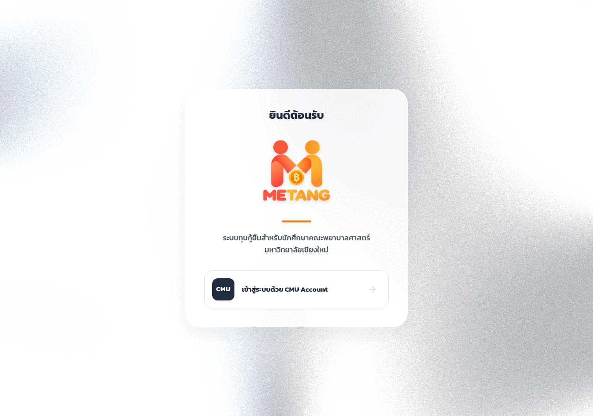

**ผลลัพธ์:** ระบบแสดงหน้าหลักของนักศึกษา พร้อมคำทักทาย **สวัสดี** และชื่อของนักศึกษา

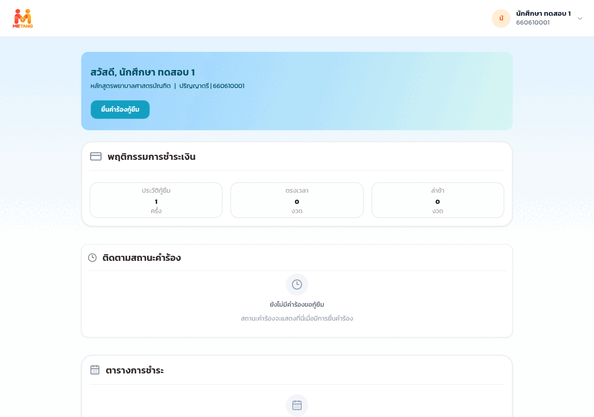

### 2.1 เปลี่ยนภาษาและออกจากระบบ

เมื่อเข้าระบบครั้งแรก ระบบเลือกภาษาเริ่มต้นจากรหัสนักศึกษา บางรหัสจะเห็นหน้าจอเป็นภาษาอังกฤษ
คู่มือนี้ใช้ชื่อปุ่มภาษาไทย หากหน้าจอเป็นภาษาอังกฤษ ให้เปลี่ยนเป็น **ไทย** ตามขั้นตอนด้านล่าง

1. คลิกชื่อของนักศึกษาที่มุมขวาบน
2. ที่ **Language** คลิก **ไทย** หรือ **EN** ระบบจำภาษาที่เลือกไว้ในเบราว์เซอร์นี้
3. คลิก **ออกจากระบบ** เพื่อออกจากระบบ

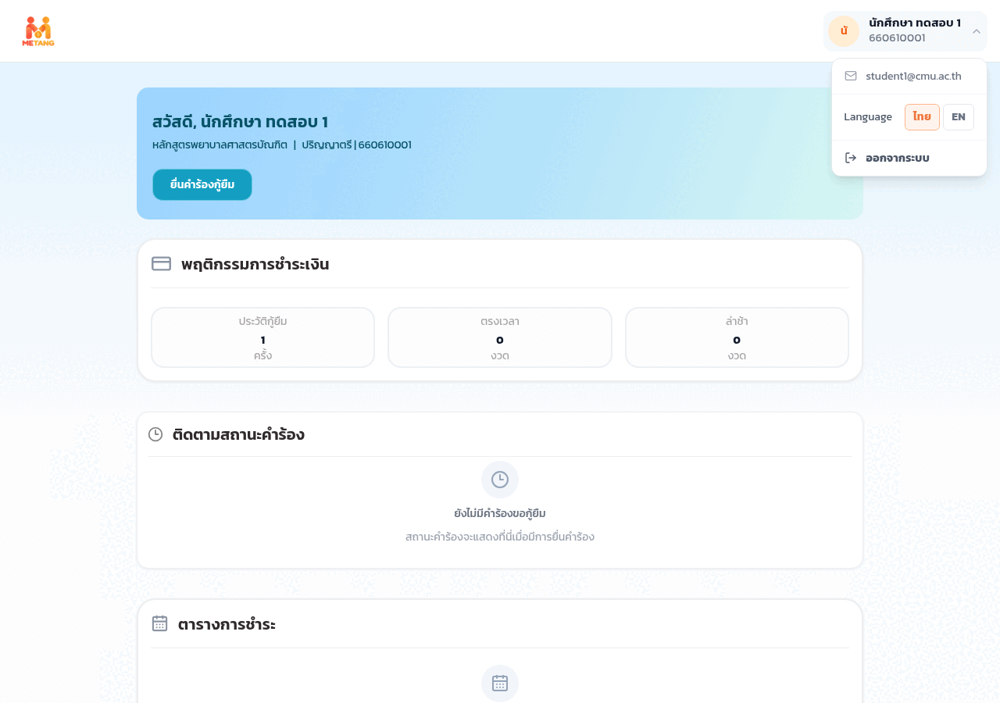

### 2.2 ข้อความผิดพลาดขณะเข้าสู่ระบบ

| ข้อความ | ความหมาย | วิธีแก้ |
|---|---|---|
| การเข้าสู่ระบบถูกยกเลิก | ยกเลิกในหน้าของ Microsoft | เข้าสู่ระบบใหม่ |
| คำขอเข้าสู่ระบบหมดอายุหรือไม่ถูกต้อง กรุณาลองใหม่ | อยู่ในหน้าของ Microsoft นานเกินไป หรือเปิดลิงก์เก่า | คลิก **เข้าสู่ระบบด้วย CMU Account** ใหม่ |
| ข้อมูลตอบกลับจาก CMU ไม่ครบถ้วน กรุณาลองใหม่ | CMU ส่งข้อมูลกลับมาไม่ครบ | เข้าสู่ระบบใหม่ |
| ไม่สามารถยืนยันการเข้าสู่ระบบกับ CMU ได้ | ติดต่อระบบของ CMU ไม่สำเร็จ | รอสักครู่แล้วลองใหม่ |
| เข้าสู่ระบบสำเร็จ แต่ไม่สามารถอ่านข้อมูลบัญชี CMU ได้ | ระบบอ่านข้อมูลบัญชีจาก CMU ไม่ได้ | รอสักครู่แล้วลองใหม่ |
| ระบบนี้อนุญาตให้นักศึกษาปริญญาตรี ภาคปกติ คณะพยาบาลศาสตร์ หรือบุคลากรคณะพยาบาลศาสตร์เท่านั้น | บัญชีนี้ไม่มีสิทธิ์ใช้ระบบ | ติดต่อเจ้าหน้าที่กองทุน (หัวข้อ 11) |
| เกิดข้อผิดพลาดระหว่างเข้าสู่ระบบ กรุณาลองใหม่ | ข้อผิดพลาดอื่น | ลองใหม่ หากยังไม่ได้ ติดต่อเจ้าหน้าที่ |

---

## 3. ยื่นคำร้องกู้ยืม

**วัตถุประสงค์:** ส่งคำร้องขอกู้ยืมเงินให้อาจารย์ที่ปรึกษาพิจารณา

**สิ่งที่ต้องมี:**

- ไม่มีคำร้องอื่นที่กำลังดำเนินการอยู่
- ข้อมูลบัญชีธนาคารของนักศึกษาสำหรับรับเงิน: ธนาคาร เลขที่บัญชี 10 หลัก และชื่อบัญชี

**ขั้นตอน:**

1. ที่หน้าหลัก คลิก **ยื่นคำร้องกู้ยืม**
2. ระบบแสดง **ขั้นตอนที่ 1: ยืนยันข้อตกลงการกู้ยืม** อ่านข้อกำหนดและเงื่อนไขทั้งหมด

   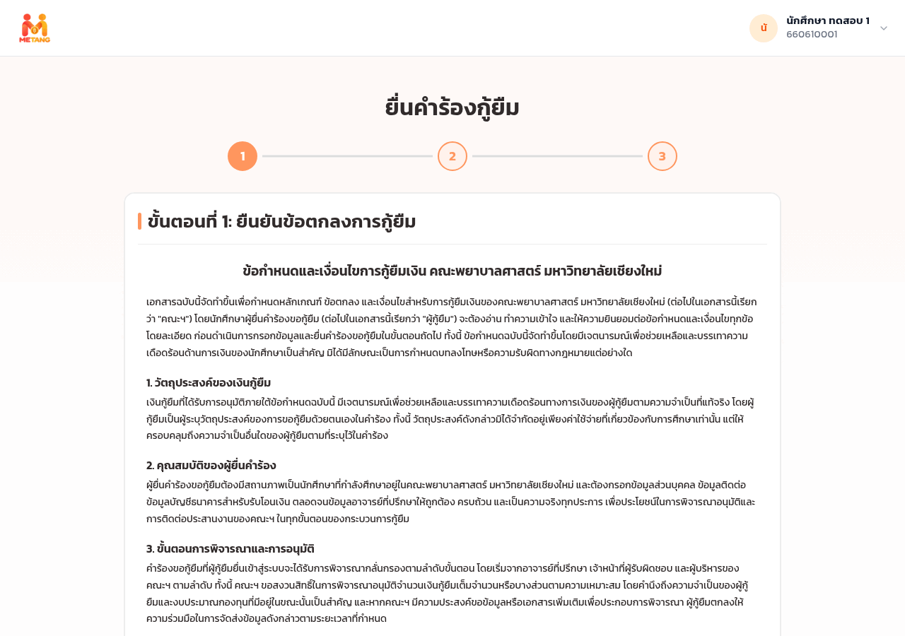

3. เลื่อนหน้าจอลงจนสุด ช่องยอมรับข้อตกลงจะเลือกได้เมื่อเลื่อนถึงท้ายหน้าเท่านั้น
4. เลือกช่องยอมรับข้อตกลง แล้วคลิก **ถัดไป**

   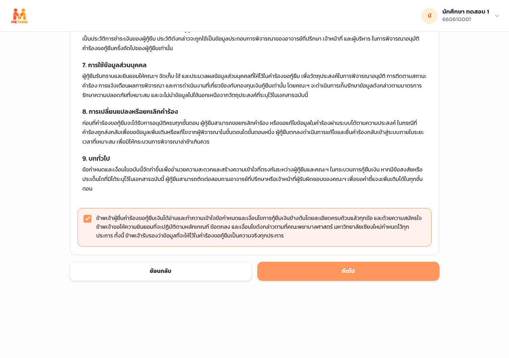

5. ระบบแสดง **ขั้นตอนที่ 2: กรอกข้อมูลการกู้ยืม** ตรวจสอบ **ข้อมูลนักศึกษา** ที่ระบบแสดงให้
   ได้แก่ ชื่อ-นามสกุล รหัสนักศึกษา หลักสูตร และระดับการศึกษา
6. กรอกข้อมูลต่อไปนี้
   - **ชั้นปีการศึกษา**
   - **อาจารย์ที่ปรึกษา**
   - **เบอร์โทรศัพท์**: เบอร์มือถือ 10 หลัก หรือเบอร์บ้าน 9 หลัก ระบบกรอกเบอร์เดิมให้ถ้ามี
   - **ธนาคาร**, **เลขที่บัญชีธนาคาร** (10 หลัก ระบบใส่เครื่องหมาย - ให้อัตโนมัติในรูปแบบ xxx-x-xxxxx-x) และ **ชื่อบัญชีธนาคาร**
   - **วัตถุประสงค์การกู้ยืม**: ไม่เกิน 500 ตัวอักษร
   - **จำนวนเงินที่ขอกู้ยืม**: จำนวนเต็มบาท ไม่เกินวงเงินที่ใช้ได้
   - **จำนวนงวดการชำระ**: คลิก **1 งวด**, **2 งวด** หรือ **3 งวด**
     **ตารางการชำระ** ด้านล่างแสดงยอดและวันครบกำหนดของแต่ละงวด

   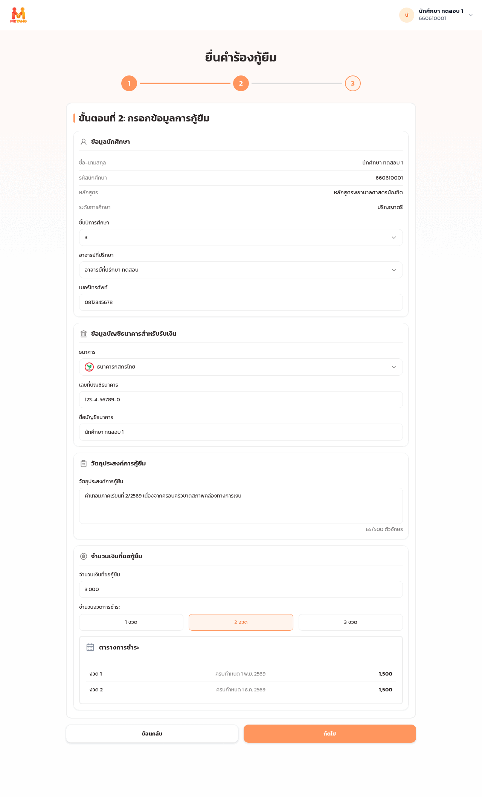

7. คลิก **ถัดไป** ระบบแสดงหน้าต่าง **ยืนยันข้อมูลการกู้ยืม**

> **คำเตือน:** ตรวจสอบเลขที่บัญชีธนาคารให้ถูกต้องก่อนยืนยัน เจ้าหน้าที่โอนเงินเข้าบัญชีนี้

8. ตรวจสอบข้อมูลทั้งหมด แล้วคลิก **ยืนยัน** หากต้องการแก้ไข คลิก **ยกเลิก**

   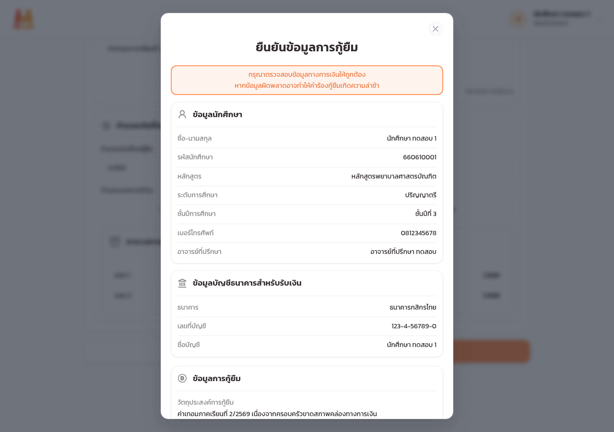

**ผลลัพธ์:** ระบบแสดง **ขั้นตอนที่ 3: รายละเอียดการกู้ยืม** พร้อมเลขที่คำร้อง
สถานะคำร้องเป็น **รออาจารย์** คลิก **กลับหน้าหลัก** เพื่อกลับไปหน้าหลัก

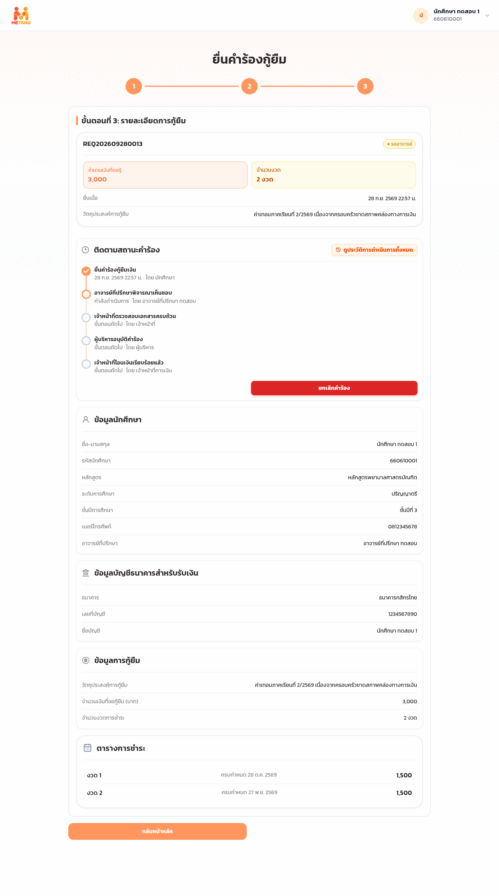

---

## 4. ติดตามสถานะคำร้อง

**วัตถุประสงค์:** ดูว่าคำร้องอยู่ขั้นใด และอ่านความคิดเห็นของผู้พิจารณา

**ขั้นตอน:**

1. เข้าสู่ระบบ หน้าหลักแสดงคำร้องปัจจุบัน สถานะ และ **ติดตามสถานะคำร้อง**
2. คลิก **ดูรายละเอียดคำร้อง** เพื่อเปิดหน้ารายละเอียดของคำร้อง
3. คลิก **ดูประวัติการดำเนินการทั้งหมด** เพื่อดูทุกการดำเนินการ พร้อมวันเวลาและผู้ดำเนินการ
4. ดูคำร้องเก่าได้ที่ **ประวัติคำร้องกู้ยืม** คลิก **ดูประวัติคำร้องทั้งหมด** เพื่อแสดงทุกคำร้อง
   คลิกคำร้องเพื่อเปิดหน้ารายละเอียด คำร้องที่ชำระครบแล้วแสดง **ชำระแล้ว** พร้อมยอดที่ชำระ

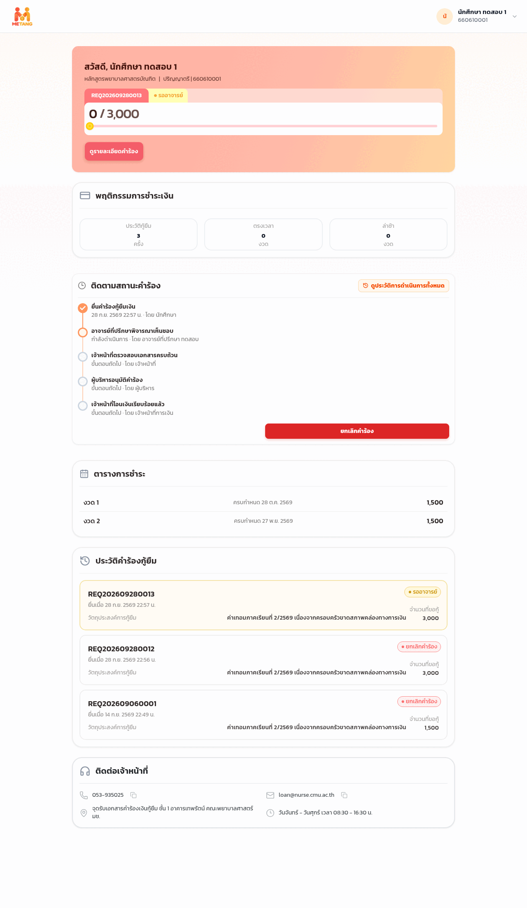

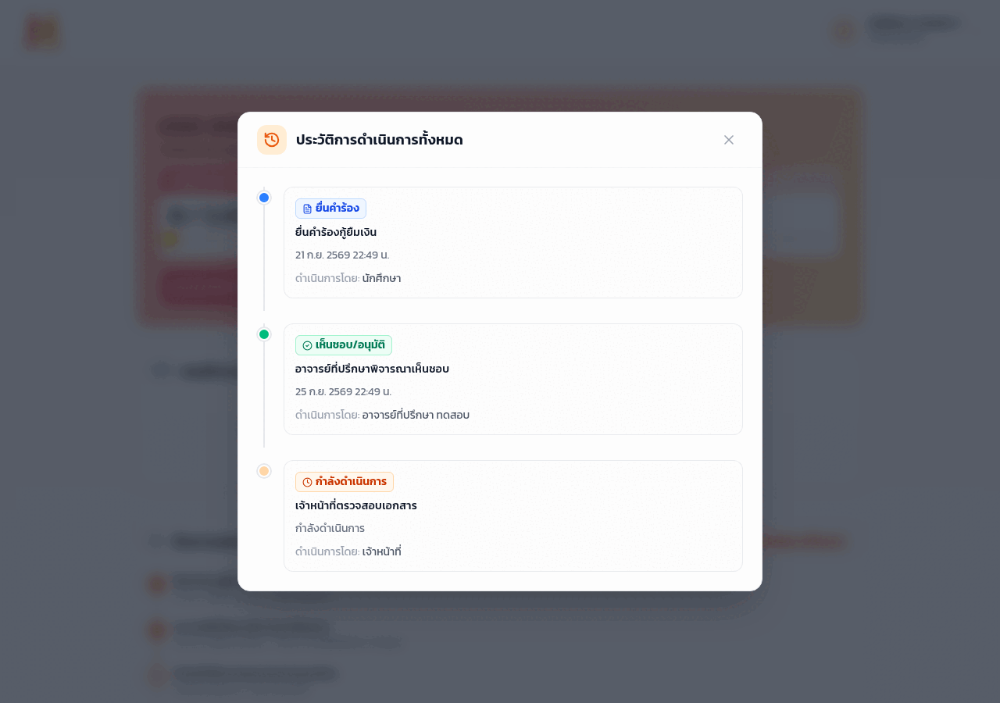

### 4.1 ความหมายของสถานะ

| สถานะ | ความหมาย | สิ่งที่นักศึกษาต้องทำ |
|---|---|---|
| รออาจารย์ | รออาจารย์ที่ปรึกษาพิจารณา | รอผล |
| รอเจ้าหน้าที่ | รอเจ้าหน้าที่ตรวจสอบเอกสาร | รอผล |
| รอผู้บริหาร | รอผู้บริหารพิจารณาอนุมัติ | รอผล |
| แก้ไขเอกสาร | คำร้องถูกส่งกลับให้แก้ไข | แก้ไขและยื่นใหม่ (หัวข้อ 5) |
| รอยืนยันการโอนเงิน | ผู้บริหารอนุมัติแล้ว รอเจ้าหน้าที่โอนเงิน หรือเจ้าหน้าที่โอนเงินแล้วและรอนักศึกษายืนยัน | เมื่อปุ่ม **ยืนยันการรับเงิน** แสดง ให้ตรวจสอบบัญชีและยืนยัน (หัวข้อ 7) |
| กำลังชำระ | ยืนยันการรับเงินแล้ว อยู่ระหว่างชำระคืน | ชำระตามงวด (หัวข้อ 8) |
| ชำระแล้ว | ชำระครบทุกงวดแล้ว | ไม่ต้องทำอะไร |
| ไม่อนุมัติโดยอาจารย์ / ไม่อนุมัติโดยเจ้าหน้าที่ / ไม่อนุมัติโดยผู้บริหาร | คำร้องไม่ได้รับการอนุมัติ | อ่าน **เหตุผลที่ไม่อนุมัติ** ในหน้ารายละเอียด ยื่นคำร้องใหม่ได้ |
| ยกเลิกคำร้อง | นักศึกษายกเลิกคำร้องแล้ว | ยื่นคำร้องใหม่ได้ |

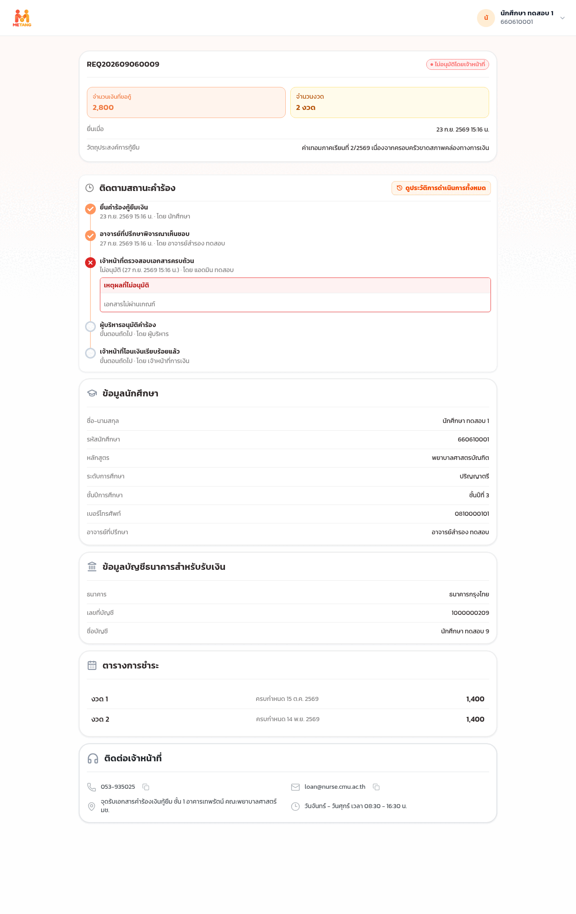

---

## 5. แก้ไขคำร้องที่ถูกส่งกลับ

**วัตถุประสงค์:** แก้ไขคำร้องตามที่ผู้พิจารณาแจ้ง แล้วส่งใหม่

**สิ่งที่ต้องมี:** คำร้องมีสถานะ **แก้ไขเอกสาร**

**ขั้นตอน:**

1. ที่หน้าหลัก ใน **ติดตามสถานะคำร้อง** อ่านข้อความจากผู้พิจารณา
   เช่น **อาจารย์ที่ปรึกษาแจ้งแก้ไข** หรือ **เจ้าหน้าที่แจ้งแก้ไข**
2. คลิก **แก้ไขคำร้อง**

   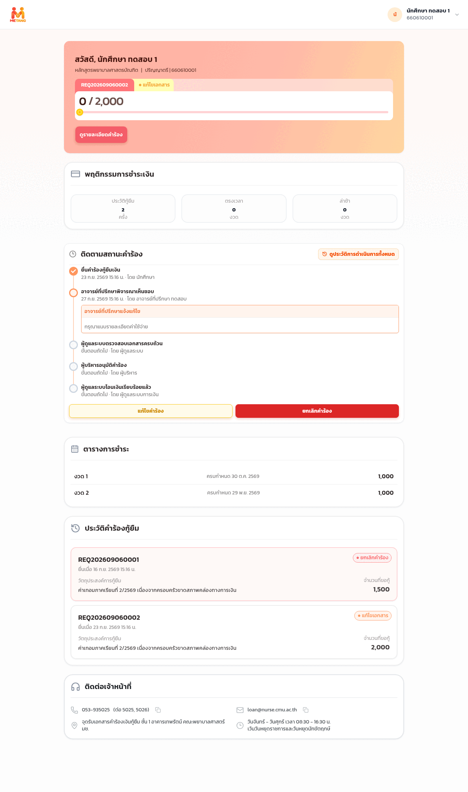

3. ระบบแสดงหน้า **แก้ไขและยื่นคำร้องกู้ยืม** ที่ขั้นตอนที่ 2 พร้อมข้อมูลเดิมและข้อความจากผู้พิจารณา
4. แก้ไขข้อมูลตามที่ได้รับแจ้ง แล้วคลิก **ถัดไป**

   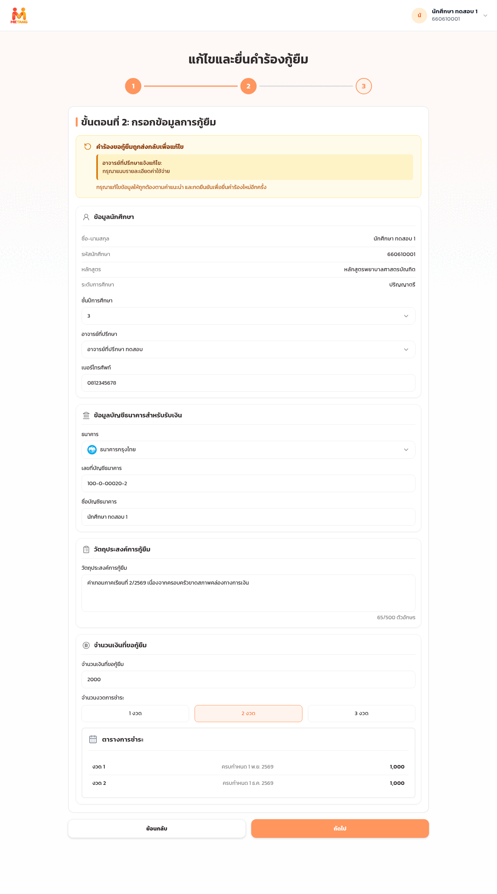

5. ในหน้าต่าง **ยืนยันการแก้ไขข้อมูลการกู้ยืม** ตรวจสอบข้อมูล แล้วคลิก **ยืนยันแก้ไข**

   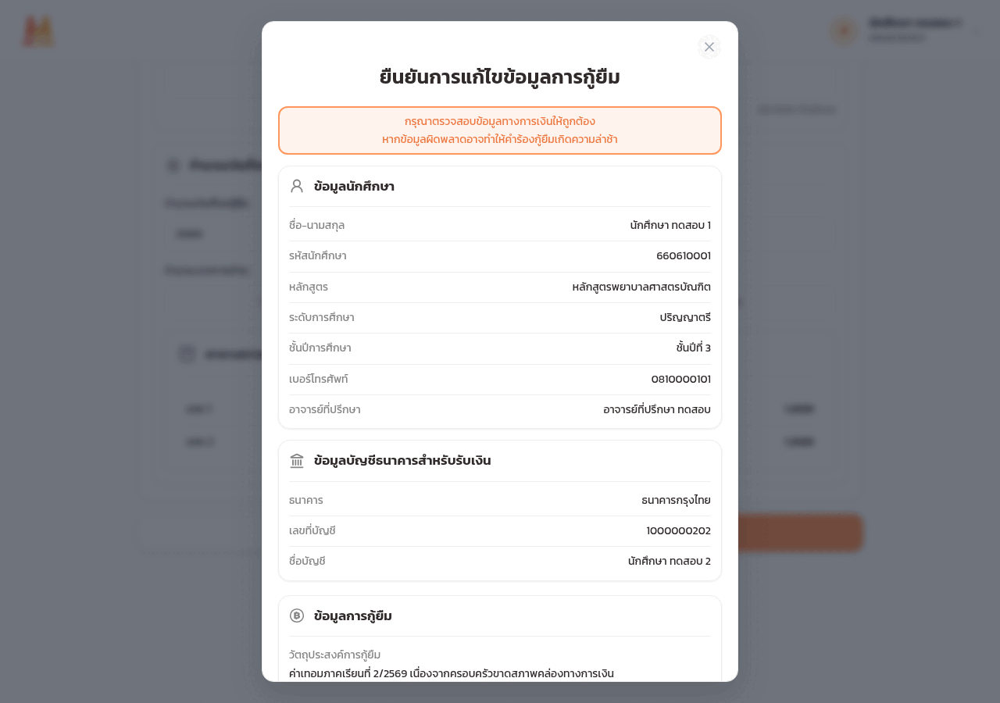

**ผลลัพธ์:** คำร้องกลับไปที่ผู้พิจารณาที่ส่งกลับ
คำร้องที่อาจารย์ที่ปรึกษาส่งกลับมีสถานะ **รออาจารย์**
คำร้องที่เจ้าหน้าที่ส่งกลับมีสถานะ **รอเจ้าหน้าที่**

---

## 6. ยกเลิกคำร้อง

**สิ่งที่ต้องมี:** ผู้บริหารยังไม่อนุมัติคำร้อง เมื่อผู้บริหารอนุมัติแล้ว ปุ่ม **ยกเลิกคำร้อง** จะไม่แสดง

> **คำเตือน:** เมื่อยกเลิกแล้ว คำร้องนี้จะไม่สามารถดำเนินการต่อได้ ต้องยื่นคำร้องใหม่

**ขั้นตอน:**

1. ที่หน้าหลัก หรือหน้ารายละเอียดคำร้อง คลิก **ยกเลิกคำร้อง**
2. ในหน้าต่าง **ยืนยันการยกเลิกคำร้อง** คลิก **ยืนยันยกเลิก** หรือคลิก **กลับ** เพื่อไม่ยกเลิก

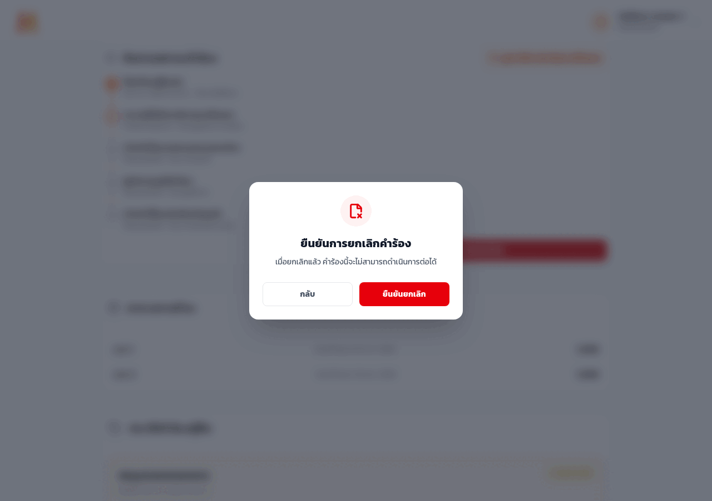

**ผลลัพธ์:** สถานะคำร้องเป็น **ยกเลิกคำร้อง** นักศึกษายื่นคำร้องใหม่ได้

---

## 7. ยืนยันการรับเงิน

**วัตถุประสงค์:** แจ้งระบบว่าได้รับเงินกู้เข้าบัญชีแล้ว เพื่อเริ่มชำระคืน

**สิ่งที่ต้องมี:** เจ้าหน้าที่โอนเงินแล้ว **ติดตามสถานะคำร้อง** แสดง **เจ้าหน้าที่โอนเงิน จำนวน ...**

> **คำเตือน:** ตรวจสอบบัญชีธนาคารก่อน หากยังไม่ได้รับเงิน อย่ายืนยัน ให้ติดต่อเจ้าหน้าที่ (หัวข้อ 11)

**ขั้นตอน:**

1. ตรวจสอบบัญชีธนาคารว่าได้รับเงินแล้ว
2. คลิก **ดูหลักฐาน** เพื่อดูสลิปการโอนเงินจากเจ้าหน้าที่
3. คลิก **ยืนยันการรับเงิน**

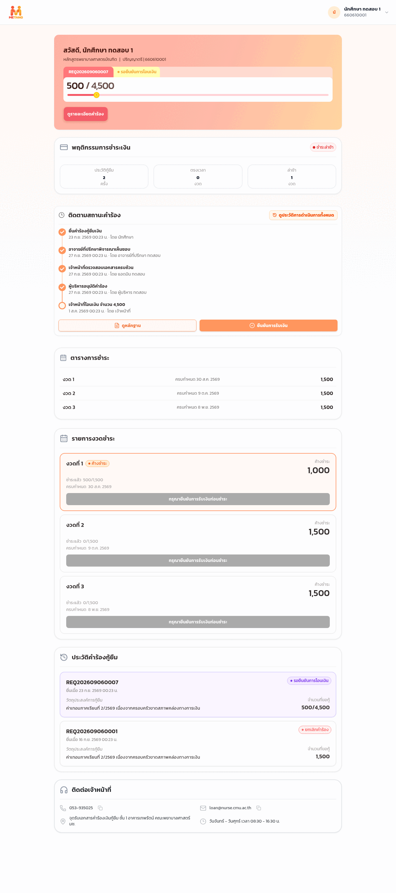

**ผลลัพธ์:** ระบบแสดง **ยืนยันการรับเงินสำเร็จ** คลิก **กลับสู่หน้าหลัก**
สถานะคำร้องเป็น **กำลังชำระ** และหน้าหลักแสดง **รายการงวดชำระ**

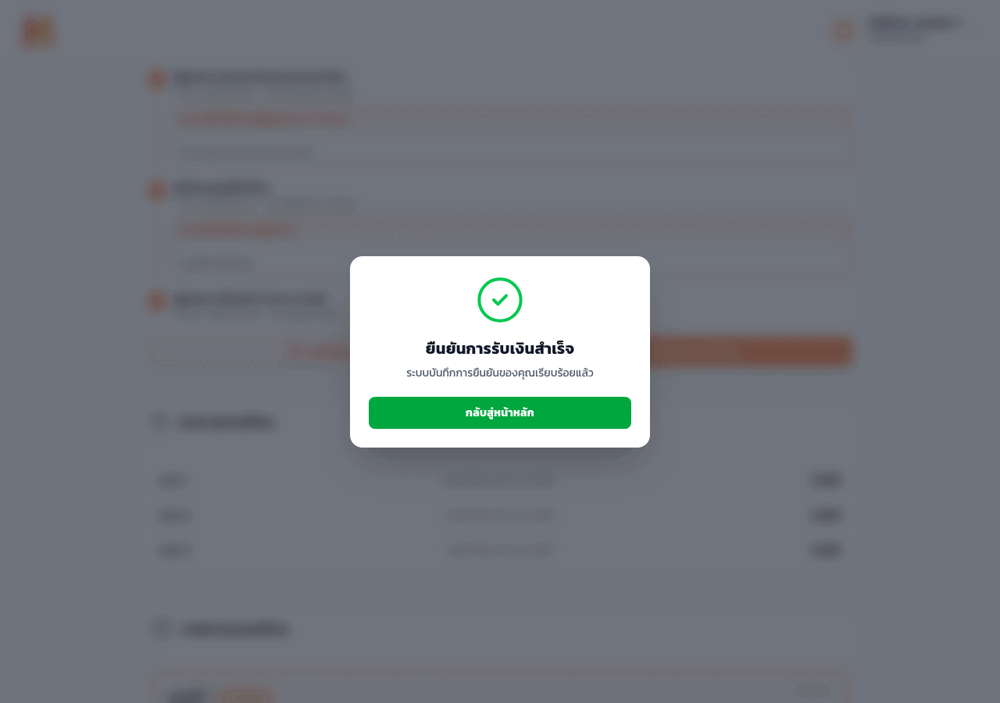

### 7.1 ดาวน์โหลดแบบคำร้อง

หลังผู้บริหารอนุมัติและเจ้าหน้าที่โอนเงินแล้ว นักศึกษาดาวน์โหลดแบบคำร้องได้ที่หน้ารายละเอียดคำร้อง
(คลิก **ดูรายละเอียดคำร้อง** ที่หน้าหลัก) เมื่อยืนยันการรับเงินแล้ว ปุ่มนี้แสดงที่ **ติดตามสถานะคำร้อง** ในหน้าหลักด้วย

1. คลิก **ดาวน์โหลดแบบคำร้อง (PDF)** ในหน้ารายละเอียดคำร้อง หรือ **ดาวน์โหลดแบบคำร้อง** ในหน้าหลัก
   ระบบแสดงหน้าต่าง **แบบขอยืมเงินทุนสวัสดิการ**
2. คลิก **ดาวน์โหลด PDF**

---

## 8. ชำระเงินคืนและส่งหลักฐาน

**วัตถุประสงค์:** ชำระงวดและส่งหลักฐานการโอนเงินให้เจ้าหน้าที่ตรวจสอบ

**สิ่งที่ต้องมี:**

- ยืนยันการรับเงินแล้ว (หัวข้อ 7)
- งวดก่อนหน้าชำระครบแล้ว
- หลักฐานการชำระครั้งก่อนตรวจสอบเสร็จแล้ว
- รูปสลิปการโอนเงิน ไฟล์ JPG หรือ PNG ขนาดไม่เกิน 1 MB

**ขั้นตอน:**

1. ที่หน้าหลัก ใน **รายการงวดชำระ** คลิก **ชำระงวดนี้ · คงเหลือ ...** ของงวดที่ต้องการ

   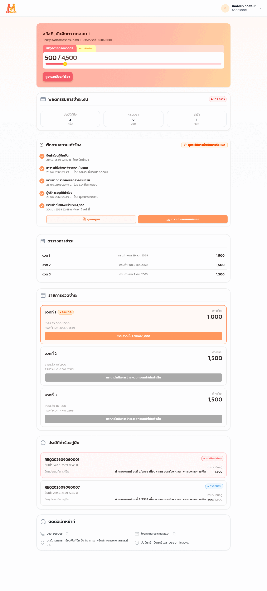

2. ระบบแสดงหน้าต่าง **ชำระงวดที่ ...** พร้อมยอด **ค้างชำระ** และ **ข้อมูลบัญชีสำหรับชำระเงิน**
3. โอนเงินเข้าบัญชีที่แสดง คลิก **คัดลอกเลขที่บัญชี** เพื่อคัดลอกเลขบัญชี
   หรือสแกน QR Code คลิก **บันทึกรูปภาพ** เพื่อบันทึก QR Code

   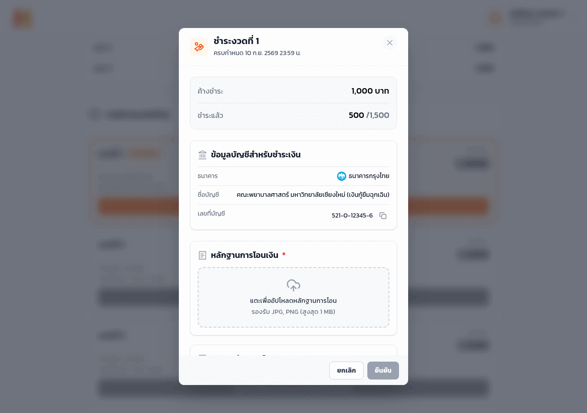

4. ที่ **หลักฐานการโอนเงิน** คลิก **แตะเพื่ออัปโหลดหลักฐานการโอน** แล้วเลือกรูปสลิป
5. ที่ **รายละเอียดการโอนเงิน** เลือก **วันที่โอน** และ **เวลาที่โอน** ตามสลิป
6. กรอก **จำนวนเงินที่โอน** เป็นจำนวนเต็มบาท
   - ถ้ายอดเกินงวดนี้ ระบบแสดง **ระบบจะนำยอดชำระส่วนเกินไปคำนวณและตัดยอดหนี้คงค้างโดยอัตโนมัติ**
   - ถ้ายอดเกินยอดหนี้คงค้างทั้งหมด ระบบแสดง
     **จำนวนเงินที่ระบุเกินยอดหนี้คงค้างทั้งหมด หากโอนเงินแล้ว โปรดติดต่อเจ้าหน้าที่เพื่อดำเนินการต่อ**
     และปุ่ม **ยืนยัน** กดไม่ได้จนกว่าจะแก้จำนวนเงินให้ไม่เกินยอดหนี้คงค้างทั้งหมด
7. คลิก **ยืนยัน**

   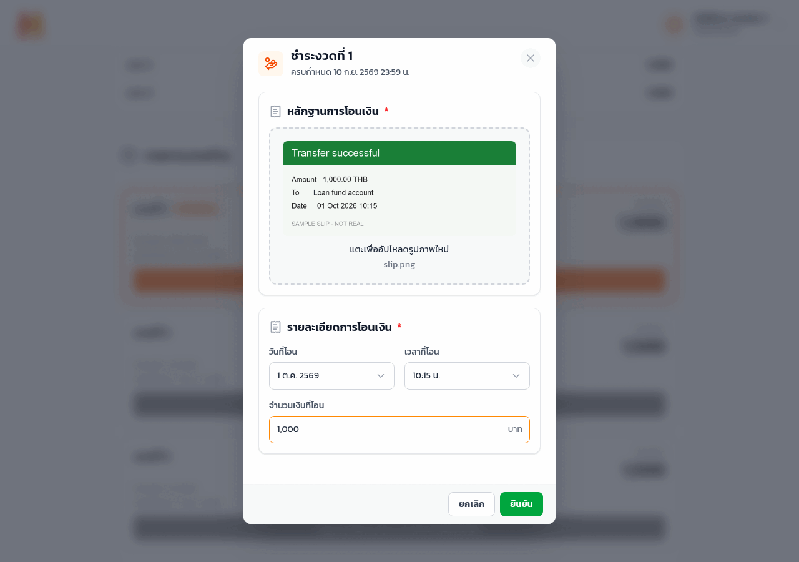

**ผลลัพธ์:** ระบบแสดง **ดำเนินการสำเร็จ!** และ **ส่งหลักฐานการชำระเงินเรียบร้อยแล้ว** คลิก **ตกลง**
งวดนั้นแสดง **รอตรวจสอบ** จนกว่าเจ้าหน้าที่ตรวจสอบ

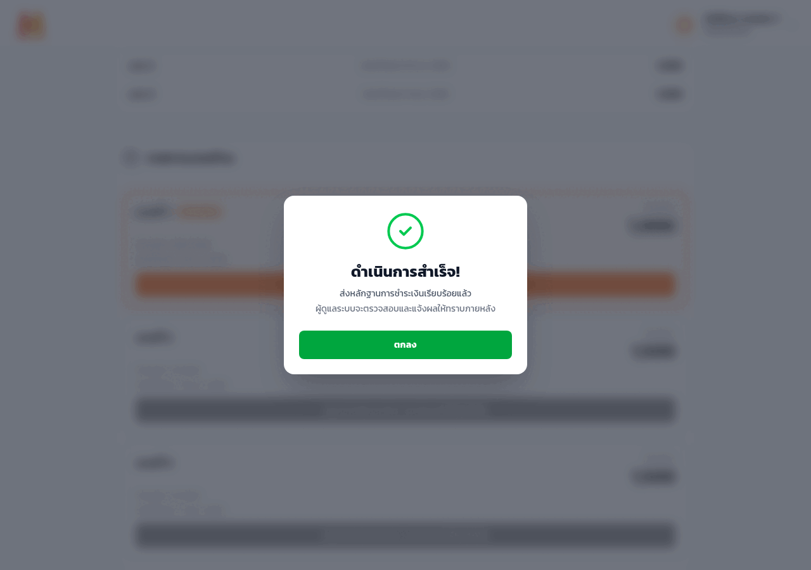

### 8.1 ดูผลการตรวจสอบหลักฐาน

1. คลิก **ดูรายละเอียดคำร้อง**
2. ดู **ประวัติหลักฐานการชำระ** ระบบแสดงจำนวนหลักฐานที่ **ผ่าน**, **ไม่ผ่าน** และ **ตรวจสอบ**
3. หลักฐานที่ **ไม่ผ่าน** แสดง **เหตุผลจากเจ้าหน้าที่** แก้ไขตามเหตุผล แล้วส่งหลักฐานใหม่ (ทำขั้นตอนในหัวข้อ 8 อีกครั้ง)

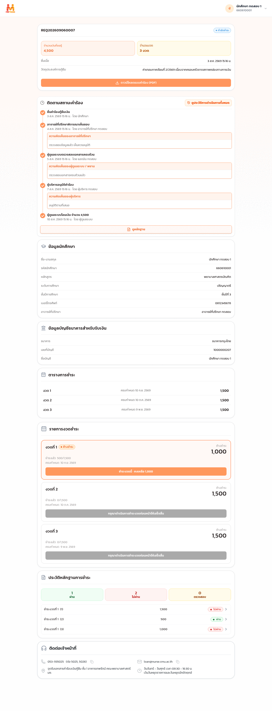

### 8.2 สถานะของงวด

ระบบแสดงสถานะที่งวดที่ชำระแล้วและงวดที่ถึงคิวชำระ งวดถัดไปยังไม่แสดงสถานะ

| สถานะ | ความหมาย |
|---|---|
| รอชำระ | งวดนี้ถึงคิวชำระ และยังไม่เลยวันครบกำหนด |
| ค้างชำระ | เลยวันครบกำหนดแล้ว และยังชำระไม่ครบ |
| รอตรวจสอบ | ส่งหลักฐานแล้ว รอเจ้าหน้าที่ตรวจสอบ |
| ชำระตรงเวลา | ชำระครบภายในวันครบกำหนด |
| ชำระล่าช้า | ชำระครบหลังวันครบกำหนด |

### 8.3 ข้อความผิดพลาดขณะชำระเงิน

| ข้อความ | วิธีแก้ |
|---|---|
| กรุณาอัปโหลดไฟล์ JPG หรือ PNG | เลือกไฟล์รูปภาพ JPG หรือ PNG |
| ไฟล์รูปภาพต้องมีขนาดไม่เกิน 1 MB | ลดขนาดรูป หรือถ่ายภาพหน้าจอสลิปใหม่ |
| Unsupported slip file type | ไฟล์ที่เลือกไม่ใช่รูปภาพ JPG หรือ PNG จริง บันทึกสลิปเป็นรูป JPG หรือ PNG ใหม่ แล้วส่งอีกครั้ง |
| A slip file is required | เลือกไฟล์รูปสลิปที่มีข้อมูล แล้วส่งอีกครั้ง |
| เวลาโอนต้องไม่อยู่ในอนาคต | แก้วันที่และเวลาให้ตรงกับสลิป |
| กรุณาระบุจำนวนเงินเป็นจำนวนเต็มบาท | กรอกจำนวนเงินโดยไม่มีสตางค์ |
| โปรดระบุข้อมูลในช่องนี้ | กรอกช่องที่ระบบแจ้ง |
| กรุณายืนยันการรับเงินก่อนชำระ | ยืนยันการรับเงินก่อน (หัวข้อ 7) |
| กรุณาดำเนินการชำระงวดก่อนหน้าให้เสร็จสิ้น | ชำระงวดก่อนหน้าให้ครบก่อน |
| รอเจ้าหน้าที่ตรวจสอบหลักฐานการชำระ | รอผลการตรวจสอบหลักฐานครั้งก่อน |
| กรุณารอเจ้าหน้าที่ตรวจสอบหลักฐานการชำระครั้งก่อนให้เสร็จสิ้น แล้วจึงส่งหลักฐานใหม่ | รอผลการตรวจสอบหลักฐานครั้งก่อน |
| สัญญากู้ยืมนี้ไม่มียอดค้างชำระแล้ว | ชำระครบแล้ว ไม่ต้องส่งเพิ่ม |
| ไม่พบข้อมูลบัญชีรับชำระเงิน | ลองใหม่ภายหลัง หากยังไม่ได้ ติดต่อเจ้าหน้าที่ |

---

## 9. การแจ้งเตือนทางอีเมล

ระบบส่งอีเมลถึงอีเมล CMU ของนักศึกษาเฉพาะเมื่อมีงวดที่ยังชำระไม่ครบ ใน 2 กรณีต่อไปนี้

| เหตุการณ์ | หัวเรื่องอีเมล | เวลาที่ส่ง |
|---|---|---|
| ใกล้ครบกำหนดชำระ | แจ้งเตือนกำหนดชำระเงินกู้ยืม งวดที่ ... | 3 วันก่อนครบกำหนด 1 วันก่อนครบกำหนด และในวันครบกำหนด |
| เลยกำหนดชำระแล้วและยังชำระไม่ครบ | แจ้งเตือนเกินกำหนดชำระเงินกู้ยืม งวดที่ ... | 1 วัน 3 วัน และ 7 วันหลังครบกำหนด |

อีเมลส่งในช่วงเช้าหลังเวลา 08:00 น. เมื่อชำระงวดนั้นครบแล้ว ระบบไม่ส่งอีเมลอีก
อีเมลเตือนเกินกำหนดบอกจำนวนวันที่เกินกำหนด จำนวนเงินที่ค้างชำระ และวันครบกำหนดเดิม

ระบบไม่ส่งอีเมลเมื่อคำร้องเปลี่ยนสถานะ เช่น เมื่อเจ้าหน้าที่โอนเงิน เมื่อคำร้องไม่ได้รับการอนุมัติ
หรือเมื่อเจ้าหน้าที่ตรวจสอบหลักฐานการชำระ ดูผลที่หัวข้อ 4 (สถานะคำร้อง) และหัวข้อ 8.1 (ผลการตรวจสอบหลักฐาน)

ระบบส่งการแจ้งเตือนทาง LINE ให้ผู้พิจารณาเท่านั้น นักศึกษาไม่ได้รับการแจ้งเตือนทาง LINE

---

## 10. ข้อความผิดพลาดทั่วไป

| ข้อความ | วิธีแก้ |
|---|---|
| คุณมีคำร้องขอกู้ยืมที่กำลังดำเนินการอยู่แล้ว | รอคำร้องเดิมเสร็จ หรือยกเลิกคำร้องเดิม (หัวข้อ 6) คลิก **กลับหน้าหลัก** |
| ท่านมีคำร้องขอกู้ยืมที่กำลังดำเนินการอยู่แล้ว ระบบอนุญาตให้เปิดได้ครั้งละ 1 คำร้อง | รอคำร้องเดิมเสร็จ หรือยกเลิกคำร้องเดิม |
| กรุณากรอกเบอร์โทรศัพท์ที่ถูกต้อง (เบอร์มือถือ 10 หลัก หรือเบอร์บ้าน 9 หลัก) | แก้เบอร์โทรศัพท์ |
| กรุณากรอกเลขที่บัญชีธนาคาร 10 หลัก | แก้เลขที่บัญชีให้มี 10 หลัก |
| กรุณากรอกจำนวนเงินที่ถูกต้อง | กรอกจำนวนเงินเป็นตัวเลข |
| จำนวนเงินไม่อยู่ในวงเงินที่ใช้ได้ | ลดจำนวนเงินที่ขอกู้ |
| โปรดระบุข้อมูลในช่องนี้ | กรอกช่องที่ระบบแจ้ง |
| ไม่สามารถยกเลิกคำร้องได้ กรุณาลองใหม่อีกครั้ง | ลองใหม่ หากยังไม่ได้ ติดต่อเจ้าหน้าที่ |
| ไม่สามารถยืนยันการรับเงินได้ กรุณาลองใหม่อีกครั้ง | ลองใหม่ หากยังไม่ได้ ติดต่อเจ้าหน้าที่ |
| เซสชันการเข้าสู่ระบบหมดอายุหรือไม่ได้รับอนุญาต กรุณาเข้าสู่ระบบใหม่อีกครั้ง | คลิก **เข้าสู่ระบบใหม่** |
| ข้อมูลที่กรอกไม่ถูกต้อง กรุณาตรวจสอบความถูกต้องของข้อมูล | ตรวจสอบช่องที่ระบบแจ้ง |
| ไม่พบข้อมูลคำร้องขอกู้ยืมที่ระบุ | กลับหน้าหลัก แล้วเปิดคำร้องจาก **ประวัติคำร้องกู้ยืม** |
| ไม่สามารถเชื่อมต่อเซิร์ฟเวอร์ได้ กรุณาตรวจสอบการเชื่อมต่ออินเทอร์เน็ต | ตรวจสอบอินเทอร์เน็ต แล้วลองใหม่ |
| ระบบเซิร์ฟเวอร์ขัดข้องชั่วคราว กรุณารอสักครู่แล้วลองใหม่อีกครั้ง | รอสักครู่ แล้วคลิก **ลองใหม่อีกครั้ง** |
| เกิดข้อผิดพลาดที่ไม่ทราบสาเหตุ กรุณาลองใหม่อีกครั้ง | ลองใหม่ หากยังไม่ได้ ติดต่อเจ้าหน้าที่ |

---

## 11. ติดต่อเจ้าหน้าที่

ข้อมูลติดต่อเจ้าหน้าที่กองทุนแสดงที่ **ติดต่อเจ้าหน้าที่** ท้ายหน้าหลักและหน้ารายละเอียดคำร้อง
ได้แก่ เบอร์โทรศัพท์ อีเมล สถานที่ และเวลาทำการ
หากมีเบอร์ต่อภายใน ระบบแสดงต่อท้ายเบอร์โทรศัพท์ เวลาทำการเป็นค่าคงที่ของระบบ
คลิกไอคอนคัดลอกข้างเบอร์โทรศัพท์หรืออีเมลเพื่อคัดลอก

---

## ประวัติเอกสาร

| ฉบับ | วันที่ | รายละเอียด |
|---|---|---|
| 0.1 | 2026-09-28 | ฉบับร่างแรก เขียนจากซอร์สโค้ด ยังไม่มีภาพหน้าจอ |
| 0.2 | 2026-09-28 | ตรวจทุกขั้นตอนกับซอร์สโค้ดและระบบทดสอบ เพิ่มภาพหน้าจอ 22 ภาพ แก้ชื่อปุ่มและสถานะให้ตรงกับหน้าจอ |
| 0.3 | 2026-09-29 | ปรับข้อความตามซอร์สโค้ดล่าสุด: ปุ่มดาวน์โหลดแบบคำร้อง ปุ่ม **ยืนยัน** เมื่อจำนวนเงินเกินหนี้ ข้อความผิดพลาดของสลิป และประวัติคำร้องที่ชำระแล้ว |
| 0.4 | 2026-09-30 | ถ่ายภาพหน้าจอใหม่ 2 ภาพ: หน้าเข้าสู่ระบบ และหน้าหลักของคำร้องที่เจ้าหน้าที่โอนเงินแล้ว (รอยืนยันการรับเงิน) |
| 0.5 | 2026-09-30 | ถ่ายภาพหน้าจอใหม่ทั้งหมด 22 ภาพ จากโค้ดที่ commit `18a94e0` |
| 0.6 | 2026-10-01 | ปรับหัวข้อ 9: นักศึกษาได้รับอีเมลเฉพาะเตือนใกล้ครบกำหนดชำระและเตือนเกินกำหนดชำระ ไม่มีอีเมลเมื่อโอนเงิน ปฏิเสธคำร้อง หรือตรวจสลิป ปรับหัวข้อ 3 เลขที่บัญชี (xxx-x-xxxxx-x) และหัวข้อ 11 เบอร์ต่อ ตรวจกับโค้ดที่ commit `7ebabc3` |
